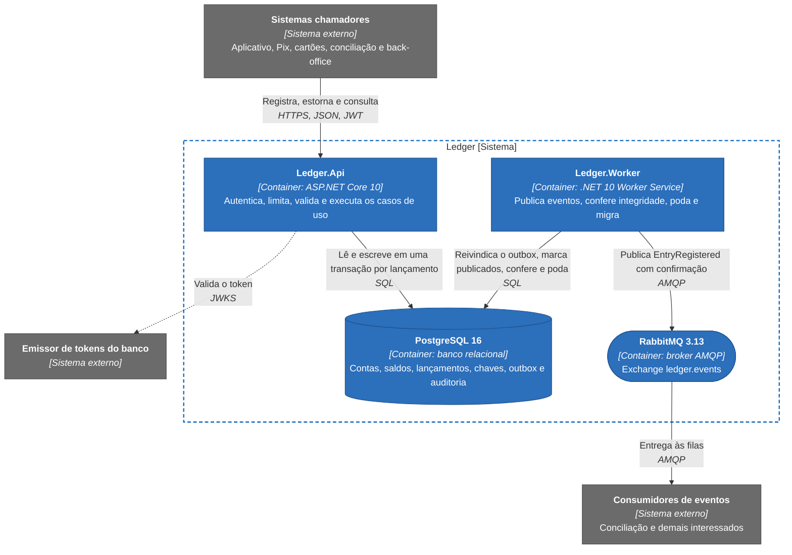

# Visão geral do ledger

O ledger é o livro-razão de um banco digital. Registra créditos e débitos nas contas dos clientes e responde quanto havia em uma conta em qualquer instante, do passado ou do presente, sem perder nem duplicar dinheiro, mesmo sob estresse. Aqui "ledger" designa só o razão das contas dos clientes: plano de contas, partidas dobradas e fechamento contábil pertencem a outro sistema do banco. Não há interface. Quem chama são outros sistemas (o aplicativo, Pix, cartões, a conciliação e o back-office de atendimento), que escrevem lançamentos, pedem estornos e consultam saldo e extrato.

## O problema

O ledger anterior é lento, instável nos picos e difícil de manter, e ninguém mediu esses sintomas ([Questões em aberto](../03-principios-e-decisoes/questoes-em-aberto.md)). O efeito prático é conhecido: o canal que espera demais reenvia, e reenvio sem defesa debita o cliente duas vezes, e uma falha no meio da operação deixa o banco com duas versões do mesmo fato. O projeto trata isso como um problema de confiança. O custo de cada falha e os objetivos estão em [Contexto de negócio](../02-contexto-e-requisitos/contexto-de-negocio.md).

## O que o ledger garante

Cada garantia tem um mecanismo no código e testes que o exercitam.

| Garantia | Como é obtida | Onde ler |
|---|---|---|
| Um lançamento confirmado existe uma única vez, mesmo com repetição ou chamadas concorrentes | `Idempotency-Key` com unicidade `(conta, chave)` no banco e `UPDATE` condicional na linha do saldo | [Registro de lançamento](../06-fluxos/registro-de-lancamento.md), [Idempotência e hash canônico](../05-contratos/idempotencia-e-hash-canonico.md) |
| Nada é reescrito, e erro se corrige com estorno, que é um novo lançamento | Só inserção, gatilho no banco e privilégios mínimos por papel | [Modelo de consistência](../07-consistencia-e-seguranca/modelo-de-consistencia.md) |
| O saldo sempre se explica | `balance_after` gravado em cada lançamento, na mesma transação do saldo | [Modelo de consistência](../07-consistencia-e-seguranca/modelo-de-consistencia.md) |
| O saldo do passado se consulta sem somar histórico | Busca por índice sobre `recorded_at` | [Saldo em um instante](../06-fluxos/consulta-em-um-instante.md) |
| Cada lançamento gera um evento, sem que a escrita dependa do broker | Linha em `outbox_messages` gravada na transação e publicada pelo Worker | [Publicação do outbox](../06-fluxos/publicacao-do-outbox.md) |
| Quando não dá para garantir, o sistema recusa | Timeouts, limites de taxa e de concorrência, 503 com `Retry-After` | [Políticas de resiliência](../08-resiliencia-e-operacao/politicas-de-resiliencia.md) |
| Divergência entre saldo e lançamentos é detectada e nunca corrigida em silêncio | Conferência de integridade periódica no Worker | [Conferência de integridade](../06-fluxos/conferencia-de-integridade.md) |

As metas de vazão, latência, disponibilidade e recuperação ficam fora da tabela porque são premissas de dimensionamento que ninguém mediu em escala. Estão em [Requisitos não funcionais](../02-contexto-e-requisitos/requisitos-nao-funcionais.md), e o que falta medir está em [Limites conhecidos](../09-qualidade/limites-conhecidos.md).

## Como é composto

O sistema tem dois executáveis do mesmo código-fonte, um banco e um broker. `Ledger.Api` atende o HTTP e não guarda estado. `Ledger.Worker` faz o que não pertence a uma requisição: publica a caixa de saída, confere a integridade, poda registros vencidos, recifra documentos quando a chave muda e, chamado com `--migrate`, aplica as migrações. O PostgreSQL é a única fonte de verdade, e o RabbitMQ distribui os eventos.

Três decisões moldam o desenho. A API não fala com o broker: o evento nasce como uma linha de `outbox_messages` na mesma transação do lançamento, e o Worker o leva ao RabbitMQ depois, de modo que um broker fora do ar atrasa a publicação e não afeta a escrita ([documento de arquitetura 0005](../03-principios-e-decisoes/documento-arquitetura/0005-transacao-unica-com-outbox.md), [documento de arquitetura 0008](../03-principios-e-decisoes/documento-arquitetura/0008-rabbitmq-entrega-ao-menos-uma-vez.md)). API e Worker nunca se chamam: cada um conversa com o banco por um papel de menor privilégio, e a única ponte entre eles é o dado persistido ([documento de arquitetura 0001](../03-principios-e-decisoes/documento-arquitetura/0001-monolito-modular-dois-executaveis.md)). E o banco concentra a consistência, porque a serialização das escritas de uma conta e a unicidade da chave de idempotência vêm do PostgreSQL, sem depender de memória nem de afinidade entre instâncias da API ([documento de arquitetura 0004](../03-principios-e-decisoes/documento-arquitetura/0004-saldo-corrente-com-update-condicional.md), [documento de arquitetura 0006](../03-principios-e-decisoes/documento-arquitetura/0006-idempotencia-por-chave-e-hash.md)).

Portas, dependências e topologia de cada container estão em [C4 nível 2: containers](../04-modelos-c4/nivel-2-containers.md). O que o repositório sobe está em [Implantação: visão geral e ambiente local](../04-modelos-c4/implantacao.md), e a topologia de produção, que ele não sobe, em [Implantação: topologia de produção](../04-modelos-c4/implantacao-producao.md).

## Escopo e tecnologia

A primeira versão cobre o cadastro mínimo de conta, créditos e débitos, estorno, saldo atual e em um instante, extrato paginado e um evento por lançamento, com autenticação por escopo, proteção do documento do titular, trilha de auditoria, observabilidade e conferência de integridade. O que ficou de fora e o que o chamador deve esperar de cada ausência estão em [Contexto de negócio](../02-contexto-e-requisitos/contexto-de-negocio.md#escopo), e o gatilho de cada item em [Evolução futura](../11-evolucao/evolucao-futura.md).

A plataforma é C# 14 sobre .NET 10 (SDK fixado em `global.json`), com ASP.NET Core Minimal API. O banco é o PostgreSQL 16, acessado por Npgsql e Dapper com SQL explícito, e as migrações são SQL puro aplicado pelo DbUp. A mensageria é RabbitMQ 3.13 com `RabbitMQ.Client` 7, a resiliência usa Polly, os logs usam Serilog e a telemetria usa OpenTelemetry. Os testes usam xUnit, Shouldly, NSubstitute, Testcontainers e NetArchTest, e a carga usa k6. As versões de pacote ficam em `Directory.Packages.props`, e cada escolha tem o seu [documento de arquitetura](../03-principios-e-decisoes/documento-arquitetura/README.md).

A solução tem cinco projetos de código (`Ledger.Domain`, `Ledger.Application`, `Ledger.Infrastructure`, `Ledger.Api` e `Ledger.Worker`) e projetos de teste para o domínio, a aplicação e a infraestrutura, mais os de integração da API, de arquitetura e de fim a fim. A dependência só aponta para dentro, e o `LayerDependencyTests` falha se alguém a inverter. O desenho interno está em [componentes da API](../04-modelos-c4/nivel-3-componentes-api.md), [componentes do Worker](../04-modelos-c4/nivel-3-componentes-worker.md) e [código](../04-modelos-c4/nivel-4-codigo.md), e os termos usados em toda a documentação, no [Glossário](glossario.md).

## Leia também

- [Documentação de arquitetura do ledger](../README.md): o mapa e a ordem de leitura.
- [Princípios de arquitetura](../03-principios-e-decisoes/principios-de-arquitetura.md): o que orienta toda decisão de desenho.
- [Limites conhecidos](../09-qualidade/limites-conhecidos.md): o que não foi medido nem exercitado.
