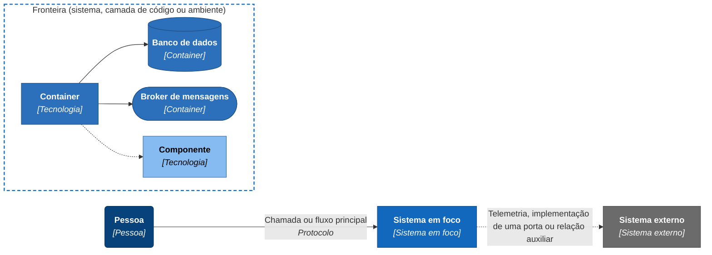

# 04 Modelos C4

O ledger está desenhado nos quatro níveis de zoom do modelo C4, do sistema no mapa do banco até as classes do domínio, mais duas páginas de implantação: o ambiente que o repositório sobe e a topologia de produção. Os diagramas são blocos Mermaid dentro de cada página, que o GitHub renderiza. O modelo formal está em [workspace.dsl](workspace.dsl), em Structurizr DSL, e as páginas explicam o que se vê.

Cada nível responde a uma pergunta. O [contexto](nivel-1-contexto.md) mostra onde o ledger fica no mapa do banco e com quem conversa. Os [containers](nivel-2-containers.md) mostram executáveis, banco e broker. Os componentes da [API](nivel-3-componentes-api.md) e do [Worker](nivel-3-componentes-worker.md) mostram como cada executável é organizado por dentro. O [código](nivel-4-codigo.md) cobre só o domínio e o fluxo de escrita, porque é ali que a regra é difícil de ver lendo o fonte e porque um diagrama de classes é o que mais depressa envelhece. A [implantação local](implantacao.md) mostra o que o Compose sobe, e a [topologia de produção](implantacao-producao.md), onde o ledger foi desenhado para rodar.

As sequências de mensagens não ficam aqui, porque cada uma é um [fluxo](../06-fluxos/README.md). O SQL, os contratos e a configuração moram no espaço de contratos, a começar pelo [modelo de dados](../05-contratos/modelo-de-dados.md).

## Legenda

Todas as páginas usam a mesma convenção visual.



| Elemento | Como aparece |
|---|---|
| Pessoa | Retângulo arredondado azul-escuro |
| Sistema em foco (o ledger) | Retângulo azul |
| Sistema externo | Retângulo cinza |
| Container | Retângulo azul médio; o banco é um cilindro e o broker, uma pílula |
| Componente | Retângulo azul-claro |
| Fronteira (sistema, camada de código ou ambiente) | Caixa tracejada com título |
| Seta contínua | Chamada ou fluxo principal |
| Seta pontilhada | Telemetria, implementação de uma porta ou relação auxiliar |

O nome do elemento vai em negrito, o tipo ou a tecnologia entre colchetes e, quando cabe, uma frase de responsabilidade. Toda seta tem um verbo, o protocolo vai em itálico (`HTTPS, JSON, JWT`) e a seta aponta para quem é chamado ou para onde o dado vai. Quando o consumidor lê do broker, a seta sai do broker com o verbo "entrega", porque é assim que o AMQP funciona: o broker empurra a mensagem para a fila de quem consome. Nos diagramas de componentes, a seta pontilhada de uma porta para um adaptador diz "implementadas por". Nomes físicos (classes, tabelas, rotas, colunas) ficam em inglês, como no código.

## Por que flowchart e não a sintaxe C4 do Mermaid

O Mermaid tem sintaxe C4 própria (`C4Context`, `C4Container`, `C4Component`, `C4Deployment`), e a escolha foi pelo `flowchart` com `subgraph`. No `C4Context`, o renderizador põe os elementos numa grade de duas colunas, na ordem de declaração, e liga as caixas sem rotear as setas. Com os oito elementos do [nível 1](nivel-1-contexto.md), uma seta cruza um sistema sem relação com ela, os rótulos de três grupos de relações se sobrepõem, e pedir três elementos por linha com `UpdateLayoutConfig` não muda o desenho. Um desenho que não se controla não dá para conferir.

O `flowchart` roteia as setas, tem layout independente da tela e mantém a semântica do C4 pela convenção acima. Cada diagrama de estrutura abre com um bloco de configuração (`wrappingWidth`, `nodeSpacing`, `rankSpacing`) para as caixas ficarem legíveis; o GitHub renderiza, e um renderizador mais antigo pode não entender o frontmatter. O custo é que o `flowchart` não sabe que uma caixa é um container e não valida o modelo: quem garante que toda relação aponta para um elemento existente é o `workspace.dsl`. Os diagramas de classes do nível 4 usam `classDiagram`, que tem sintaxe nativa, e são divididos em vários blocos pequenos, cada um com um assunto, para caberem na largura de uma página sem encolher.

## O modelo em Structurizr

O [workspace.dsl](workspace.dsl) é o modelo completo: pessoa, sistemas externos, containers, componentes de cada executável e os ambientes de implantação. Cada visão do DSL corresponde a um diagrama das páginas.

| Visão (chave no DSL) | Equivale a |
|---|---|
| `Contexto` | [Nível 1](nivel-1-contexto.md) |
| `Containers` | [Nível 2](nivel-2-containers.md) |
| `ApiCadeiaHttp`, `ApiEscrita`, `ApiLeitura` | Os três diagramas dos [componentes da API](nivel-3-componentes-api.md) |
| `WorkerPublicacao`, `WorkerIntegridadeEChaves`, `WorkerComandosESaude` | Os três diagramas dos [componentes do Worker](nivel-3-componentes-worker.md) |
| `DinamicaRegistrarLancamento`, `DinamicaSaldoEmUmInstante`, `DinamicaOutboxBrokerIndisponivel` | Resumos dos fluxos de [registro de lançamento](../06-fluxos/registro-de-lancamento.md), [saldo em um instante](../06-fluxos/consulta-em-um-instante.md) e [falha do broker](../06-fluxos/falha-do-broker.md) |
| `ImplantacaoLocal` | [Implantação local](implantacao.md) |
| `ImplantacaoProducao` | [Topologia de produção](implantacao-producao.md), com as três zonas modeladas |

O nível 4 não está no DSL, porque o C4 modela classes só em diagrama. As portas aparecem como um componente por camada de aplicação (`Portas de escrita`, `Portas de leitura`, `Portas do Worker`), e o texto de cada relação traz o nome da interface.

### Abrir o modelo no navegador

A imagem `structurizr/structurizr` traz o comando `local`, que serve o modelo num navegador. O fluxo abaixo copia o arquivo para dentro do contêiner em vez de montar a pasta, o que também funciona quando o daemon do Docker não enxerga o sistema de arquivos do host. Na raiz do repositório:

```bash
docker create --name c4-local -p 127.0.0.1:8090:8080 structurizr/structurizr local
docker cp docs/04-modelos-c4/workspace.dsl c4-local:/usr/local/structurizr/workspace.dsl
docker start c4-local
```

Depois, abra `http://localhost:8090`; a 8090 evita a 8080, que é da API quando o Compose está de pé. Para ver uma edição do DSL, copie o arquivo de novo e recarregue a página. Para encerrar, `docker stop c4-local` e `docker rm c4-local`.

Onde o daemon enxerga a pasta do repositório, a montagem direta também serve: `docker run --rm -p 8090:8080 -v "$(pwd)/docs/04-modelos-c4:/usr/local/structurizr" structurizr/structurizr local`. O servidor pode criar arquivos auxiliares na pasta montada, que são do editor e não são fonte.

## Validação

O comando `validate` da mesma imagem confere sintaxe, identificadores e se cada relação, visão e passo de visão dinâmica aponta para algo que existe. Sem erro, sai em silêncio com código 0. Com erro, imprime a linha do DSL e sai com 1.

```bash
docker create --name c4-validate structurizr/structurizr validate -workspace /usr/local/structurizr/workspace.dsl
docker cp docs/04-modelos-c4/workspace.dsl c4-validate:/usr/local/structurizr/workspace.dsl
docker start -a c4-validate
docker rm c4-validate
```

No Git Bash do Windows, o shell converte caminhos que começam por `/`, então a execução precisa de `MSYS_NO_PATHCONV=1`. O `export -workspace ... -format mermaid` gera um diagrama por visão e serve para conferir o que cada visão inclui. A imagem `structurizr/cli` está descontinuada: só imprime um aviso e sai com 0 sem validar nada, então não serve para conferir o DSL.

## Leia também

- [Fluxos](../06-fluxos/README.md), com as sequências de mensagens e o SQL de cada operação.
- [Registro de decisões](../03-principios-e-decisoes/documento-arquitetura/README.md), com o porquê de cada escolha que os desenhos mostram.
- [Limites conhecidos](../09-qualidade/limites-conhecidos.md), com o que não foi medido e afeta os desenhos, em especial a topologia de produção.
