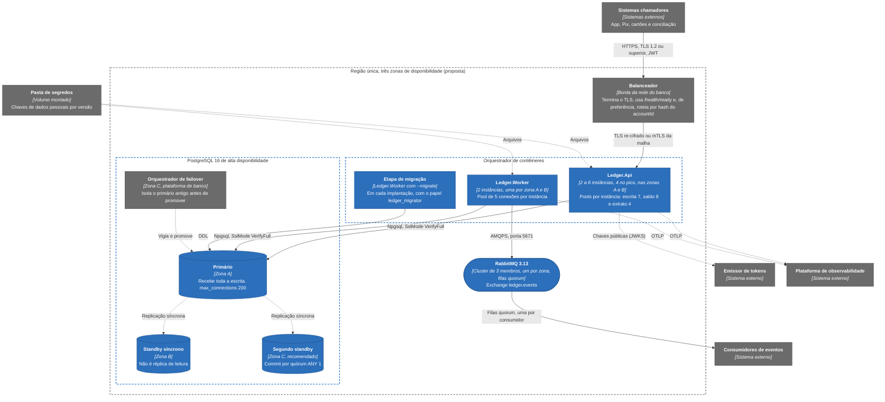

# Implantação: topologia de produção

Esta é a topologia em que o ledger foi desenhado para rodar em produção, e nada dela roda no repositório: o ambiente que o Compose sobe é o da [implantação local](implantacao.md), com uma instância de cada serviço. Ela nasce das metas de RPO zero e de recuperação em até 15 minutos, que um PostgreSQL único não cumpre. Todo número de réplica, zona e quórum abaixo é premissa de dimensionamento, e nenhuma das garantias que se espera dela foi exercitada: o que falta medir está em [Limites conhecidos](../09-qualidade/limites-conhecidos.md). O que o código impõe independentemente da topologia é verificado na subida: fora de `Development` e `Testing`, a conexão com o banco exige `Postgres:SslMode` igual a `VerifyFull`, a do broker exige `RabbitMq:UseTls`, a autenticação não aceita o modo de desenvolvimento, o provedor de chaves não pode ser o de configuração e a lista de provisionamento não pode ser `*`. Quem quebra uma dessas regras não sobe ([Configuração e linha de comando](../05-contratos/configuracao.md)).

## A topologia

A produção é uma região com três zonas de disponibilidade. A API roda atrás de um balanceador que termina o TLS, com de 2 a 6 instâncias (quatro no pico, duas em cada uma das zonas A e B, para perder uma sem saturar o pool de escrita), e o Worker roda em duas instâncias, uma por zona, que dividem o lote do outbox sem se atropelar. O PostgreSQL é um primário com replicação síncrona para um standby em outra zona, e convém um segundo standby, com commit por quórum (`ANY 1`), porque com um standby só a queda dele trava a escrita até alguém agir. Os standbys servem à alta disponibilidade e a mais nada: nenhuma consulta de negócio vai a eles, e o saldo atual não sairia de uma réplica mesmo que isso mudasse. O RabbitMQ é um cluster de três membros, o menor em que as filas quorum toleram a perda de um membro com maioria. O orquestrador de failover, na zona C, vigia o primário e os dois standbys, promove um standby e nunca rebaixa o commit para assíncrono sozinho.

O desenho agrupa as instâncias por camada e mostra uma só vez as ligações que se repetem por instância. A distribuição por zona está em cada elemento e na vista de implantação do `workspace.dsl`, que modela as três zonas, e os consumidores declaram filas em qualquer nó do cluster.

Algumas premissas não aparecem nas caixas. O balanceador, na camada 7 e na borda da rede do banco, tira do rodízio a instância cuja readiness falha e, nas rotas de lançamento, de preferência balanceia por hash do `accountId`, o que faz cada conta cair sempre na mesma instância e dá sentido ao limite por conta, local a cada instância; isso é configuração do balanceador, não código. A API não tem estado nem afinidade de sessão, e perder uma instância ou uma zona não satura o pool de escrita. O primário é premissa de 16 vCPU, `max_connections` 200 e WAL em disco separado. A etapa de migração, `Ledger.Worker --migrate` com o papel `ledger_migrator`, roda uma vez por versão, e execuções simultâneas se serializam pela trava consultiva. A pasta de segredos entrega as chaves de dados pessoais por versão e é relida periodicamente, e de onde vem o conteúdo (cofre, orquestrador) é decisão de implantação.

O orçamento de conexões sai da conta de [Capacidade e escala](../08-resiliencia-e-operacao/capacidade-e-escala.md): seis instâncias da API a 19 conexões cada (pools de escrita 7, saldo 8 e extrato 4, os valores de `appsettings.json`), duas do Worker a 5 e uma reserva de 20 para migração, administração e replicação somam 144 conexões num `max_connections` de 200. Se for preciso passar de seis instâncias, o caminho é reduzir o pool por instância ou pôr um PgBouncer em modo de transação na frente, em vez de esticar o banco.

## O que ainda não foi exercitado

O RPO zero para lançamentos confirmados depende do commit síncrono no standby, do failover que isola o primário antigo antes de promover e do comportamento da escrita quando o standby cai sem quórum, e nenhum desses pontos foi exercitado. O RTO de até 15 minutos vale para perda de máquina ou de zona, porque corrupção lógica não se resolve com failover e para ela existe a conferência de integridade do Worker, e o tempo de promoção e de restauração não foi medido. O pool de escrita de 7 por instância sai da conta de capacidade. A premissa da conta quente é de 50 lançamentos por segundo, e o cenário `write-hot-account` do teste de carga usa 100 por segundo, mas só roda contra o Compose, sem standby síncrono. A disponibilidade de 99,95% depende de operação medida por pelo menos 30 dias, não da topologia sozinha, e a entrega das chaves por pasta de segredos e a degradação com o cofre fora não foram exercitadas contra um cofre real.

## O que o desenho mostra

Cada executável escala pelo seu motivo, a API pelo tráfego e o Worker pelo tamanho do backlog do outbox ([documento de arquitetura 0001](../03-principios-e-decisoes/documento-arquitetura/0001-monolito-modular-dois-executaveis.md)). Há um primário só para escrita, com replicação síncrona para sustentar o RPO zero, ao preço de uma espera pela confirmação do standby em cada commit, que reduz o teto de lançamentos por conta ([Capacidade e escala](../08-resiliencia-e-operacao/capacidade-e-escala.md)), e da escrita parada se o standby cair sem quórum. A migração é uma etapa de implantação, nunca algo que a API faz ao subir ([documento de arquitetura 0007](../03-principios-e-decisoes/documento-arquitetura/0007-postgresql-npgsql-dapper-dbup.md)), e não há cache nem Redis no desenho: a leitura de saldo vai direto ao primário ([documento de arquitetura 0009](../03-principios-e-decisoes/documento-arquitetura/0009-sem-cache-na-v1.md)). O broker fora do ar não é risco para a API, porque ela não fala com ele, e o circuit breaker e o acúmulo no outbox protegem o resto ([documento de arquitetura 0005](../03-principios-e-decisoes/documento-arquitetura/0005-transacao-unica-com-outbox.md), [documento de arquitetura 0011](../03-principios-e-decisoes/documento-arquitetura/0011-resiliencia-timeouts-retry-circuit-breaker-rate-limit.md)). Há TLS em todos os saltos, `VerifyFull` no banco e `AMQPS` no broker, como a subida exige ([documento de arquitetura 0010](../03-principios-e-decisoes/documento-arquitetura/0010-seguranca-jwt-e-criptografia-de-pii.md)). A liveness não consulta dependência alguma, para reiniciar não virar uma tempestade de reconexões contra um banco que tenta voltar. Os contêineres devem rodar sem privilégio e com o sistema de arquivos raiz somente leitura, e a rede deve deixar a API falar só com o banco, o emissor de tokens e a pasta de segredos: o Compose já aplica o endurecimento de contêiner, e as regras de rede de produção são parte do desenho e não foram verificadas ([Segurança](../07-consistencia-e-seguranca/seguranca.md)).

## O que fica fora

Ficam fora o backup, a restauração e a retenção de dez anos, o particionamento de `ledger_entries` e a réplica de leitura, que são [evolução](../11-evolucao/evolucao-futura.md) e não fazem parte da v1, além da plataforma de orquestração, do desenho da rede e da escolha do produto de failover, que são decisões de quem opera. O que acontece quando cada peça falha está em [Cenários de falha](../08-resiliencia-e-operacao/cenarios-de-falha.md) e em [falha do banco de dados](../06-fluxos/falha-do-banco.md).
