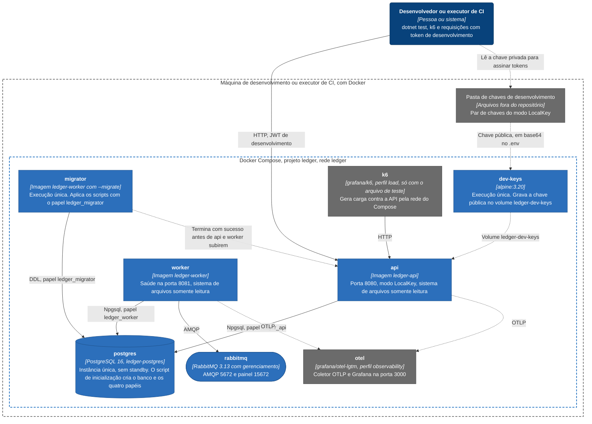

# Implantação: visão geral e ambiente local

O repositório sobe um ambiente só, o de Docker Compose: um PostgreSQL, um RabbitMQ, a API, o Worker e dois serviços de execução única, o de migração e o de chave de desenvolvimento. Ele serve ao desenvolvimento, aos testes fim a fim e ao teste de carga. A topologia pensada para as metas de disponibilidade e durabilidade não roda em lugar nenhum do repositório e está descrita em [Implantação: topologia de produção](implantacao-producao.md). Como subir, portas e variáveis estão em [Execução local](../10-implantacao-e-entrega/execucao-local.md) e [Ambientes e configuração](../10-implantacao-e-entrega/ambientes-e-configuracao.md).

Tudo roda numa máquina, sem TLS, com um banco, e as portas são publicadas só em `127.0.0.1`. API e Worker sobem com `ASPNETCORE_ENVIRONMENT=Development`, o que liga os controles relaxados do desenvolvimento: autenticação no modo `LocalKey`, com um par de chaves RSA que o `openssl` gera na pasta `dev-keys/` (ignorada pelo git) e tokens assinados com a chave privada; provedor de chaves de dados pessoais por configuração; criação de conta aberta a qualquer cliente com escopo de escrita; e documento OpenAPI em `/openapi/v1.json`.

API e Worker só sobem depois que o `migrator` termina com sucesso, e o `migrator` é a imagem do Worker chamada com `--migrate`. Os quatro papéis de banco nascem de um script de inicialização do contêiner do PostgreSQL (`docker/postgres/init-roles.sh`), antes de qualquer migração, porque senha é segredo e não entra em migração.

## Serviços

| Serviço | Imagem | Papel |
|---|---|---|
| `postgres` | `ledger-postgres`, construída de `postgres:16` fixado por digest | Banco `ledger` e os papéis `ledger_migrator`, `ledger_api`, `ledger_worker` e `ledger_readonly`. Instância única, `scram-sha-256` em todos os caminhos e `synchronous_commit=on`, que sem standby só espera o disco local |
| `rabbitmq` | `rabbitmq:3.13-management`, fixado por digest | Broker. O Worker declara a exchange e a fila de retenção ao conectar |
| `migrator` | `ledger-migrator`, a imagem do Worker | Aplica as migrações com `--migrate` e termina. Espera o `postgres` saudável |
| `dev-keys` | `alpine:3.20`, fixado por digest | Decodifica a chave pública de `DEV_JWT_PUBLIC_KEY_PEM_B64` para o volume `ledger-dev-keys`, que a API monta em `/run/keys` somente leitura |
| `api` | `ledger-api` | `Ledger.Api` na porta 8080. Espera o `postgres` saudável e `migrator` e `dev-keys` concluídos |
| `worker` | `ledger-worker` | `Ledger.Worker`, com saúde na porta 8081. Espera `postgres` e `rabbitmq` saudáveis e o `migrator` concluído |
| `otel` | `grafana/otel-lgtm` | Coletor OTLP e Grafana, só com `--profile observability`. Para a API e o Worker exportarem para ele, `OTEL_EXPORTER_OTLP_ENDPOINT=http://otel:4317` |
| `k6` | `ledger-k6`, de `grafana/k6` | Gera carga. Só existe no `docker-compose.test.yml`, no perfil `load` |

API, Worker, `migrator` e `dev-keys` rodam com sistema de arquivos raiz somente leitura, `/tmp` em memória, `cap_drop: ALL` e `no-new-privileges`; `postgres` e `rabbitmq` não têm esse endurecimento. Sem `OTEL_EXPORTER_OTLP_ENDPOINT` (o padrão) nada é exportado, e os logs JSON ficam no `stdout`, que o `docker compose logs` lê.

## O ambiente de teste

O `docker-compose.test.yml` é uma camada sobre o arquivo principal, não um ambiente à parte. Troca o nome do projeto para `<COMPOSE_PROJECT_NAME>-test` (`ledger-test` por padrão), com volumes e rede próprios, desliga o `restart` para que um contêiner derrubado de propósito continue derrubado, baixa o log da API e do Worker para `Warning` e desliga a amostragem de traces. Sobe os limites de taxa da API, porque um único `client_id` de teste empurra o volume que em produção viria de vários, e faz a conferência de integridade rodar a cada minuto, com o limite de atraso do outbox da readiness em 5 segundos. É esse ambiente que o teste fim a fim e o de carga usam, e o teste fim a fim pode provisionar o próprio ([documento de arquitetura 0032](../03-principios-e-decisoes/documento-arquitetura/0032-teste-fim-a-fim-que-provisiona-o-proprio-ambiente.md)).

## O que o desenho mostra

A migração é uma etapa de implantação com papel próprio, nunca algo que a API faz ao subir: se falhar, nada mais sobe, e o motivo está em `docker compose logs migrator` ([documento de arquitetura 0007](../03-principios-e-decisoes/documento-arquitetura/0007-postgresql-npgsql-dapper-dbup.md), [migração do esquema](../06-fluxos/migracao-do-esquema.md)). A chave pública de desenvolvimento chega à API por um volume nomeado, e não por montagem de pasta do host, o que funciona também quando o daemon do Docker não enxerga o sistema de arquivos do host.

O ambiente local não tem emissor de tokens nem cofre de chaves: a API valida tokens com uma chave pública local, e as chaves de dados pessoais chegam por configuração ([documento de arquitetura 0010](../03-principios-e-decisoes/documento-arquitetura/0010-seguranca-jwt-e-criptografia-de-pii.md)). O mesmo `Dockerfile.worker` serve ao `migrator` e ao `worker`, e o [pipeline](../10-implantacao-e-entrega/pipeline-azure-devops.md) constrói as mesmas imagens.

## O que este ambiente cobre

O Compose exercita o comportamento: atomicidade da escrita, idempotência, concorrência na mesma conta, publicação do outbox e recuperação quando o banco ou o broker param e voltam. Quem cobre isso são `PostgresOutageE2ETests`, `BrokerOutageE2ETests`, `BrokerOutageTests`, `CommitCuttingProxyTests` e `PublisherKilledBetweenPublishAndMarkTests`, e o `ComposeSmokeE2ETests` confere que o próprio Compose sobe e responde.

Ele não cobre as metas de vazão e de latência (NFR-01 a NFR-04): 2.000 lançamentos por segundo, 10.000 consultas de saldo por segundo e os p99 de escrita e de leitura. O cenário padrão de carga roda em um décimo da escala, só para pegar regressão grosseira, e a escala cheia não foi executada. Também não cobre failover do banco, perda de uma zona nem tempo de recuperação, porque não há segundo nó para promover. Esses números são metas e premissas de dimensionamento que ainda não foram medidas, e o assunto está em [Limites conhecidos](../09-qualidade/limites-conhecidos.md).

## O que fica fora

Ficam fora o balanceador, o TLS, os standbys, o cluster do broker e a pasta de segredos de produção, na [topologia de produção](implantacao-producao.md), e as portas escolhidas no host e as variáveis de cada serviço, que mudam por máquina, em [Ambientes e configuração](../10-implantacao-e-entrega/ambientes-e-configuracao.md).
