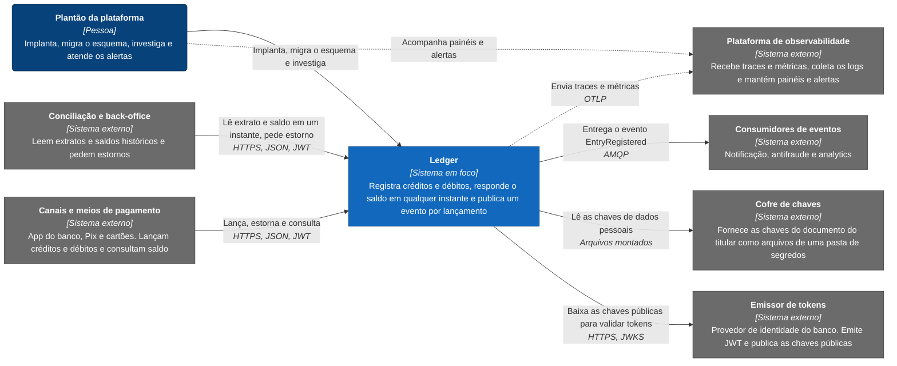

# C4 nível 1: contexto

Neste nível o ledger é uma caixa só. Interessa quem escreve nele, quem lê dele, de que ele depende e quem fica sabendo do que ele faz. A decomposição por dentro está nos [containers](nivel-2-containers.md).

Os chamadores são sistemas internos do banco. Canais e meios de pagamento (app, Pix e cartões) lançam créditos e débitos e consultam saldo. A conciliação e o back-office leem extratos e saldos históricos e pedem estorno quando um erro precisa ser corrigido, porque o passado do ledger não se edita. Todos chegam com um JWT que o emissor de tokens do banco entregou por client credentials, e a identidade vem do claim `client_id`, nunca do corpo da requisição. O ledger só valida tokens, com as chaves públicas do emissor, e por isso a obtenção do token, que sai dos chamadores para o emissor, não aparece no desenho.

## Elementos

| Nome | Tipo | Responsabilidade | Tecnologia ou protocolo |
|---|---|---|---|
| Plantão da plataforma | Pessoa | Implanta versões, executa a migração (`--migrate`), investiga uma conta (`--inspect-account`) e atende os alertas | Linha de comando, painéis |
| Canais e meios de pagamento | Sistema externo | Lançam, estornam e consultam saldo (`ledger.write` e `ledger.read`) | HTTPS, JSON, JWT |
| Conciliação e back-office | Sistema externo | Leem extratos e saldos em um instante (`ledger.read`) e pedem estornos (`ledger.write`) | HTTPS, JSON, JWT |
| Ledger | Sistema em foco | Registra créditos e débitos de forma idempotente e atômica, responde o saldo e publica um evento por lançamento confirmado | Ver [containers](nivel-2-containers.md) |
| Emissor de tokens | Sistema externo | Emite o JWT por client credentials e publica as chaves públicas com que a API valida a assinatura | OAuth 2.0, JWKS |
| Cofre de chaves | Sistema externo | Fornece, como arquivos de uma pasta de segredos, as chaves que cifram o documento do titular e calculam o índice cego | Arquivos montados |
| Consumidores de eventos | Sistema externo | Notificação, antifraude e analytics. Recebem `EntryRegistered` pelo menos uma vez e deduplicam pelo `message_id` | AMQP |
| Plataforma de observabilidade | Sistema externo | Recebe traces e métricas, coleta os logs JSON do `stdout`, mantém painéis e alertas | OTLP, `stdout` |

## O que o desenho mostra

Quem lê e quem escreve têm escopos separados: `ledger.read` para consulta e `ledger.write` para lançamento e estorno, e escrever não dá direito a ler. A identidade de cada chamador vem do token ([documento de arquitetura 0010](../03-principios-e-decisoes/documento-arquitetura/0010-seguranca-jwt-e-criptografia-de-pii.md)). A criação de conta, `POST /v1/accounts`, é rota administrativa, aberta em produção só a clientes de provisionamento ([Autenticação e autorização](../07-consistencia-e-seguranca/autenticacao-e-autorizacao.md)).

A integração com quem consome é por evento, nunca por acesso ao banco do ledger, e a entrega é pelo menos uma vez ([documento de arquitetura 0008](../03-principios-e-decisoes/documento-arquitetura/0008-rabbitmq-entrega-ao-menos-uma-vez.md)). O broker fica dentro da fronteira do ledger e só aparece no nível 2. Se ele estiver fora do ar, o chamador não percebe: o evento nasce na mesma transação do lançamento e sai depois ([documento de arquitetura 0005](../03-principios-e-decisoes/documento-arquitetura/0005-transacao-unica-com-outbox.md)).

Emissor de tokens e cofre de chaves são dependências leves. A biblioteca de autenticação guarda as chaves públicas em cache e as chaves de cifra ficam em memória depois de lidas, então uma queda curta de qualquer um dos dois não para o dinheiro. Os caminhos do lançamento e do saldo nunca consultam o cofre, e a readiness da API só degrada, sem tirar a instância do rodízio, quando o provedor de chaves falha ([documento de arquitetura 0019](../03-principios-e-decisoes/documento-arquitetura/0019-readiness-nao-depende-do-provedor-de-chaves.md)).

Os logs saem em JSON pelo `stdout` com o `X-Correlation-Id` do chamador, e traces e métricas saem por OTLP quando há endpoint ([documento de arquitetura 0012](../03-principios-e-decisoes/documento-arquitetura/0012-observabilidade-serilog-opentelemetry.md)).

## O que fica fora

Ficam fora do desenho a obtenção do token pelos chamadores, o balanceador, o TLS da borda (ver [topologia de produção](implantacao-producao.md)) e as filas que cada consumidor declara no broker. O repositório também não traz o emissor de tokens nem os consumidores: o [ambiente local](implantacao.md) troca o emissor por um par de chaves de desenvolvimento e não sobe consumidor algum.

Não existe adaptador para um cofre de chaves externo. O provedor de chaves lê uma pasta de segredos, e quem monta essa pasta (um cofre, um orquestrador, um volume) é decisão de implantação. O adaptador para o cofre do banco não foi escrito, e a degradação com o cofre fora do ar só foi exercitada contra um provedor de teste que falha, não contra um cofre real. O assunto está em [Limites conhecidos](../09-qualidade/limites-conhecidos.md).
