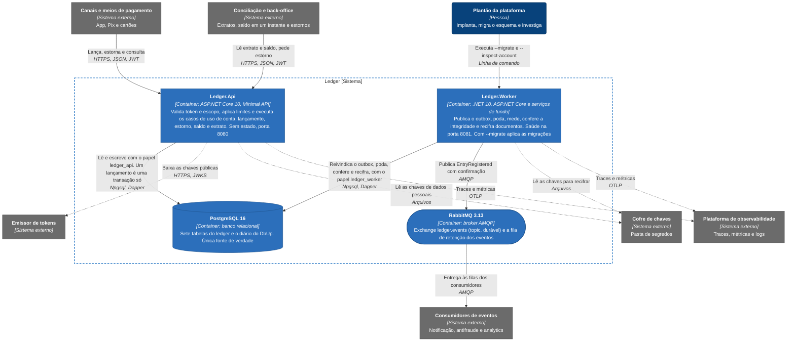

# C4 nível 2: containers

Dentro da caixa do ledger há quatro containers: dois executáveis do mesmo código-fonte, o banco e o broker. O `Ledger.Api` atende o HTTP, não guarda estado e escala por réplicas. O `Ledger.Worker` faz o que não pertence a uma requisição: publica a caixa de saída no RabbitMQ, mede e poda o que já foi publicado, confere a integridade dos dados e recifra documentos quando a chave ativa muda. Com `--migrate` o mesmo executável aplica as migrações do esquema, e com `--inspect-account=<guid>` confere uma conta e termina.

Os dois falam com o PostgreSQL e nunca entre si, e a decisão mais importante do desenho está aí: a API não fala com o broker. Gravação, saldo e evento acontecem na mesma transação, porque o evento nasce como uma linha de `outbox_messages` ([documento de arquitetura 0005](../03-principios-e-decisoes/documento-arquitetura/0005-transacao-unica-com-outbox.md)), e o Worker o leva ao RabbitMQ depois. Se o broker cair, a escrita não percebe.

## Elementos

| Nome | Tecnologia | Responsabilidade | Porta e acesso ao banco |
|---|---|---|---|
| `Ledger.Api` | ASP.NET Core 10, Minimal API. Imagem `ledger-api` | Autentica o JWT, autoriza por escopo, aplica limites de taxa e de concorrência e executa os casos de uso das cinco rotas de negócio | HTTP na 8080. Papel `ledger_api`, em três fontes de dados Npgsql com pool próprio: `Write`, `Balance` e `Statement` |
| `Ledger.Worker` | .NET 10, ASP.NET Core com serviços de fundo. Imagem `ledger-worker` | Seis serviços de fundo (publicação do outbox, poda do outbox, poda das chaves de idempotência, medição do acúmulo, integridade e recifragem) e os comandos `--migrate` e `--inspect-account` | HTTP na 8081, só com `/health/live` e `/health/ready`. Papel `ledger_worker` na fonte `Worker`; com `--migrate`, papel `ledger_migrator` na fonte `Migrator` |
| PostgreSQL 16 | `postgres:16` | Guarda as sete tabelas do ledger (`accounts`, `account_balances`, `ledger_entries`, `idempotency_keys`, `outbox_messages`, `audit_log`, `account_creation_keys`) e o diário `schemaversions` do DbUp. Decide o saldo pelo `UPDATE` condicional e garante a unicidade da chave de idempotência | 5432. Quatro papéis: `ledger_migrator`, `ledger_api`, `ledger_worker` e `ledger_readonly`, este último sem uso por executável algum |
| RabbitMQ 3.13 | `rabbitmq:3.13-management` no Compose | Recebe `EntryRegistered` na exchange `ledger.events` e guarda os eventos na fila de retenção `retention.ledger.entry-registered` enquanto nenhum consumidor declara a sua | AMQP na 5672. Gerenciamento na 15672, só no Compose |

Papéis e privilégios por tabela estão em [Modelo de dados](../05-contratos/modelo-de-dados.md), e as chaves de cada fonte em [Configuração e linha de comando](../05-contratos/configuracao.md).

## Como os containers se relacionam

O Worker declara a exchange `ledger.events` (`topic`, durável) e, a cada conexão, a fila de retenção e a de mensagens mortas, e publica cada mensagem com confirmação e `mandatory`, com o tipo do evento, `EntryRegistered`, como chave de roteamento. Cada consumidor declara e liga a própria fila ([Contrato de eventos](../05-contratos/eventos.md)).

API e Worker usam papéis de banco diferentes, cada um com o menor privilégio possível: só a API insere em `ledger_entries`, só o Worker marca uma mensagem do outbox como publicada e apaga linhas de `outbox_messages`, `idempotency_keys` e `account_creation_keys`, e a migração roda com um terceiro papel, o único que cria objetos. As duas fontes de leitura da API são somente leitura e têm pool próprio, de modo que um extrato lento não toma conexão do saldo. A API valida o JWT localmente e só usa as chaves de cifra para criar conta, e o Worker as usa para recifrar documentos depois de uma rotação.

## O que o desenho mostra

Dois executáveis, uma base de código e um banco: é o monolito modular do [documento de arquitetura 0001](../03-principios-e-decisoes/documento-arquitetura/0001-monolito-modular-dois-executaveis.md). O Worker existe separado porque depende do broker, o componente mais provável de ficar lento, e essa lentidão não pode disputar threads e conexões com as requisições HTTP. As duas imagens compilam os mesmos projetos, e o `LayerDependencyTests` verifica as camadas.

A entrega ao consumidor é pelo menos uma vez, com confirmação do broker e o identificador da linha do outbox como `message_id` ([documento de arquitetura 0008](../03-principios-e-decisoes/documento-arquitetura/0008-rabbitmq-entrega-ao-menos-uma-vez.md)), e a fila de retenção com a publicação `mandatory` impede que um evento sem consumidor seja descartado ([documento de arquitetura 0033](../03-principios-e-decisoes/documento-arquitetura/0033-fila-de-retencao-e-publicacao-mandatory.md)).

O PostgreSQL concentra a consistência. A serialização por conta vem de um `UPDATE` condicional na linha de `account_balances` ([documento de arquitetura 0004](../03-principios-e-decisoes/documento-arquitetura/0004-saldo-corrente-com-update-condicional.md)) e a unicidade da `Idempotency-Key`, de uma restrição do banco ([documento de arquitetura 0006](../03-principios-e-decisoes/documento-arquitetura/0006-idempotencia-por-chave-e-hash.md)), sem depender de memória nem de afinidade entre instâncias. O acesso a dados é Npgsql com Dapper e as migrações são SQL puro aplicado pelo DbUp, sem EF Core ([documento de arquitetura 0007](../03-principios-e-decisoes/documento-arquitetura/0007-postgresql-npgsql-dapper-dbup.md)). Não há cache entre a API e o banco, de propósito ([documento de arquitetura 0009](../03-principios-e-decisoes/documento-arquitetura/0009-sem-cache-na-v1.md)).

As chaves de cifra só são lidas para o documento do titular ([documento de arquitetura 0010](../03-principios-e-decisoes/documento-arquitetura/0010-seguranca-jwt-e-criptografia-de-pii.md)), e timeouts, retentativa da escrita e circuit breaker do broker estão no [documento de arquitetura 0011](../03-principios-e-decisoes/documento-arquitetura/0011-resiliencia-timeouts-retry-circuit-breaker-rate-limit.md).

Quantas instâncias rodam depende do ambiente: uma de cada no Compose e, na [topologia de produção](implantacao-producao.md), de duas a seis da API e duas do Worker, números que são premissa de dimensionamento e não foram medidos.

## O que fica fora

Ficam fora as réplicas, o balanceador, o standby do PostgreSQL e o cluster do broker ([implantação local](implantacao.md) e [topologia de produção](implantacao-producao.md)), as filas dos consumidores e a divisão interna de cada executável, em [componentes da API](nivel-3-componentes-api.md) e [componentes do Worker](nivel-3-componentes-worker.md).
