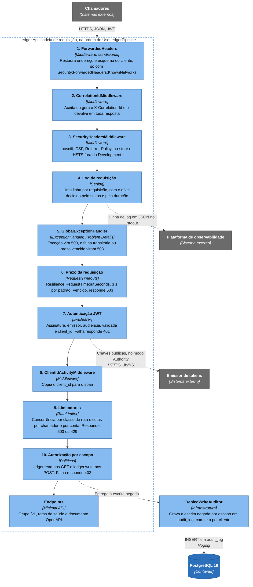
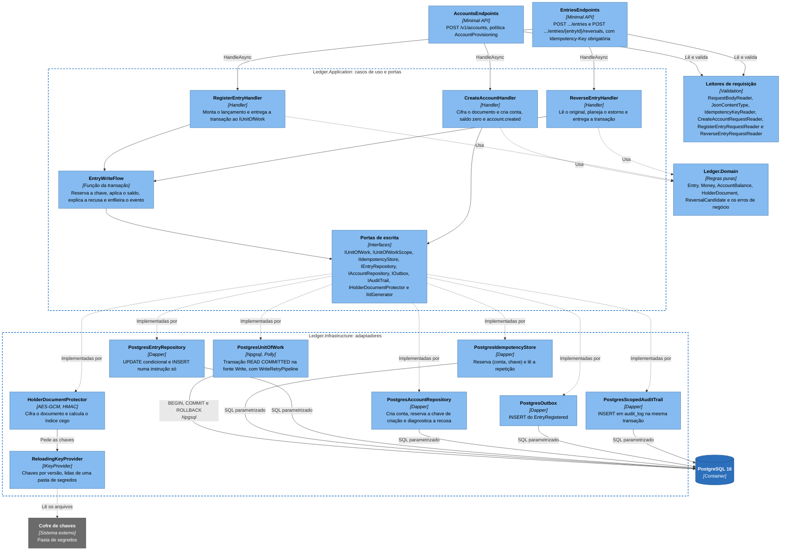
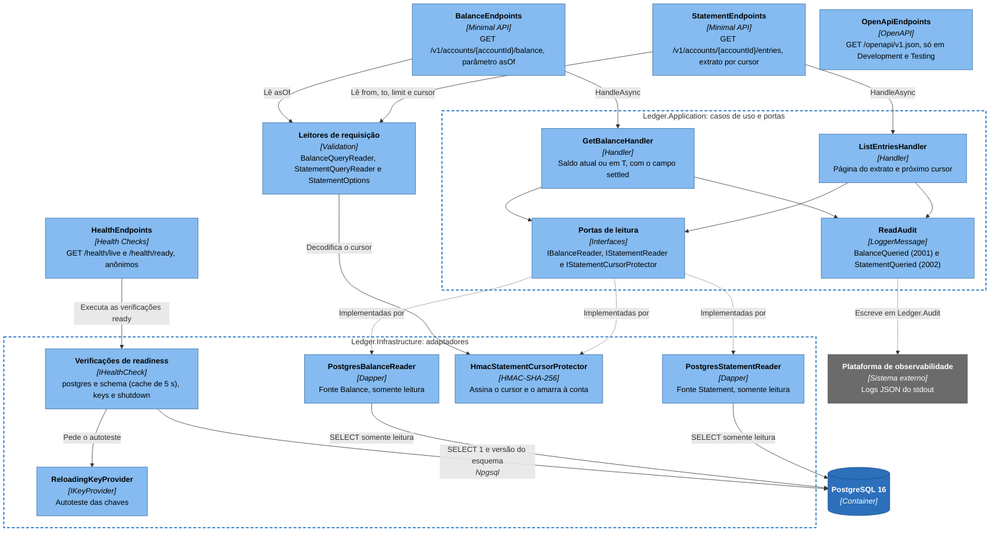

# C4 nível 3: componentes da API

Este nível abre o container `Ledger.Api`. O executável é só a borda HTTP e a raiz de composição, então os componentes que importam vivem em quatro projetos que ele carrega: o próprio `Ledger.Api` (cadeia de requisição e rotas), `Ledger.Application` (casos de uso e portas), `Ledger.Domain` (regras puras) e `Ledger.Infrastructure` (adaptadores). A dependência aponta sempre para dentro, e o `LayerDependencyTests` derruba a suíte se alguém inverter. Uma vista só passaria de trinta caixas, então são três: a cadeia de requisição, o caminho de escrita e o de leitura, com a saúde e o OpenAPI. O domínio aparece como uma caixa só, porque o [nível 4](nivel-4-codigo.md) abre os tipos dele.

## Cadeia de requisição

Toda requisição passa pela mesma sequência, e cada passo pode encerrá-la com uma recusa. A ordem foi escolhida: o tratamento de exceção fica antes do prazo e da autenticação para cobrir os dois, a autenticação vem antes dos limitadores para a cota usar o `client_id` do token, e os limitadores vêm antes da autorização, de modo que uma chamada sem o escopo certo ainda consome concorrência e cota antes do 403. Os limitadores leem os metadados da rota (`RequestClassMetadata`) para saber a classe da requisição, por isso o roteamento já resolveu o endpoint nesse ponto. As respostas de cada passo, os valores dos limites e a validação do token estão em [ciclo de vida de uma requisição](../06-fluxos/ciclo-de-vida-da-requisicao.md), [Limites de taxa e de concorrência](../08-resiliencia-e-operacao/limites-de-taxa-e-concorrencia.md) e [Autenticação e autorização](../07-consistencia-e-seguranca/autenticacao-e-autorizacao.md).

| Passo | Tipos |
|---|---|
| 1. `ForwardedHeaders` | `ForwardedHeadersSetup`, `ConfigureForwardedHeadersOptions`. Só entra na cadeia com `Security:ForwardedHeaders:KnownNetworks` preenchida |
| 2. Correlação | `CorrelationIdMiddleware` |
| 3. Cabeçalhos de segurança | `SecurityHeadersMiddleware` |
| 4. Log de requisição | `UseSerilogRequestLogging`, `RequestLogEnricher`, `RequestLogLevel`, `ColdStartRequestLogLevel` |
| 5. Exceção | `GlobalExceptionHandler`, `ProblemFactory`, `ProblemCatalog`, `UseStatusCodePages` |
| 6. Prazo | `ConfigureRequestTimeouts`, `RequestTimeoutMarkerMiddleware`. As rotas de saúde ficam fora |
| 7. Autenticação | `ConfigureJwtBearerOptions`, `AuthenticationEvents`, `PublicKeyLoader`. Valida o JWT localmente (RS256 ou ES256) |
| 8. Identidade no span | `ClientIdActivityMiddleware` |
| 9. Limitadores | `RequestLimiters`, `SingleAttemptRateLimiter`, `RateLimitRejectionWriter`, `ConfigureRateLimiterOptions`. Concorrência por classe de rota (`Write`, `Balance` ou `Statement`), cota por chamador e cota por conta (só nas escritas de quem tem o escopo de escrita), todos sem fila |
| 10. Autorização | `ScopeAuthorizationHandler`, `ProvisioningClientHandler`, `LedgerAuthorizationResultHandler`. Na criação de conta exige também um cliente de provisionamento, e a escrita negada vai para a trilha de auditoria |

## Caminho de escrita

Três rotas escrevem: criação de conta, lançamento e estorno. Cada endpoint lê o corpo de forma estrita, valida tudo de uma vez e só então chama o caso de uso, que devolve `Result`: regra de negócio não lança exceção, e um único ponto, o `WriteResults` sobre o `ProblemCatalog`, converte o erro em Problem Details. O que sobra de exceção, banco fora ou prazo vencido, vira 503 com `Retry-After`. O `RegisterEntryHandler` e o `ReverseEntryHandler` entregam a transação inteira ao `IUnitOfWork` como uma função, a `EntryWriteFlow.RunAsync`, comum aos dois. A `PostgresUnitOfWork` abre a transação em `READ COMMITTED` na fonte `Write`, executa a função e a repete se a falha for transitória, e é a reserva da chave de idempotência, primeiro passo da função, que torna a repetição segura sem saber se o commit anterior aconteceu. O `CreateAccountHandler` usa o mesmo `IUnitOfWork`, sem outbox, e é o único caso de uso que usa a cifra do documento.

| Componente | Responsabilidade |
|---|---|
| `AccountsEndpoints`, `EntriesEndpoints` (`Ledger.Api.Endpoints`) | `POST /v1/accounts` (política `AccountProvisioning`, `Idempotency-Key` opcional), `POST .../entries` e `POST .../entries/{entryId}/reversals` (política `ledger.write`, `Idempotency-Key` obrigatória) |
| Leitores de requisição (`Ledger.Api.Validation`) | `RequestBodyReader` limita o corpo a 16 KiB, `JsonContentType` aceita só `application/json` em UTF-8, `IdempotencyKeyReader` lê a chave, e `CreateAccountRequestReader`, `RegisterEntryRequestReader` e `ReverseEntryRequestReader` leem o corpo campo a campo, convertem `occurredAt` para UTC, recusam campo desconhecido e devolvem todos os erros juntos |
| `CreateAccountHandler` (`Ledger.Application.Accounts`) | Valida moeda e limite, cifra o documento com o `accountId` gerado antes do `INSERT`, grava conta, saldo zero e `account.created` numa transação e, com chave, devolve a mesma conta na repetição |
| `RegisterEntryHandler`, `ReverseEntryHandler` (`Ledger.Application.Entries`) | Calculam o hash canônico, montam o lançamento ou o estorno (este lê antes o candidato com `FindForReversalAsync`) e entregam a transação ao `IUnitOfWork` |
| `EntryWriteFlow` (`Ledger.Application.Entries`) | A função da transação: reserva a chave, compara o hash na repetição, aplica o saldo com `TryApplyAsync`, diagnostica a recusa e enfileira o `EntryRegistered` |
| Portas de escrita (`Ledger.Application.Abstractions`) | Interfaces que só a infraestrutura implementa, o que o `LayerDependencyTests` confere |
| `PostgresUnitOfWork` e os repositórios `Postgres*` (`Ledger.Infrastructure.Persistence`) | A unidade de trabalho abre a transação, a repete em falha transitória e entrega o `PostgresUnitOfWorkScope`, que agrega os repositórios na mesma conexão e transação. `PostgresIdempotencyStore`, `PostgresEntryRepository`, `PostgresAccountRepository`, `PostgresOutbox` e `PostgresScopedAuditTrail` são donos do SQL de cada passo, em [registro de lançamento](../06-fluxos/registro-de-lancamento.md) |
| `HolderDocumentProtector`, `ReloadingKeyProvider` (`Ledger.Infrastructure.Security`) | Cifram o documento (AES-256-GCM amarrado ao `account_id`), calculam o índice cego (HMAC-SHA-256) e entregam as chaves por versão. O `ReloadingKeyProvider` lê um `IKeySetSource`, e o único existente é o `DirectoryKeySetSource`, que relê uma pasta de segredos periodicamente |

## Caminho de leitura, saúde e OpenAPI

As leituras não passam pela unidade de trabalho. O `GetBalanceHandler` usa o `IBalanceReader` e o `ListEntriesHandler` usa o `IStatementReader`, cada um abrindo conexão na sua fonte (`Balance` ou `Statement`), ambas somente leitura e com pool e timeouts próprios. O saldo atual é uma busca pela chave primária de `account_balances`, o saldo em um instante é uma busca por índice em `ledger_entries`, sem somar histórico, e o cursor do extrato é assinado e amarrado à conta: o `StatementQueryReader` o decodifica com o `IStatementCursorProtector` e recusa o que não bater. O `ReadAudit` registra cada consulta bem-sucedida na categoria de log `Ledger.Audit`.

| Componente | Responsabilidade |
|---|---|
| `BalanceEndpoints`, `StatementEndpoints` (`Ledger.Api.Endpoints`) | `GET /v1/accounts/{accountId}/balance` e `GET .../entries`, política `ledger.read`, classes de limite `Balance` e `Statement` |
| `HealthEndpoints` | `GET /health/live`, sem verificação alguma, e `GET /health/ready`, com as verificações marcadas como `ready`. Só GET e HEAD (outros métodos recebem 405), sem prazo de requisição e fora do OpenAPI |
| `OpenApiEndpoints` (`Ledger.Api.OpenApi`) | `GET /openapi/v1.json`, só em `Development` e `Testing`. `LedgerDocumentTransformer`, `LedgerOperationTransformer` e `LedgerSchemaTransformer` montam o documento |
| `BalanceQueryReader`, `StatementQueryReader` (`Ledger.Api.Validation`) | Validam `asOf`, `from`, `to` (convertidos para UTC pelo `InstantParameterReader`), `limit` e `cursor`, com os limites de `StatementOptions` |
| `GetBalanceHandler` (`Ledger.Application.Balances`) | Monta `BalanceView`. No saldo em um instante, recusa `asOf` no futuro e calcula `Settled` contra a janela de acomodação |
| `ListEntriesHandler`, `ReadAudit` (`Ledger.Application`) | O primeiro resolve `StatementBounds`, pede uma linha a mais que o `limit` para saber se há próxima página e gera o `NextCursor`. O segundo registra `BalanceQueried` e `StatementQueried` com `client_id`, conta e correlação |
| `PostgresBalanceReader`, `PostgresStatementReader`, `HmacStatementCursorProtector` | Donos do SQL de saldo e extrato, em [saldo atual](../06-fluxos/consulta-de-saldo.md), [saldo em um instante](../06-fluxos/consulta-em-um-instante.md) e [extrato](../06-fluxos/extrato.md), e do cursor, com chave de `Security:Cursor:SigningKey` ([Cursor do extrato](../05-contratos/cursor-do-extrato.md)) |
| Verificações de readiness | `postgres` e `schema` (`PostgresReadinessChecks`, com cache), `keys` (`KeyProviderHealthCheck`, só `Degraded`) e `shutdown` (`ShutdownHealthCheck`). Nenhuma consulta o RabbitMQ |

## O que o desenho mostra

A API é uma borda fina: os tipos de `Ledger.Api` são `internal`, regra de negócio e SQL vivem fora dela, e os testes de arquitetura proíbem os endpoints de depender de Npgsql, Dapper ou `Ledger.Infrastructure`, que só aparece em `Program.cs`, para registrar serviços ([documento de arquitetura 0001](../03-principios-e-decisoes/documento-arquitetura/0001-monolito-modular-dois-executaveis.md)). O saldo é decidido no SQL do passo de aplicação, por um `UPDATE` condicional na linha de `account_balances` ([documento de arquitetura 0004](../03-principios-e-decisoes/documento-arquitetura/0004-saldo-corrente-com-update-condicional.md)), e `AccountBalance.Apply`, no domínio, é a mesma regra em código puro, usada para explicar uma recusa. Reserva da chave, saldo, lançamento e outbox estão na mesma transação, sem chamada de rede dentro dela além do PostgreSQL ([documento de arquitetura 0005](../03-principios-e-decisoes/documento-arquitetura/0005-transacao-unica-com-outbox.md), [documento de arquitetura 0006](../03-principios-e-decisoes/documento-arquitetura/0006-idempotencia-por-chave-e-hash.md)). A criação de conta repete do mesmo jeito, com identificador gerado antes e chave opcional ([documento de arquitetura 0031](../03-principios-e-decisoes/documento-arquitetura/0031-criacao-de-conta-repetivel-com-identificador-previo.md), [documento de arquitetura 0035](../03-principios-e-decisoes/documento-arquitetura/0035-idempotency-key-opcional-na-criacao-de-conta.md)).

Escrita, saldo e extrato usam fontes Npgsql distintas, com pools separados, e a retentativa do Polly envolve só a escrita ([documento de arquitetura 0007](../03-principios-e-decisoes/documento-arquitetura/0007-postgresql-npgsql-dapper-dbup.md), [documento de arquitetura 0011](../03-principios-e-decisoes/documento-arquitetura/0011-resiliencia-timeouts-retry-circuit-breaker-rate-limit.md)). Os limites formam uma cadeia, em ordem fixa ([documento de arquitetura 0027](../03-principios-e-decisoes/documento-arquitetura/0027-limites-de-taxa-e-de-concorrencia-em-cadeia.md)), e não há cache entre o handler e o banco ([documento de arquitetura 0009](../03-principios-e-decisoes/documento-arquitetura/0009-sem-cache-na-v1.md)). O extrato é lido por posição, com cursor assinado ([documento de arquitetura 0025](../03-principios-e-decisoes/documento-arquitetura/0025-extrato-por-posicao-com-cursor-assinado.md)), e o saldo em um instante usa o `recorded_at` do relógio do banco ([documento de arquitetura 0013](../03-principios-e-decisoes/documento-arquitetura/0013-tempo-do-saldo-registrado-em-vs-ocorrido-em.md), [documento de arquitetura 0018](../03-principios-e-decisoes/documento-arquitetura/0018-monotonicidade-do-recorded-at-e-janela-de-acomodacao.md)). A autenticação e o isolamento da chave de cifra em relação ao caminho do dinheiro estão no [documento de arquitetura 0010](../03-principios-e-decisoes/documento-arquitetura/0010-seguranca-jwt-e-criptografia-de-pii.md), o catálogo de eventos de auditoria no [documento de arquitetura 0028](../03-principios-e-decisoes/documento-arquitetura/0028-trilha-de-auditoria-com-catalogo-fechado.md) e a readiness independente do provedor de chaves no [documento de arquitetura 0019](../03-principios-e-decisoes/documento-arquitetura/0019-readiness-nao-depende-do-provedor-de-chaves.md).

## O que fica fora

Ficam fora o domínio por dentro, que está no [nível 4](nivel-4-codigo.md), a ordem exata das mensagens de cada caso, nos [fluxos](../06-fluxos/README.md), e o outro executável, em [componentes do Worker](nivel-3-componentes-worker.md). A telemetria (`Observability`: Serilog, `ActivitySource` e `Meter` chamados `Ledger`, mascaramento de dado sensível e exportação OTLP) é usada por todo componente e não ganha caixa, para não encher o desenho.
