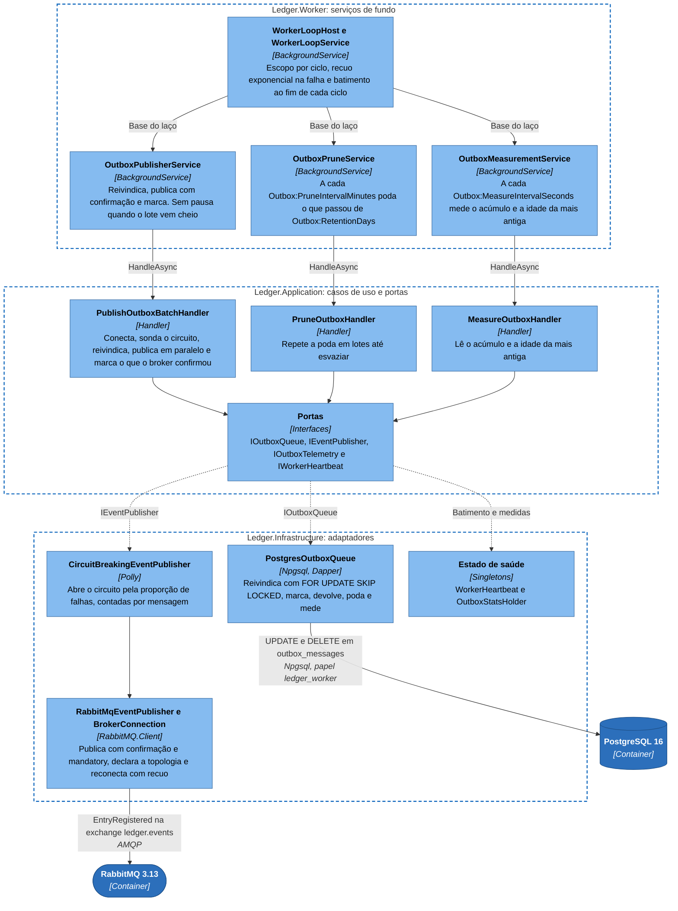
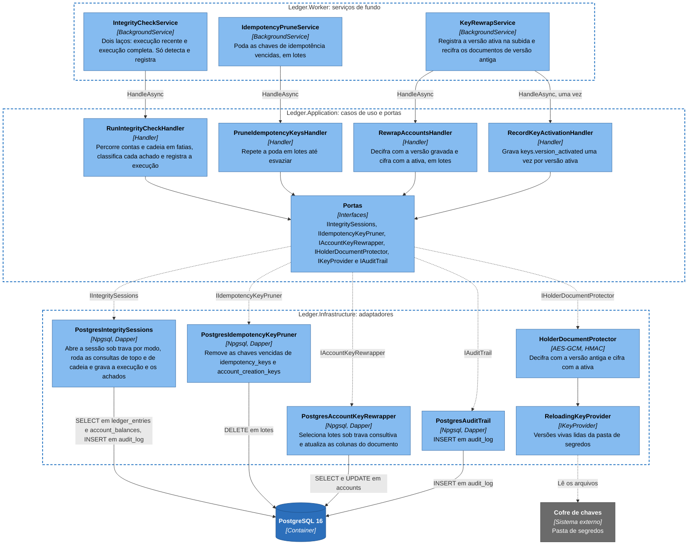
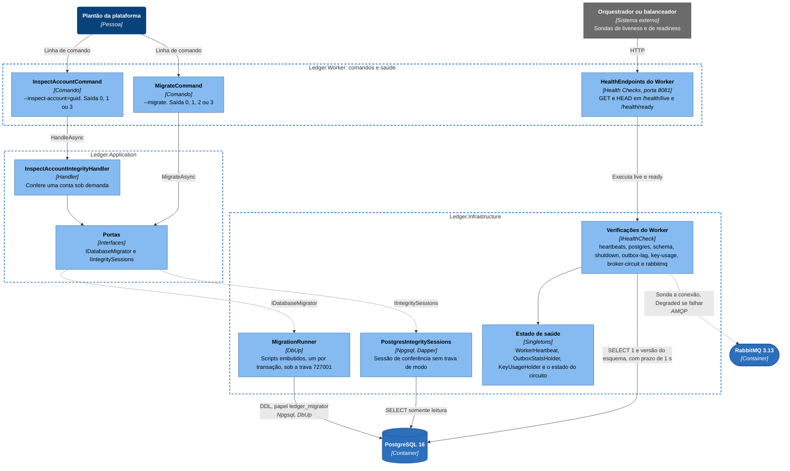

# C4 nível 3: componentes do Worker

O `Ledger.Worker` é uma aplicação ASP.NET Core com serviços de fundo. Ninguém o chama: ele acorda sozinho, olha o banco e age, e o único tráfego de entrada é o de saúde, na porta 8081. O mesmo executável tem três modos. Sem argumento, sobe os seis serviços de fundo e a saúde. Com `--migrate`, registra só a infraestrutura com o papel `ledger_migrator`, aplica as migrações e termina. Com `--inspect-account=<guid>`, registra a aplicação sem os laços, confere uma conta e termina, e nos dois modos de comando o código de saída diz o resultado.

O Worker se apoia nas portas da camada de aplicação e só chega ao banco com o papel `ledger_worker`, que lê o ledger e não insere nada nele. Várias instâncias podem rodar lado a lado: o lote do outbox é reivindicado com `FOR UPDATE SKIP LOCKED`, e a conferência de integridade e a recifragem usam travas consultivas para só uma instância trabalhar por vez. Cadência, lote e prazo de cada serviço estão em [Configuração e linha de comando](../05-contratos/configuracao.md).

## Publicação do outbox, poda e medição

O `OutboxPublisherService` reivindica lotes de `outbox_messages`, publica no RabbitMQ esperando a confirmação, por meio do `CircuitBreakingEventPublisher`, que envolve o `RabbitMqEventPublisher`, e só depois marca as mensagens como publicadas. Com o circuito aberto o handler nem reivindica: as mensagens esperam no banco e uma sonda sem mensagem testa o broker ([publicação do outbox](../06-fluxos/publicacao-do-outbox.md)). O `OutboxPruneService` apaga o que foi publicado além da retenção, e o `OutboxMeasurementService` mede o acúmulo e a idade da pendente mais antiga, que alimentam a readiness e as métricas.

| Componente | Responsabilidade |
|---|---|
| `WorkerLoopHost`, `WorkerLoopService` (`Ledger.Worker`) | Base de cinco dos seis serviços (o `IntegrityCheckService` tem laços próprios): escopo de injeção por ciclo, recuo exponencial depois de falha e batimento ao fim de cada ciclo |
| `OutboxPublisherService` | Volta sem pausa com o lote cheio, espera pouco com o lote incompleto e um pouco mais quando não reivindicou nada (broker desconectado ou circuito não fechado). No desligamento, o `DrainToken` dá ao handler `Resilience:ShutdownTimeoutSeconds` menos 5 s para terminar de marcar |
| `OutboxPruneService`, `OutboxMeasurementService` | A poda remove, em lotes, as publicadas além de `Outbox:RetentionDays`: remoção física de uma fila de integração, nunca do ledger. A medição conta as pendentes, a idade da mais antiga e as que passaram do limite de tentativas |
| `PublishOutboxBatchHandler` (`Ledger.Application.Outbox`) | Conecta ao broker se preciso, sonda o circuito quando não está fechado, reivindica até o orçamento do publicador, publica em paralelo dentro do prazo de confirmação e marca as confirmadas. As que nem foram tentadas voltam à fila e devolvem a tentativa gasta, e marcar e devolver têm prazo próprio ([documento de arquitetura 0030](../03-principios-e-decisoes/documento-arquitetura/0030-prazo-proprio-para-marcar-as-mensagens-publicadas.md)) |
| `PruneOutboxHandler`, `MeasureOutboxHandler` | Repetem a poda até um lote sair incompleto e leem as estatísticas do outbox, publicando-as como métricas |
| `PostgresOutboxQueue` (`Ledger.Infrastructure.Persistence.Outbox`) | Dono do SQL da fila (reivindicação com aluguel, marcação, devolução, poda e estatística), em [publicação do outbox](../06-fluxos/publicacao-do-outbox.md) e [rotinas de manutenção](../06-fluxos/rotinas-de-manutencao.md) |
| `CircuitBreakingEventPublisher` (`Ledger.Infrastructure.Messaging`) | Circuit breaker do Polly: abre quando a proporção de falhas na janela passa do limite, com um mínimo de mensagens, e fica aberto por um tempo fixo (`Resilience:BrokerCircuitBreaker`). Falha de serialização e mensagem sem rota não contam |
| `RabbitMqEventPublisher`, `BrokerConnection` | Publicam com confirmação e `mandatory`: a mensagem que nenhuma fila recebe volta do broker e permanece no outbox. Declaram a exchange e a fila de retenção a cada conexão e reconectam com recuo exponencial. Levam o `traceparent` guardado na linha, e o span `outbox.publish` nasce como raiz de um trace novo, com link para o da requisição original |
| `WorkerHeartbeat`, `OutboxStatsHolder` | Guardam o último batimento de cada laço e a última medida do outbox, que as verificações de saúde leem |

## Integridade, chaves e poda de idempotência

O `IntegrityCheckService` confere periodicamente se o ledger ainda diz a verdade e nunca corrige nada: lê, compara, registra e alerta. A execução recente roda a cada poucos minutos sobre a janela desde a última, e a completa uma vez por dia sobre todas as contas, cada modo com a sua trava consultiva. O `IdempotencyPruneService` apaga as chaves vencidas, e o `KeyRewrapService` registra a versão ativa da chave na subida e recifra, em lotes, os documentos gravados sob uma versão antiga.

| Componente | Responsabilidade |
|---|---|
| `IntegrityCheckService` | Laço recente, com sobreposição sobre a janela anterior, e laço completo, que só começa depois da primeira execução recente e roda quando passou o intervalo da última, lida em `audit_log`. Registra o batimento de cada laço |
| `IdempotencyPruneService`, `KeyRewrapService` | O primeiro remove, em lotes, as chaves mais velhas que 35 dias ([documento de arquitetura 0017](../03-principios-e-decisoes/documento-arquitetura/0017-retencao-de-35-dias-das-chaves-de-idempotencia.md)). O segundo chama o `RecordKeyActivationHandler` na subida e depois recifra, em lotes e em intervalo fixo, os documentos de versão antiga |
| `RunIntegrityCheckHandler` (`Ledger.Application.Integrity`) | Na execução completa confere o topo de todas as contas e a cadeia de `balance_after` em fatias de tempo, e na recente só as contas com lançamento na janela. Cada achado vira uma linha em `audit_log` e o evento de log `IntegrityViolationDetected` ([documento de arquitetura 0026](../03-principios-e-decisoes/documento-arquitetura/0026-conferencia-de-integridade-com-trava-por-modo.md)) |
| `PruneIdempotencyKeysHandler`, `RewrapAccountsHandler`, `RecordKeyActivationHandler` | Repetem a poda até um lote sair incompleto, recifram sob trava e observam o uso das versões de chave, e gravam `keys.version_activated` uma vez por versão ativa |
| `PostgresIntegritySessions`, `PostgresIntegritySession` (`Ledger.Infrastructure.Persistence.Integrity`) | Tomam a trava consultiva `727002` por modo e entregam a sessão que executa as consultas de [conferência de integridade](../06-fluxos/conferencia-de-integridade.md) |
| `PostgresIdempotencyKeyPruner`, `PostgresAccountKeyRewrapper` | O primeiro poda `idempotency_keys` e `account_creation_keys` com a mesma retenção. O segundo toma a trava `727003` por passagem, seleciona lotes com `FOR NO KEY UPDATE SKIP LOCKED` e atualiza as colunas do documento em `accounts`, que não é imutável ([rotação das chaves](../06-fluxos/rotacao-de-chaves.md)) |
| `PostgresAuditTrail`, `HolderDocumentProtector`, `ReloadingKeyProvider` | Gravam as linhas de auditoria do Worker, recifram o documento e entregam as versões vivas das chaves, lidas de uma pasta de segredos |

## Comandos e saúde

Os dois comandos usam o mesmo `Program`. O `MigrateCommand` chama a porta `IDatabaseMigrator`, que o `MigrationRunner` implementa: aplica os scripts SQL embutidos no assembly, cada um na sua transação, sob a trava consultiva `727001` com prazo de `Migrations:LockTimeoutSeconds`. O `InspectAccountCommand` chama o `InspectAccountIntegrityHandler` e lista, uma linha por achado, as verificações que a conta reprova. A saúde é a única superfície HTTP do Worker ([Saúde e observabilidade](../08-resiliencia-e-operacao/saude-e-observabilidade.md)).

| Componente | Responsabilidade |
|---|---|
| `MigrateCommand`, `InspectAccountCommand` (`Ledger.Worker`) | O primeiro traduz o `MigrationStatus` em código de saída: 0 (aplicada ou nada a aplicar), 1 (um script falhou), 2 (banco inalcançável ou trava ocupada além do prazo) e 3 (configuração inválida). O segundo lê `--inspect-account=<guid>`, confere a conta e sai com 0 (sem achado), 1 (com achado) ou 3 (identificador ou configuração inválidos) |
| `HealthEndpoints` do Worker | `GET /health/live`, com a verificação `heartbeats`, e `GET /health/ready`, com as marcadas como `ready`. Só GET e HEAD, e o HEAD responde sem corpo. `Unhealthy` devolve 503 com `Retry-After` |
| `InspectAccountIntegrityHandler` | Abre uma sessão e confere uma conta, sem tomar a trava de modo |
| `MigrationRunner` (`Ledger.Infrastructure.Persistence`) | Aplica os scripts embutidos que ainda faltam, na ordem, e registra cada um no diário `schemaversions`, como descreve a [migração do esquema](../06-fluxos/migracao-do-esquema.md) |
| Verificações do Worker | `heartbeats` falha se um laço ficar sem batimento além do limite (`Resilience:Health`). Na readiness, `postgres`, `schema` e `shutdown` derrubam a instância, e `outbox-lag`, `key-usage`, `broker-circuit` e `rabbitmq` só a degradam, sem tirar o 200 |

## O que o desenho mostra

O Worker é o único container que fala com o broker, e é por isso que a queda do RabbitMQ não chega à escrita. O circuit breaker do Polly fica em volta da publicação e só existe aqui ([documento de arquitetura 0011](../03-principios-e-decisoes/documento-arquitetura/0011-resiliencia-timeouts-retry-circuit-breaker-rate-limit.md), [documento de arquitetura 0029](../03-principios-e-decisoes/documento-arquitetura/0029-publicador-do-outbox-com-circuito-por-mensagem.md)). A publicação sai da caixa de saída gravada junto do lançamento ([documento de arquitetura 0005](../03-principios-e-decisoes/documento-arquitetura/0005-transacao-unica-com-outbox.md)), a entrega é pelo menos uma vez, em lotes, e o prazo de reivindicação funciona como um aluguel que expira sozinho ([documento de arquitetura 0008](../03-principios-e-decisoes/documento-arquitetura/0008-rabbitmq-entrega-ao-menos-uma-vez.md)): se o processo morrer entre publicar e marcar, a mensagem sai de novo na volta seguinte e quem consome deduplica pelo `message_id`. A fila de retenção e o `mandatory` evitam que um evento sem rota se perca ([documento de arquitetura 0033](../03-principios-e-decisoes/documento-arquitetura/0033-fila-de-retencao-e-publicacao-mandatory.md)).

A conferência de integridade só lê, com uma trava por modo ([documento de arquitetura 0026](../03-principios-e-decisoes/documento-arquitetura/0026-conferencia-de-integridade-com-trava-por-modo.md)), e a correção de um achado entra como novo lançamento, não como edição, porque o ledger é só de inserção ([documento de arquitetura 0002](../03-principios-e-decisoes/documento-arquitetura/0002-ledger-imutavel-somente-insercao.md)). A recifragem só toca `accounts`, que não é imutável ([documento de arquitetura 0010](../03-principios-e-decisoes/documento-arquitetura/0010-seguranca-jwt-e-criptografia-de-pii.md)), e o mesmo executável serve de ferramenta de migração, com um papel de banco diferente do de operação ([documento de arquitetura 0007](../03-principios-e-decisoes/documento-arquitetura/0007-postgresql-npgsql-dapper-dbup.md)). A readiness do Worker degrada, mas continua em 200, quando o broker cai, porque tirar o processo do ar só atrasaria a volta. Traces, métricas e logs saem como na API ([documento de arquitetura 0012](../03-principios-e-decisoes/documento-arquitetura/0012-observabilidade-serilog-opentelemetry.md)).

## O que fica fora

Ficam fora a telemetria (`Observability`), que todo laço usa, o `ShutdownHealthCheck` e o desligamento ordenado, descritos em [encerramento e reinício](../06-fluxos/encerramento-e-reinicio.md), e o comportamento do Worker quando o banco falha, em [falha do banco de dados](../06-fluxos/falha-do-banco.md). A API tem desenho próprio em [componentes da API](nivel-3-componentes-api.md).
