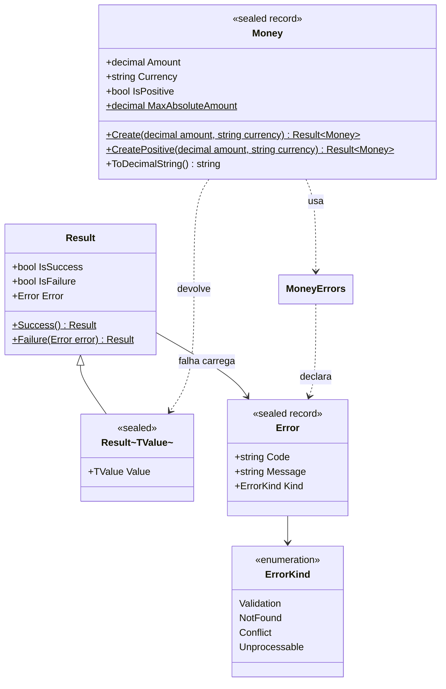
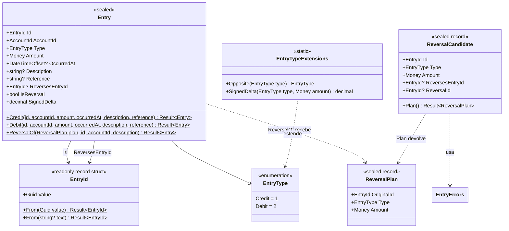
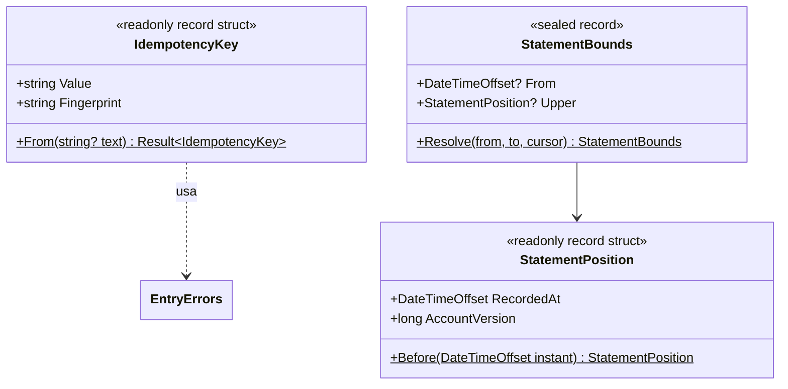
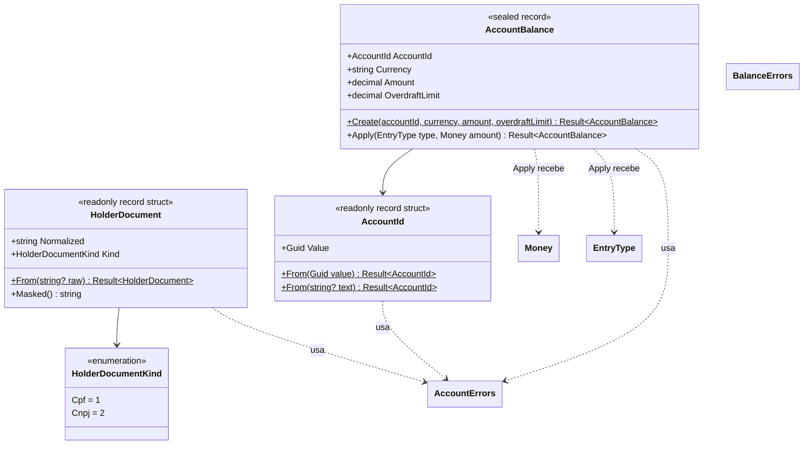
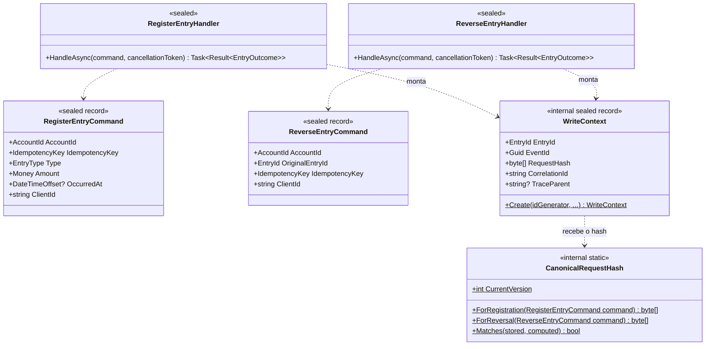
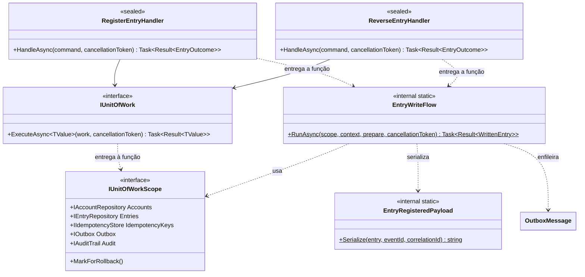
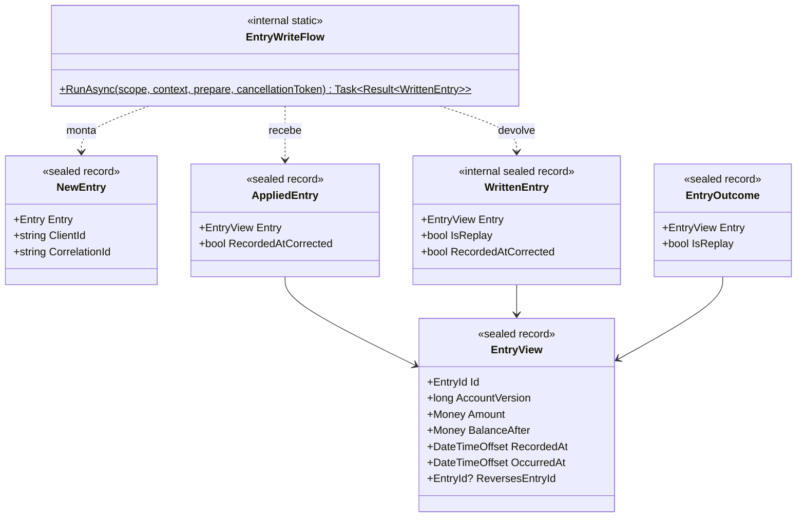
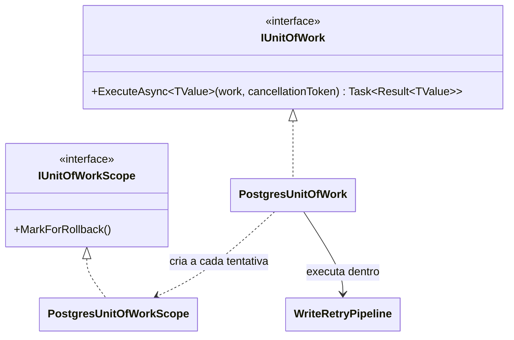
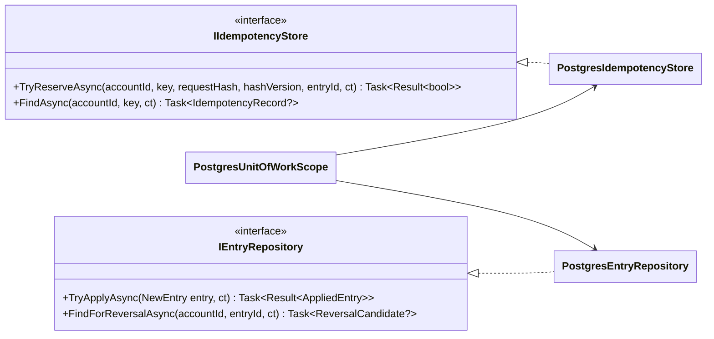
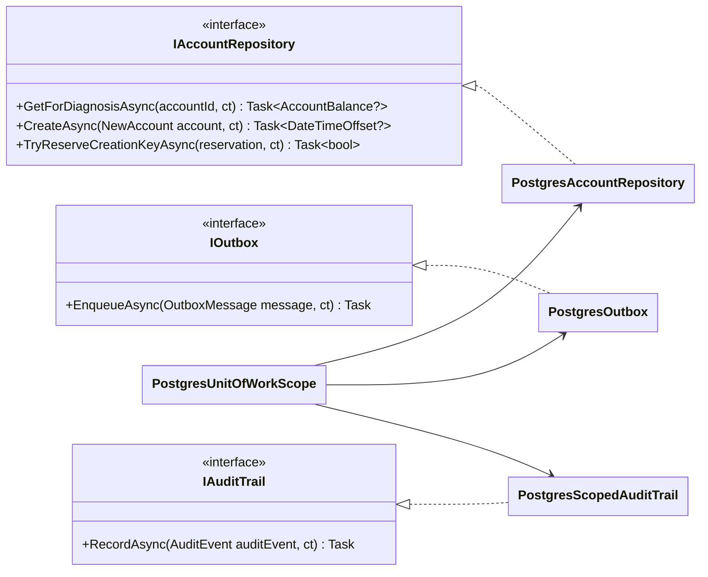

# C4 nível 4: código

O nível 4 desce até as classes e só vale para o que é difícil de ver lendo o fonte: o domínio, que carrega as regras que ninguém pode quebrar, e o fluxo de escrita, que orquestra a transação de um lançamento. As classes seguem as [convenções de código](../12-engenharia/convencoes-de-codigo.md): `Ledger.Domain` por assunto (`Shared`, `Accounts`, `Entries`), erro de negócio como `Result` e nunca como exceção, tipos de valor com construtor privado e fábrica estática, e `Entry` selada, sem setter público. O ledger só recebe inserção, então o lançamento nasce completo e nunca muda.

Os diagramas mostram forma, responsabilidade e dependência, com assinaturas resumidas. Dois pontos antes de descer: em produção, quem decide se um débito cabe no saldo é o `UPDATE` condicional do banco ([documento de arquitetura 0004](../03-principios-e-decisoes/documento-arquitetura/0004-saldo-corrente-com-update-condicional.md)); a regra equivalente no domínio, `AccountBalance.Apply`, é uma especificação executável do piso, testável sem Docker, e a explicação tipada de uma recusa. E não existe classe `Account` no domínio: o cadastro da conta é dado da persistência, e o domínio só precisa do saldo e do documento do titular.

## Núcleo compartilhado: `Result`, `Error` e `Money`

`Result<TValue>` é o que toda regra de negócio devolve. Os dois tipos herdam de `Result`, que carrega o `Error` quando falha, e a conversão implícita permite devolver o valor ou o erro direto. `Error` traz um código estável do contrato (`INSUFFICIENT_FUNDS`, por exemplo) e um `ErrorKind`, que a API traduz em status HTTP num ponto só: `Validation` vira 400, `NotFound` 404, `Conflict` 409 e `Unprocessable` 422. `Money` guarda um `decimal` com a moeda de três letras maiúsculas, recusa mais de duas casas em vez de arredondar e fica dentro de `MaxAbsoluteAmount`. A moeda diferente da conta é recusada na regra de saldo, não em `Money`.

## Lançamentos: `Entry` e o estorno

`Entry` é o lançamento antes de ser gravado. Nasce completo, por uma de três fábricas estáticas (`Credit`, `Debit` e `ReversalOf`), e nunca muda. Não carrega a posição na conta, o saldo depois do lançamento nem o instante de registro: o banco decide os três no `UPDATE` condicional e eles voltam na leitura da linha gravada, em `AppliedEntry` e `EntryView`, da camada de aplicação ([documento de arquitetura 0003](../03-principios-e-decisoes/documento-arquitetura/0003-saldo-apos-em-cada-lancamento.md), [documento de arquitetura 0018](../03-principios-e-decisoes/documento-arquitetura/0018-monotonicidade-do-recorded-at-e-janela-de-acomodacao.md)). Dos dois instantes que o [documento de arquitetura 0013](../03-principios-e-decisoes/documento-arquitetura/0013-tempo-do-saldo-registrado-em-vs-ocorrido-em.md) separa, `OccurredAt`, informado pelo chamador e opcional, fica na `Entry`, e `recorded_at`, do relógio do banco, só existe depois da gravação.

O estorno é uma `Entry` comum com `ReversesEntryId` preenchido, de tipo oposto e mesmo valor. A decisão de estornar passa por `ReversalCandidate.Plan()`, que recusa estornar quem já é estorno (`NotReversible`) e quem já foi estornado (`AlreadyReversed`) e devolve o `ReversalPlan` que `ReversalOf` consome. O repositório monta o candidato lendo o lançamento e o estorno que aponta para ele, e o índice único parcial `uq_ledger_entries_reverses_entry_id` fecha a corrida entre dois estornos.

`IdempotencyKey` é tipo de valor porque o formato da chave (de 1 a 128 caracteres ASCII visíveis) é regra do contrato, e ele só se mostra por uma impressão digital curta. `StatementPosition` e `StatementBounds` dão forma às regras do extrato: a posição `(RecordedAt, AccountVersion)` é comparável, e `StatementBounds.Resolve` escolhe o limite superior único entre o cursor e o `to` ([documento de arquitetura 0025](../03-principios-e-decisoes/documento-arquitetura/0025-extrato-por-posicao-com-cursor-assinado.md)). `EntryErrors` declara os erros do lançamento (`NotFound`, `InsufficientFunds`, `AlreadyReversed`, `NotReversible`, as três variações de `IdempotencyKey` e os de descrição e referência), e `StatementErrors` declara `InvalidCursor`.

## Contas: `AccountBalance` e `HolderDocument`

`AccountBalance` é o valor da linha quente do sistema: conta, moeda, saldo e limite. `Apply(EntryType, Money)` escreve a regra do piso (`saldo + delta >= -limite`) como código puro, o mesmo predicado que o `UPDATE` carrega no `WHERE`, e devolve o saldo novo, `InsufficientFunds` ou `CurrencyMismatch`. Quando o `UPDATE` condicional não atinge nenhuma linha, a aplicação lê o estado da conta com `GetForDiagnosisAsync` e usa essa regra para dizer o motivo.

`HolderDocument` é o documento do titular. `From` remove a pontuação, aceita CPF e CNPJ (inclusive o alfanumérico) e confere os dígitos verificadores. `Masked()` produz `***.***.789-**` a partir de um CPF, e o `ToString()` só devolve a forma mascarada, para o documento em claro não sair por acidente num log. A cifra e o índice cego ficam na infraestrutura ([Proteção de dados](../07-consistencia-e-seguranca/protecao-de-dados.md)).

## Fluxo de escrita: casos de uso

Os handlers são `sealed`, terminam em `Handler` e têm um único método público, `HandleAsync`, com o `CancellationToken` por último. O endpoint os chama por injeção direta, sem mediador, e o `LayerDependencyTests` confere essas regras. O `RegisterEntryHandler` abre a operação de telemetria, monta o `WriteContext` (os identificadores gerados por `IIdGenerator` e o hash canônico do pedido, de [Idempotência e hash canônico](../05-contratos/idempotencia-e-hash-canonico.md)) e entrega a transação inteira à unidade de trabalho como uma função que o pipeline de retentativa pode repetir. O `ReverseEntryHandler` entrega a mesma função e muda só a preparação: lê o candidato com `FindForReversalAsync` e monta o estorno com `Entry.ReversalOf`.

A função é a `EntryWriteFlow.RunAsync`, comum aos dois, e começa sempre pela reserva da chave: com a chave já existente devolve o lançamento original se o hash confere, ou `IdempotencyKeyReused` se não, e com a chave nova aplica o lançamento com `TryApplyAsync`, que deixa o banco decidir o saldo, diagnostica a recusa com `AccountBalance.Apply` e enfileira o `EntryRegistered` no outbox. O `EntryOutcome` leva o `EntryView` e o indicador de repetição, que a API traduz em `Idempotent-Replayed: true`. O passo a passo, com o SQL, está em [registro de lançamento](../06-fluxos/registro-de-lancamento.md).

A criação de conta usa a mesma unidade de trabalho, mas não passa pela `EntryWriteFlow` nem pelo outbox: o `CreateAccountHandler` gera o `AccountId` antes de qualquer `INSERT` (ele entra como dado autenticado da cifra), pede ao `IHolderDocumentProtector` o documento cifrado e o índice cego (`ProtectedHolderDocument`) e grava conta, saldo zero e a linha `account.created` do `audit_log` numa transação só. Com `Idempotency-Key`, reserva antes a chave em `account_creation_keys` (`AccountCreationKeyReservation`, com o hash de `AccountCreationRequestHash`), e a repetição devolve a conta original (`CreatedAccount.IsReplay`) sem escrever nada ([documento de arquitetura 0031](../03-principios-e-decisoes/documento-arquitetura/0031-criacao-de-conta-repetivel-com-identificador-previo.md), [documento de arquitetura 0035](../03-principios-e-decisoes/documento-arquitetura/0035-idempotency-key-opcional-na-criacao-de-conta.md), [criação de conta](../06-fluxos/criacao-de-conta.md)).

## Fluxo de escrita: portas e adaptadores

As portas pertencem à camada de aplicação e só a infraestrutura as implementa, o que o `LayerDependencyTests` confere. O `PostgresUnitOfWork` abre a conexão na fonte `Write`, inicia a transação em `READ COMMITTED` e entrega aos handlers um `PostgresUnitOfWorkScope`, que agrega os repositórios ligados à mesma conexão e transação e não confirma se o resultado for falha ou o escopo tiver pedido o desfazimento. O `WriteRetryPipeline` repete a tentativa inteira nos estados de falha transitória que o `PostgresRetryPredicate` reconhece, com recuo exponencial e jitter. Só a escrita tem retentativa, e é segura porque a primeira operação da função é a reserva da chave.

## O que o desenho mostra

Regra de negócio é `Result`: erro de dinheiro, de saldo, de estorno e de chave tem lugar no tipo de retorno, e a exceção fica para defeito de programação e falha de infraestrutura. O ledger é imutável no tipo, porque `Entry` não tem setter e nenhum handler ou repositório atualiza ou apaga um lançamento, e também no banco, por gatilho ([documento de arquitetura 0002](../03-principios-e-decisoes/documento-arquitetura/0002-ledger-imutavel-somente-insercao.md)). `BalanceAfter` e `AccountVersion` fazem parte da linha gravada, e é isso que faz do saldo em um instante uma busca por índice.

Reserva da chave, saldo, lançamento e outbox passam pela mesma unidade de trabalho e, portanto, pela mesma transação ([documento de arquitetura 0005](../03-principios-e-decisoes/documento-arquitetura/0005-transacao-unica-com-outbox.md), [documento de arquitetura 0006](../03-principios-e-decisoes/documento-arquitetura/0006-idempotencia-por-chave-e-hash.md)). As portas pertencem à aplicação e os adaptadores `Postgres*` as implementam, de modo que o SQL fica em `Ledger.Infrastructure` e o domínio não importa banco algum ([documento de arquitetura 0001](../03-principios-e-decisoes/documento-arquitetura/0001-monolito-modular-dois-executaveis.md), [documento de arquitetura 0007](../03-principios-e-decisoes/documento-arquitetura/0007-postgresql-npgsql-dapper-dbup.md)). Todo método de E/S termina em `Async` e recebe `CancellationToken` por último, como pedem as [convenções de código](../12-engenharia/convencoes-de-codigo.md).

## O que fica fora

Ficam fora os casos de uso de leitura (`GetBalanceHandler` e `ListEntriesHandler` usam `IBalanceReader` e `IStatementReader` sem passar pela unidade de trabalho), os laços do Worker e os tipos de configuração, telemetria e segurança, que estão nos componentes da [API](nivel-3-componentes-api.md) e do [Worker](nivel-3-componentes-worker.md). O SQL de cada método dos repositórios está nos [fluxos](../06-fluxos/README.md).
