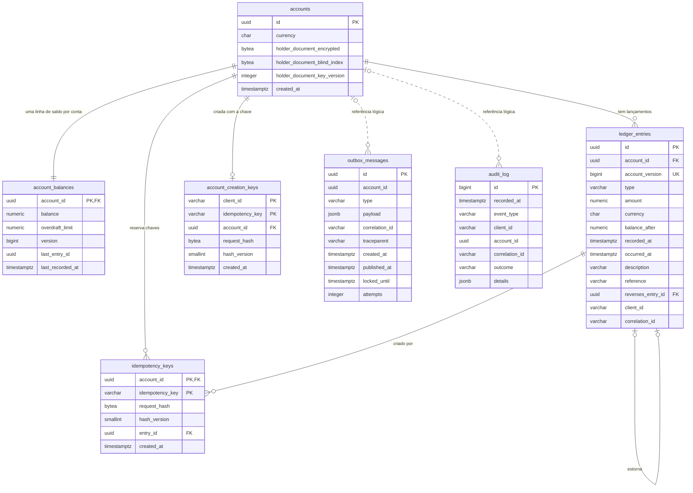

# Modelo de dados

O banco do ledger é um PostgreSQL 16 com sete tabelas de negócio e uma de controle das migrações. A página traz o DDL dos scripts de `src/Ledger.Infrastructure/Persistence/Migrations`, com a razão de cada índice e de cada privilégio. O SQL de cada operação (o `UPDATE` do saldo, a reserva da chave, a reivindicação do outbox) mora nos [fluxos](../06-fluxos/README.md).

## Visão geral

| Tabela | Papel | Quem escreve | A linha muda depois de gravada? |
|---|---|---|---|
| `accounts` | Cadastro mínimo da conta e o documento cifrado do titular | A API insere. O Worker re-cifra o documento | Só as três colunas `holder_document_*`, na rotação de chaves |
| `account_balances` | Saldo atual, limite e versão da conta. É a linha quente | A API insere e atualiza | A cada lançamento |
| `ledger_entries` | O livro: um lançamento por linha | A API insere | Nunca |
| `idempotency_keys` | Chaves de idempotência já consumidas e o hash do pedido | A API insere. O Worker poda | Nunca |
| `account_creation_keys` | Chaves de idempotência da criação de conta, por chamador | A API insere. O Worker poda | Nunca |
| `outbox_messages` | Fila dos eventos a publicar | A API insere. O Worker reivindica, marca e poda | Sim, é uma fila |
| `audit_log` | Trilha de ações administrativas e de segurança | A API e o Worker inserem | Nunca |
| `schemaversions` | Diário dos scripts já aplicados, mantido pelo DbUp | O executor de migrações | Só por inserção |



O diagrama omite o tamanho dos tipos, que está no DDL a seguir. Linhas contínuas são chaves estrangeiras, e as tracejadas, referências lógicas sem restrição no banco.

Cada conta tem exatamente uma linha em `account_balances`, cuja chave primária é também chave estrangeira, e o `UPDATE` condicional trava essa linha ([documento de arquitetura 0004](../03-principios-e-decisoes/documento-arquitetura/0004-saldo-corrente-com-update-condicional.md)). `balance_after` e `account_version` moram no próprio lançamento, o que faz do saldo em um instante uma busca por índice ([documento de arquitetura 0003](../03-principios-e-decisoes/documento-arquitetura/0003-saldo-apos-em-cada-lancamento.md)), e dos dois instantes do lançamento só `recorded_at`, do relógio do banco, define o saldo ([documento de arquitetura 0013](../03-principios-e-decisoes/documento-arquitetura/0013-tempo-do-saldo-registrado-em-vs-ocorrido-em.md)). `ledger_entries` não tem coluna de atualização: o estorno é um lançamento novo que aponta para o original por `reverses_entry_id`, com um índice único parcial que garante um estorno por lançamento ([documento de arquitetura 0002](../03-principios-e-decisoes/documento-arquitetura/0002-ledger-imutavel-somente-insercao.md)). `outbox_messages` e `audit_log` não têm chave estrangeira, porque uma restrição custaria uma verificação a cada escrita, e a caixa de saída vive no mesmo banco para entrar na transação do lançamento ([documento de arquitetura 0005](../03-principios-e-decisoes/documento-arquitetura/0005-transacao-unica-com-outbox.md)).

## Convenções

Identificadores são `uuid` versão 7, gerados pela aplicação (`Guid.CreateVersion7`): o `entry_id` e o id do evento precisam existir antes do `INSERT`, porque a linha de idempotência aponta para o lançamento antes de ele ser gravado, e o `account_id` entra como dado autenticado na cifra do documento. O prefixo temporal faz as inserções nos índices caírem perto da borda direita. Instantes são `timestamptz` com precisão de microssegundo, as conexões abrem com `timezone=UTC`, e `recorded_at` e `created_at` vêm do relógio do PostgreSQL (`clock_timestamp()`), nunca do da API. Dinheiro é `numeric(18,2)`. Os nomes são `snake_case`, tabelas no plural, colunas no singular, instantes terminados em `_at` e prefixos `pk_`, `fk_`, `uq_`, `ix_` e `ck_` nas restrições e nos índices.

## `accounts`

```sql
CREATE TABLE accounts (
    id uuid NOT NULL,
    currency char(3) NOT NULL,
    holder_document_encrypted bytea NULL,
    holder_document_blind_index bytea NULL,
    holder_document_key_version integer NULL,
    created_at timestamptz NOT NULL DEFAULT clock_timestamp(),
    CONSTRAINT pk_accounts PRIMARY KEY (id),
    CONSTRAINT ck_accounts_currency CHECK (currency ~ '^[A-Z]{3}$'),
    CONSTRAINT ck_accounts_holder_document CHECK (
        (holder_document_encrypted IS NULL) = (holder_document_blind_index IS NULL)
        AND (holder_document_encrypted IS NULL) = (holder_document_key_version IS NULL)
    ),
    CONSTRAINT ck_accounts_holder_document_blind_index CHECK (
        holder_document_blind_index IS NULL OR octet_length(holder_document_blind_index) = 32
    )
);

CREATE INDEX ix_accounts_holder_document_blind_index
    ON accounts (holder_document_blind_index)
    WHERE holder_document_blind_index IS NOT NULL;

CREATE INDEX ix_accounts_holder_document_key_version
    ON accounts (holder_document_key_version)
    WHERE holder_document_key_version IS NOT NULL;
```

Uma restrição acrescentada pela migração `0005` amarra a versão da chave aos bytes do blob cifrado:

```sql
ALTER TABLE accounts
    ADD CONSTRAINT ck_accounts_holder_document_key_version_matches_payload CHECK (
        holder_document_encrypted IS NULL
        OR (CASE
                WHEN octet_length(holder_document_encrypted) >= 3
                    THEN get_byte(holder_document_encrypted, 1) * 256 + get_byte(holder_document_encrypted, 2)
                         = holder_document_key_version
                ELSE FALSE
            END)
    );
```

O ledger não guarda nome, e-mail nem endereço, que o cadastro do banco já tem. Guarda o documento do titular, cifrado com AES-256-GCM, e o índice cego (HMAC-SHA-256, 32 bytes) que permite achar contas pelo documento sem decifrar nada. As três colunas do documento são nulas juntas ou preenchidas juntas, por causa do `CHECK`, e o esquema admite o estado nulo para a anonimização após a retenção, que nenhuma rotina executa hoje. O formato do blob está em [Proteção de dados](../07-consistencia-e-seguranca/protecao-de-dados.md).

O índice cego não é único, porque um titular pode ter mais de uma conta, e o índice por versão de chave serve à re-cifragem, que procura versões menores que a ativa. Os dois são parciais para não pesar depois da anonimização. A restrição da `0005` usa os bytes 1 e 2 do blob, que guardam a versão da chave, e o `CASE` garante a ordem da avaliação: um blob curto demais para ter versão é recusado, em vez de estourar em `get_byte`. A moeda mora aqui, não em `account_balances`, e o `UPDATE` do saldo a confere por junção com `accounts`, uma busca por chave primária que não trava a linha.

## `account_balances`

```sql
CREATE TABLE account_balances (
    account_id uuid NOT NULL,
    balance numeric(18,2) NOT NULL DEFAULT 0,
    overdraft_limit numeric(18,2) NOT NULL DEFAULT 0,
    version bigint NOT NULL DEFAULT 0,
    last_entry_id uuid NULL,
    last_recorded_at timestamptz NOT NULL,
    CONSTRAINT pk_account_balances PRIMARY KEY (account_id),
    CONSTRAINT fk_account_balances_account_id FOREIGN KEY (account_id) REFERENCES accounts (id),
    CONSTRAINT ck_account_balances_overdraft_limit CHECK (overdraft_limit >= 0),
    CONSTRAINT ck_account_balances_version CHECK (version >= 0),
    CONSTRAINT ck_account_balances_balance_floor CHECK (balance >= -overdraft_limit)
) WITH (fillfactor = 70, autovacuum_vacuum_scale_factor = 0.02);
```

É a linha que serializa as escritas de uma conta e carrega, sem junção, o que a decisão de aceitar ou recusar um débito precisa: `balance`, `overdraft_limit` e `version`. O limite mora aqui, não em `accounts`, para que uma mudança de limite e um débito disputem o mesmo lock.

A `version` é o número do último lançamento da conta: começa em zero e o primeiro lançamento é a versão 1. O incremento acontece na mesma instrução que trava a linha, e a transação confirma tudo ou desfaz tudo, então as versões não têm lacuna, o que uma sequência do PostgreSQL não garantiria. `last_entry_id` responde o `lastEntryId` do saldo atual por chave primária, sem tocar em `ledger_entries`, e `last_recorded_at` apoia a regra de monotonicidade abaixo.

O `CHECK` do piso é a segunda trava: um saldo atualizado por fora do repositório que passasse do limite seria recusado pelo banco. O `fillfactor` de 70 deixa espaço na página para as versões novas da linha, e como nenhuma coluna atualizada é indexada toda atualização é elegível a HOT. O autovacuum a 2% em vez de 20% existe porque cada lançamento deixa uma tupla morta.

### Monotonicidade de `recorded_at`

Dentro de uma conta, se a versão de A é menor que a de B, o `recorded_at` de A é estritamente menor que o de B. Sem a regra, o saldo em um instante deixaria de ter resposta única. O `UPDATE` de `account_balances` grava `last_recorded_at = GREATEST(clock_timestamp(), ab.last_recorded_at + INTERVAL '1 microsecond')`, e o `recorded_at` do lançamento é o `last_recorded_at` devolvido por esse mesmo `UPDATE`. Como ele só acontece com a linha travada, e quem espera o lock reavalia a expressão sobre a versão mais recente, cada lançamento enxerga o `last_recorded_at` do anterior já confirmado. O `GREATEST` mantém a sequência crescente mesmo que o relógio do servidor recue, e o valor fica na própria linha, então vale também para a primeira escrita depois de uma troca de primário. A decisão está no [documento de arquitetura 0018](../03-principios-e-decisoes/documento-arquitetura/0018-monotonicidade-do-recorded-at-e-janela-de-acomodacao.md), e a conferência de integridade do Worker verifica a regra por conta.

## `ledger_entries`

```sql
CREATE TABLE ledger_entries (
    id uuid NOT NULL,
    account_id uuid NOT NULL,
    account_version bigint NOT NULL,
    type varchar(6) NOT NULL,
    amount numeric(18,2) NOT NULL,
    currency char(3) NOT NULL,
    balance_after numeric(18,2) NOT NULL,
    recorded_at timestamptz NOT NULL,
    occurred_at timestamptz NOT NULL,
    description varchar(140) NULL,
    reference varchar(100) NULL,
    reverses_entry_id uuid NULL,
    client_id varchar(128) NOT NULL,
    correlation_id varchar(64) NOT NULL,
    CONSTRAINT pk_ledger_entries PRIMARY KEY (id),
    CONSTRAINT fk_ledger_entries_account_id FOREIGN KEY (account_id) REFERENCES accounts (id),
    CONSTRAINT fk_ledger_entries_reverses_entry_id FOREIGN KEY (reverses_entry_id) REFERENCES ledger_entries (id),
    CONSTRAINT uq_ledger_entries_account_id_account_version UNIQUE (account_id, account_version),
    CONSTRAINT ck_ledger_entries_type CHECK (type IN ('CREDIT', 'DEBIT')),
    CONSTRAINT ck_ledger_entries_amount CHECK (amount > 0),
    CONSTRAINT ck_ledger_entries_account_version CHECK (account_version >= 1),
    CONSTRAINT ck_ledger_entries_not_self_reversal CHECK (reverses_entry_id IS NULL OR reverses_entry_id <> id)
) WITH (autovacuum_vacuum_insert_scale_factor = 0.01, autovacuum_vacuum_insert_threshold = 100000);

CREATE INDEX ix_ledger_entries_account_id_recorded_at_account_version
    ON ledger_entries (account_id, recorded_at DESC, account_version DESC)
    INCLUDE (id, balance_after);

CREATE UNIQUE INDEX uq_ledger_entries_reverses_entry_id
    ON ledger_entries (reverses_entry_id)
    WHERE reverses_entry_id IS NOT NULL;

CREATE INDEX ix_ledger_entries_recorded_at
    ON ledger_entries USING brin (recorded_at)
    WITH (pages_per_range = 32, autosummarize = on);
```

O valor é sempre positivo e o sentido vem de `type`, nome escolhido para casar com o campo do contrato. O saldo anterior de uma linha é `balance_after` menos o valor com sinal, e `account_version` é a posição do lançamento na conta, uma ordem total que não depende de relógio. `client_id` e `correlation_id` gravam quem pediu e a que fluxo pertence, na mesma transação do lançamento, e por isso a linha já é o seu próprio registro de auditoria: um lançamento aceito não gera linha em `audit_log`. `description` e `reference` são texto livre do chamador e não vão para log, métrica nem evento. Sem `occurredAt` no pedido, a coluna recebe o `recorded_at`. A tabela não tem `updated_at`, exclusão lógica nem coluna que sugira mudança.

`reverses_entry_id` aponta para o lançamento original quando a linha é um estorno. A chave estrangeira garante que o original existe, o `CHECK` impede o estorno de si mesmo e o índice único parcial garante no máximo um estorno por lançamento, mesmo com duas requisições concorrentes. O banco não impõe que o estorno pertença à mesma conta do original: quem garante isso é o algoritmo de estorno, que busca o original por `(id, account_id)`. Uma chave estrangeira composta daria a garantia no banco ao custo de mais um índice único na maior tabela do sistema.

## `idempotency_keys` e `account_creation_keys`

```sql
CREATE TABLE idempotency_keys (
    account_id uuid NOT NULL,
    idempotency_key varchar(128) NOT NULL,
    request_hash bytea NOT NULL,
    hash_version smallint NOT NULL DEFAULT 1,
    entry_id uuid NOT NULL,
    created_at timestamptz NOT NULL DEFAULT clock_timestamp(),
    CONSTRAINT pk_idempotency_keys PRIMARY KEY (account_id, idempotency_key),
    CONSTRAINT fk_idempotency_keys_account_id FOREIGN KEY (account_id) REFERENCES accounts (id),
    CONSTRAINT fk_idempotency_keys_entry_id FOREIGN KEY (entry_id) REFERENCES ledger_entries (id) DEFERRABLE INITIALLY DEFERRED,
    CONSTRAINT ck_idempotency_keys_request_hash CHECK (octet_length(request_hash) = 32),
    CONSTRAINT ck_idempotency_keys_hash_version CHECK (hash_version >= 1)
);

CREATE INDEX ix_idempotency_keys_created_at
    ON idempotency_keys (created_at);

CREATE TABLE account_creation_keys (
    client_id varchar(128) NOT NULL,
    idempotency_key varchar(128) NOT NULL,
    account_id uuid NOT NULL,
    request_hash bytea NOT NULL,
    hash_version smallint NOT NULL DEFAULT 1,
    created_at timestamptz NOT NULL DEFAULT clock_timestamp(),
    CONSTRAINT pk_account_creation_keys PRIMARY KEY (client_id, idempotency_key),
    CONSTRAINT uq_account_creation_keys_account_id UNIQUE (account_id),
    CONSTRAINT fk_account_creation_keys_account_id FOREIGN KEY (account_id) REFERENCES accounts (id) DEFERRABLE INITIALLY DEFERRED,
    CONSTRAINT ck_account_creation_keys_request_hash CHECK (octet_length(request_hash) = 32),
    CONSTRAINT ck_account_creation_keys_hash_version CHECK (hash_version >= 1)
);

CREATE INDEX ix_account_creation_keys_created_at
    ON account_creation_keys (created_at);
```

Os dois índices em `created_at` vêm das migrações `0004` e `0006`. A chave primária de `idempotency_keys` é o árbitro do `ON CONFLICT` e a garantia de unicidade por conta. A tabela não guarda o corpo da resposta, porque a repetição reconstrói a resposta do lançamento gravado, que é imutável.

A chave estrangeira para `ledger_entries` é adiada até o commit de propósito: a linha da chave entra antes do lançamento, na mesma transação, e um defeito que confirmasse uma chave sem lançamento faria o commit falhar. O banco não impõe unicidade em `entry_id`, então a relação é de um para muitos, embora na prática cada lançamento tenha uma chave só.

Em `account_creation_keys` a chave pertence a quem a enviou, e por isso o `client_id` faz parte da chave primária e não entra no hash. A chave estrangeira para `accounts` é adiada pelo mesmo motivo, e `uq_account_creation_keys_account_id` impede que duas chaves apontem para a mesma conta. O `request_hash` leva o índice cego do documento, não o documento ([Idempotência e hash canônico](idempotencia-e-hash-canonico.md)). As duas tabelas guardam as chaves por 35 dias.

## `outbox_messages`

```sql
CREATE TABLE outbox_messages (
    id uuid NOT NULL,
    account_id uuid NOT NULL,
    type varchar(64) NOT NULL,
    payload jsonb NOT NULL,
    correlation_id varchar(64) NOT NULL,
    traceparent varchar(55) NULL,
    created_at timestamptz NOT NULL DEFAULT clock_timestamp(),
    published_at timestamptz NULL,
    locked_until timestamptz NULL,
    attempts integer NOT NULL DEFAULT 0,
    CONSTRAINT pk_outbox_messages PRIMARY KEY (id),
    CONSTRAINT ck_outbox_messages_attempts CHECK (attempts >= 0)
) WITH (fillfactor = 80, autovacuum_vacuum_scale_factor = 0.02);

CREATE INDEX ix_outbox_messages_created_at_pending
    ON outbox_messages (created_at)
    WHERE published_at IS NULL;

CREATE INDEX ix_outbox_messages_published_at
    ON outbox_messages (published_at)
    WHERE published_at IS NOT NULL;
```

O `id` é também o identificador do evento, o `message_id` da mensagem AMQP e o `eventId` do corpo ([Contrato de eventos](eventos.md)). O `payload` guarda o evento já pronto, `locked_until` é o prazo da reivindicação do lote pelo Worker e `attempts` conta as reivindicações. `correlation_id` e `traceparent` ficam em colunas para o Worker propagá-los ao broker sem abrir o JSON.

Os dois índices são parciais: o primeiro contém só o que falta publicar, é o que a reivindicação percorre e fica pequeno mesmo com a tabela cheia, e o segundo contém só as publicadas e serve à poda de sete dias. Marcar uma mensagem como publicada move a linha de um índice para o outro, então essa atualização não é HOT, e o `fillfactor` de 80 e o autovacuum agressivo compensam parte do custo.

## `audit_log`

```sql
CREATE TABLE audit_log (
    id bigint GENERATED ALWAYS AS IDENTITY,
    recorded_at timestamptz NOT NULL DEFAULT clock_timestamp(),
    event_type varchar(64) NOT NULL,
    client_id varchar(128) NOT NULL,
    account_id uuid NULL,
    correlation_id varchar(64) NOT NULL,
    outcome varchar(16) NOT NULL,
    details jsonb NOT NULL DEFAULT '{}'::jsonb,
    CONSTRAINT pk_audit_log PRIMARY KEY (id),
    CONSTRAINT ck_audit_log_outcome CHECK (outcome IN ('SUCCESS', 'DENIED', 'FAILURE'))
);

CREATE INDEX ix_audit_log_account_id_recorded_at
    ON audit_log (account_id, recorded_at DESC)
    WHERE account_id IS NOT NULL;

CREATE INDEX ix_audit_log_event_type_recorded_at
    ON audit_log (event_type, recorded_at DESC);
```

Só ações administrativas e de segurança entram aqui. O catálogo de `event_type` e o que a coluna `details` pode conter estão em [Trilha de auditoria](../07-consistencia-e-seguranca/trilha-de-auditoria.md). Rejeições de negócio e falhas de autenticação vão para log e métrica, e um lançamento aceito não entra, porque a própria linha de `ledger_entries` o registra.

## Índices de `ledger_entries` e de `account_balances`

| Índice ou restrição | Colunas | Atende |
|---|---|---|
| `pk_ledger_entries` | `id` | Busca do original no estorno e alvo das chaves estrangeiras. Com UUID v7, as inserções caem na borda direita |
| `uq_ledger_entries_account_id_account_version` | `account_id, account_version` | Uma versão por conta e o vizinho anterior de cada lançamento na conferência de integridade |
| `ix_ledger_entries_account_id_recorded_at_account_version` | `account_id, recorded_at DESC, account_version DESC`, incluindo `id, balance_after` | Saldo em um instante (varredura só de índice) e extrato por posição. É o maior índice da tabela |
| `uq_ledger_entries_reverses_entry_id` | `reverses_entry_id`, parcial | No máximo um estorno por lançamento |
| `ix_ledger_entries_recorded_at` | `recorded_at`, BRIN | Varredura por janela de tempo na conferência de integridade. Minúsculo, porque o heap é anexado em ordem de tempo |
| `pk_account_balances` | `account_id` | Saldo atual e alvo do `UPDATE` condicional. É o único índice da tabela, para manter as atualizações HOT |

O `audit_log` tem dois índices, `ix_audit_log_account_id_recorded_at` (parcial, para a trilha de uma conta) e `ix_audit_log_event_type_recorded_at` (histórico por tipo, inclusive das execuções da conferência de integridade). Os das outras tabelas estão junto de cada uma.

O índice do saldo em um instante carrega a promessa de baixa latência da consulta histórica. Com a chave `(account_id, recorded_at DESC, account_version DESC)`, a consulta "último lançamento com `recorded_at <= T`" desce a árvore até o primeiro item que satisfaz o predicado, e como `balance_after` e `id` estão no `INCLUDE` o plano é uma varredura só de índice, sem visita ao heap. O `QueryPlanTests` confere essa forma do plano. O terceiro componente, `account_version DESC`, torna a ordem do extrato e a do saldo determinística mesmo que alguém relaxe a monotonicidade.

Como `ledger_entries` só recebe inserções, o autovacuum clássico quase nunca dispara, e por isso a tabela usa `autovacuum_vacuum_insert_scale_factor = 0.01`: com o mapa de visibilidade em dia a varredura só de índice não visita o heap. A latência de 50 ms no p99 da consulta de saldo, atual e histórica, é uma meta para o volume premissado. A carga em escala não foi executada, e portanto o número não foi medido ([limites conhecidos](../09-qualidade/limites-conhecidos.md)).

## Imutabilidade

A imutabilidade de `ledger_entries` tem três camadas ([documento de arquitetura 0002](../03-principios-e-decisoes/documento-arquitetura/0002-ledger-imutavel-somente-insercao.md)): nenhum caminho do código emite `UPDATE` ou `DELETE` contra a tabela, os papéis da aplicação não têm esses privilégios, e um gatilho barra quem entra com um papel mais forte por engano. O mesmo gatilho protege `audit_log`.

```sql
CREATE FUNCTION forbid_mutation() RETURNS trigger
LANGUAGE plpgsql
AS $$
BEGIN
    RAISE EXCEPTION '% on % is not allowed', TG_OP, TG_TABLE_NAME
        USING ERRCODE = 'integrity_constraint_violation';
END;
$$;

CREATE TRIGGER tr_ledger_entries_forbid_update_delete
    BEFORE UPDATE OR DELETE ON ledger_entries
    FOR EACH ROW EXECUTE FUNCTION forbid_mutation();

CREATE TRIGGER tr_ledger_entries_forbid_truncate
    BEFORE TRUNCATE ON ledger_entries
    FOR EACH STATEMENT EXECUTE FUNCTION forbid_mutation();

CREATE TRIGGER tr_audit_log_forbid_update_delete
    BEFORE UPDATE OR DELETE ON audit_log
    FOR EACH ROW EXECUTE FUNCTION forbid_mutation();

CREATE TRIGGER tr_audit_log_forbid_truncate
    BEFORE TRUNCATE ON audit_log
    FOR EACH STATEMENT EXECUTE FUNCTION forbid_mutation();
```

O gatilho recusa `UPDATE`, `DELETE` e `TRUNCATE` até para o dono das tabelas, com o SQLSTATE `23000` (`integrity_constraint_violation`) e mensagens como `UPDATE on ledger_entries is not allowed`. A retenção de dez anos é uma premissa de negócio, e nenhum mecanismo do banco remove lançamento.

## Papéis e privilégios

O banco tem quatro papéis de login, sem superusuário e sem permissão de criar papéis. O provisionamento do ambiente os cria antes das migrações, porque senha é segredo e não entra em migração: no ambiente local, é o script de inicialização da imagem do PostgreSQL, em `docker/postgres`. O mesmo provisionamento cria o banco `ledger` com dono `ledger_migrator`, retira os privilégios de `PUBLIC` no banco e no esquema `public` e concede `CONNECT` e `USAGE` aos três papéis de aplicação.

| Papel | Quem usa | Pode |
|---|---|---|
| `ledger_migrator` | O comando `--migrate` do Worker | É dono do banco e das tabelas. Cria e altera objetos. O gatilho o impede de mudar o livro e a trilha |
| `ledger_api` | A API, nas três fontes de conexão | Inserir e ler o necessário para escrever e consultar. Nunca atualiza nem apaga lançamento |
| `ledger_worker` | O Worker | Publicar, podar e re-cifrar. Nunca insere lançamento |
| `ledger_readonly` | Quem precisa ler para diagnóstico e conciliação. Nenhum executável do ledger o usa | Ler, sem as colunas do documento do titular |

Os privilégios vêm das migrações `0002` a `0006`. A tabela mostra o resultado final por papel e por tabela. Quando o privilégio não vale para a tabela inteira, a célula lista as colunas permitidas.

| Tabela | `ledger_api` | `ledger_worker` | `ledger_readonly` |
|---|---|---|---|
| `accounts` | `INSERT`. `SELECT` em `id, currency, created_at` | `SELECT` em todas as colunas. `UPDATE` em `holder_document_encrypted, holder_document_blind_index, holder_document_key_version` | `SELECT` em `id, currency, created_at` |
| `account_balances` | `SELECT`, `INSERT`. `UPDATE` em `balance, version, last_entry_id, last_recorded_at` | `SELECT` | `SELECT` |
| `ledger_entries` | `SELECT`, `INSERT` | `SELECT` | `SELECT` |
| `idempotency_keys` | `SELECT`, `INSERT` | `SELECT` em `account_id, idempotency_key, created_at`. `DELETE` | `SELECT` |
| `account_creation_keys` | `SELECT`, `INSERT` | `SELECT` em `client_id, idempotency_key, created_at`. `DELETE` | `SELECT` em `client_id, idempotency_key, account_id, hash_version, created_at` |
| `outbox_messages` | `INSERT` | `SELECT`, `DELETE`. `UPDATE` em `published_at, locked_until, attempts` | nenhum |
| `audit_log` | `INSERT` | `INSERT`. `SELECT` em `id, recorded_at, event_type, outcome, details` | `SELECT` |
| `schemaversions` | `SELECT` | `SELECT` | `SELECT` |

A API só atualiza as quatro colunas do saldo, porque o `UPDATE` de tabela inteira lhe daria o poder de subir o `overdraft_limit` de uma conta, e a conferência de integridade não acusaria, já que compara o saldo com o mesmo limite adulterado. O Worker só atualiza as colunas do documento e as três do outbox, o que o impede de trocar a moeda de uma conta ou de reescrever o `payload` de um evento antes da publicação. A API não lê as colunas do documento porque não as usa, e o Worker lê da trilha só as cinco de que a conferência precisa, sem `client_id`, `account_id` nem `correlation_id`. O `ledger_readonly` não enxerga `outbox_messages`, as colunas do documento nem o `request_hash` da criação de conta, que contém o índice cego.

## Migrações e evolução do esquema

Os scripts são SQL puro, embutidos no assembly `Ledger.Infrastructure` e aplicados pelo DbUp com uma transação por script. Quem migra é o `--migrate` do Worker, com o papel `ledger_migrator`, e a API nunca migra ao subir ([migração do esquema](../06-fluxos/migracao-do-esquema.md)).

| Script | O que faz |
|---|---|
| `0001_initial_schema.sql` | As seis primeiras tabelas, os índices, a função e os gatilhos de imutabilidade |
| `0002_grant_privileges.sql` | Os privilégios iniciais dos papéis |
| `0003_grant_schema_version_and_audit_read.sql` | `SELECT` em `schemaversions` para os três papéis e a leitura da trilha pelo Worker |
| `0004_grant_prune_idempotency_keys.sql` | `DELETE` e leitura parcial de `idempotency_keys` para o Worker, e o índice `ix_idempotency_keys_created_at` |
| `0005_harden_security_constraints.sql` | Privilégios por coluna e a restrição que amarra a versão da chave ao blob |
| `0006_create_account_creation_keys.sql` | A tabela `account_creation_keys`, o índice e os privilégios |

O diário `schemaversions` tem três colunas: `schemaversionsid` (inteiro de sequência, chave primária), `scriptname` (texto de até 255 caracteres, com o nome completo do recurso, como `Ledger.Infrastructure.Persistence.Migrations.0001_initial_schema.sql`) e `applied` (instante sem fuso), e os três papéis de aplicação só o leem. A versão esperada é o maior número entre os scripts embutidos (hoje 6), que a readiness `schema` compara com o diário.

Regras que valem para toda mudança de esquema:

- Um script aplicado nunca é alterado, e não existe script de volta: reverter também é uma migração para a frente. O `migrations.sha256`, ao lado dos scripts, guarda o SHA-256 de cada um com os fins de linha normalizados para LF, e o `MigrationChecksumTests` reprova um script mudado depois de registrado, um script sem linha no arquivo e uma linha sem script. Mudança nova é script novo, com o número seguinte e a soma acrescentada ao arquivo.
- O nome segue `NNNN_verbo_objeto.sql`, com o número de quatro dígitos, e o nome de um script aplicado nunca muda, porque o DbUp o guarda no diário de cada banco e um nome diferente faria o script ser aplicado de novo.
- Cada script roda em sua própria transação, e duas execuções simultâneas se serializam pela trava consultiva `727001`, tomada numa conexão dedicada: a segunda espera, encontra o diário completo e não aplica nada.
- Mudança destrutiva acontece em duas versões do código: acrescenta e migra numa, remove na seguinte. A readiness aceita um esquema mais novo que o código, e por isso uma instância antiga convive com o banco já migrado durante a troca.
- Um `CREATE INDEX CONCURRENTLY` não cabe numa transação por script, e criar índice sobre tabela já grande exigiria mudar o executor antes. As migrações atuais não pediram, porque as tabelas nasceram vazias.
- Quando o particionamento de `ledger_entries` chegar, as restrições de unicidade que hoje são índices simples ganham a chave de partição. A lista do que muda está em [Evolução futura](../11-evolucao/evolucao-futura.md).
