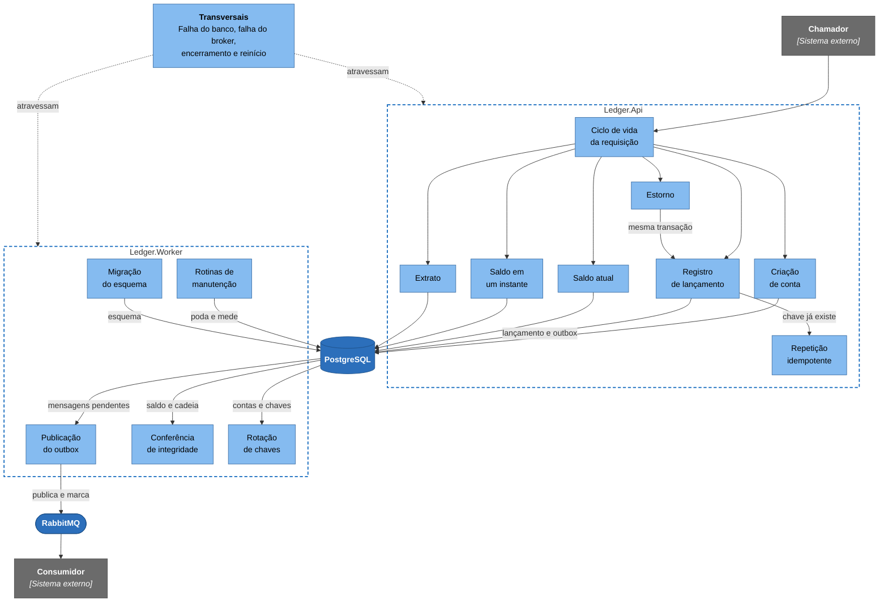

# 06 Fluxos

Cada página deste espaço segue uma operação do ledger na ordem real do código: quem chama quem, que SQL roda em cada passo, o que o passo garante e o que acontece quando ele falha. O que o sistema promete a quem o chama está nos [contratos](../05-contratos/README.md), e a estrutura dos executáveis, nos [modelos C4](../04-modelos-c4/README.md).

## Índice

| Fluxo | Pergunta que responde | Executável | Ponto de entrada |
|---|---|---|---|
| [Ciclo de vida de uma requisição](ciclo-de-vida-da-requisicao.md) | Em que ordem uma requisição é identificada, limitada, autorizada, medida e respondida? | API | `UseLedgerPipeline` |
| [Registro de lançamento](registro-de-lancamento.md) | Como um crédito ou débito vira um lançamento imutável, com saldo e evento, sem perder nem duplicar dinheiro? | API | `RegisterEntryHandler`, `EntryWriteFlow` |
| [Repetição idempotente](repeticao-idempotente.md) | O que acontece quando o mesmo pedido chega de novo, igual ou alterado? | API | `EntryWriteFlow.ReplayAsync` |
| [Estorno de lançamento](estorno.md) | Como se desfaz um lançamento sem alterá-lo, e o que acontece com dois estornos simultâneos? | API | `ReverseEntryHandler` |
| [Consulta de saldo atual](consulta-de-saldo.md) | Qual é o saldo agora, e o que essa resposta garante? | API | `GetBalanceHandler` |
| [Consulta de saldo em um instante](consulta-em-um-instante.md) | Quanto a conta tinha em um instante do passado, e até quando esse número pode mudar? | API | `GetBalanceHandler`, `PostgresBalanceReader` |
| [Extrato paginado](extrato.md) | Como se percorre o histórico da conta sem repetir nem perder lançamento? | API | `ListEntriesHandler` |
| [Criação de conta](criacao-de-conta.md) | Como nasce uma conta com o documento do titular protegido, e como repetir a criação com segurança? | API | `CreateAccountHandler` |
| [Publicação do outbox](publicacao-do-outbox.md) | Como o evento de um lançamento chega ao broker, pelo menos uma vez? | Worker | `OutboxPublisherService`, `PublishOutboxBatchHandler` |
| [Conferência de integridade](conferencia-de-integridade.md) | Como o ledger verifica continuamente que o saldo e a cadeia concordam entre si? | Worker | `IntegrityCheckService`, `RunIntegrityCheckHandler` |
| [Rotação das chaves de dados pessoais](rotacao-de-chaves.md) | Como se troca a chave dos documentos sem parar o serviço? | Worker | `KeyRewrapService`, `RewrapAccountsHandler` |
| [Rotinas de manutenção do Worker](rotinas-de-manutencao.md) | O que o Worker apaga e mede, e como se sabe que cada laço continua girando? | Worker | `WorkerLoopService`, `OutboxPruneService`, `IdempotencyPruneService`, `OutboxMeasurementService` |
| [Migração do esquema](migracao-do-esquema.md) | Como o esquema evolui, e o que impede uma versão sem esquema de receber tráfego? | Worker, em modo de migração | `MigrateCommand`, `MigrationRunner` |
| [Falha do banco de dados](falha-do-banco.md) | O que o sistema faz quando o PostgreSQL cai, demora ou deixa um commit incerto? | API e Worker | `GlobalExceptionHandler`, `WriteRetryPipeline` |
| [Falha do broker](falha-do-broker.md) | O que o sistema faz quando o RabbitMQ fica fora, e como se recupera? | Worker | `CircuitBreakingEventPublisher`, `BrokerConnection` |
| [Encerramento e reinício](encerramento-e-reinicio.md) | Como a API e o Worker são desligados e religados sem perder trabalho confirmado? | API e Worker | `ShutdownHealthCheck`, `DrainToken` |

## Como os fluxos se relacionam

Os fluxos giram em torno do PostgreSQL. A escrita termina no banco, o Worker lê o que a escrita deixou e a leitura consulta o mesmo banco. O estorno reaproveita o caminho do registro, e a repetição idempotente é a saída do registro quando a chave já existe. API e Worker nunca se falam: o que os liga é o banco, e a linha de outbox que o registro grava é a mensagem que a publicação lê. A publicação é o único caminho até o broker, e o broker não está no caminho de nenhuma escrita. Os fluxos de falha e de encerramento atravessam todos os demais.

## Convenções

Os participantes dos diagramas têm os nomes dos containers do [nível 2 do C4](../04-modelos-c4/nivel-2-containers.md): `Chamador`, `Ledger.Api`, `Ledger.Worker`, `PostgreSQL`, `RabbitMQ` e `Consumidor`, mais o `Provedor de chaves` e o `Orquestrador` onde o fluxo pede. Dentro de cada executável, os componentes seguem o nível 3 da [API](../04-modelos-c4/nivel-3-componentes-api.md) e do [Worker](../04-modelos-c4/nivel-3-componentes-worker.md). Uma seta cheia é chamada, uma tracejada é resposta e uma com `x` na ponta é mensagem que se perde. Blocos `alt` e `opt` mostram ramos, e blocos coloridos mostram variantes de um mesmo fluxo. O `BEGIN` e o `COMMIT` aparecem de propósito: o que acontece entre eles é uma transação em `READ COMMITTED`, e é nesse nível que duas requisições disputando a mesma conta se resolvem. Nomes físicos (tabelas, colunas, rotas, classes, chaves de configuração) ficam em fonte de código, em inglês.

Os blocos `sql` são o texto das constantes SQL de `src/Ledger.Infrastructure/Persistence`. Os testes `CriticalSqlMatchesFlowPagesTests` e `ReadSqlMatchesFlowPagesTests` comparam cada constante, com os espaços normalizados, com o bloco da página que a mostra. O SQL de definição das tabelas está em [Modelo de dados](../05-contratos/modelo-de-dados.md).

## Garantias que atravessam os fluxos

| Garantia | Mecanismo | Onde está descrita |
|---|---|---|
| Lançamento, saldo, chave e evento são tudo ou nada | Transação única, com chave estrangeira adiada ligando a chave ao lançamento | [Registro de lançamento](registro-de-lancamento.md) |
| Saldo nunca fura o limite, mesmo com concorrência | `UPDATE` condicional em `READ COMMITTED`, reavaliado depois da espera pelo lock | [Registro de lançamento](registro-de-lancamento.md) |
| Repetir um pedido nunca duplica | Índice único sobre `(account_id, idempotency_key)` e hash canônico do pedido | [Repetição idempotente](repeticao-idempotente.md) |
| O ledger só cresce | Gatilho, privilégios por papel e estorno como lançamento novo | [Estorno de lançamento](estorno.md) |
| Saldo, extrato e saldo em um instante concordam entre si | Eixo único de `recorded_at`, com `balance_after` em cada lançamento | [Saldo em um instante](consulta-em-um-instante.md), [Extrato](extrato.md) |
| Todo evento chega ao broker pelo menos uma vez | Outbox na mesma transação, reivindicação com prazo e confirmação do broker | [Publicação do outbox](publicacao-do-outbox.md) |
| A escrita não depende do broker | A API só grava no outbox, e o Worker publica | [Falha do broker](falha-do-broker.md) |
| O documento do titular não existe em claro | Cifra AES-256-GCM antes da transação e índice cego | [Criação de conta](criacao-de-conta.md), [Rotação das chaves](rotacao-de-chaves.md) |
| Divergência é detectada e nunca corrigida em silêncio | Conferência periódica com papel que não escreve no ledger | [Conferência de integridade](conferencia-de-integridade.md) |
| Toda falha de infraestrutura vira 503 e se recupera sozinha | Classificação de exceções, repetição segura e ausência de estado em memória | [Falha do banco de dados](falha-do-banco.md), [Encerramento e reinício](encerramento-e-reinicio.md) |

O que ainda não foi medido nem exercitado em ambiente real aparece dito, no ponto em que importa, e está reunido em [limites conhecidos](../09-qualidade/limites-conhecidos.md).
