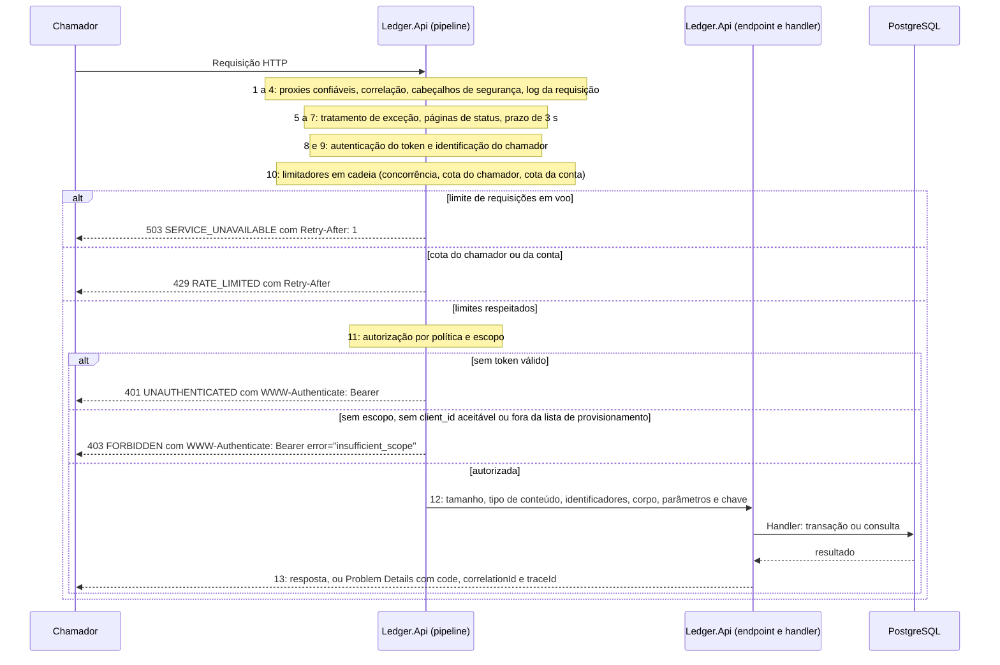

# Fluxo: ciclo de vida de uma requisição

Toda requisição que chega à `Ledger.Api` atravessa a mesma cadeia de etapas antes de qualquer regra de negócio, e a ordem da cadeia decide quem responde cada recusa. A correlação vem primeiro, para que até um 401 leve o identificador. A autenticação vem antes dos limites, para que a cota seja do chamador e não do endereço. Os limites vêm antes da autorização, para que quem esgotou a cota não gaste mais trabalho do servidor. Os valores dos limites estão em [Limites de taxa e de concorrência](../08-resiliencia-e-operacao/limites-de-taxa-e-concorrencia.md), a política de resiliência em [Políticas de resiliência](../08-resiliencia-e-operacao/politicas-de-resiliencia.md) e os códigos de erro no [Catálogo de erros](../05-contratos/catalogo-de-erros.md).

Os componentes são os do [nível 3 da API](../04-modelos-c4/nivel-3-componentes-api.md), compostos em `UseLedgerPipeline`. A autenticação lê a configuração `Authentication` (modo `Authority`, com as chaves públicas do emissor em cache, ou `LocalKey`, só em Development e Testing), os limites vêm de `RateLimiting` e o prazo e o `Retry-After`, de `Resilience`. As rotas de saúde e a do documento OpenAPI são anônimas e ficam fora dos limites, e as de saúde ficam fora também do prazo.

## Sequência

Cada nota do diagrama traz o número da etapa na tabela da próxima seção. As recusas dos limitadores vêm antes da autorização: uma requisição sem escopo ainda gasta a cota do chamador, e a cota esgotada responde 429 antes do 403. O prazo de 3 segundos cobre autenticação, limites, autorização e handler, não só o banco.

## Etapas

A ordem é a de `UseLedgerPipeline` e dos manipuladores registrados em `Program`, e o `PipelineOrderTests` cobre as relações que mais importam.

| Etapa | Componente | O que faz | O que pode devolver |
|---|---|---|---|
| 1 | `UseForwardedHeaders` | Só existe com `Security:ForwardedHeaders:KnownNetworks` preenchida (vazia por padrão). Aceita `X-Forwarded-For` e `X-Forwarded-Proto` de proxies das redes listadas, com um salto no máximo | Nada. Define a origem usada pelas cotas de quem não tem token |
| 2 | `CorrelationIdMiddleware` | Aceita um único `X-Correlation-Id` que case com `^[A-Za-z0-9._:-]{8,64}\z`. Senão gera 32 caracteres hexadecimais e, se havia valor recebido, registra o log 9004. Escreve o cabeçalho na resposta, marca o span e injeta `CorrelationId` no log | Nada |
| 3 | `SecurityHeadersMiddleware` e `ProblemMediaTypeMiddleware` | O primeiro escreve na saída os cabeçalhos de segurança (`Cache-Control: no-store` e, fora de Development, `Strict-Transport-Security`). O segundo faz o tipo `application/problem+json` levar `charset=utf-8` | Nada |
| 4 | `UseSerilogRequestLogging` | Uma linha por requisição, no nível que `RequestLogLevel` e `ColdStartRequestLogLevel` escolhem | Nada |
| 5 | `UseExceptionHandler` | Entrega ao `GlobalExceptionHandler` toda exceção que escapa das etapas internas | 503, 500, 499, ou o status do `BadHttpRequestException` |
| 6 | `UseStatusCodePages` | Dá corpo de Problem Details a respostas que só têm status | O corpo dos 401, 403, 404 e 405 |
| 7 | `UseRequestTimeouts` e `RequestTimeoutMarkerMiddleware` | Aplica o prazo de `Resilience:RequestTimeoutSeconds` (3 s) a tudo que não o desligou e marca o pedido que estourou. As rotas de saúde o desligam | 503 `SERVICE_UNAVAILABLE` com `Retry-After` |
| 8 | `UseAuthentication` | Valida o JWT: assinatura, emissor, audiência, validade com tolerância de 30 s, tipo `at+jwt`, vida de no máximo 15 minutos e algoritmos RS256 e ES256. Um token ruim não derruba a requisição aqui: ela segue como anônima, e a falha é contada em `ledger.auth.failures` | Nada. O usuário é autenticado ou anônimo |
| 9 | `ClientIdActivityMiddleware` | Copia o `client_id` do token para o span, quando existe | Nada |
| 10 | `UseRateLimiter` | Aplica a cadeia de limitadores: concorrência, cota do chamador, cota da conta | 503 ou 429, com `Retry-After` |
| 11 | `UseAuthorization` | Aplica a política da rota. Rota sem política cai na política padrão, que exige usuário autenticado com `client_id` | 401 ou 403 |
| 12 | Endpoint | Verificações de cada rota, abaixo | 400, 404, 413, 415, 422, 409, 503 e o sucesso |
| 13 | Resposta | `Cache-Control: no-store` nas respostas de negócio, e o cabeçalho e o corpo de erro com a correlação | |

Quem identifica é a autenticação (etapa 8), e quem recusa é a autorização (etapa 11): 401 quando não há usuário autenticado e 403 quando o token não tem o escopo da rota, não tem um `client_id` aceitável ou, na criação de conta, o cliente não consta em `Authorization:AccountProvisioningClients`. As regras de token e de escopo estão em [Autenticação e autorização](../07-consistencia-e-seguranca/autenticacao-e-autorizacao.md).

A etapa 10 combina três limitadores, e aqui só importa a ordem entre eles. O primeiro é a concorrência da classe da rota (escrita, saldo ou extrato): um máximo de requisições em voo por instância, sem fila. Estourar responde 503 com `Retry-After: 1` e não gasta cota do chamador, porque saturação é problema do servidor. O segundo é a cota do chamador, em dois baldes por `client_id`, leitura e escrita. Quem não tem token válido cai na cota da origem do soquete, ou do `X-Forwarded-For` quando os proxies estão configurados, e estourar responde 429 com `Retry-After` igual ao tempo até a próxima reposição. O terceiro é a cota da conta, só nas escritas de quem tem token autenticado com o escopo de escrita, `client_id` válido e o identificador de conta canônico na rota. Assim quem conhece um `accountId` não consegue esvaziar o balde da conta com pedidos sem credencial e fazer os lançamentos legítimos receberem 429. Baldes e contadores vivem na memória de cada instância, e as rotas sem classe, como as de saúde, não passam pela cadeia.

## Dentro do endpoint

Depois da autorização, o endpoint repete uma ordem fixa de verificações. Cada uma só roda se a anterior passou, e nenhuma abre transação. Nas rotas de escrita (`POST /v1/accounts`, `POST .../entries`, `POST .../reversals`):

1. Tamanho do corpo: acima de 16 KiB (`ApiConstants.MaxRequestBodyBytes`), 413 `PAYLOAD_TOO_LARGE`. O Kestrel tem o mesmo teto, e a recusa dele também chega como 413 com Problem Details.
2. Tipo de conteúdo: tudo que não é `application/json` com charset `utf-8` ou ausente responde 415. O estorno só exige o tipo quando há corpo.
3. Identificadores: conta e lançamento fora do formato hifenizado de 36 caracteres respondem 404, como se não existissem, sem olhar o corpo.
4. Corpo e cabeçalho: leitura estrita do JSON e do `Idempotency-Key`, com todos os problemas acumulados num 400 `VALIDATION_FAILED` único, sem repetir os valores recebidos.
5. Chave obrigatória ausente: 400 `IDEMPOTENCY_KEY_REQUIRED`, só depois de o corpo ser considerado válido.
6. Handler: a transação ([registro de lançamento](registro-de-lancamento.md), [estorno](estorno.md), [criação de conta](criacao-de-conta.md)).

Nas rotas de leitura (`GET .../balance` e `GET .../entries`) vêm o identificador da conta (404 se malformado), os parâmetros (400, com `INVALID_AS_OF` para o `asOf` e `VALIDATION_FAILED` com `errors` no extrato) e o handler ([saldo atual](consulta-de-saldo.md), [saldo em um instante](consulta-em-um-instante.md), [extrato](extrato.md)).

## Respostas de erro

Todo erro sai como `application/problem+json; charset=utf-8`, montado pelo `ProblemFactory` e pelo `ProblemCatalog`, sem pilha, texto de SQL, nome de servidor, SQLSTATE nem o valor que o chamador enviou. O formato e o significado de cada código estão no [Catálogo de erros](../05-contratos/catalogo-de-erros.md). Quem produz cada um está na tabela de etapas, com três acréscimos: o handler responde 409 e 422, o 401 leva `WWW-Authenticate: Bearer` (e `error="invalid_token"` quando havia token recusado) e o 403 leva `error="insufficient_scope"` e o escopo exigido, quando o chamador é conhecido. O 500 sai com o log 9001, o 503 de dependência indisponível leva sempre `Retry-After`, e o 499, sem corpo, é de quem foi embora antes do prazo.

## O que falha em cada etapa

| Etapa | Falha | Efeito | O que o chamador percebe |
|---|---|---|---|
| 2 | `X-Correlation-Id` repetido ou fora do padrão | Descartado e substituído, log 9004 | A resposta traz o identificador gerado |
| 5 | Exceção não prevista | Registrada com pilha no log, sem detalhe na resposta | 500 `INTERNAL_ERROR` |
| 7 | Requisição passa de 3 s, ou o cliente desiste antes | Trabalho cancelado | 503 com `Retry-After`, ainda com os cabeçalhos das etapas externas, ou 499 sem corpo |
| 8 | Token ausente, expirado, adulterado, de outro emissor, de outra audiência ou longo demais | Requisição segue como anônima, a falha é contada | 401 na etapa 11, e a cota é a da origem |
| 10 | Cota ou concorrência esgotada | Recusa antes da autorização | 429 ou 503 com `Retry-After` |
| 11 | Escopo ou `client_id` insuficientes | Em escrita com chamador conhecido, a negação é gravada na trilha, com teto por cliente | 403 |
| 12 | Corpo ou parâmetro inválido | Nenhuma transação | 400, 404, 413 ou 415 |
| 12 | Falha de dependência no handler | Tratada em [falha do banco de dados](falha-do-banco.md) | 503 ou 500 |

## O que o fluxo garante

Toda resposta, inclusive 401, 413, 429 e 503, carrega a correlação e os cabeçalhos de segurança, porque as etapas externas os escrevem no início da resposta e as saídas das etapas internas passam por elas. A cota por conta não serve de arma contra terceiros, porque só quem pode escrever a esgota. Rota sem política é negada por padrão: uma rota desconhecida responde 401 sem token e 404 com token, e não revela quais existem. Nenhuma recusa anterior ao handler abre transação.

Cada requisição gera `http.server.request.duration` e a linha de log da etapa 4, que sai em `Error` para 5xx, `Information` para 4xx, `Warning` acima de 150 ms, `Debug` nas demais e `Verbose` para `/health` (a primeira requisição lenta do processo fica em `Information`). As falhas de autenticação e de autorização contam em `ledger.auth.failures` e as recusas de limite em `ledger.rate_limit.rejections`, e a escrita negada a chamador conhecido vai para a [trilha de auditoria](../07-consistencia-e-seguranca/trilha-de-auditoria.md) como `authorization.denied_write`. Eventos de log e métricas estão em [Saúde e observabilidade](../08-resiliencia-e-operacao/saude-e-observabilidade.md) e no [Catálogo de métricas](../08-resiliencia-e-operacao/catalogo-de-metricas.md).

Os testes do fluxo: `PipelineOrderTests` (ordem entre correlação, autenticação, limites e autorização), `CorrelationIdTests`, `SecurityHeadersTests`, `RateLimitBehaviorTests`, `RouteScopeMatrixTests`, `ProblemDetailPresenceTests`, `RequestTimeoutTests`, `EntryRequestOrderTests` e `ReadRequestOrderTests` (ordem das verificações dentro do endpoint).
