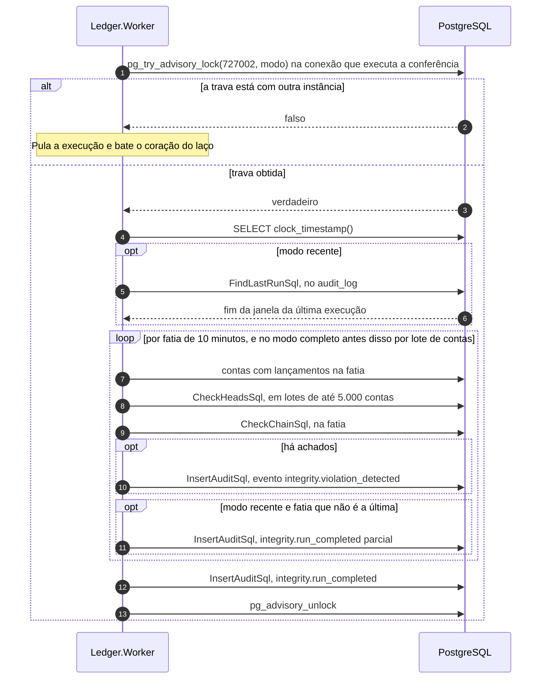

# Fluxo: conferência de integridade

O ledger promete que o saldo guardado, a cadeia de lançamentos e os limites das contas concordam entre si. A conferência é o laço do Worker que verifica essa promessa continuamente, registra cada divergência na trilha de auditoria e nunca corrige nada sozinha. Uma divergência entre `account_balances` e `ledger_entries`, ou dentro da própria cadeia, venha de alteração indevida ou de defeito de gravação, é acusada em minutos quando a conta teve movimento recente, e o topo de todas as contas é conferido uma vez por dia, no padrão. As invariantes verificadas estão em [Modelo de consistência](../07-consistencia-e-seguranca/modelo-de-consistencia.md), e a trilha em [Trilha de auditoria](../07-consistencia-e-seguranca/trilha-de-auditoria.md).

A API não participa. O Worker usa o papel `ledger_worker`, que só lê `ledger_entries` e `account_balances` e grava no `audit_log`, de onde lê apenas `id`, `recorded_at`, `event_type`, `outcome` e `details`, as colunas de que precisa para achar o ponto de partida da próxima execução. Os componentes (`IntegrityCheckService`, `RunIntegrityCheckHandler`, `IntegrityClassifier`, `PostgresIntegritySession`) estão no [nível 3 do Worker](../04-modelos-c4/nivel-3-componentes-worker.md), e os parâmetros, em `Integrity`, na [configuração](../05-contratos/configuracao.md).

## O que se verifica

Duas consultas cobrem as sete verificações automáticas: a do topo olha a linha de cada conta contra o último lançamento dela, e a da cadeia olha cada lançamento contra o anterior. A oitava, a soma direta dos lançamentos, existe só no comando de inspeção.

| Verificação | Consulta | O que acusa |
|---|---|---|
| `HEAD_BALANCE` | Topo | O saldo guardado difere do `balance_after` do último lançamento (ou de zero, sem lançamentos) |
| `HEAD_VERSION` | Topo | A `version` da conta difere do `account_version` do último lançamento |
| `HEAD_LAST_ENTRY` | Topo | O `last_entry_id` não aponta para o último lançamento |
| `HEAD_FLOOR` | Topo | O saldo está abaixo de menos o limite de cheque especial |
| `CHAIN_DRIFT` | Cadeia | O `balance_after` do lançamento difere do anterior mais o valor com sinal |
| `CHAIN_GAP` | Cadeia | O lançamento de versão N não tem o de versão N menos 1. Quando há lacuna, o desvio não é reportado |
| `CHAIN_NON_MONOTONIC` | Cadeia | O `recorded_at` do lançamento não é posterior ao do anterior |
| `SUM_BALANCE` | Só na inspeção | O saldo guardado difere da soma dos valores com sinal de todos os lançamentos da conta |

## Uma execução

A trava e todas as consultas rodam na mesma conexão, e a trava é de sessão: cai sozinha se a conexão morrer. O ponto de partida do modo recente vem da trilha, sem tabela de controle, e a ordem das fatias e dos lotes muda conforme o modo.



1. **Dois laços.** O laço recente roda a cada `Integrity:RecentIntervalMinutes`. O completo espera a primeira execução recente terminar e acorda no mesmo intervalo para ver se está na hora: compara o último `integrity.run_completed` do modo `FULL` no `audit_log` com o relógio do banco e só executa quando passou `Integrity:FullIntervalHours`, ou de imediato se nunca rodou. Cada laço tem o seu batimento (`integrity-recent` e `integrity-full`), para que um laço recente preso não seja escondido pelo completo.

2. **Trava por modo.** O `PostgresIntegritySessions.TryBeginRunAsync` abre uma conexão da fonte `Worker` e executa `pg_try_advisory_lock(727002, modo)`, com modo 1 para a recente e 2 para a completa. Só uma instância confere cada modo por vez, e as outras pulam a execução e seguem registrando o batimento. O modo entra na chave porque a execução completa é longa e não pode segurar a recente. Se a liberação da trava falha (log 4004), a sessão descarta a conexão física, o que a libera no servidor.

3. **Relógio e janela.** No modo recente, o ponto de partida é o fim da janela da última execução (lido pela consulta abaixo) menos `Integrity:RecentOverlapMinutes`, ou, sem execução anterior, o agora menos o intervalo e a sobreposição. A sobreposição existe porque uma transação em voo pode confirmar depois, com `recorded_at` dentro de uma janela já conferida, e 1 minuto cobre com sobra a janela de acomodação de 5 segundos. Se o ponto de partida ficar atrás do agora menos 24 horas e 1 minuto, a janela é cortada nesse piso, o log 4005 avisa e o trecho mais antigo fica para a execução completa. No modo completo a janela são as últimas 24 horas mais a sobreposição, sem ler o registro anterior.

```sql
SELECT a.recorded_at, a.outcome, a.details
FROM audit_log AS a
WHERE a.event_type = 'integrity.run_completed'
  AND a.details ->> 'mode' = @mode
ORDER BY a.recorded_at DESC
LIMIT 1;
```

4. **Modo recente: fatias.** A janela é cortada em fatias de `Integrity:ChainSliceMinutes`. Para cada fatia, o handler lista as contas com lançamentos nela, pula as já conferidas na execução, confere o topo em lotes de `Integrity:HeadBatchSize` e confere a cadeia da fatia. Depois de cada fatia que não é a última grava um registro parcial, com o fim da janela naquela fatia, que é o ponto de retomada da próxima execução se esta for interrompida.

```sql
SELECT DISTINCT e.account_id
FROM ledger_entries AS e
WHERE e.recorded_at >= @window_start
  AND e.recorded_at < @window_end
ORDER BY e.account_id;
```

5. **Modo completo: todas as contas, depois a cadeia.** O handler percorre todas as contas por chave, em lotes (`account_id > @after`), e confere o topo de cada lote. Em seguida confere a cadeia da janela inteira, fatia por fatia, o que com os padrões dá 145 fatias.

```sql
SELECT b.account_id
FROM account_balances AS b
WHERE b.account_id > @after
ORDER BY b.account_id
LIMIT @batch_size;
```

6. **Topo.** O `CheckHeadsAsync` recebe uma lista de contas e devolve só as que divergem.

```sql
SELECT b.account_id, b.balance, b.overdraft_limit, b.version, b.last_entry_id,
       last_entry.balance_after, last_entry.account_version, last_entry.id AS entry_id
FROM account_balances AS b
LEFT JOIN LATERAL (
    SELECT e.id, e.account_version, e.balance_after
    FROM ledger_entries AS e
    WHERE e.account_id = b.account_id
    ORDER BY e.recorded_at DESC, e.account_version DESC
    LIMIT 1
) AS last_entry ON TRUE
WHERE b.account_id = ANY(@account_ids)
  AND (   b.balance <> COALESCE(last_entry.balance_after, 0)
       OR b.version <> COALESCE(last_entry.account_version, 0)
       OR b.last_entry_id IS DISTINCT FROM last_entry.id
       OR b.balance < -b.overdraft_limit);
```

7. **Cadeia.** O `CheckChainAsync` olha cada lançamento da fatia contra o anterior, achado pelo índice único `(account_id, account_version)`. O predecessor é escrito como `LEFT JOIN LATERAL ... LIMIT 1`, que só tem plano de busca por índice: sem isso o planejador pode escolher um *hash join* que lê a tabela inteira, o que não serve para uma tabela grande. A janela de uma fatia é pequena para caber no `statement_timeout` de 10 segundos da fonte `Worker`.

```sql
SELECT e.account_id, e.account_version, e.id, e.balance_after, e.recorded_at,
       p.recorded_at AS previous_recorded_at,
       e.balance_after - COALESCE(p.balance_after, 0)
         - CASE e.type WHEN 'CREDIT' THEN e.amount ELSE -e.amount END AS balance_drift,
       (p.id IS NULL AND e.account_version > 1) AS missing_predecessor,
       (p.id IS NOT NULL AND e.recorded_at <= p.recorded_at) AS non_monotonic
FROM ledger_entries AS e
LEFT JOIN LATERAL (
    SELECT q.id, q.balance_after, q.recorded_at
    FROM ledger_entries AS q
    WHERE q.account_id = e.account_id AND q.account_version = e.account_version - 1
    LIMIT 1
) AS p ON TRUE
WHERE e.recorded_at >= @window_start
  AND e.recorded_at < @window_end
  AND (   e.balance_after - COALESCE(p.balance_after, 0)
            - CASE e.type WHEN 'CREDIT' THEN e.amount ELSE -e.amount END <> 0
       OR (p.id IS NULL AND e.account_version > 1)
       OR (p.id IS NOT NULL AND e.recorded_at <= p.recorded_at));
```

8. **Classificação.** O `IntegrityClassifier` transforma cada linha devolvida em um ou mais achados. Numa linha da cadeia com lacuna só o `CHAIN_GAP` é reportado. Sem lacuna, o desvio e o `CHAIN_NON_MONOTONIC` podem vir juntos.

9. **Registro de cada achado.** Cada achado vira uma linha `integrity.violation_detected` no `audit_log`, com resultado `FAILURE`, o identificador da execução como correlação, a conta e, nos detalhes, o modo, a verificação, o lançamento e a versão (na cadeia) e os valores esperado e encontrado. Os valores monetários ficam na trilha, que tem acesso restrito e retenção longa, e o log 4002 (`Error`) diz qual verificação falhou, em qual conta e em qual lançamento, sem valor.

```sql
INSERT INTO audit_log (event_type, client_id, account_id, correlation_id, outcome, details)
VALUES (@event_type, @client_id, @account_id, @correlation_id, @outcome, @details);
```

10. **Registro da execução.** Ao fim, a execução grava `integrity.run_completed` com resultado `SUCCESS`, ou `FAILURE` quando houve achado, e nos detalhes o modo (`RECENT` ou `FULL`), a janela, o número de contas e de lançamentos conferidos e o de achados. O medidor `ledger.integrity.last.success.timestamp` só avança se a execução terminou sem achados.

11. **Batimento.** O handler registra o batimento do laço depois de cada lote de contas e de cada fatia, para que uma execução longa não ultrapasse o limite de 30 minutos da verificação de vida do Worker.

## O que a conferência nunca faz

O Worker não corrige: o papel `ledger_worker` não tem `INSERT`, `UPDATE` nem `DELETE` em `ledger_entries` e `account_balances`, e a execução só lê. O ajuste, quando a causa é entendida, é decisão humana: um novo lançamento ou, para `account_balances`, um procedimento operacional executado fora da aplicação. A conta com divergência continua recebendo lançamentos, e a cadeia de lançamentos mais antigos que a janela da execução completa só é conferida sob demanda, pelo comando de inspeção.

`Ledger.Worker --inspect-account=<guid>` confere uma conta sem iniciar serviço algum, sem trava e sem escrever nada. Roda o topo, a cadeia sem janela (`e.account_id = @account_id`) e a soma direta, as duas últimas sobre todo o histórico, e imprime um resumo (log 4006) e um achado por linha (log 4007). Sai com 0 sem achados, 1 com achados e 3 para entrada ou configuração inválida.

```sql
SELECT b.balance AS stored_balance,
       COALESCE(s.entries_sum, 0) AS entries_sum,
       COALESCE(s.entry_count, 0) AS entry_count,
       b.version
FROM account_balances AS b
LEFT JOIN LATERAL (
    SELECT SUM(CASE e.type WHEN 'CREDIT' THEN e.amount ELSE -e.amount END) AS entries_sum,
           COUNT(*) AS entry_count
    FROM ledger_entries AS e
    WHERE e.account_id = b.account_id
) AS s ON TRUE
WHERE b.account_id = @account_id;
```

## O que falha

| Passo | Falha | Efeito | O que se observa |
|---|---|---|---|
| 2 | Outra instância tem a trava do modo | A execução é pulada, o batimento é registrado | Nenhum registro, nenhuma falha |
| 3 a 7 | Banco indisponível, consulta acima de 10 s ou conexão derrubada | A execução falha, a trava é liberada, nenhuma execução completa é registrada | Log 4003, `ledger.integrity.check.runs` com `result` igual a `error`. A próxima execução recente recomeça do último registro, inclusive dos parciais (`IntegrityFailureTests`) |
| 3 | Parada longa do Worker (mais de 24 h) | A janela recente é cortada no piso | Log 4005, e o trecho mais antigo fica para a execução completa |
| 9 | Divergência encontrada | Registro `integrity.violation_detected`, execução marcada como `FAILURE` | Log 4002 em `Error`, `ledger.integrity.violations` e o medidor de último sucesso parado |
| Desligamento | Parada pedida no meio | A execução é cancelada e nenhuma execução completa é registrada (os parciais já gravados ficam). Nenhuma falha é contada | A trava é liberada pelo encerramento da sessão |

## O que o fluxo garante

Não há lacuna entre execuções: a sobreposição de 1 minuto e o registro parcial por fatia fazem a próxima execução retomar do ponto certo, e uma transação que confirma tarde ainda é conferida. A completa confere o topo de todas as contas a cada `Integrity:FullIntervalHours` (24 por padrão), mesmo as sem lançamento recente. A consulta de cadeia só usa busca por índice, e um teste contra um banco real reprova o plano se aparecer *hash join* ou *merge join*.

A duração da execução completa com o volume premissado, de dezenas de milhões de contas, não foi medida, e esse volume nunca foi exercitado ([limites conhecidos](../09-qualidade/limites-conhecidos.md)).

A execução gera `ledger.integrity.check.runs`, `ledger.integrity.check.duration`, `ledger.integrity.violations` e o span `integrity.check`, com os logs 4001 a 4007, 4100 e 4101, descritos em [Saúde e observabilidade](../08-resiliencia-e-operacao/saude-e-observabilidade.md) e no [Catálogo de métricas](../08-resiliencia-e-operacao/catalogo-de-metricas.md). O que fazer diante de um achado está em [Procedimentos de operação](../08-resiliencia-e-operacao/runbooks.md), e a trava por modo, no [documento de arquitetura 0026](../03-principios-e-decisoes/documento-arquitetura/0026-conferencia-de-integridade-com-trava-por-modo.md).

Os testes do fluxo: `IntegrityDetectsTamperingTests` aplica cada adulteração a um banco real e confere que o ledger saudável não gera achado, `IntegrityNeverCorrectsTests` confere que a execução não escreve no ledger e `IntegrityLockTests` dispara oito execuções simultâneas, com uma só vencedora. Também cobrem o fluxo `IntegrityWindowTests`, `IntegrityFailureTests`, `PostgresIntegritySessionTests` (inclusive o plano da consulta de cadeia), `IntegrityCheckServiceTests`, `RunIntegrityCheckHandlerTests` e, ponta a ponta, `IntegrityE2ETests`. O SQL é o das constantes do código, conferido por `ReadSqlMatchesFlowPagesTests`.
