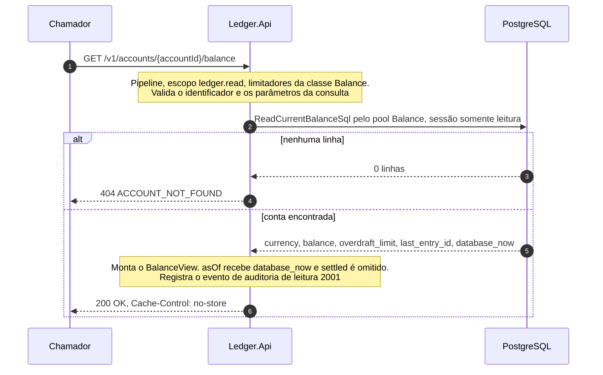

# Fluxo: consulta de saldo atual

`GET /v1/accounts/{accountId}/balance`, sem parâmetros, devolve o saldo confirmado mais recente da conta. A leitura é uma única instrução do PostgreSQL, que junta duas buscas por chave primária, e não soma histórico. O mesmo endpoint com `asOf` resolve o saldo de um instante do passado e tem página própria: [consulta de saldo em um instante](consulta-em-um-instante.md). A forma exata da resposta está em [Contrato da API REST](../05-contratos/api-rest.md).

Participam o chamador, a `Ledger.Api` e o PostgreSQL, e na API o `BalanceEndpoints`, o `GetBalanceHandler` e o `PostgresBalanceReader` ([nível 3](../04-modelos-c4/nivel-3-componentes-api.md)). O chamador tem `ledger.read` e `client_id` aceitável, a conta existe e a instância tem a fonte `Balance` disponível: pool próprio de 8 conexões, sessões somente leitura (`default_transaction_read_only=on`), comando de 1 segundo e `statement_timeout` de 1,5 segundo (`Postgres:Sources:Balance`).

## Sequência

A sequência é curta de propósito: uma conexão, uma instrução, nenhuma transação aberta pela aplicação, nenhuma escrita e nenhum cache. O relógio que sai na resposta é o do banco (`clock_timestamp()`), o mesmo que atribui o `recorded_at` dos lançamentos, e a sessão somente leitura faz o banco recusar qualquer escrita que um defeito pusesse nesse caminho.



## Passo a passo

1. **Pipeline e limites.** A rota exige a política `ledger.read` e pertence à classe `Balance`: 16 requisições em voo por instância, cota de leitura por chamador (`RateLimiting:ReadPerClient`) e prazo de 3 segundos, na ordem do [ciclo de vida de uma requisição](ciclo-de-vida-da-requisicao.md).

2. **Validação no endpoint.** O `BalanceEndpoints.GetBalanceAsync` valida o identificador da conta (formato hifenizado de 36 caracteres, senão 404 `ACCOUNT_NOT_FOUND` sem tocar o banco) e lê a query string com o `BalanceQueryReader`. Parâmetro desconhecido é 400 `VALIDATION_FAILED` com a razão `UNKNOWN_FIELD`, e sem `asOf` a consulta é a do saldo atual.

3. **Telemetria.** O `GetBalanceHandler` abre a operação no modo `current`, que cria o span `ledger.balance_query` e, ao fechar, grava `ledger.balance.query.duration`.

4. **Leitura.** O `PostgresBalanceReader.ReadCurrentAsync` abre uma conexão da fonte `PostgresSource.Balance` e executa a instrução abaixo: duas buscas por chave primária, em `accounts` e em `account_balances`, cuja linha já guarda saldo, limite e `last_entry_id`.

```sql
SELECT a.currency, ab.balance, ab.overdraft_limit, ab.last_entry_id, clock_timestamp() AS database_now
FROM accounts AS a
JOIN account_balances AS ab ON ab.account_id = a.id
WHERE a.id = @account_id;
```

5. **Resultado.** Sem linha, o resultado é `AccountErrors.NotFound` e a resposta é 404. Com linha, o handler monta o `BalanceView` com saldo e limite como `Money` na moeda da conta, o `lastEntryId` (nulo para conta sem lançamento) e o `asOf` igual ao `database_now`. No saldo atual, `settled` fica nulo e não aparece no corpo.

6. **Auditoria da leitura.** Em caso de sucesso, o `ReadAudit.BalanceQueried` emite o evento 2001 na categoria `Ledger.Audit`, com chamador, conta, correlação e o modo `CURRENT`, sem nunca levar o saldo. A categoria tem nível `Information` configurado mesmo quando o nível padrão do log é mais alto.

7. **Resposta.** O `ReadResults.Success` responde 200 com `Cache-Control: no-store`. Uma conta sem lançamento devolve saldo `0.00` e `lastEntryId` nulo.

## O que falha

| Passo | Falha | Efeito | O que o chamador percebe |
|---|---|---|---|
| 2 | Identificador fora do formato | Nenhum acesso ao banco | 404 `ACCOUNT_NOT_FOUND` |
| 2 | Parâmetro desconhecido ou `asOf` repetido | Nenhum acesso ao banco | 400 `VALIDATION_FAILED` ou 400 `INVALID_AS_OF` |
| 4 | Conta inexistente | Nenhum efeito | 404 `ACCOUNT_NOT_FOUND` |
| 4 | Pool de saldo esgotado (espera de 1 s), comando acima de 1 s ou banco indisponível | Trabalho cancelado, sem nova tentativa | 503 `SERVICE_UNAVAILABLE` com `Retry-After: 1` |

A cota do chamador e o limite de requisições em voo recusam no pipeline, antes do handler, com 429 `RATE_LIMITED` ou 503 `SERVICE_UNAVAILABLE` e `Retry-After`. A leitura não tem nova tentativa: uma falha vira 503 e o chamador repete. Esgotar o pool de saldo não afeta o extrato nem a escrita, porque cada um tem o seu (`ReadPoolIsolationTests`). O banco indisponível está em [falha do banco de dados](falha-do-banco.md).

## O que a resposta garante

O saldo é o valor confirmado mais recente: a instrução roda em `READ COMMITTED` e enxerga tudo o que já confirmou, sem cache entre a API e o banco ([documento de arquitetura 0009](../03-principios-e-decisoes/documento-arquitetura/0009-sem-cache-na-v1.md)), e depois de um `201` de escrita a leitura em qualquer instância vê o lançamento e o saldo novo (`BalanceAfterWriteTests`). Saldo e último lançamento são coerentes porque vêm da mesma linha de `account_balances`, atualizada pelo `UPDATE` do registro junto com o lançamento: o saldo lido é o `balance_after` do lançamento de `last_entry_id`, e a [conferência de integridade](conferencia-de-integridade.md) verifica a igualdade. A leitura não espera escrita, porque o MVCC faz a consulta ignorar o lock que uma escrita segura na linha da conta (`ReadsDuringWritesTests`), e não altera o ledger.

O saldo atual não é um saldo em T, e por isso não serve como verificação antes de um débito: entre a consulta e o débito, outra chamada pode ter gastado o dinheiro. Quem verifica saldo é o `UPDATE` condicional do [registro de lançamento](registro-de-lancamento.md).

As metas de p99 de até 50 ms (NFR-04, saldo atual e histórico) e de 10.000 consultas por segundo (NFR-02) ainda não foram medidas com a carga e o volume premissados ([limites conhecidos](../09-qualidade/limites-conhecidos.md)).

## Sinais e testes

Além do span e do histograma do passo 3 (`mode` igual a `current`), a leitura gera `ledger.db.command.duration` com `operation` igual a `select_balance`, sem conta, valor ou cursor como rótulo ou atributo. O log 2001 `BalanceQueried` só sai em sucesso. As métricas estão no [Catálogo de métricas](../08-resiliencia-e-operacao/catalogo-de-metricas.md).

Os testes do fluxo: `CurrentBalanceTests`, `GetBalanceHandlerTests`, `PostgresBalanceReaderTests`, `BalanceAfterWriteTests`, `ReadsDuringWritesTests` (leitura a cada 5 ms durante 100 escritas, sempre igual a um lançamento confirmado), `ReadPoolIsolationTests`, `StatementMatchesBalanceTests` e, ponta a ponta, `ReadsE2ETests`. A instrução SQL é a da constante do código, conferida por `ReadSqlMatchesFlowPagesTests`.
