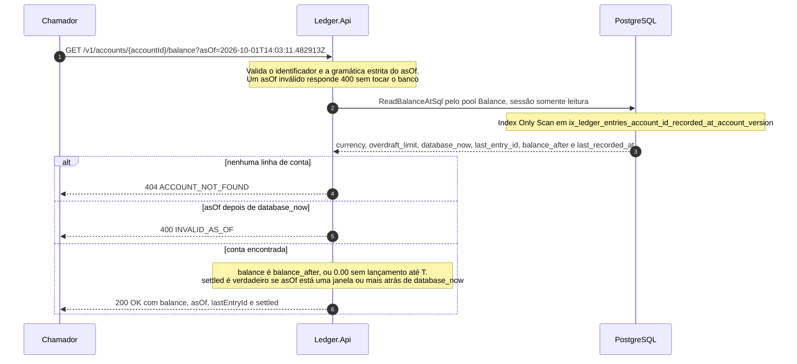

# Fluxo: consulta de saldo em um instante

`GET /v1/accounts/{accountId}/balance?asOf=<instante>` responde quanto a conta tinha em um instante qualquer, passado ou presente. O saldo em T é o `balance_after` do último lançamento da conta registrado até T, e por isso a resposta é uma descida no índice e não uma soma do histórico: custa o mesmo para ontem e para cinco anos atrás. O saldo atual, sem `asOf`, está em [consulta de saldo atual](consulta-de-saldo.md), e a forma da resposta em [Contrato da API REST](../05-contratos/api-rest.md).

Serve a quem concilia, audita ou investiga o saldo que a conta tinha, de forma reproduzível, e diz se o instante pedido já está fora da zona em que o resultado ainda poderia mudar. Participam o chamador, a `Ledger.Api` e o PostgreSQL, e na API o `BalanceEndpoints`, o `BalanceQueryReader`, o `InstantParameterReader`, o `GetBalanceHandler` e o `PostgresBalanceReader` ([nível 3](../04-modelos-c4/nivel-3-componentes-api.md)). O chamador tem `ledger.read`, a conta existe e o `asOf` é um instante ISO 8601 com fuso, com `Z` ou um deslocamento como `-03:00`, e não posterior ao relógio do banco ([Datas e fusos horários](../05-contratos/api-rest.md#datas-e-fusos-horários)). A regra de tempo é a do [documento de arquitetura 0013](../03-principios-e-decisoes/documento-arquitetura/0013-tempo-do-saldo-registrado-em-vs-ocorrido-em.md): vale o `recorded_at`, o instante em que o ledger registrou o lançamento, e não a data de negócio `occurred_at` que o chamador informou.

## Sequência

A comparação com o futuro usa o relógio do banco, o mesmo que atribui o `recorded_at`, e não o da instância da API. A consulta devolve a linha da conta mesmo quando não há lançamento até T, e é assim que um único comando distingue conta inexistente (zero linhas, 404) de conta sem lançamento até T (uma linha com os campos do último lançamento nulos). O 404 vem antes da verificação do futuro: o `asOf` futuro de uma conta inexistente responde 404. Não há cache nem snapshot, porque o histórico é o próprio índice.



## Passo a passo

1. **Gramática do parâmetro.** O `BalanceQueryReader` lê a query string. Parâmetro desconhecido é reportado primeiro, como 400 `VALIDATION_FAILED`, sem avaliar o `asOf`. Um `asOf` repetido, sem fuso ou fora da gramática do `InstantParameterReader` responde 400 `INVALID_AS_OF` sem tocar o banco e sem repetir o valor recebido. O instante sem fuso recebe a mensagem que pede o fuso, e não há conversão implícita para o horário de Brasília. O leitor converte o instante para UTC logo na entrada, então o SQL, o log de auditoria e a resposta só enxergam UTC, e `2026-10-01T11:03:11-03:00` e `2026-10-01T14:03:11Z` são a mesma consulta.

2. **Telemetria.** O `GetBalanceHandler` abre a operação no modo `as_of`, que gera o span `ledger.balance_query` e o histograma `ledger.balance.query.duration`.

3. **Consulta.** O `PostgresBalanceReader.ReadAtAsync` executa a instrução abaixo pelo pool `Balance`. O `LEFT JOIN LATERAL` busca, para a conta, o último lançamento com `recorded_at <= @as_of`, ordenado por `recorded_at` e `account_version` decrescentes, com `LIMIT 1`. A comparação é inclusiva, então um lançamento registrado exatamente em T entra no saldo de T, e o desempate por `account_version` resolve dois lançamentos no mesmo instante.

```sql
SELECT a.currency, ab.overdraft_limit, clock_timestamp() AS database_now,
       last_entry.id AS last_entry_id, last_entry.balance_after, last_entry.recorded_at AS last_recorded_at
FROM accounts AS a
JOIN account_balances AS ab ON ab.account_id = a.id
LEFT JOIN LATERAL (
    SELECT e.id, e.balance_after, e.recorded_at
    FROM ledger_entries AS e
    WHERE e.account_id = a.id
      AND e.recorded_at <= @as_of
    ORDER BY e.recorded_at DESC, e.account_version DESC
    LIMIT 1
) AS last_entry ON TRUE
WHERE a.id = @account_id;
```

4. **Conta inexistente.** Sem linha, o resultado é 404 `ACCOUNT_NOT_FOUND`.

5. **Verificação do futuro.** O handler compara o `asOf` com o `database_now` lido na mesma instrução, e `asOf` posterior é 400 `INVALID_AS_OF`. Um `asOf` igual ao `database_now` é aceito, e o instante que o saldo atual devolve como `asOf` é sempre aceito.

6. **Montagem da resposta.** O saldo é o `balance_after` do último lançamento até T, ou `0.00` quando não houve lançamento, e o `lastEntryId` é o lançamento que fecha o saldo, ou nulo. O `overdraftLimit` é o de hoje, porque o limite não tem histórico. O `asOf` da resposta é o pedido, convertido para UTC e escrito com seis casas. O `settled` é verdadeiro quando `asOf <= database_now - janela`, e a igualdade conta como acomodado.

7. **Auditoria e resposta.** O `ReadAudit.BalanceQueried` emite o evento 2001 com o modo `AS_OF` e o instante pedido, sem o saldo, e a API responde 200 com `Cache-Control: no-store`.

## A janela de acomodação

O `recorded_at` é atribuído dentro da transação de escrita, no `UPDATE` do passo 2 do [registro de lançamento](registro-de-lancamento.md), antes do commit. Para um T dentro dos últimos milissegundos pode haver uma transação em voo com `recorded_at <= T` que ainda não confirmou: a consulta não a vê, e a mesma consulta repetida um instante depois a vê. O `settled` diz ao chamador de que lado está. Verdadeiro, o instante está fora da janela, o resultado é definitivo e a mesma consulta dá sempre a mesma resposta. Falso, o valor ainda pode mudar.

A janela é `Ledger:Balance:SettlingWindowSeconds`, de 1 a 60 segundos, com padrão de 5. O número vem do tempo que uma transação de escrita pode ficar aberta depois de receber o `recorded_at`: a requisição inteira tem 3 segundos de limite, e o servidor derruba uma sessão parada dentro de transação em 5 segundos (`idle_in_transaction_session_timeout`). A API não espera a janela passar: segurar toda consulta histórica por 5 segundos arruinaria a latência, e o `settled` resolve o problema com um campo a mais. Quem precisa de um número que nunca mude, como conciliação e auditoria, consulta instantes com `settled` verdadeiro, e quem quer o estado de agora usa o saldo atual ([documento de arquitetura 0018](../03-principios-e-decisoes/documento-arquitetura/0018-monotonicidade-do-recorded-at-e-janela-de-acomodacao.md)).

A monotonicidade do `recorded_at` completa a garantia: o `GREATEST(clock_timestamp(), last_recorded_at + 1 µs)` do `UPDATE` faz o instante crescer estritamente com a versão da conta, e o saldo em T coincide, lançamento a lançamento, com o encadeamento de `balance_after`. Quando o relógio do banco atrasa e o valor guardado fica à frente, o instante é empurrado para frente, e o `asOf` desse lançamento só é aceito quando o relógio do banco o alcança (`AsOfFutureTests`).

Que a janela de 5 segundos cubra o p99,99 da duração de uma transação de escrita depois de receber o `recorded_at` ainda não foi medido sob carga: o número deriva dos prazos configurados ([limites conhecidos](../09-qualidade/limites-conhecidos.md)).

## O que falha

| Passo | Falha | Efeito | O que o chamador percebe |
|---|---|---|---|
| 1 | `asOf` fora da gramática, sem fuso, com `-00:00`, com deslocamento fora de `-14:00` a `+14:00` ou repetido | Nenhum acesso ao banco | 400 `INVALID_AS_OF` |
| 1 | Parâmetro desconhecido | Nenhum acesso ao banco | 400 `VALIDATION_FAILED`, razão `UNKNOWN_FIELD` |
| 3 | Banco indisponível, pool de saldo esgotado ou comando acima de 1 s | Trabalho cancelado, sem nova tentativa | 503 `SERVICE_UNAVAILABLE` com `Retry-After: 1` |
| 4 | Conta inexistente | Nenhum efeito | 404 `ACCOUNT_NOT_FOUND`, também para `asOf` futuro |
| 5 | `asOf` posterior ao relógio do banco | Nenhum efeito | 400 `INVALID_AS_OF` |

## O que o fluxo garante

O índice `ix_ledger_entries_account_id_recorded_at_account_version` (`account_id`, `recorded_at` e `account_version` decrescentes, com `id` e `balance_after` incluídos) atende a consulta com um Index Only Scan, sem visitar a tabela. Fora da janela o resultado é reproduzível, porque o ledger só cresce e nunca altera uma linha, e como o relógio é o do banco, instâncias com relógios diferentes respondem igual.

O ledger não é bitemporal: o `occurred_at` volta nos lançamentos, mas a consulta o ignora. Respostas 400 e 404 não geram evento de auditoria, e o `ledger.balance.query.duration` leva `mode` igual a `as_of`.

A meta de p99 de até 50 ms (NFR-04) não foi medida: o plano de consulta com cem mil lançamentos é conferido por teste, mas o plano não é a latência, e falta carga com a tabela no volume premissado ([limites conhecidos](../09-qualidade/limites-conhecidos.md)).

Os testes do fluxo: `AsOfBalanceTests`, `AsOfFutureTests`, `AsOfValidationTests`, `BalanceTimeZoneTests`, `SettledWindowTests`, `StableAsOfTests` (resposta idêntica antes e depois de cem novas escritas), `AsOfMatchesChainTests`, `PostgresBalanceReaderTests`, `QueryPlanTests` (plano sem acesso à tabela) e, ponta a ponta, `BalanceInstantE2ETests`. A instrução é a da constante do código, conferida por `ReadSqlMatchesFlowPagesTests`.
