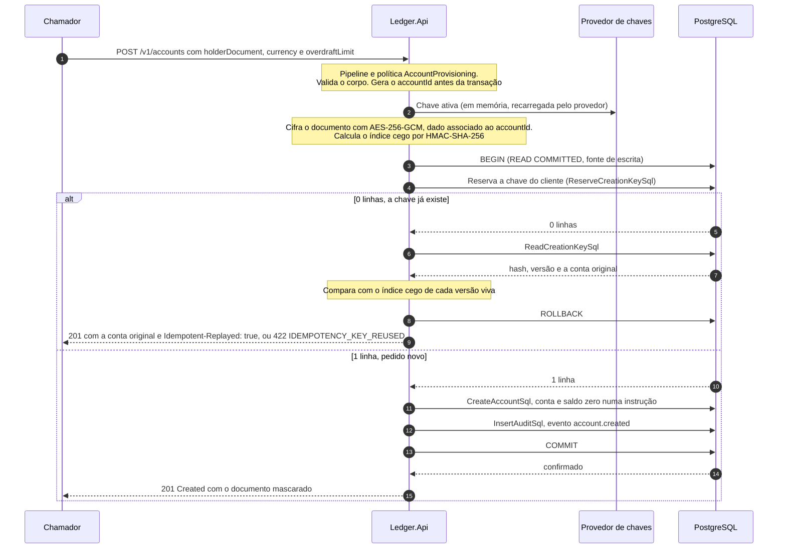

# Fluxo: criação de conta

A conta nasce em outro sistema do banco, e o ledger oferece um cadastro mínimo, suficiente para operar e para os testes locais: `POST /v1/accounts`. O fluxo cifra o documento do titular antes de abrir a transação, grava a conta e o saldo zerado numa instrução só, registra o evento de auditoria na mesma transação e, quando o chamador envia `Idempotency-Key`, torna a criação repetível. O documento do titular nunca existe em claro no banco, no log ou na resposta. A cifra e as chaves estão em [Proteção de dados](../07-consistencia-e-seguranca/protecao-de-dados.md), a política de acesso à rota em [Autenticação e autorização](../07-consistencia-e-seguranca/autenticacao-e-autorizacao.md) e o formato do pedido em [Contrato da API REST](../05-contratos/api-rest.md).

Participam o chamador autorizado a provisionar contas, a `Ledger.Api`, o provedor de chaves e o PostgreSQL, com o `AccountsEndpoints`, o `CreateAccountHandler`, o `HolderDocumentProtector`, o `PostgresAccountRepository` e a trilha de auditoria ([nível 3](../04-modelos-c4/nivel-3-componentes-api.md)). O provedor é o `ReloadingKeyProvider` sobre uma pasta de segredos, e o `ConfigurationKeyProvider` só é aceito em Development e Testing. O token tem `ledger.write` e o `client_id` consta em `Authorization:AccountProvisioningClients` (ou a lista tem o curinga `*`, que o validador recusa fora de Development e Testing), e o pedido leva `holderDocument`, `currency` `BRL` e, se quiser, `overdraftLimit`. O `Idempotency-Key` é opcional.

## Sequência

O diagrama mostra a criação com chave, o caminho mais completo: sem chave os passos 4 e 5 não existem, e a transação só cria a conta e a auditoria. Só o blob cifrado e o índice cego chegam ao banco, o provedor de chaves não é consultado a cada pedido (o `ReloadingKeyProvider` mantém o conjunto em memória e o recarrega por temporizador) e a criação não escreve no outbox.



1. **Autorização e validação.** A política `AccountProvisioning` combina o escopo `ledger.write` com o requisito de cliente provisionador (`ProvisioningClientHandler`), e a recusa responde 403 antes de o corpo ser lido, sem criar nada. O `AccountsEndpoints.CreateAsync` lê o corpo (limite de 16 KiB), exige `application/json` e usa o `CreateAccountRequestReader`: o documento precisa passar nos dígitos verificadores, a moeda só pode ser `BRL` (`UNSUPPORTED_CURRENCY`) e o limite é decimal com no máximo duas casas. Propriedades desconhecidas, como `clientId` e `accountId`, são recusadas. O `Idempotency-Key` segue as regras do registro, com uma diferença: pode faltar, mas presente e vazio, repetido ou malformado é 400. Problemas de corpo e de cabeçalho vêm juntos num 400 só.

2. **Verificações do caso de uso.** O `CreateAccountHandler.HandleAsync` confere de novo a moeda, a moeda do limite e o intervalo do limite, e só então abre a operação de telemetria (`ledger.create_account`).

3. **Identificador e cifra.** O handler gera o `accountId` (UUID v7) e chama o `HolderDocumentProtector.Protect`. O documento é normalizado (sem `.`, `-` e `/`, em maiúsculas) e cifrado com AES-256-GCM, com o `accountId` como dado associado, e o índice cego é o HMAC-SHA-256 do documento normalizado com o prefixo `holder-document:`. O blob tem 42 bytes para CPF e 45 para CNPJ: três de cabeçalho (versão do formato e da chave), 12 de nonce, o texto cifrado e 16 de etiqueta. Se o provedor não entrega o conjunto ativo, a `KeyProviderUnavailableException` interrompe o caso de uso antes de qualquer transação, com o log 7002, e a resposta é 503 enquanto o resto do ledger segue funcionando. Cifra e índice são calculados uma vez, fora da transação, e todas as tentativas reutilizam o mesmo `accountId` e o mesmo blob.

4. **Reserva da chave (com `Idempotency-Key`).** O hash do pedido é `AccountCreationRequestHash.Compute`: SHA-256 de `v1`, `account.create`, a moeda, o limite com duas casas e o índice cego em hexadecimal, separados por quebra de linha, de modo que o documento em claro nunca vira parte do que o banco guarda. O `PostgresAccountRepository.TryReserveCreationKeyAsync` executa a reserva abaixo, e a chave é única por cliente e chave (`pk_account_creation_keys`), não por conta, porque a conta ainda não existe.

```sql
INSERT INTO account_creation_keys (client_id, idempotency_key, account_id, request_hash, hash_version)
VALUES (@client_id, @idempotency_key, @account_id, @request_hash, @hash_version)
ON CONFLICT (client_id, idempotency_key) DO NOTHING;
```

5. **Chave já existente.** Quando a reserva afeta zero linhas, o `FindCreationKeyAsync` lê o registro, e a transação é marcada para desfazer.

```sql
SELECT k.request_hash, k.hash_version, k.account_id, a.created_at
FROM account_creation_keys AS k
JOIN accounts AS a ON a.id = k.account_id
WHERE k.client_id = @client_id
  AND k.idempotency_key = @idempotency_key;
```

O hash guardado foi calculado com o índice cego da versão de chave vigente na época, e por isso a comparação o refaz com o índice cego de cada versão viva (`BlindIndexCandidates`): a repetição continua válida depois de uma rotação. Havendo coincidência, a resposta é a conta original, com `Idempotent-Replayed: true`, o `createdAt` original e o documento mascarado a partir do pedido atual. Sem coincidência, é 422 `IDEMPOTENCY_KEY_REUSED`. Um `hash_version` desconhecido é defeito e vira 500, e se o registro some entre a reserva e a leitura o laço tenta mais uma vez e depois lança exceção.

6. **Criação da conta.** O `CreateAsync` executa uma instrução com duas expressões de tabela comum: insere em `accounts` (`ON CONFLICT (id) DO NOTHING`) e, a partir da linha inserida, insere em `account_balances` com saldo `0`, versão `0`, o limite do pedido e `last_recorded_at` igual ao `created_at`, atribuído pelo relógio do banco.

```sql
WITH new_account AS (
    INSERT INTO accounts (id, currency, holder_document_encrypted, holder_document_blind_index, holder_document_key_version)
    VALUES (@id, @currency, @holder_document_encrypted, @holder_document_blind_index, @holder_document_key_version)
    ON CONFLICT (id) DO NOTHING
    RETURNING id, created_at
)
INSERT INTO account_balances (account_id, balance, overdraft_limit, version, last_recorded_at)
SELECT id, 0, @overdraft_limit, 0, created_at FROM new_account
RETURNING last_recorded_at AS created_at;
```

7. **Auditoria.** Na mesma transação, o `AuditEvents.AccountCreated` gera o evento `account.created`, com o `client_id` do token, a conta, a correlação e o resultado `SUCCESS`, e o `PostgresScopedAuditTrail` o grava, sem detalhe algum do titular.

```sql
INSERT INTO audit_log (event_type, client_id, account_id, correlation_id, outcome, details)
VALUES (@event_type, @client_id, @account_id, @correlation_id, @outcome, @details);
```

8. **Commit e resposta.** A chave estrangeira `fk_account_creation_keys_account_id` é adiada até o commit e garante que a chave aponte para uma conta que existe. A API responde `201 Created` com `Cache-Control: no-store`, `Location` para `/v1/accounts/{accountId}/balance` e o corpo com `accountId`, `currency`, `overdraftLimit`, `holderDocumentMasked` e `createdAt`. A máscara deixa visíveis só três dígitos do CPF (`***.***.123-**`) ou quatro do CNPJ, e o documento completo nunca é devolvido.

Sem `Idempotency-Key`, cada pedido cria uma conta nova ([documento de arquitetura 0035](../03-principios-e-decisoes/documento-arquitetura/0035-idempotency-key-opcional-na-criacao-de-conta.md)). O `accountId` gerado antes da transação é o que torna segura a nova tentativa da unidade de trabalho depois de um desfecho desconhecido do commit ([documento de arquitetura 0031](../03-principios-e-decisoes/documento-arquitetura/0031-criacao-de-conta-repetivel-com-identificador-previo.md)). A primeira tentativa que encontra o identificador já existente é defeito e lança exceção, mas a segunda, que só acontece depois de uma falha transitória, lê a conta existente e a devolve sem registrar a auditoria de novo. Essa nova tentativa não é tratada como repetição do chamador: o `isReplay` só é verdadeiro quando a conta devolvida difere da gerada, e a criação é contada uma vez em `ledger.accounts.created`.

## O que falha

| Passo | Falha | Efeito | O que o chamador percebe |
|---|---|---|---|
| 1 | Cliente fora da lista, ou token sem `ledger.write` | Corpo não lido, nada criado, tentativa registrada na trilha | 403 `FORBIDDEN` com `WWW-Authenticate` |
| 1 | Documento inválido, moeda diferente de BRL, limite fora do intervalo, cabeçalho de chave vazio ou malformado | Nenhuma transação aberta, chave não consumida | 400 `VALIDATION_FAILED` com `errors` |
| 3 | Provedor de chaves indisponível | Nenhuma transação aberta | 503 `SERVICE_UNAVAILABLE` com `Retry-After` |
| 4 | Chave já usada pelo mesmo cliente com outro documento, moeda ou limite | Transação desfeita | 422 `IDEMPOTENCY_KEY_REUSED`. Outro cliente com a mesma chave é uma reserva independente, porque a chave primária é `(client_id, idempotency_key)` |
| 6 a 8 | Falha transitória de banco | A função inteira roda de novo com o mesmo `accountId` e o mesmo blob | 201 se a nova tentativa passar, ou 503 depois de esgotá-las |
| 8 | Desfecho desconhecido do commit | Com chave, a reserva revela a conta já criada. Sem chave, a nova tentativa lê a conta existente | 201, uma conta e uma linha de auditoria |
| 6 | Identificador gerado já existe na primeira tentativa | Exceção | 500 `INTERNAL_ERROR` |

## O que o fluxo garante

`accounts` guarda `holder_document_encrypted`, `holder_document_blind_index` e `holder_document_key_version`, as três nulas ou as três preenchidas (`ck_accounts_holder_document`), e `ck_accounts_holder_document_key_version_matches_payload` amarra a versão ao cabeçalho do blob. A API não lê essas colunas depois de criar a conta: o `ledger_api` só enxerga `id`, `currency` e `created_at`. Conta e saldo nascem juntos, a auditoria entra na mesma transação e a repetição não acrescenta evento nem conta. Não há dado pessoal fora do blob e do cofre de chaves, porque o hash de repetição usa o índice cego, a trilha não leva detalhe e o log do caso de uso leva só o `accountId` e o `client_id`. A repetição continua casando depois que a versão ativa muda (`TheReplay_StillWorksAfterTheActiveKeyVersionMoves`).

Não existe adaptador para um cofre de chaves externo: o `ReloadingKeyProvider` lê uma pasta de segredos (`Security:Pii:Directory`). A degradação com o cofre fora foi exercitada só com um provedor de teste que falha, e não contra um cofre real ([limites conhecidos](../09-qualidade/limites-conhecidos.md)).

O span `ledger.create_account` termina como `created`, `already_created`, `key_unavailable` ou `failed`, sem documento nem material de chave, e os logs são o 7001 `AccountCreated` e o 7002 `KeyProviderUnavailable`. A escrita negada a um cliente válido vai para a [trilha](../07-consistencia-e-seguranca/trilha-de-auditoria.md) como `authorization.denied_write`.

Os testes do fluxo: `CreateAccountTests`, `CreateAccountIdempotencyTests`, `PostgresAccountCreationKeyTests`, `CreateAccountValidationTests`, `AccountProvisioningTests`, `AccountDocumentProtectionTests` (só o blob e o índice chegam ao banco, e um blob copiado para outra conta é recusado), `HolderDocumentProtectorTests`, `CreateAccountHandlerTests`, `EntryCommitUnknownTests`, `EntryFailureTests` (provedor de chaves fora com o resto do ledger de pé) e, ponta a ponta, `AccountsE2ETests`. O SQL é o das constantes do código, conferido por `CriticalSqlMatchesFlowPagesTests`.
