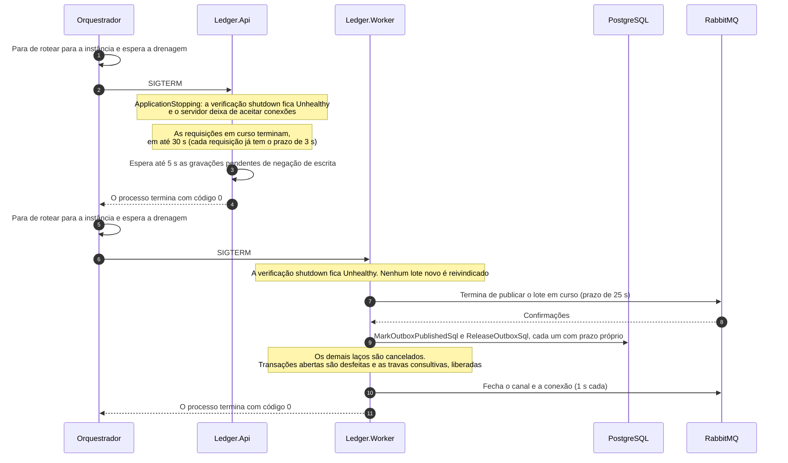
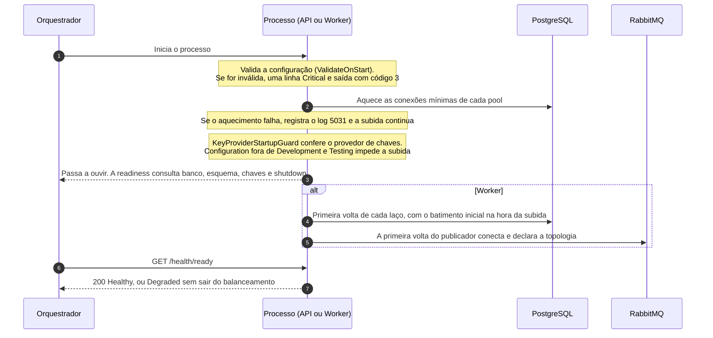

# Fluxo: encerramento e reinício

Instâncias do ledger são desligadas e religadas o tempo todo, por implantação, por escala ou por falha. Nenhuma guarda estado que o banco não tenha, e é isso que simplifica o desligamento: o que estava confirmado continua confirmado, e o que estava em voo ou termina dentro de um prazo conhecido ou é desfeito e refeito com segurança. A página descreve o desligamento ordenado da API e do Worker, o que acontece quando o processo é morto sem aviso e a sequência de subida. A subida depois de uma migração está em [migração do esquema](migracao-do-esquema.md), e os sinais de saúde em [Saúde e observabilidade](../08-resiliencia-e-operacao/saude-e-observabilidade.md).

O orquestrador (no Compose, o Docker) faz duas perguntas. `GET /health/live` diz se o processo está vivo, e falhar significa reiniciar. `GET /health/ready` diz se a instância deve receber trabalho agora, e falhar significa sair do balanceamento sem reiniciar. O tempo de desligamento é `Resilience:ShutdownTimeoutSeconds` (30 segundos), aplicado pelo `ConfigureHostShutdown` ao `HostOptions.ShutdownTimeout` dos dois executáveis. No Compose, `api` e `worker` têm `stop_grace_period` de 35 segundos, para os 30 de trabalho mais a saída, e `restart: unless-stopped`.

O ledger não tem janela de drenagem própria. No pedido de parada a verificação `shutdown` fica `Unhealthy` e o servidor deixa de aceitar conexões no mesmo instante, então uma sonda de readiness enviada depois do `SIGTERM` não recebe 503: a conexão é encerrada ou recusada. Tirar a instância do balanceamento antes do sinal é trabalho do orquestrador, por exemplo com um gancho de pré-parada que a remove do balanceador e espera o tempo de uma sonda e de uma requisição antes de deixar o `SIGTERM` seguir. O Compose não tem balanceador, e um pedido que chegue entre o sinal e a saída é recusado na conexão. Essa retirada nunca foi exercitada atrás de um balanceador real e sob carga, então não se sabe se a espera basta para que um encerramento planejado não recuse nenhum pedido ([limites conhecidos](../09-qualidade/limites-conhecidos.md)).

## Desligamento ordenado

A API não tem estado a drenar além das requisições em curso, e nenhuma dura mais que o prazo de 3 segundos. O Worker tem um trabalho que não pode ser largado no meio, um lote já publicado e ainda não marcado, e o termina antes de sair. Os dois saem com código 0.

Na API, o `ApplicationStopping` é cancelado, o `ShutdownHealthCheck` passa a `Unhealthy` e o servidor fecha a porta, inclusive para `GET /health/live`. O servidor espera as requisições em curso por até `Resilience:ShutdownTimeoutSeconds`, mas como cada uma tem prazo de 3 segundos (`Resilience:RequestTimeoutSeconds`) elas terminam antes, com a transação confirmando ou sendo desfeita normalmente. O `DeniedWriteAuditor`, que grava em segundo plano as negações de escrita, espera até 5 segundos as gravações em voo, as fontes de dados do Npgsql são descartadas e o processo termina.

No Worker, o servidor também fecha a porta e a readiness fica `Unhealthy`. O `OutboxPublisherService` cria um `DrainToken` a cada volta, e quando a parada é pedida o token dá um prazo de graça igual ao tempo de desligamento menos 5 segundos (25 segundos, com mínimo de 1) antes de cancelar a publicação em curso. O lote já reivindicado é publicado e marcado, as confirmadas e as devolvidas com o prazo próprio da [publicação do outbox](publicacao-do-outbox.md), e nenhum lote novo é reivindicado. Poda, medição e recifragem recebem o token de parada: a consulta em curso é cancelada, o laço sai sem registrar falha e a transação do lote de recifragem, se ainda não confirmou, é desfeita com as atualizações e a auditoria dele. A conferência de integridade interrompida entre lotes não grava a execução completa nem conta falha, e a sessão libera a trava consultiva ao ser descartada. Por fim a `BrokerConnection` fecha o canal e a conexão, com prazo de 1 segundo cada, e zera `broker.connected`.

## Processo morto sem aviso

Um `SIGKILL`, uma queda de máquina ou um contêiner derrubado pelo limite de memória não dão chance de desligar com ordem, e o sistema foi desenhado para isso: a segurança vem do banco. Na API, uma transação em andamento é desfeita pelo servidor quando a conexão some. Se o processo morreu e o sistema operacional fechou a conexão, o PostgreSQL percebe na hora, e se a máquina sumiu sem fechá-la o servidor recolhe a sessão, e o lock da conta com ela, pelo `idle_in_transaction_session_timeout` de 5 segundos ou pelo keepalive do Compose (`tcp_keepalives_idle=10`, `tcp_keepalives_interval=5`, `tcp_keepalives_count=3`, cerca de 25 segundos). O chamador que não recebeu resposta repete com a mesma chave, e a repetição devolve o lançamento se a transação tinha confirmado (`ApiKillE2ETests`).

No Worker, uma mensagem publicada e ainda não marcada sai de novo quando o lease de 30 segundos vence, de qualquer instância, com o mesmo `message_id`, e o consumidor a reconhece como duplicata (`PublisherKilledBetweenPublishAndMarkTests`). Uma reivindicada e não publicada volta à fila quando o lease vence, a execução de integridade interrompida deixa a trava cair com a sessão e é retomada, a partir do último registro parcial, na execução seguinte, e o lote de recifragem em curso é desfeito pelo servidor.

## Subida

A subida valida a configuração antes de aceitar tráfego, aquece os pools e só então responde `Healthy` na readiness.

1. **Configuração.** O `ValidateOnStart` valida as opções dos dois executáveis. Com configuração inválida, o processo escreve uma única linha `Critical` que nomeia cada chave e a regra violada (log 5040 na API, 5021 no Worker, sem pilha nem segredo) e termina com o código 3, sem ouvir porta alguma. Em ambiente que exige controles de produção, as configurações de desenvolvimento (`LocalKey` na autenticação, `*` na lista de provisionamento) também são recusadas.
2. **Aquecimento.** O `PostgresPoolWarmupService` abre as conexões mínimas de cada fonte (na API, 2 de escrita, 2 de saldo e 1 de extrato). Com o banco inalcançável, registra o log 5031 e a subida continua: as primeiras requisições abrem as conexões.
3. **Provedor de chaves.** O `KeyProviderStartupGuard` recusa o provedor `Configuration` fora de Development e Testing e confere que o conjunto ativo cifra e decifra um documento de teste. Um provedor indisponível não impede a subida: o log 7002 avisa, a verificação `keys` da readiness da API fica `Degraded` e só a criação de conta responde 503.
4. **Readiness.** A API passa a ouvir, e a readiness consulta banco, esquema, chaves e desligamento, com cache de 5 segundos, ficando `Unhealthy` enquanto o esquema estiver atrás do código. O Worker consulta ainda o broker, o circuito e a idade da mensagem mais antiga do outbox, e esses três só o deixam `Degraded`.
5. **Laços do Worker.** O batimento de cada laço começa na hora da subida, e o processo recém-iniciado não nasce doente. A integridade recente roda logo, a completa espera a primeira terminar, a recifragem registra a ativação da versão de chave e o publicador se conecta ao broker na primeira volta. A verificação `outbox-lag` é `Healthy` nos primeiros 60 segundos, mesmo sem medição.

Nenhum estado em memória precisa ser recuperado: as cotas dos limitadores, o cache de chaves públicas dos tokens, o retrato do provedor de chaves e o estado do circuito do broker começam limpos, e o que importa vem do banco.

## O que falha

| Situação | Efeito | O que se observa |
|---|---|---|
| `SIGTERM` na API com requisição em curso | A requisição termina no prazo de 3 s. Se o orquestrador retirou a instância antes do sinal, nenhum pedido novo chega | Nenhuma resposta cortada. Pedido novo depois do sinal é recusado na conexão |
| `SIGTERM` no Worker com lote em curso | O lote é publicado e marcado, nenhum outro é reivindicado | Logs 3100 e 3101, sem mensagem duplicada |
| Parada acima de 30 s, ou processo morto | O orquestrador mata o processo ao fim da tolerância de 35 s | O caso do processo morto sem aviso: transação desfeita ou confirmada, chave livre ou revelada na repetição, duplicata com o mesmo `message_id` |
| Configuração inválida na subida | O processo não ouve porta | Uma linha `Critical` e código de saída 3 |
| Banco fora na subida | O processo sobe, a readiness fica 503 | O aquecimento registra o 5031 e a recuperação é sozinha |
| Esquema atrás do código | A instância sobe e fica fora do balanceamento | `ready` 503 até a migração rodar |

## O que o fluxo garante

A instância só entra no balanceamento depois de passar nas verificações de readiness. O lote do outbox nunca é largado sem desfecho: o que o broker confirmou é marcado, mesmo com o serviço cancelado, e o resto volta à fila ou espera o lease vencer. Nada confirmado se perde, porque um `201` só existe depois do commit, que sobrevive à morte de qualquer processo, e a morte sem aviso é segura: duplicata de mensagem é possível e esperada, perda não é.

Os testes do fluxo: `ApiHealthEndpointTests` e `WorkerHealthSignalsTests` (a verificação `shutdown`), `PublisherShutdownTests` (o lote em voo é publicado e marcado, e nenhum outro é reivindicado), `WorkerStartupTests`, `ApiStartupTests`, `DeniedWriteAuditorTests`, `PublisherKilledBetweenPublishAndMarkTests`, `WorkerRestartE2ETests`, `ApiKillE2ETests` e, com a pilha subindo do zero e a saúde respondendo, `ComposeSmokeE2ETests`. Os logs de início e parada são 3100 e 3101, 4100 e 4101, 5021, 5040, 5031 e 7002.

A tolerância de 35 segundos e a ordem de subida do Compose estão em [Ambientes e configuração](../10-implantacao-e-entrega/ambientes-e-configuracao.md), os limites do desligamento em [Políticas de resiliência](../08-resiliencia-e-operacao/politicas-de-resiliencia.md) e o código de saída 3 em [Configuração e linha de comando](../05-contratos/configuracao.md).
