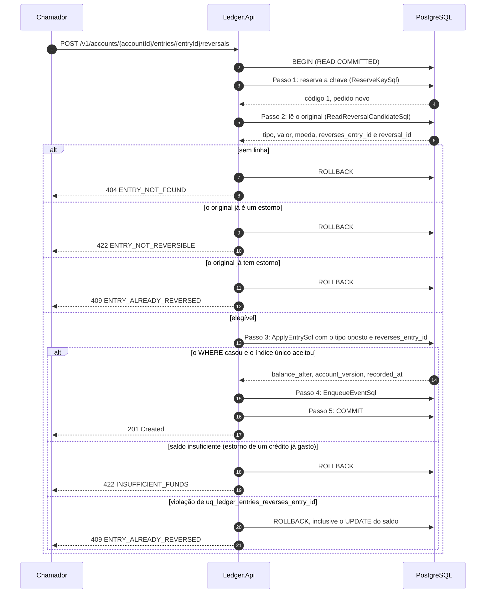
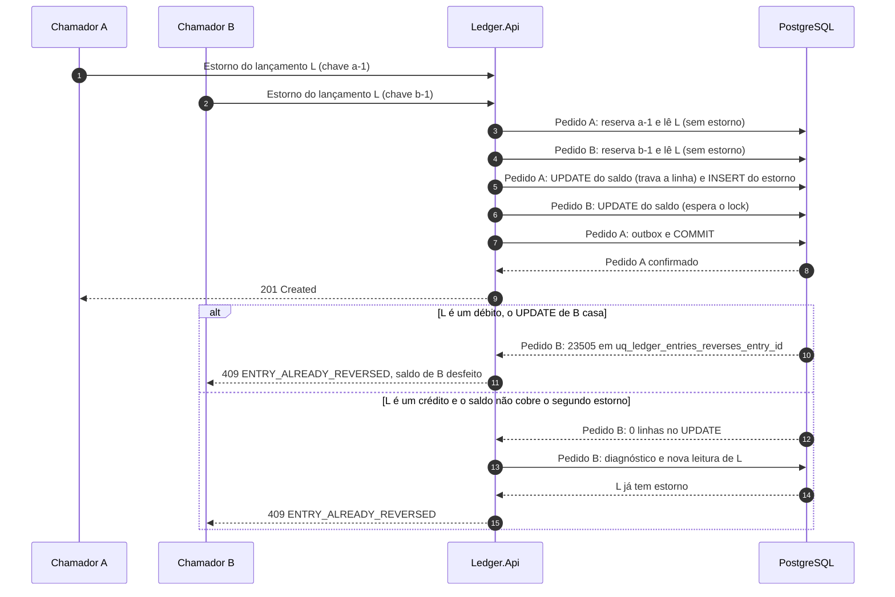

# Fluxo: estorno de lançamento

O ledger é imutável, e o erro se corrige com um lançamento novo. O estorno é um lançamento de tipo oposto, com o mesmo valor e a mesma moeda do original, que aponta para ele por `reverses_entry_id`. O fluxo percorre `POST /v1/accounts/{accountId}/entries/{entryId}/reversals`: o que o estorno reaproveita do [registro de lançamento](registro-de-lancamento.md), o que acrescenta (a leitura do original e as regras de elegibilidade) e o que acontece quando dois estornos do mesmo lançamento chegam juntos. O formato do pedido e da resposta está em [Contrato da API REST](../05-contratos/api-rest.md).

Participam o chamador, a `Ledger.Api` e o PostgreSQL, com o `ReverseEntryHandler`, o `EntryWriteFlow` (o mesmo do registro), o `PostgresEntryRepository` e o `ReversalCandidate` do domínio ([nível 3](../04-modelos-c4/nivel-3-componentes-api.md) e [nível 4](../04-modelos-c4/nivel-4-codigo.md)). O chamador tem `ledger.write`, a conta e o lançamento existem, o lançamento é da conta da rota e o pedido leva `Idempotency-Key`. O corpo é opcional e aceita só `description` de até 140 caracteres: ausente, vazio ou `{}` é válido, e qualquer outra propriedade é recusada.

## Sequência

O diagrama cobre o sucesso e as recusas de elegibilidade, e não redesenha a parte comum com o registro (pipeline, reserva da chave, saída por repetição). A conta é verificada pela própria reserva, antes da leitura do original, e o original é buscado por `(id, account_id)`. Toda recusa termina em `ROLLBACK` e por isso não consome a chave.



1. **Chegada ao endpoint.** O `EntriesEndpoints.ReverseAsync` lê o corpo (limite de 16 KiB), exige `application/json` só quando há corpo, valida o identificador da conta e depois o do lançamento (fora do formato hifenizado, 404 `ACCOUNT_NOT_FOUND` ou `ENTRY_NOT_FOUND`) e lê a descrição com o `ReverseEntryRequestReader` e o cabeçalho `Idempotency-Key`.

2. **Contexto e hash.** O `ReverseEntryHandler` cria o `WriteContext` e calcula `CanonicalRequestHash.ForReversal`, com a operação `entry.reverse`, a conta, o `client_id`, o identificador do original e a descrição aparada. Reusar a chave de um lançamento num estorno, ou repetir o estorno com outra descrição, dá 422 `IDEMPOTENCY_KEY_REUSED` ([repetição idempotente](repeticao-idempotente.md)).

3. **Passo 1: reservar a chave.** É o `ReserveKeySql` do registro, com o mesmo ramo de repetição quando a chave já existe. Conta inexistente é 404 `ACCOUNT_NOT_FOUND`.

4. **Passo 2: ler o original.** O `ReverseEntryHandler.PrepareAsync` chama `FindForReversalAsync`. O original é imutável, então a leitura não precisa de lock. A busca é por `(id, account_id)`, de modo que um lançamento de outra conta recebe a mesma resposta de um que não existe, e é aqui que se garante que o estorno pertence à conta da rota.

```sql
SELECT o.id, o.type, o.amount, o.currency, o.reverses_entry_id, r.id AS reversal_id
FROM ledger_entries AS o
LEFT JOIN ledger_entries AS r ON r.reverses_entry_id = o.id
WHERE o.id = @entry_id
  AND o.account_id = @account_id;
```

5. **Elegibilidade.** O `ReversalCandidate.Plan()` decide nesta ordem: se `reverses_entry_id` do original não é nulo, ele é um estorno e a resposta é 422 `ENTRY_NOT_REVERSIBLE`; se `reversal_id` não é nulo, já existe estorno e a resposta é 409 `ENTRY_ALREADY_REVERSED`; senão nasce um `ReversalPlan` com o tipo oposto e o mesmo valor, e o `Entry.ReversalOf` cria o lançamento com `occurred_at` ausente (vale o `recorded_at`), a descrição do corpo e referência nula.

6. **Passo 3: aplicar.** É o `ApplyEntrySql` do registro, com `@type` oposto, `@amount` e `@currency` do original, `@reverses_entry_id` preenchido e `@occurred_at` nulo. O `@delta` é `+amount` quando o original era um débito e `-amount` quando era um crédito. Estornar um crédito é então um débito e passa pela mesma regra de saldo: se o dinheiro já foi gasto, o `UPDATE` não casa, o diagnóstico acusa saldo insuficiente e a resposta é 422 `INSUFFICIENT_FUNDS`, com o original ainda sem estorno.

7. **Passos 4 e 5: evento e commit.** O outbox recebe o `EntryRegistered` com `reversesEntryId` preenchido, e o commit fecha a transação. A resposta é 201 com o lançamento do estorno.

## A corrida entre estornos

Dois estornos do mesmo lançamento, com chaves diferentes, podem passar juntos pela leitura do passo 2, porque nenhum estava confirmado ainda. O desfecho depende do tipo do original, e quem vence é quem confirmou primeiro, não quem chegou primeiro à leitura. O perdedor nunca deixa efeito no saldo.

Se o original é um débito, ou o saldo cobre os dois estornos, os dois executam o passo 3, serializados pela linha de `account_balances`. O primeiro grava o estorno e confirma. O segundo acorda, o `UPDATE` casa contra o saldo novo e o `INSERT` esbarra em `uq_ledger_entries_reverses_entry_id` com SQLSTATE 23505. O `PostgresEntryRepository.TryApplyAsync` traduz essa violação, e só ela, em `EntryErrors.AlreadyReversed`: a transação inteira daquele pedido, inclusive o `UPDATE` do saldo, é desfeita e a resposta é 409 `ENTRY_ALREADY_REVERSED`.

Se o original é um crédito e o saldo cobre só um estorno, o `UPDATE` do perdedor acorda depois do commit do vencedor, reavalia o `WHERE` contra o saldo novo e não casa. A instrução devolve zero linhas, o `INSERT` nem roda e a restrição não tem o que recusar. O diagnóstico mostraria um saldo que não comporta o débito, e a recusa pareceria `INSUFFICIENT_FUNDS` quando o lançamento já foi estornado. Por isso, quando um estorno termina recusado por saldo, o `EntryWriteFlow.ExplainRefusalAsync` repete a leitura do original na mesma transação: ela enxerga o estorno do vencedor e a resposta passa a ser 409 `ENTRY_ALREADY_REVERSED`. Se não achar estorno algum, o saldo foi gasto por outro lançamento e o 422 `INSUFFICIENT_FUNDS` está certo.



## O que falha

| Passo | Falha | Efeito | O que o chamador percebe |
|---|---|---|---|
| Validação | Identificador malformado, corpo com outra propriedade, descrição acima de 140 caracteres, tipo de conteúdo errado quando há corpo | Nenhuma transação aberta | 404, 400 `VALIDATION_FAILED`, 415 |
| 1 | Conta inexistente | Transação desfeita | 404 `ACCOUNT_NOT_FOUND` |
| 2 | Lançamento inexistente ou de outra conta | Transação desfeita, chave livre | 404 `ENTRY_NOT_FOUND` |
| 2 | Original é um estorno, ou já tem estorno | Transação desfeita, chave livre | 422 `ENTRY_NOT_REVERSIBLE` ou 409 `ENTRY_ALREADY_REVERSED` |
| 3 | Saldo insuficiente para estornar um crédito | Transação desfeita, original continua sem estorno | 422 `INSUFFICIENT_FUNDS` |
| 3 | Estorno concorrente confirmou antes | Transação desfeita, inclusive o saldo | 409 `ENTRY_ALREADY_REVERSED` |
| 3 | Espera de lock acima de 1 s | Transação desfeita, sem nova tentativa | 503 com `Retry-After: 1` |
| 5 | Desfecho desconhecido do commit | A nova tentativa começa pela reserva da chave | 201 com `Idempotent-Replayed: true`, ou 201 novo |

Repetir o estorno com a mesma chave cai no passo 1 e devolve a repetição. Um segundo estorno do mesmo lançamento só dá 409 com outra chave.

## O que o fluxo garante

O índice único parcial `uq_ledger_entries_reverses_entry_id` garante no banco um estorno por lançamento, e nenhuma corrida produz dois. Estorno não se estorna.

O original não muda: o estorno só insere, o gatilho `tr_ledger_entries_forbid_update_delete` recusa `UPDATE` e `DELETE` em `ledger_entries` e o papel `ledger_api` não tem esses privilégios. O extrato mostra os dois lançamentos, e a soma dos valores com sinal continua igual à variação do saldo.

Chave, saldo, estorno e evento confirmam juntos ou não existem, e o evento carrega `reversesEntryId` para que quem consome associe o estorno ao original. Cada estorno confirmado conta em `ledger.entries.recorded` com `type` igual a `reversal`, as recusas contam em `ledger.entries.rejected` e o log 1003 traz a operação `reverse`. O resto da instrumentação é a do [registro de lançamento](registro-de-lancamento.md).

Os testes do fluxo: `ReverseEntryTests` cobre o estorno de ponta a ponta, inclusive a repetição com a mesma chave. A corrida entre estornos está em `ParallelReversalsTests` e `ParallelReversalsHttpTests`, que exercitam os dois desfechos com até vinte estornos simultâneos do mesmo lançamento, e as regras de elegibilidade e a tradução da violação do índice, em `ReversalCandidateTests`, `ReverseEntryHandlerTests` e `PostgresEntryRepositoryTests`.
