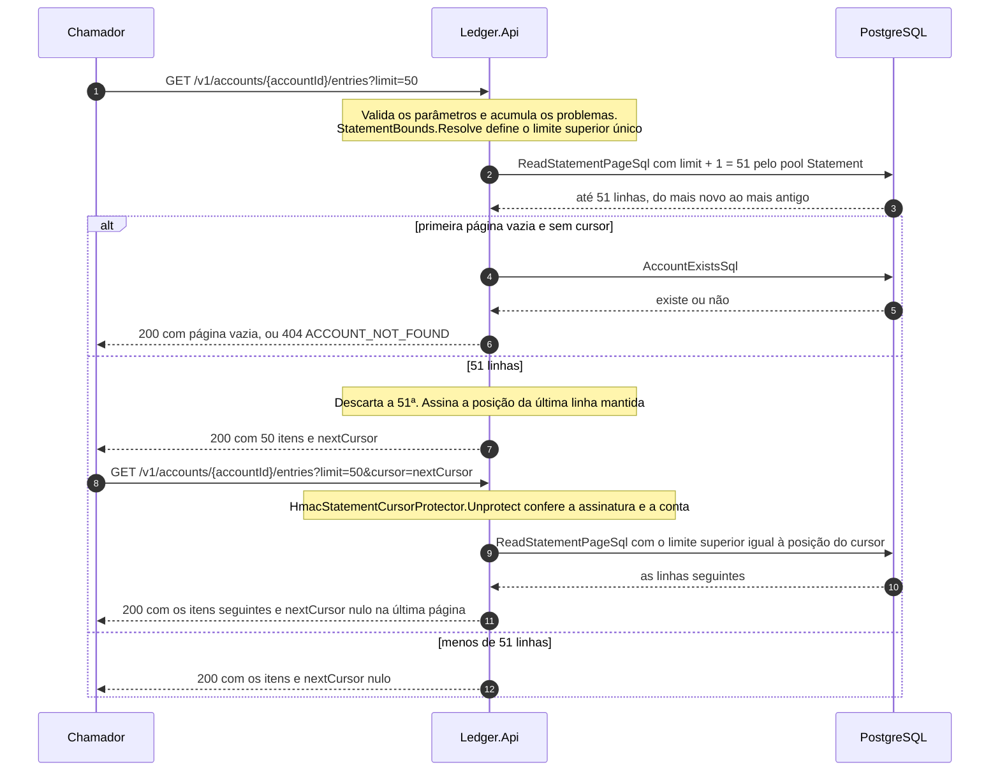

# Fluxo: extrato paginado

`GET /v1/accounts/{accountId}/entries` devolve os lançamentos da conta do mais novo para o mais antigo, em páginas. A paginação é por posição (*keyset*), não por `OFFSET`: cada página começa onde a anterior terminou, a página 5.000 custa o mesmo que a primeira, e o cursor que o chamador recebe é opaco e assinado. Quem concilia ou audita percorre todo o histórico de uma conta, em qualquer profundidade, sem repetir nem perder lançamento, mesmo com escrita concorrente. Os bytes do cursor estão em [Cursor do extrato](../05-contratos/cursor-do-extrato.md), e os parâmetros e a resposta em [Contrato da API REST](../05-contratos/api-rest.md).

Participam o chamador, a `Ledger.Api` e o PostgreSQL, com o `StatementEndpoints`, o `StatementQueryReader`, o `ListEntriesHandler`, o `HmacStatementCursorProtector` e o `PostgresStatementReader` ([nível 3](../04-modelos-c4/nivel-3-componentes-api.md)). O chamador tem `ledger.read` e a conta existe, senão o extrato responde 404. A leitura usa o pool próprio `Statement` (4 conexões por instância, sessões somente leitura, comando de 1 segundo e `statement_timeout` de 1,5 segundo), para que um extrato lento não consuma as conexões do saldo, e a classe `Statement` limita 8 requisições em voo por instância (`RateLimiting:StatementConcurrency`).

## Sequência

O cursor da segunda chamada leva a posição do último item da primeira, e o banco recebe sempre um limite superior único. A página é pedida com `limit + 1` linhas: se voltam `limit + 1` há próxima página, a linha extra é descartada e o cursor sai da última linha mantida, sem consulta de contagem. A existência da conta só é verificada quando a primeira página volta vazia e não há cursor, o que distingue extrato vazio (200) de conta inexistente (404) sem custo nas demais chamadas. A API não guarda estado entre as páginas.



1. **Pipeline e limites.** A rota exige `ledger.read` e a classe `Statement`. A cota por chamador é a de leitura (`RateLimiting:ReadPerClient`), compartilhada com o saldo, e não gasta a cota de escrita ([ciclo de vida de uma requisição](ciclo-de-vida-da-requisicao.md)).

2. **Validação.** O `StatementEndpoints.ListEntriesAsync` valida o identificador da conta (fora do formato é 404) e chama o `StatementQueryReader`, que acumula todos os problemas numa única resposta 400 `VALIDATION_FAILED`. `from` e `to` são instantes ISO 8601 com fuso, convertidos para UTC (`MISSING_TIME_ZONE` sem fuso, `INVALID_FORMAT` nos demais defeitos), e `from` precisa ser anterior a `to` (`FROM_AFTER_TO`). O `limit` é um inteiro de 1 até o máximo configurado, com padrão 50 e máximo 200 (`Ledger:Statement:DefaultLimit` e `MaxLimit`), e o `cursor` tem de 1 a 64 caracteres e uma assinatura válida para a conta da rota (`INVALID_CURSOR`, sempre com a mesma mensagem). Parâmetro repetido ou desconhecido também é recusado, e nenhum valor recebido volta na resposta.

3. **Limite superior único.** O `ListEntriesHandler` chama `StatementBounds.Resolve(from, to, cursor)`. Cursor e `to` dizem a mesma coisa de dois jeitos, "só o que vem antes de", e a aplicação os junta antes de ir ao banco. Só `to` dá a posição `(to, menor valor de bigint)`, "logo antes de todo lançamento registrado em `to`", o que mantém `to` exclusivo sem segunda comparação. Só o cursor dá a posição dele, os dois juntos dão a menor das duas, e nenhum dá limite superior. O `from` segue como limite inferior inclusivo. Como tudo chega em UTC, `from` e `to` escritos em fusos diferentes se comparam como instantes.

4. **Leitura da página.** O `PostgresStatementReader.ReadPageAsync` executa a instrução abaixo, pedindo `limit + 1` linhas. O predicado `recorded_at <= upper` repete de propósito o que a comparação de linha já diz: dá ao planejador um limite simples sobre a segunda coluna do índice, e a comparação de linha refina o resto. A ordenação coincide com a do índice `ix_ledger_entries_account_id_recorded_at_account_version`, e a leitura anda no índice sem ordenar nem varrer a tabela.

```sql
SELECT e.id, e.account_version, e.type, e.amount, e.currency, e.balance_after,
       e.recorded_at, e.occurred_at, e.description, e.reference, e.reverses_entry_id
FROM ledger_entries AS e
WHERE e.account_id = @account_id
  AND e.recorded_at >= COALESCE(@from, '-infinity'::timestamptz)
  AND e.recorded_at <= COALESCE(@upper_recorded_at, 'infinity'::timestamptz)
  AND (e.recorded_at, e.account_version) < (
        COALESCE(@upper_recorded_at, 'infinity'::timestamptz),
        COALESCE(@upper_account_version, 9223372036854775807)
      )
ORDER BY e.recorded_at DESC, e.account_version DESC
LIMIT @limit_plus_one;
```

5. **Existência da conta.** Se a primeira página volta vazia e não há cursor, o handler executa a consulta abaixo. Conta inexistente é 404 `ACCOUNT_NOT_FOUND`, inclusive com filtro de período. Conta sem lançamento, ou com a janela sem lançamento, responde 200 com `items` vazio e sem cursor.

```sql
SELECT EXISTS (SELECT 1 FROM accounts AS a WHERE a.id = @account_id);
```

6. **Página e cursor.** Se voltaram mais linhas que o `limit`, o handler mantém as primeiras `limit` e cria o `nextCursor` com `HmacStatementCursorProtector.Protect` sobre a posição `(recorded_at, account_version)` da última linha mantida. Como a conta entra na assinatura, um cursor adulterado ou de outra conta é recusado com 400.

7. **Auditoria e resposta.** O `ReadAudit.StatementQueried` emite o evento 2002, com chamador, conta, correlação, `from`, `to`, `limit`, a quantidade devolvida e se havia cursor, sem o texto do cursor. A resposta leva `items`, `nextCursor` e `limit`, com `Cache-Control: no-store`, e cada item tem os doze campos do lançamento, idênticos ao corpo do `201` da escrita, com os dois instantes em seis casas.

O cursor guarda só a posição, e `from` e `to` vêm de novo em cada requisição: quem os altera no meio da paginação obtém o novo filtro a partir da posição. Um `to` anterior ao cursor passa a mandar e retoma a leitura de um ponto mais antigo, um `to` posterior não reabre o que já foi entregue, porque a menor posição mantém a do cursor, e um `to` igual ao instante do lançamento do cursor não repete o lançamento. O dia civil de Brasília se pede com `-03:00` nos dois limites, com `to` exclusivo no início do dia seguinte, e como o cursor guarda a posição em UTC a página seguinte pode ser pedida com os mesmos limites escritos em outro fuso ([Datas e fusos horários](../05-contratos/api-rest.md#datas-e-fusos-horários)).

## O que falha

| Passo | Falha | Efeito | O que o chamador percebe |
|---|---|---|---|
| 2 | Identificador fora do formato | Nenhum acesso ao banco | 404 `ACCOUNT_NOT_FOUND` |
| 2 | Qualquer parâmetro inválido, inclusive `from` ou `to` sem fuso, e cursor de outra conta ou adulterado | Nenhum acesso ao banco | 400 `VALIDATION_FAILED`, com `errors` listando todos os problemas |
| 4 | Pool de extrato esgotado, comando acima de 1 s ou banco indisponível | Trabalho cancelado, sem nova tentativa | 503 com `Retry-After: 1`, sem afetar saldo e escrita |
| 5 | Conta inexistente | Nenhum efeito | 404 `ACCOUNT_NOT_FOUND` |

A cota de leitura e o limite de 8 requisições em voo recusam no pipeline, antes do handler, com 429 `RATE_LIMITED` ou 503 `SERVICE_UNAVAILABLE` e `Retry-After`. Parâmetro inválido nunca produz 503, porque a validação acontece antes de o banco ser tocado (`ReadRequestOrderTests`).

## O que o fluxo garante

Não há repetição nem perda: a ordem é `recorded_at` decrescente com `account_version` decrescente no desempate, a posição do cursor é única por lançamento e lançamentos no mesmo instante mantêm uma ordem estável entre páginas. Lançamentos novos entram sempre no topo e o cursor desce, então a paginação é estável sob escrita concorrente e devolve só o que existia na primeira leitura. O custo não depende da profundidade: o banco lê aproximadamente o mesmo número de blocos na primeira página e numa do meio do histórico. Extrato e saldo concordam, porque a soma dos valores com sinal de uma janela é o saldo antes do fim da janela menos o saldo antes do início. O estorno aparece como lançamento próprio, com o original intacto, e o cursor é assinado e preso à conta, com chave distinta das de dados pessoais.

Os testes do fluxo: `StatementPaginationTests` (120 lançamentos de 50 em 50, sem repetir nem pular), `StatementFilterTests`, `StatementTimeZoneTests`, `StatementMatchesBalanceTests`, `StatementDuringWritesTests` (cem escritas concorrentes), `StatementCursorProtectorTests`, `StatementBoundsTests`, `QueryPlanTests` e, ponta a ponta, `StatementE2ETests`. A instrução é a da constante do código, conferida por `ReadSqlMatchesFlowPagesTests`.
