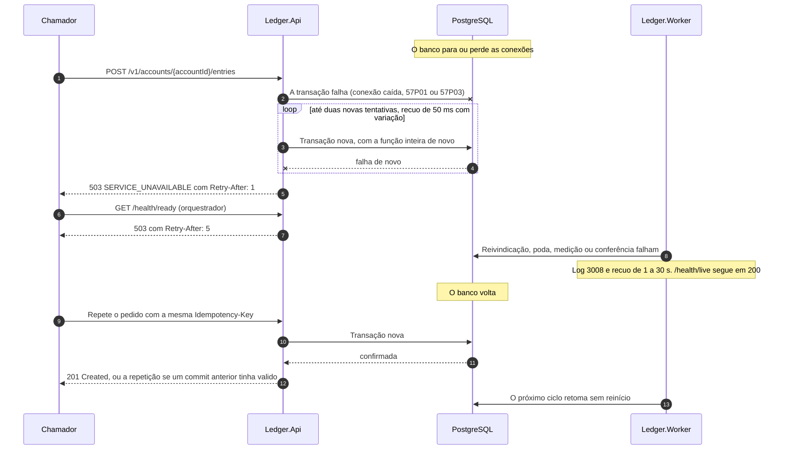
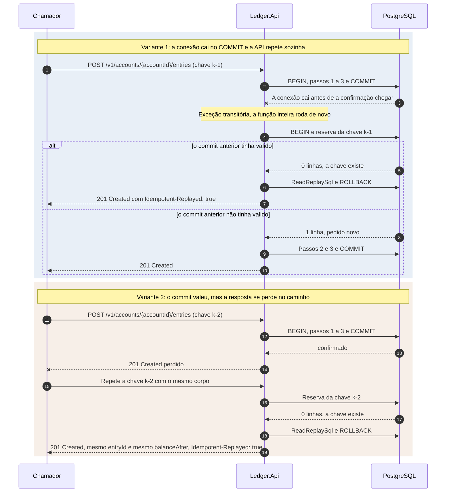

# Fluxo: falha do banco de dados

O PostgreSQL é a única fonte de verdade do ledger, então a falha dele é a que mais pesa. O desenho responde com três regras. Toda falha de infraestrutura vira 503 com `Retry-After`, nunca 500. A transação de escrita só é repetida quando repetir é seguro, e é sempre seguro porque a primeira coisa que ela faz é reservar a chave de idempotência. E nenhum componente guarda estado que o banco não tenha, então API e Worker voltam sozinhos quando ele volta. Timeouts, retries e pool estão em [Políticas de resiliência](../08-resiliencia-e-operacao/politicas-de-resiliencia.md), e a comparação com os outros cenários em [Cenários de falha](../08-resiliencia-e-operacao/cenarios-de-falha.md).

Os limites de tempo nascem em ordem, do mais interno ao mais externo, para que o mais interno falhe primeiro e com a causa certa: espera por conexão do pool (1 s), `lock_timeout` da escrita (1 s), comando do Npgsql (2 s na escrita, 1 s na leitura), `statement_timeout` do servidor (2,5 s e 1,5 s) e requisição inteira (3 s). O servidor ainda derruba a sessão parada dentro de transação em 5 s. Os componentes são o `GlobalExceptionHandler`, o `PostgresTransientFailureClassifier`, o `WriteRetryPipeline`, a `PostgresUnitOfWork`, as verificações de readiness do banco e o `WorkerLoopService` ([API](../04-modelos-c4/nivel-3-componentes-api.md) e [Worker](../04-modelos-c4/nivel-3-componentes-worker.md)).

## Sequência

O chamador sempre recebe resposta dentro do prazo, sem depender de o banco voltar, e repetir é seguro em todos os casos. API e Worker não precisam de reinício: o Npgsql descarta as conexões quebradas e abre novas, e os laços do Worker, que não têm chamador, esperam e tentam de novo.

1. **A escrita decide se repete.** O Npgsql levanta `NpgsqlException` ou `PostgresException` com um SQLSTATE, ou o pool não entrega conexão em 1 segundo (`TimeoutException`), e a exceção chega ao tratamento de erros sem passar pela regra de negócio. A `PostgresUnitOfWork.ExecuteAsync` entrega a função da transação ao `WriteRetryPipeline`, do Polly, com até `Resilience:Retry:MaxRetryAttempts` novas tentativas, atraso inicial de `BaseDelayMs`, crescimento exponencial e variação aleatória. O `PostgresRetryPredicate` só repete o que costuma passar em segundos: SQLSTATE `08xxx` (conexão), `57P01` (desligamento administrativo), `57P03` (o servidor ainda não aceita conexão), `25P03` (sessão derrubada por ficar parada dentro da transação), `40P01` (deadlock) e `40001` (falha de serialização), e `NpgsqlException` transitória que não envolva timeout.

2. **Cada nova tentativa recomeça do zero.** Abre conexão e transação novas e roda a função inteira, a começar pela reserva da chave, com o mesmo `entryId` e o mesmo `eventId`. Registra o log 1006 e `ledger.db.retries`. O prazo de 3 segundos da requisição, que chega como `CancellationToken`, limita o tempo total.

3. **O que não é repetido.** Espera de lock acima de 1 segundo (`55P03`), comando que estoura (`57014`), `too_many_connections` (`53300`), disco cheio (`53100`), transação somente leitura (`25006`), desligamento anormal de outro processo do servidor (`57P02`) e pool esgotado não melhoram com nova tentativa: o problema está do outro lado, e repetir só alonga a fila. Recusa de negócio e leitura também não repetem. A falha vira 503 e quem repete é o chamador. A tabela de SQLSTATE, resposta e log está em [Políticas de resiliência](../08-resiliencia-e-operacao/politicas-de-resiliencia.md).

4. **O erro vira resposta.** O `GlobalExceptionHandler` classifica a exceção. Prazo estourado, cancelamento sem que o cliente tenha ido embora e falha que o `CompositeTransientFailureClassifier` reconhece como transitória (as do banco e a indisponibilidade do provedor de chaves) viram 503 `SERVICE_UNAVAILABLE` com `Retry-After`, e o log 9002 leva só o SQLSTATE de cinco caracteres. Violação de restrição que o desenho considera impossível vira 500 com o log 1008, que nomeia a restrição, e qualquer outra exceção é 500 com o log 9001. Se o cliente foi embora antes do prazo, a resposta é 499, sem corpo. O Problem Details nunca leva pilha, SQL, nome de servidor, nome de banco nem SQLSTATE.

5. **A saúde reflete o banco.** `GET /health/ready` da API faz um `SELECT 1` com prazo de 1 segundo, pelo pool do extrato, e confere a versão do esquema, com cache de 5 segundos. Com o banco fora responde 503 com `Retry-After: 5` e o corpo só com o estado, e a readiness do Worker também cai. `GET /health/live` responde 200 sempre na API, porque não consulta nada, e o do Worker segue 200 enquanto os laços giram.

6. **O Worker espera e repete.** Cada laço que falha registra o log 3008, conta `ledger.worker.loop.failures` e espera de 1 a 30 segundos ([rotinas de manutenção](rotinas-de-manutencao.md)). A reivindicação do outbox em voo expira sozinha, os medidores velhos somem e a conferência de integridade registra a falha e recomeça do último registro.

7. **O banco volta.** A sonda de readiness volta a 200 depois da janela de cache e o Worker retoma no ciclo seguinte. Os [limites de taxa e de concorrência](../08-resiliencia-e-operacao/limites-de-taxa-e-concorrencia.md) seguram os chamadores que repetem ao mesmo tempo, e o `Retry-After` pede o recuo.

## Desfecho desconhecido do commit

O caso mais delicado é a conexão que cai no `COMMIT`: o banco pode ter confirmado e a API não sabe. Há duas variantes, e a idempotência resolve as duas do mesmo jeito.

Na variante 1 a repetição acontece dentro da mesma requisição, e o chamador recebe o `201` sem saber que a primeira tentativa falhou. Com as novas tentativas desligadas o resultado é 503, e a repetição do chamador devolve o lançamento gravado. Na variante 2 só o chamador fecha o ciclo, repetindo com a mesma chave e o mesmo corpo. Nas duas recebe o mesmo `entryId` e o mesmo `balanceAfter` do momento original, nunca um segundo débito, e se não repetir o lançamento existe mesmo assim, o saldo o reflete e o evento é publicado. Na criação de conta, o `accountId` gerado antes da transação cumpre o mesmo papel ([criação de conta](criacao-de-conta.md)).

## O que falha

| Situação | Efeito | O que o chamador percebe |
|---|---|---|
| Banco fora, escrita | Transação nunca confirmada, ou desfeita pelo servidor. Chave livre | 503 com `Retry-After: 1` em até 3 s |
| Banco fora, leitura | Sem nova tentativa e sem dado velho | 503 com `Retry-After: 1` |
| Banco fora, readiness | `ready` da API e do Worker caem | 503 com `Retry-After: 5`. `live` segue 200 |
| Banco fora, autenticação e autorização | Não tocam o banco | 401 e 403 como sempre |
| Conexões derrubadas no meio do tráfego, ou desfecho desconhecido do commit | Sem escrita parcial. A repetição com a mesma chave revela se valeu e não duplica | 503 ou 201, e a repetição devolve o lançamento |
| Lock da conta além de 1 s, ou pool de escrita esgotado | Desfeita sem nova tentativa, chave livre, sem escrita parcial | 503 com `Retry-After: 1`, ou 201 e recusa de negócio para quem conseguiu conexão |
| Pedido que não precisa do banco (token ruim, corpo inválido, falta de escopo) | Respondido sem consultar o banco | 400, 401, 403 ou 404 normais |

## O que o desenho garante

Um `201` só existe depois de um commit confirmado, e os testes que param e matam o PostgreSQL no meio do tráfego conferem que todo lançamento respondido com `201` continua lá depois. Repetir uma transação de desfecho desconhecido, ou o pedido, nunca grava duas vezes, porque a reserva da chave está na mesma transação do saldo, do lançamento e do evento: os quatro confirmam juntos ou não existem.

Três pontos não foram exercitados. O RPO zero depende de um standby síncrono e de um failover que o repositório não sobe, porque o Compose tem uma única instância. O teste cobre só a resposta da aplicação a uma instância que passa a recusar escrita (o `25006` vira 503 e a repetição é segura), e não a promoção de um standby de verdade nem o isolamento do primário antigo. O RTO de até 15 minutos pressupõe promoção ou restauração de backup nesse prazo, e nenhum ensaio foi feito. E o disco cheio só está classificado, com o `53100` virando 503 sem nova tentativa, sem exercício com um volume realmente cheio. Esses limites estão em [limites conhecidos](../09-qualidade/limites-conhecidos.md). Se mais de 1% das escritas precisarem de nova tentativa num teste de carga, o sinal é de contenção, e não de falha transitória ([documento de arquitetura 0011](../03-principios-e-decisoes/documento-arquitetura/0011-resiliencia-timeouts-retry-circuit-breaker-rate-limit.md)).

Os sinais do fluxo são `ledger.db.retries` (`reason`: `deadlock`, `serialization_failure` ou `transient_connection`), `ledger.worker.loop.failures` e os logs 1006 a 1009, 9001, 9002, 9101, 9102 e 3008. Os testes são `PostgresTransientFailureClassifierTests`, `PostgresUnitOfWorkRetryTests`, `EntryFailureTests`, `WriteFailureTests`, `SaturatedWritePoolTests`, `CommitCuttingProxyTests` (um proxy corta a resposta do `COMMIT`), `EntryCommitUnknownTests`, `RequestTimeoutTests`, `PostgresReadinessTests`, `WorkerDatabaseOutageTests` e, de ponta a ponta, `PostgresOutageE2ETests` (para e mata o PostgreSQL de verdade no meio de um lote) e `ApiKillE2ETests` (mata a API no meio da carga e repete as chaves). A repetição que revela se um commit anterior valeu está em [repetição idempotente](repeticao-idempotente.md), e a readiness e o cache das sondas em [Saúde e observabilidade](../08-resiliencia-e-operacao/saude-e-observabilidade.md).
