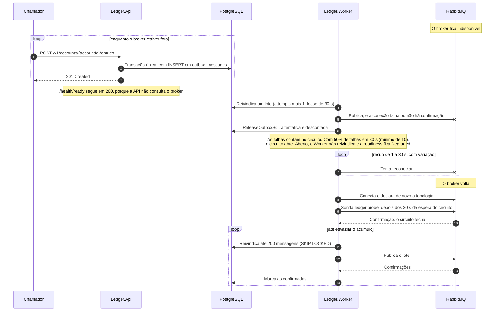

# Fluxo: falha do broker

Com o RabbitMQ parado, a API continua aceitando lançamentos, porque nunca falou com ele: cada evento é uma linha de `outbox_messages` gravada na mesma transação do lançamento. Quem sente a queda é o `Ledger.Worker`, que para de publicar, deixa o acúmulo esperando no banco e, quando o broker volta, esvazia a fila sem reinício e sem perda. O detalhe de uma volta do publicador, da classificação das falhas e do circuito está em [publicação do outbox](publicacao-do-outbox.md), e a comparação com os demais cenários em [Cenários de falha](../08-resiliencia-e-operacao/cenarios-de-falha.md).

As formas de falha cobertas são o broker parado ou inalcançável, o broker vivo que aceita a conexão e não confirma (bloqueado por alarme de memória ou disco, por exemplo), a credencial recusada e o broker sem a fila de destino. Em todas a causa é do broker e o ledger não é afetado. Os componentes do Worker são o `OutboxPublisherService`, o `CircuitBreakingEventPublisher` e a `BrokerConnection` ([nível 3](../04-modelos-c4/nivel-3-componentes-worker.md)).

## Linha do tempo

A API aparece só no começo, porque não muda de comportamento em nenhum momento: o caminho do chamador não tem seta alguma para o RabbitMQ, e a latência e a disponibilidade da escrita são as mesmas com o broker no ar ou fora. O que o Worker não consegue publicar volta ao estado pendente, com a tentativa descontada, em vez de ficar como falha, e o próprio laço se recupera sem reinício.

1. **O broker cai.** A conexão do Worker fecha e o evento `ConnectionShutdownAsync` zera `broker.connected`. Na próxima publicação o canal falha e é descartado, e a mensagem recebe o motivo `broker_unavailable`. Uma publicação sem confirmação por mais de 5 segundos recebe `timeout`. Nos dois casos a mensagem volta ao outbox com a tentativa descontada.

2. **O circuito abre.** Cada publicação que falha conta no circuit breaker. Com 50% de falhas em 30 segundos e pelo menos 10 operações, o circuito abre por 30 segundos e o log 3003 registra a mudança. Um lote de 200 que falha por inteiro abre o circuito na hora.

3. **O Worker deixa de reivindicar.** Com o circuito fora de `Closed` o orçamento de reivindicação é zero: o Worker não toca o banco para pegar lotes que não poderia publicar, e o laço dorme 1 segundo entre as voltas. Sem conexão utilizável o orçamento também é zero, e a reconexão segue o recuo exponencial de 1 a 30 segundos, com 20% de variação, registrando o log 3007 a cada tentativa.

4. **O acúmulo cresce no banco.** Os lançamentos continuam sendo gravados, cada um deixando uma linha pendente, e o índice parcial `ix_outbox_messages_created_at_pending` mantém a reivindicação rápida mesmo com horas de acúmulo. A mensagem pendente mais antiga com mais de 60 segundos deixa a readiness do Worker `Degraded`.

5. **O que cada sinal diz durante a queda.**

| Sinal | Valor durante a queda | Efeito |
|---|---|---|
| `GET /health/ready` da API | 200 | A API continua no balanceamento |
| `GET /health/live` do Worker | 200 | O processo não é reiniciado, porque o laço do outbox segue registrando o batimento |
| `GET /health/ready` do Worker | 200 com `Degraded` | `rabbitmq`, `broker-circuit` e `outbox-lag` degradadas, sem tirar o processo do ar |
| `broker.connected` e `broker.circuit_breaker.state` | 0 e 1 ou 2 | Sem conexão utilizável, circuito meio aberto ou aberto |
| `outbox.oldest_pending.age` | Cresce | Alimenta o alerta de idade da mensagem mais antiga |
| `outbox.failed.messages` | Não cresce | A indisponibilidade devolve a tentativa e não conta como mensagem presa |

6. **O broker volta.** A próxima tentativa de conexão passa: o Worker abre a conexão, declara a exchange e as filas de retenção, cria o canal com confirmação e registra o log 3006. Com os 30 segundos do circuito cumpridos, o handler publica a sonda vazia na chave `ledger.probe`, e confirmada a sonda o circuito fecha e o orçamento volta ao tamanho do lote. Uma instância sem mensagem pendente também fecha o circuito, porque a sonda não depende de linha do outbox.

7. **O acúmulo é esvaziado.** O Worker reivindica até 200 mensagens por volta e, com o lote cheio, volta na hora, em ordem de `created_at`. As devolvidas na hora da queda voltam a ser elegíveis, e as que ficaram com o lease vigente esperam até 30 segundos. Quando o acúmulo termina, `outbox.pending.messages` volta a zero, e a readiness volta a `Healthy` quando a próxima medição (a cada 10 segundos) e a sonda do RabbitMQ (cache de 5 segundos) refletem a recuperação.

8. **Duplicatas possíveis.** Se o Worker morrer ou perder a conexão depois de o broker confirmar e antes de a marcação gravar, a mensagem sai de novo. É a entrega pelo menos uma vez, e o consumidor deduplica pelo `message_id`.

## Outras formas de falha

Num broker vivo que não confirma, cada mensagem do lote falha por prazo e o circuito abre pela mesma regra de 50%, contada por mensagem. Credencial recusada ou erro de TLS contam como falha de tentativa de conexão, com o mesmo recuo e o log 3007, e a readiness da API não muda. Uma exchange sem nenhuma fila ligada devolve a mensagem `mandatory`: o Worker a devolve ao outbox sem gastar tentativa e redeclara a topologia, o que recria a fila de retenção ([publicação do outbox](publicacao-do-outbox.md)). O que o broker já confirmou e depois perdeu, por volume apagado, por exemplo, não volta do outbox, porque a linha foi marcada e a poda a remove depois de 7 dias. O consumidor reconstrói o estado pelo extrato, e o evento carrega `accountVersion` justamente para detectar a lacuna ([Contrato de eventos](../05-contratos/eventos.md)).

## O que falha

| Fase | Falha | Efeito | O que o chamador percebe |
|---|---|---|---|
| Escrita | Broker fora | Nenhum: a escrita não usa o broker | 201, com a latência de sempre |
| Publicação | `broker_unavailable`, `timeout` | Mensagem devolvida, tentativa descontada, canal descartado | Nada. O consumidor vê o atraso |
| Circuito | 50% de falhas em 30 s | Circuito aberto por 30 s, sem reivindicação | Nada. A readiness do Worker fica `Degraded` |
| Reconexão | Broker ainda fora | Recuo de 1 a 30 s, log 3007 | Nada |
| Banco fora ao mesmo tempo | Reivindicação ou devolução falham | A volta falha e o laço espera de 1 a 30 s. As reivindicações vencem sozinhas | 503 na escrita ([falha do banco de dados](falha-do-banco.md)) |
| Marcação | Banco falha depois da confirmação do broker | A mensagem sai de novo | Duplicata para o consumidor |

## O que o fluxo garante

Nenhum evento se perde por indisponibilidade, porque a linha continua pendente até haver confirmação e marcação. Uma queda longa também não vira alarme de mensagem presa, porque a tentativa é devolvida a cada falha de indisponibilidade e só recusas do broker acumulam tentativas. A recuperação é automática, e o `live` do Worker não depende do broker, já que reiniciá-lo com o broker fora não ajudaria. A deduplicação pelo `message_id` e a ordenação por `accountVersion` ficam por conta do consumidor.

O tempo para esvaziar o acúmulo depende da latência de confirmação e do tamanho do acúmulo. A meta de p99 de até 5 segundos de atraso de publicação ainda não foi medida em escala ([limites conhecidos](../09-qualidade/limites-conhecidos.md)). Alertas e limiares estão em [Indicadores, objetivos e alertas](../08-resiliencia-e-operacao/slos-e-alertas.md), e o procedimento de plantão em [Procedimentos de operação](../08-resiliencia-e-operacao/runbooks.md).

Os testes do fluxo são `BrokerOutageTests`, `BrokerOutageRecoveryTests`, `EntryOutboxTests` (escrita sem lentidão e sem falha com o broker inalcançável), `WorkerHealthTests`, `BrokerAndLagHealthCheckTests`, `CircuitBreakingEventPublisherTests` e, de ponta a ponta, `BrokerOutageE2ETests` (broker parado de verdade, escrita em andamento e drenagem na volta) e `WorkerRestartE2ETests`.
