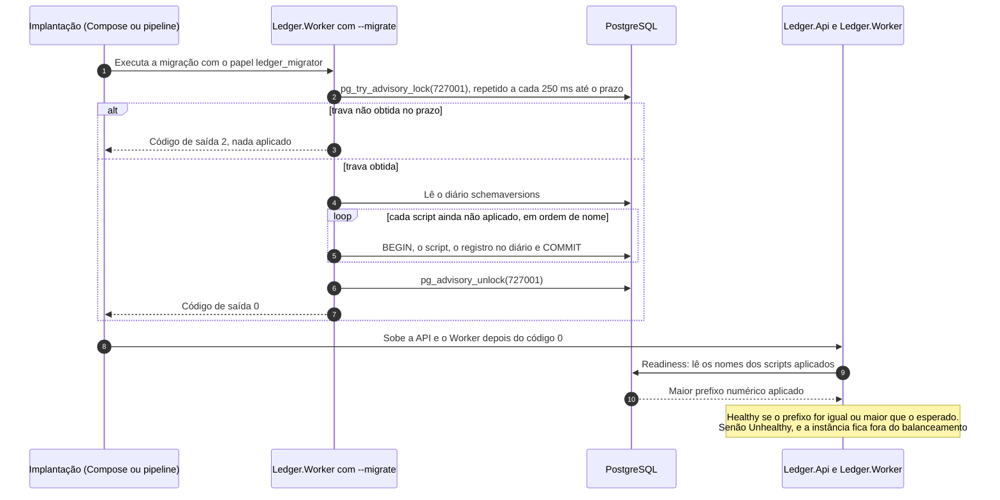

# Fluxo: migração do esquema

O esquema do PostgreSQL muda por scripts SQL numerados, embutidos no assembly do ledger e aplicados pelo DbUp. A migração é uma etapa de implantação, executada pelo mesmo binário do Worker com o argumento `--migrate`, sob um papel de banco próprio e sob uma trava que impede duas execuções ao mesmo tempo. O fluxo leva o esquema à versão que o código espera, de forma repetível e segura mesmo com várias execuções simultâneas, e impede que uma instância sirva tráfego com o esquema atrasado. As tabelas, os privilégios e a lista dos scripts estão em [Modelo de dados](../05-contratos/modelo-de-dados.md), e o argumento `--migrate` em [Configuração e linha de comando](../05-contratos/configuracao.md).

Participam a etapa de implantação (o serviço `migrator` do Compose ou o passo equivalente de um pipeline), o `Ledger.Worker` em modo de migração, o PostgreSQL e a API e o Worker em operação, que verificam a versão na readiness. Os componentes são o `MigrateCommand`, o `MigrationRunner`, o `LoggerUpgradeLog`, o `SchemaVersionReader` e o `SchemaVersionHealthCheck` ([nível 3 do Worker](../04-modelos-c4/nivel-3-componentes-worker.md)). O banco e os quatro papéis já existem antes da migração, porque os scripts concedem os privilégios dos demais papéis. No Compose, o `docker/postgres/init-roles.sh` os cria na primeira inicialização do volume, define o `ledger_migrator` como dono do banco `ledger` e tira os privilégios do `PUBLIC`. O executável precisa só da fonte `Migrator` (pool de 2 conexões, comando e `statement_timeout` de 300 segundos) e de `Migrations:LockTimeoutSeconds`, sem broker nem chaves.

## Sequência

A trava consultiva fica na conexão do migrador durante toda a execução e é a única coisa que serializa duas migrações. Cada script roda na sua própria transação: um que falha desfaz só a si mesmo, e os anteriores continuam aplicados. A implantação impõe a ordem, e no Compose a API e o Worker só sobem depois de o `migrator` terminar com sucesso. A verificação de versão da readiness é uma consulta da própria instância e não depende de o migrador estar de pé.



1. **Modo de migração.** O `Program` do Worker reconhece `--migrate` e monta um host sem serviços de fundo, sem a camada de aplicação e sem os endpoints de saúde, com uma única fonte de dados, a `Migrator`. O host nunca é iniciado: o comando roda e termina. Opções inválidas, como um prazo de trava fora do intervalo, terminam com o log 5020 e o código 3 antes de tocar o banco.

2. **Conexão e trava.** O `MigrationRunner` abre uma conexão da fonte `Migrator` e tenta `pg_try_advisory_lock(727001)` a cada 250 ms até `Migrations:LockTimeoutSeconds`. Duas migrações iniciadas juntas esperam uma pela outra: a que perde a corrida entra depois, encontra o diário completo e não aplica nada. Se o prazo estoura, o log 5013 registra o motivo, nada é aplicado e a saída é 2.

3. **Aplicação dos scripts.** Com a trava, o runner registra o log 5010 e chama o DbUp, que lê o diário `schemaversions`, escolhe os scripts embutidos (`Ledger.Infrastructure.Persistence.Migrations.*.sql`) ainda não registrados, ordena por nome e executa cada um numa transação própria (`WithTransactionPerScript`), sem substituição de variáveis. O DbUp registra o nome do script no diário depois de aplicá-lo, e o que falha não é registrado. Uma segunda execução não aplica nada.

4. **Relato.** O `LoggerUpgradeLog` troca a saída do DbUp por logs estruturados: a primeira falha de script vira uma linha `Error` (log 5005), e as repetições do mesmo erro vão para `Debug`, porque o DbUp relata a mesma falha várias vezes. No fim, o log 5011 registra o resultado e a contagem de scripts aplicados.

5. **Liberação da trava e código de saída.** O runner libera a trava explicitamente. Se a liberação falha, o log 5014 avisa e o fechamento da conexão a libera no servidor, sem mudar o resultado. O `MigrateCommand` traduz o resultado em código de saída.

| Resultado | Código | Quando |
|---|---|---|
| `Succeeded` | 0 | Todos os scripts aplicados, ou nada a aplicar |
| `ScriptFailed` | 1 | Um script falhou, por exemplo por falta de permissão para criar objetos |
| `ConnectionFailed` | 2 | Servidor inexistente, senha recusada ou falha de TLS. O log 5012 traz o motivo na própria frase, e o detalhe técnico vai ao 5015 em `Debug` |
| `LockTimedOut` | 2 | A trava ficou com outra sessão além do prazo |
| Configuração inválida | 3 | `OptionsValidationException`, com o log 5020 listando as chaves |

6. **Verificação de versão.** A API e o Worker têm a verificação `schema` na readiness. O `SchemaVersionReader` lê os nomes do diário com a consulta abaixo e extrai o maior prefixo numérico de quatro dígitos, e o `SchemaVersion.Expected` é o maior prefixo entre os scripts embutidos no assembly. O `SchemaVersionHealthCheck` devolve `Healthy` quando a versão aplicada é igual ou maior que a esperada e `Unhealthy` quando é menor, ou quando o diário não existe (banco sem migrar), com cache de 5 segundos e o log 9102 com as duas versões na falha. Um esquema à frente do código é aceito, o que permite voltar a aplicação para a versão anterior depois de uma migração mais nova.

```sql
SELECT scriptname FROM schemaversions;
```

O arquivo `migrations.sha256` guarda o hash de cada script, em ordem de nome, e o `MigrationChecksumTests` falha em quatro casos: script sem linha no arquivo, linha para um script que não existe mais, script gravado cujo hash mudou e linhas fora de ordem. O hash ignora o fim de linha do ambiente. A regra do desenho é acrescentar o script seguinte e nunca alterar um que já foi aplicado em algum ambiente, porque o diário registra só o nome do script e não detectaria a mudança.

## O que falha

| Passo | Falha | Efeito | O que se observa |
|---|---|---|---|
| 1 | Opção inválida | Nada tocado | Código 3, log 5020 |
| 2 | Banco inalcançável, senha recusada, falha de TLS, ou trava com outra sessão além do prazo | Nada aplicado | Código 2, log 5012 com o motivo (por exemplo `28P01: password authentication failed`) ou 5013 |
| 3 | Script falha | Só a transação dele é desfeita. Os anteriores ficam aplicados e o diário não registra o que falhou | Código 1, log 5005 (uma linha) e log 5011 em `Error` |
| 3 | Duas migrações simultâneas | A segunda espera a trava e não aplica nada | Ambas com código 0 e cada script registrado uma vez |
| 5 | Falha ao liberar a trava | A conexão fechada a libera | Log 5014, resultado inalterado |
| Operação | Aplicação sobe antes da migração | Verificação `schema` `Unhealthy` | 503 em `/health/ready`, instância fora do balanceamento até a migração rodar |

## O que o fluxo garante

Uma migração roda por vez, e execuções simultâneas terminam todas com sucesso, cada script registrado uma vez. Rodar de novo não aplica nada, e rodar depois de uma falha retoma do script que falhou. Nenhuma instância serve com esquema atrasado, porque a readiness `schema` a tira do balanceamento, e só o `ledger_migrator` cria objetos, sem DDL para API e Worker. O fluxo não emite métrica: a observação é pelo código de saída e pelos logs 5003 a 5015 e 5020, mais o 9102 da readiness, listados em [Saúde e observabilidade](../08-resiliencia-e-operacao/saude-e-observabilidade.md).

Os testes do fluxo são `MigrationTests`, `ConcurrentMigrationsTests`, `MigrationLockTests`, `MigrateCommandTests`, `SchemaVersionTests`, `PostgresReadinessTests` e `MigrationChecksumTests`. O serviço `migrator` do Compose e a ordem de subida estão em [Ambientes e configuração](../10-implantacao-e-entrega/ambientes-e-configuracao.md), e a escolha de SQL puro com DbUp é o [documento de arquitetura 0007](../03-principios-e-decisoes/documento-arquitetura/0007-postgresql-npgsql-dapper-dbup.md).
