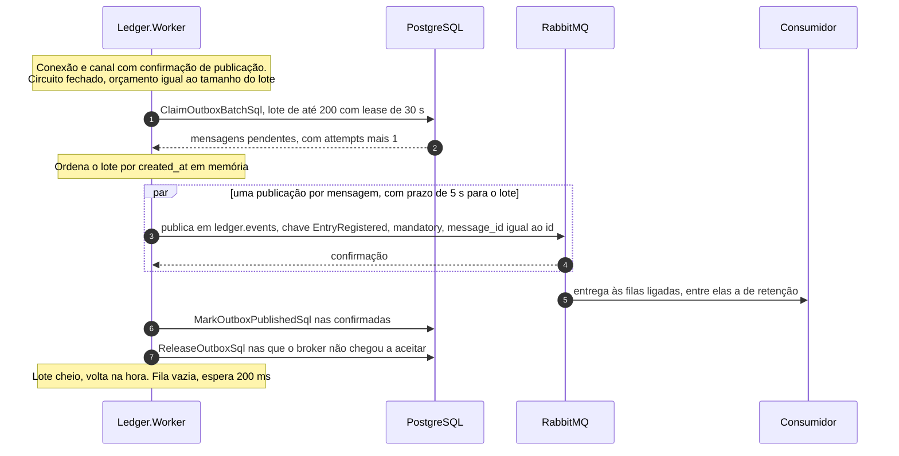

# Fluxo: publicação do outbox

A API nunca fala com o RabbitMQ. O evento `EntryRegistered` nasce como uma linha de `outbox_messages` na mesma transação do lançamento, e o `Ledger.Worker` o leva ao broker depois, num laço próprio. Cada volta do laço reivindica um lote com prazo, publica com confirmação do broker, marca o que foi confirmado e devolve o que não chegou a ser tentado. Um circuit breaker impede o Worker de insistir com um broker que não responde. A entrega é pelo menos uma vez, e quem consome deduplica. O formato do evento e a topologia estão em [Contrato de eventos](../05-contratos/eventos.md), e a queda do broker, do começo ao fim, em [falha do broker](falha-do-broker.md).

O Worker roda com o papel `ledger_worker`, que lê e apaga linhas da tabela e só atualiza `published_at`, `locked_until` e `attempts`, e conhece o broker pelas seções `RabbitMq` e `Outbox` da [configuração](../05-contratos/configuracao.md). Os componentes (`OutboxPublisherService`, `PublishOutboxBatchHandler`, `PostgresOutboxQueue`, `CircuitBreakingEventPublisher`, `RabbitMqEventPublisher` e `BrokerConnection`) estão no [nível 3 do Worker](../04-modelos-c4/nivel-3-componentes-worker.md). Várias instâncias podem rodar juntas, porque cada uma reivindica o seu lote sem bloquear as outras.

## Uma volta

Reivindicar e marcar são duas transações curtas e independentes, e a publicação acontece entre elas, fora de qualquer transação, de modo que nenhum lock de banco fica preso ao processo durante a conversa com o broker. A mensagem só é marcada depois de a confirmação chegar, e o `message_id` da mensagem AMQP é o `id` da linha, o que permite ao consumidor reconhecer uma duplicata.



1. **Conexão.** O `PublishOutboxBatchHandler` pergunta ao publicador se há conexão e, se não há, pede `TryConnectAsync`. A `BrokerConnection` respeita o recuo da última falha, abre a conexão (a recuperação automática do cliente está desligada, e a reconexão é toda dela), declara a topologia com prazo de 15 segundos e cria um canal com confirmação de publicação. Com sucesso, zera o recuo, marca `broker.connected` como 1 e registra o log 3006. Com falha, calcula o próximo atraso (recuo exponencial com variação, `RabbitMq:ReconnectMinSeconds`, `ReconnectMaxSeconds` e `ReconnectJitterPercent`), registra o 3007 e a volta termina sem reivindicar nada.

2. **Sonda.** Com o circuito aberto ou meio aberto, o handler chama `ProbeAsync` antes de pedir orçamento: uma mensagem vazia e transitória, publicada em `ledger.events` com a chave `ledger.probe`, sem `mandatory`, confirmada em até 5 segundos e liberada pelo circuit breaker só depois de 30 segundos de espera. Ela não é uma linha do outbox de propósito: se o teste do meio aberto fosse a mensagem mais antiga da fila e o broker a recusasse sempre, o circuito nunca fecharia e nenhuma outra sairia.

3. **Orçamento.** `ClaimBudget` devolve o tamanho do lote (`Outbox:BatchSize`) com o circuito fechado e a conexão utilizável, e zero em qualquer outro caso. Orçamento zero encerra a volta sem tocar o banco, e o laço espera 1 segundo.

4. **Reivindicação.** O `PostgresOutboxQueue.ClaimBatchAsync` marca `locked_until` com `Outbox:LeaseSeconds` à frente e incrementa `attempts` nas mensagens não publicadas e sem lease vivo, em ordem de `created_at`, com `FOR UPDATE SKIP LOCKED`: uma instância não espera pelas linhas que outra reivindica, e duas nunca recebem a mesma mensagem. A instrução roda sozinha, numa transação curta, sobre o índice parcial `ix_outbox_messages_created_at_pending`, que continua pequeno mesmo com o broker fora por horas.

```sql
UPDATE outbox_messages
SET locked_until = clock_timestamp() + make_interval(secs => @lease_seconds),
    attempts = attempts + 1
WHERE id IN (
    SELECT id FROM outbox_messages
    WHERE published_at IS NULL
      AND (locked_until IS NULL OR locked_until < clock_timestamp())
    ORDER BY created_at
    LIMIT @batch_size
    FOR UPDATE SKIP LOCKED
)
RETURNING id, account_id, type, payload::text AS payload, correlation_id, traceparent, created_at, attempts;
```

5. **Ordenação e mensagem presa.** O `RETURNING` de um `UPDATE` não promete ordem, então o handler ordena o lote por `created_at` em memória e registra o log 3005 para cada mensagem com `attempts` igual ou acima de `Outbox:FailedAttempts`.

6. **Publicação.** O handler dispara uma publicação por mensagem, em paralelo, com um prazo único de `Outbox:ConfirmTimeoutSeconds` para o lote. O `RabbitMqEventPublisher.PublishAsync` monta propriedades e corpo (`EventEnvelopeMapper`), com o corpo sendo o texto do `jsonb` como o PostgreSQL o devolveu, em UTF-8 estrito e sem reserializar, e envia à exchange `ledger.events` com a chave de roteamento igual ao tipo do evento e `mandatory` ligado. A chamada só retorna quando o broker confirma.

7. **Classificação das falhas.** Cada falha vira um motivo: `unroutable` quando o broker devolve a mensagem porque nenhuma fila a recebeu (`PublishReturnException`); `nack` na recusa do broker (`PublishException`), que descarta o canal; `timeout` no cancelamento pelo prazo do lote; `broker_unavailable` em qualquer outra exceção do canal, que também o descarta; `serialization` na falha ao montar a mensagem. Indisponibilidade, prazo e roteamento colocam a mensagem na lista das que não chegaram a ser aceitas, e `nack` e `serialization` ficam como estão.

8. **Marcação.** No bloco `finally`, o handler marca as confirmadas numa instrução só, com prazo próprio igual ao lease (30 s), para que o cancelamento do serviço no encerramento não deixe de marcar o que o broker já aceitou ([documento de arquitetura 0030](../03-principios-e-decisoes/documento-arquitetura/0030-prazo-proprio-para-marcar-as-mensagens-publicadas.md)).

```sql
UPDATE outbox_messages
SET published_at = clock_timestamp(),
    locked_until = NULL
WHERE id = ANY(@ids);
```

9. **Devolução.** Com o mesmo prazo próprio, devolve à fila as que o broker não aceitou por indisponibilidade, prazo ou roteamento, descontando a tentativa que a reivindicação gastou e liberando o lease, de modo que uma queda longa do broker não gera alerta de mensagem presa.

```sql
UPDATE outbox_messages
SET locked_until = NULL,
    attempts = GREATEST(attempts - 1, 0)
WHERE id = ANY(@ids)
  AND published_at IS NULL;
```

10. **Fim da volta.** O handler registra o log 3001 (`Debug` quando houve mensagens, `Trace` com o lote vazio, para o ciclo ocioso não fazer ruído), e o laço calcula o intervalo: zero com o lote cheio, `Outbox:IdlePollMs` com o lote parcial ou vazio e 1 segundo quando não reivindicou.

## O circuito do broker

O `CircuitBreakingEventPublisher` envolve cada publicação, e a sonda, num circuit breaker do Polly, e o circuito conta mensagens, não lotes ([documento de arquitetura 0029](../03-principios-e-decisoes/documento-arquitetura/0029-publicador-do-outbox-com-circuito-por-mensagem.md)). Com um lote de 200 que falha por inteiro ele abre na hora, enquanto um circuito em volta do lote nunca alcançaria o mínimo de operações com o broker bloqueado por um alarme de memória, e o Worker reivindicaria um lote novo a cada 5 segundos sem publicar nada. Os parâmetros estão em `Resilience:BrokerCircuitBreaker` (razão de falha de 0,5 numa janela de 30 segundos, mínimo de 10 operações, 30 segundos aberto). Contam como falha o cancelamento e os motivos `nack`, `timeout` e `broker_unavailable`. `serialization` e `unroutable` não contam, porque o broker respondeu ou nem foi consultado.


Com o circuito aberto as mensagens esperam seguras no banco, a readiness do Worker reporta `Degraded` (continua 200) pela verificação `broker-circuit` e o alerta de idade da mensagem mais antiga avisa o plantão. Cada mudança de estado gera o log 3003 e atualiza `broker.circuit_breaker.state` (0 fechado, 1 meio aberto, 2 aberto).

## Mensagem devolvida pelo broker

Uma publicação `mandatory` que nenhuma fila recebe volta como `basic.return`, e o Worker a trata como `unroutable`: devolve a mensagem ao outbox com a tentativa descontada, registra uma linha por lote (log 3009) e conta cada mensagem em `outbox.publish.failures`. `BrokerConnection.ReportUnroutable` marca a topologia como desatualizada e `IsConnected` passa a falso, então o Worker não reivindica até reconectar, espera o mesmo recuo da reconexão e declara a topologia de novo, o que recria a fila de retenção se ela foi apagada. No primeiro roteamento bem-sucedido, o log 3011 avisa que o broker voltou a rotear. Sem fila alguma e com a retenção desligada, as mensagens esperam no outbox, sem gastar tentativas, até o primeiro consumidor declarar a sua. Se a fila de retenção já existe com outros argumentos, é mantida como está, e o log 3010 avisa que mudar os limites exige apagá-la e declará-la de novo.

## O que falha

| Passo | Falha | Efeito | O que se observa |
|---|---|---|---|
| 1 | Broker inalcançável | Nada é reivindicado, recuo de 1 a 30 s | `broker.connected` igual a 0, log 3007, readiness `Degraded` em `rabbitmq`. A escrita não percebe |
| 2 | Sonda não confirmada | Circuito continua aberto | Nenhuma reivindicação, `broker.circuit_breaker.state` diferente de 0 |
| 4 | Banco indisponível na reivindicação | A volta falha, o laço espera de 1 a 30 s | `ledger.worker.loop.failures` com `loop` igual a `outbox`, log 3008. O `live` segue 200 |
| 6 | Broker cai no meio do lote, ou o lote passa de 5 s sem confirmação | Falhas contadas no circuito, canal descartado, mensagens devolvidas | Log 3002 por mensagem, `outbox.publish.failures` por motivo |
| 7 | `nack` do broker | A mensagem fica com o lease, tentativa contada, nova tentativa quando o lease vence (30 s) | Log 3002. Com 5 tentativas, entra em `outbox.failed.messages` e gera o log 3005 |
| 7 | Mensagem sem fila de destino | Devolvida sem gastar tentativa, topologia redeclarada | Log 3009. Não conta no circuito nem dispara o alerta de mensagem presa |
| 7 | Mensagem que o Worker não consegue montar (`serialization`) | Fica com o lease, não conta no circuito | Log 3002. Não impede a publicação das demais |
| 8 ou qualquer | Banco falha ao marcar, ou o Worker morre entre a confirmação e a marcação | A mensagem já aceita sai de novo quando o lease vence, de qualquer instância | Duplicata para o consumidor, com o mesmo `message_id` |

## O que o fluxo garante

A entrega é pelo menos uma vez: a mensagem só deixa o estado pendente depois de confirmada pelo broker, e a duplicata que sobra se o Worker morrer antes de marcar é reconhecida pelo `message_id`. Nada se perde por indisponibilidade, porque o que não foi confirmado continua pendente e a tentativa é devolvida, de modo que nenhuma queda gera mensagem presa. `FOR UPDATE SKIP LOCKED` com o lease impede que duas instâncias reivindiquem a mesma mensagem, uma mensagem que o broker sempre recusa não segura as demais e defeitos de montagem não abrem o circuito.

A ordem entre eventos de uma conta costuma se manter, mas não é garantida, por causa de novas tentativas e de mais de um publicador, e quem precisa de ordem estrita usa o `accountVersion`. O corpo publicado é o armazenado, com a ordem de chaves e os espaços que o PostgreSQL normaliza, e o contrato não promete nenhum dos dois. A poda remove só mensagens publicadas há mais de 7 dias, porque o outbox é fila de integração e não registro contábil ([rotinas de manutenção](rotinas-de-manutencao.md)). Que o atraso entre o commit e a chegada à fila tenha p99 de até 5 segundos (NFR-13, [documento de arquitetura 0008](../03-principios-e-decisoes/documento-arquitetura/0008-rabbitmq-entrega-ao-menos-uma-vez.md)) é premissa que ainda não foi medida sob carga ([limites conhecidos](../09-qualidade/limites-conhecidos.md)).

Contam em `outbox.published` as confirmadas e em `outbox.publish.failures` as falhas, por `reason`, e o acúmulo e o broker aparecem em `outbox.pending.messages`, `outbox.oldest_pending.age`, `outbox.failed.messages`, `broker.connected` e `broker.circuit_breaker.state`. Os spans são `outbox.poll` e, por mensagem, `outbox.publish`, ligado ao trace do pedido original pelo `traceparent` da linha, e o corpo da mensagem nunca vai para o log. A mensagem mais antiga com mais de 60 segundos deixa a readiness do Worker `Degraded`. Métricas e eventos estão no [Catálogo de métricas](../08-resiliencia-e-operacao/catalogo-de-metricas.md) e em [Saúde e observabilidade](../08-resiliencia-e-operacao/saude-e-observabilidade.md).

Os testes do fluxo são `OutboxPublishingTests` (mil mensagens publicadas uma vez cada), `PostgresOutboxQueueTests`, `TwoPublishersTests`, `PublisherKilledBetweenPublishAndMarkTests`, `PublisherShutdownTests`, `BrokerOutageTests`, `BrokerOutageRecoveryTests`, `CircuitBreakingEventPublisherTests`, `UnroutableMessagesTests` e, de ponta a ponta, `EntryEventsE2ETests` e `BrokerOutageE2ETests`. O SQL desta página é o das constantes do código.
