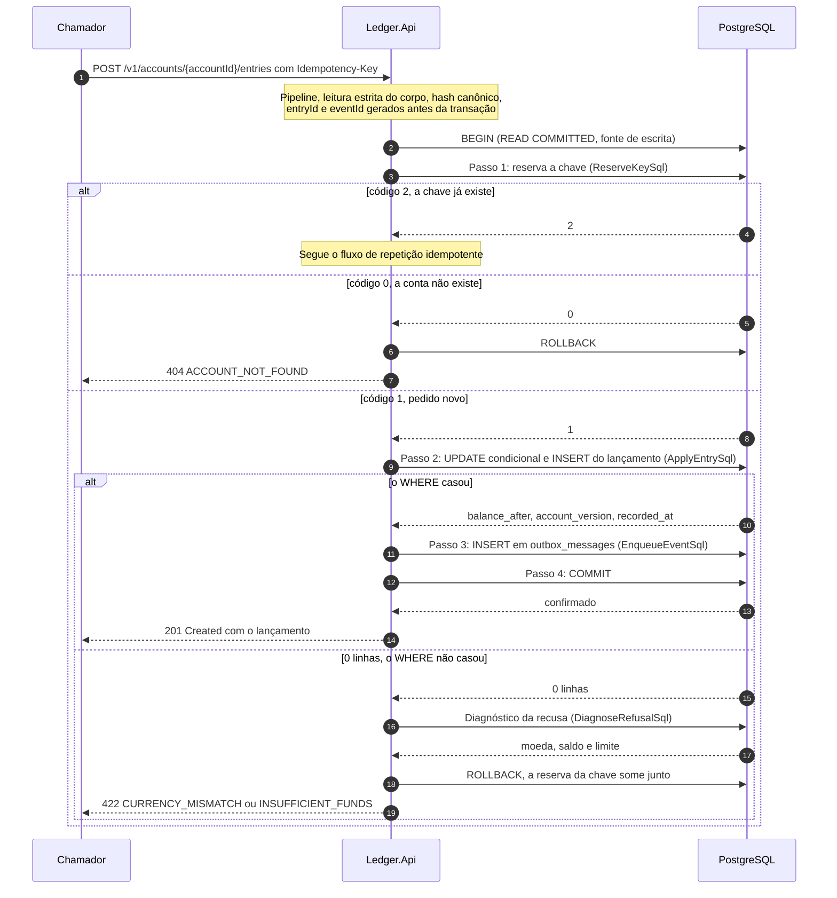

# Fluxo: registro de lançamento

Este é o caminho de escrita do ledger. Começa em `POST /v1/accounts/{accountId}/entries` e termina num único commit no PostgreSQL que grava a reserva da chave de idempotência, o saldo, o lançamento e o evento do outbox. O broker não participa: a publicação do evento é o fluxo de [publicação do outbox](publicacao-do-outbox.md). A repetição do pedido está em [repetição idempotente](repeticao-idempotente.md), o estorno em [estorno](estorno.md) e o formato do pedido e da resposta no [contrato da API](../05-contratos/api-rest.md).

Participam o chamador, a `Ledger.Api` e o PostgreSQL, com o `EntriesEndpoints`, o `RegisterEntryHandler`, o `EntryWriteFlow`, a `PostgresUnitOfWork` e os repositórios Postgres do [nível 3 da API](../04-modelos-c4/nivel-3-componentes-api.md). O fluxo parte de um token com `ledger.write`, de uma instância que passou na readiness e de um pedido com `Idempotency-Key` e um corpo com `type`, `amount` e `currency`. O caminho da requisição até o endpoint está em [ciclo de vida de uma requisição](ciclo-de-vida-da-requisicao.md).

## Sequência

A chave é reservada antes de qualquer toque no saldo, então um reenvio duplicado nunca chega à linha quente da conta. Saldo e lançamento nascem na mesma instrução, o evento entra na mesma transação antes do `COMMIT` e nenhuma chamada de rede além do PostgreSQL acontece no meio. Uma recusa termina em `ROLLBACK` e por isso não consome a chave.



## Passo a passo

1. **Chegada ao endpoint.** Depois do pipeline, o `EntriesEndpoints.RegisterAsync` lê o corpo (limite de 16 KiB), confere o tipo de conteúdo, valida o identificador da conta e lê corpo e cabeçalho com o `RegisterEntryRequestReader` e o `IdempotencyKeyReader`. A leitura é estrita (um único objeto JSON, propriedade desconhecida recusada, todos os problemas acumulados num 400 só), e o `occurredAt` é convertido para UTC aqui, com 400 `MISSING_TIME_ZONE` se vier sem fuso ([Contrato da API REST](../05-contratos/api-rest.md)). Nada disso abre transação: um pedido inválido nunca chega ao banco.

2. **Preparação no handler.** O `RegisterEntryHandler` abre a operação de telemetria (`ledger.record_entry`) e monta o `WriteContext`: gera o `entryId` e o `eventId` pelo `Uuid7IdGenerator` e calcula o hash canônico com `CanonicalRequestHash.ForRegistration`, incluindo o `client_id` do token ([Idempotência e hash canônico](../05-contratos/idempotencia-e-hash-canonico.md)). Como o contexto nasce fora da transação, todas as tentativas de uma requisição reservam o mesmo `entryId` e publicam o mesmo `eventId`.

3. **Abertura da transação.** A `PostgresUnitOfWork.ExecuteAsync` entrega a função inteira ao `WriteRetryPipeline`, e cada tentativa abre uma conexão do pool de escrita (`PostgresSource.Write`, papel `ledger_api`) e uma transação `READ COMMITTED`, nível pedido de forma explícita porque a correção do passo 2 depende dele.

4. **Passo 1: reservar a chave.** O `PostgresIdempotencyStore.TryReserveAsync` lê a conta e insere a reserva a partir dela, na mesma ida ao banco e sem consulta prévia de existência. O resultado é um código: 1 é pedido novo, 2 é chave já usada ([repetição idempotente](repeticao-idempotente.md)) e 0 é conta inexistente, que desfaz a transação e responde 404 `ACCOUNT_NOT_FOUND`. Como a inserção só acontece quando a conta existe, a chave estrangeira `fk_idempotency_keys_account_id` nunca é violada por quem erra o identificador, e o log do PostgreSQL não registra `ERROR`.

```sql
WITH account AS (
    SELECT id FROM accounts WHERE id = @account_id
),
reserved AS (
    INSERT INTO idempotency_keys (account_id, idempotency_key, request_hash, hash_version, entry_id)
    SELECT id, @idempotency_key, @request_hash, @hash_version, @entry_id
    FROM account
    ON CONFLICT (account_id, idempotency_key) DO NOTHING
    RETURNING 1
)
SELECT CASE
           WHEN NOT EXISTS (SELECT 1 FROM account) THEN 0
           WHEN EXISTS (SELECT 1 FROM reserved) THEN 1
           ELSE 2
       END;
```

5. **Montagem do lançamento.** O `Entry.Credit` ou o `Entry.Debit` do domínio cria o lançamento: exige valor positivo, apara a descrição, rejeita caractere de controle e limita descrição a 140 caracteres e referência a 100 ASCII visíveis. A API já validou esses limites, e o domínio os repete por defesa.

6. **Passo 2: aplicar o saldo e gravar o lançamento.** O `PostgresEntryRepository.TryApplyAsync` executa uma única instrução com duas expressões de tabela comum. A primeira, `applied`, é o `UPDATE` condicional de `account_balances`: soma o `@delta` (positivo no crédito, negativo no débito), incrementa `version`, grava `last_entry_id` e calcula `last_recorded_at` como o maior entre `clock_timestamp()` e o valor anterior mais um microssegundo. O `WHERE` exige que a moeda da conta seja a do pedido e que o novo saldo não fique abaixo de menos o limite de cheque especial. A segunda, `inserted`, grava em `ledger_entries` com o `balance_after`, o `account_version` e o `recorded_at` que o `UPDATE` acabou de devolver, e o `occurred_at` recebe o `recorded_at` quando o chamador não informou data. A resposta ao chamador sai desta linha, sem releitura.

```sql
WITH applied AS (
    UPDATE account_balances AS ab
    SET balance = ab.balance + @delta,
        version = ab.version + 1,
        last_entry_id = @entry_id,
        last_recorded_at = GREATEST(clock_timestamp(), ab.last_recorded_at + INTERVAL '1 microsecond')
    FROM accounts AS a
    WHERE ab.account_id = @account_id
      AND a.id = ab.account_id
      AND a.currency = @currency
      AND ab.balance + @delta >= -ab.overdraft_limit
    RETURNING ab.balance AS balance_after,
              ab.version AS account_version,
              ab.last_recorded_at AS recorded_at,
              ab.last_recorded_at > clock_timestamp() AS recorded_at_corrected
),
inserted AS (
    INSERT INTO ledger_entries (id, account_id, account_version, type, amount, currency, balance_after,
                                recorded_at, occurred_at, description, reference, reverses_entry_id,
                                client_id, correlation_id)
    SELECT @entry_id, @account_id, applied.account_version, @type, @amount, @currency, applied.balance_after,
           applied.recorded_at, COALESCE(@occurred_at, applied.recorded_at), @description, @reference,
           @reverses_entry_id, @client_id, @correlation_id
    FROM applied
    RETURNING id, account_id, account_version, type, amount, currency, balance_after,
              recorded_at, occurred_at, description, reference, reverses_entry_id
)
SELECT inserted.id, inserted.account_id, inserted.account_version, inserted.type, inserted.amount,
       inserted.currency, inserted.balance_after, inserted.recorded_at, inserted.occurred_at,
       inserted.description, inserted.reference, inserted.reverses_entry_id,
       applied.recorded_at_corrected
FROM inserted
CROSS JOIN applied;
```

7. **Caminho de recusa.** Se a instrução devolve zero linhas, o `EntryWriteFlow` lê a situação da conta com o `PostgresAccountRepository.GetForDiagnosisAsync` e a classifica com `AccountBalance.Apply`: conta ausente (404), moeda diferente (422 `CURRENCY_MISMATCH`) ou saldo insuficiente (422 `INSUFFICIENT_FUNDS`), sem revelar o saldo. Há uma corrida pequena entre o `UPDATE` e o diagnóstico, porque um crédito pode ter entrado nesse intervalo: se o diagnóstico mostra que o débito agora cabe, o fluxo repete o passo 2 uma única vez, e só responde `INSUFFICIENT_FUNDS` se a segunda tentativa também não casar. O resultado de falha faz a unidade de trabalho desfazer a transação, o que remove a reserva da chave.

```sql
SELECT a.currency, ab.balance, ab.overdraft_limit
FROM accounts AS a
JOIN account_balances AS ab ON ab.account_id = a.id
WHERE a.id = @account_id;
```

8. **Passo 3: registrar o evento.** O `EntryRegisteredPayload.Serialize` monta o `EntryRegistered` em memória, com os campos devolvidos pelo passo 2, e o `PostgresOutbox.EnqueueAsync` o grava como `jsonb` em `outbox_messages`, com o `correlation_id` e o `traceparent` da requisição ([Contrato de eventos](../05-contratos/eventos.md)).

```sql
INSERT INTO outbox_messages (id, account_id, type, payload, correlation_id, traceparent)
VALUES (@event_id, @account_id, @type, @payload, @correlation_id, @traceparent);
```

9. **Passo 4: commit.** A unidade de trabalho confirma a transação, e o commit só devolve depois de o WAL ser gravado, com `synchronous_commit` ligado. A chave estrangeira `fk_idempotency_keys_entry_id` é adiada até esse momento e faz o commit falhar se alguma transação reservou a chave sem gravar o lançamento.

10. **Resposta.** O `EntryReporting` registra a métrica e o log do resultado, e o `WriteResults.CreatedEntry` responde `201 Created` com `Cache-Control: no-store`, `Location` para `/v1/accounts/{accountId}/entries` e o corpo do lançamento, sem releitura do banco.

## Quando algo falha

| Passo | Falha | Efeito | O que o chamador percebe |
|---|---|---|---|
| Validação | Corpo, tipo de conteúdo, tamanho ou cabeçalho inválidos | Nenhuma transação aberta | 400 `VALIDATION_FAILED` ou `IDEMPOTENCY_KEY_REQUIRED`, 413 ou 415 |
| 1 | Conta inexistente (código 0) | Transação desfeita, sem erro no banco | 404 `ACCOUNT_NOT_FOUND` |
| 1 | Chave já existente | Transação desfeita, nada gravado | Repetição (201 com `Idempotent-Replayed: true`) ou 422 `IDEMPOTENCY_KEY_REUSED` |
| 2 | Moeda diferente da conta, ou saldo abaixo do piso | Transação desfeita, chave livre | 422 `CURRENCY_MISMATCH` ou `INSUFFICIENT_FUNDS`, sem o saldo |
| 2 | Espera do lock da conta além de `lock_timeout` (1 s, SQLSTATE 55P03) | Transação desfeita, sem nova tentativa, chave livre | 503 com `Retry-After: 1` |
| 2 ou 3 | Falha transitória de conexão ou deadlock | A função inteira roda de novo, até duas vezes, com recuo de 50 ms e variação aleatória | 201 se a nova tentativa passar, ou 503 depois de esgotá-las |
| 2 ou 3 | Restrição violada de forma que o desenho considera impossível (23xxx) | Transação desfeita, log 1008 | 500 `INTERNAL_ERROR`, sem detalhe interno |
| 4 | Conexão cai no `COMMIT` e o desfecho é desconhecido | Nova tentativa começa pelo passo 1, que revela se o commit anterior valeu | 201 com `Idempotent-Replayed: true` se valeu, 201 novo se não |
| Qualquer | Prazo de 3 s da requisição, ou espera de 1 s por conexão do pool | Trabalho cancelado, transação desfeita | 503 com `Retry-After: 1` |

Repetir o pedido com a mesma chave é sempre seguro: se a transação foi desfeita a chave está livre, e se o commit valeu a repetição devolve o lançamento gravado. O desfecho desconhecido do commit está em [falha do banco de dados](falha-do-banco.md), e os códigos de erro no [Catálogo de erros](../05-contratos/catalogo-de-erros.md).

## O que o fluxo garante

Chave, saldo, lançamento e evento confirmam juntos ou não existem. A corrida entre duas escritas na mesma conta se resolve no `UPDATE`, que lê, soma e confere o piso numa só instrução: quando duas transações disputam a linha de `account_balances`, a segunda espera o lock e, em `READ COMMITTED`, o PostgreSQL reavalia o `WHERE` contra a versão que a primeira confirmou. Em `REPEATABLE READ` ou `SERIALIZABLE` a mesma instrução falharia com 40001, e por isso o nível é explícito. O `balance_after` gravado é o que o `UPDATE` acabou de devolver, e como cada transação trava uma única linha de saldo o desenho não tem deadlock.

A versão de uma conta não tem lacuna. O incremento de `version` acontece com a linha travada e é desfeito junto com a transação, `uq_ledger_entries_account_id_account_version` impede a repetição e a [conferência de integridade](conferencia-de-integridade.md) procura o buraco. O `recorded_at` cresce estritamente por conta, porque o `GREATEST(clock_timestamp(), last_recorded_at + 1 µs)` não deixa o instante recuar nem se repetir, mesmo com o relógio do banco atrasado. Quando o valor guardado está à frente do relógio, a linha traz `recorded_at_corrected`, a API registra o evento 1005 e conta `ledger.recorded_at.corrections`.

Há uma linha de outbox por lançamento confirmado, e repetição, recusa e conflito de chave não escrevem evento. O papel `ledger_api` não tem `UPDATE` nem `DELETE` em `ledger_entries`, e um gatilho recusa qualquer alteração.

Dois números não foram medidos em escala. A premissa de até 50 lançamentos por segundo na mesma conta, com pool de escrita de 7 conexões por instância, conta com o limitador por conta (`RateLimiting:WritePerAccount`) para proteger o banco de uma conta quente, mas o efeito dessa carga sobre as outras contas da instância não foi medido. O p99 de até 150 ms na escrita (NFR-03) também não foi confirmado contra uma topologia próxima à de produção ([limites conhecidos](../09-qualidade/limites-conhecidos.md)).

Métricas e logs do fluxo (`ledger.entries.recorded`, `ledger.entries.rejected`, `ledger.entry.duration`, os eventos 1001 a 1008 e o 9002 nos 503) estão no [Catálogo de métricas](../08-resiliencia-e-operacao/catalogo-de-metricas.md) e em [Saúde e observabilidade](../08-resiliencia-e-operacao/saude-e-observabilidade.md). A chave de idempotência aparece nos logs só como impressão curta, os quatro primeiros bytes do SHA-256 em hexadecimal.

Os testes do fluxo: `RegisterEntryTests` e `EntryOutboxTests` cobrem o caminho feliz e a linha única de outbox, e `RejectedEntryTests` cobre a recusa que não consome a chave nem revela o saldo. `ParallelDebitsTests` dispara 100 débitos de R$ 10,00 contra R$ 500,00 e confere que exatamente 50 passam e o saldo termina em zero. O commit de desfecho desconhecido e as repetições aparecem em `EntryCommitUnknownTests`, `CommitCuttingProxyTests` e `PostgresUnitOfWorkRetryTests`, e a monotonicidade do `recorded_at`, em `RecordedAtMonotonicityTests`.
