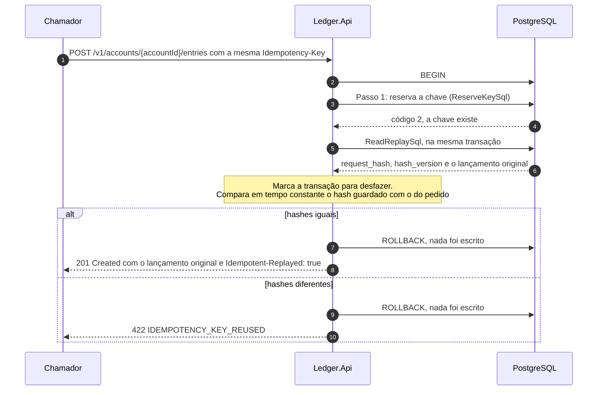
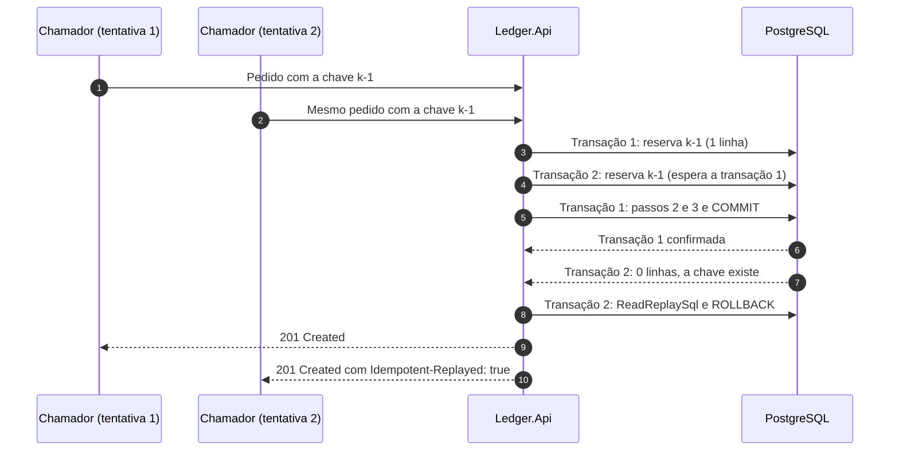

# Fluxo: repetição idempotente

Quem escreve no ledger repete pedidos: a resposta se perde, a conexão cai, o sistema de origem reprocessa um lote. O fluxo descreve o que a API faz quando o `INSERT` da reserva da chave, o passo 1 do [registro de lançamento](registro-de-lancamento.md), encontra uma chave que já existe. Quem decide é o banco, e a memória da API não entra: a mesma chave com o mesmo pedido devolve o lançamento original, sem efeito algum, e a mesma chave com outro pedido é recusada. O cálculo do hash que separa os dois casos está em [Idempotência e hash canônico](../05-contratos/idempotencia-e-hash-canonico.md), e o [estorno](estorno.md) usa o mesmo mecanismo.

Participam o chamador, a `Ledger.Api` e o PostgreSQL, e os componentes são o `EntryWriteFlow`, o `PostgresIdempotencyStore` e o `CanonicalRequestHash` ([nível 3 da API](../04-modelos-c4/nivel-3-componentes-api.md)). A chave é única por conta, por `pk_idempotency_keys` sobre `(account_id, idempotency_key)`, então a mesma chave em contas diferentes é independente, e fica no banco por 35 dias (`Idempotency:RetentionDays`).

## Sequência

Os dois desfechos de uma chave existente, repetição legítima e reuso indevido, terminam em `ROLLBACK`, porque nada foi escrito. A leitura do registro acontece antes do `ROLLBACK`, na mesma transação: em `READ COMMITTED` a linha confirmada da chave e o lançamento a que ela aponta já são visíveis, e não há segunda conexão. O lançamento original é imutável, então a resposta reconstruída é idêntica à primeira, inclusive o `balanceAfter` da época, e o fluxo não toca saldo, `ledger_entries` nem `outbox_messages`.



## Passo a passo

1. **Reserva sem sucesso.** O `PostgresIdempotencyStore.TryReserveAsync` devolve falso quando o `INSERT` da reserva não grava linha. O `INSERT ... ON CONFLICT DO NOTHING` que esbarra numa linha ainda não confirmada espera a outra transação terminar: se ela desfez, o insert passa como pedido novo, e se confirmou, cai neste fluxo.

2. **Leitura do registro.** O `EntryWriteFlow.ReplayAsync` chama `FindAsync`, que devolve o hash guardado, a versão do algoritmo e o lançamento original.

```sql
SELECT k.request_hash, k.hash_version,
       e.id, e.account_id, e.account_version, e.type, e.amount, e.currency, e.balance_after,
       e.recorded_at, e.occurred_at, e.description, e.reference, e.reverses_entry_id
FROM idempotency_keys AS k
JOIN ledger_entries AS e ON e.id = k.entry_id
WHERE k.account_id = @account_id
  AND k.idempotency_key = @idempotency_key;
```

3. **Marca para desfazer.** Havendo registro, o fluxo chama `scope.MarkForRollback()`: a unidade de trabalho devolve o resultado normalmente, mas desfaz a transação em vez de confirmá-la.

4. **Verificação da versão.** Um `hash_version` diferente do atual (`CanonicalRequestHash.CurrentVersion`, que vale 1) é defeito e lança exceção, que vira 500 `INTERNAL_ERROR`. Mudar a canonicalização exige uma versão nova, e a leitura recalcula o hash com a versão que a linha registra.

5. **Comparação.** O `CanonicalRequestHash.Matches` compara o hash guardado com o recalculado usando `CryptographicOperations.FixedTimeEquals`. O hash cobre operação, conta, `client_id`, tipo, valor, moeda, `occurredAt` em UTC, descrição aparada e referência, e não cobre a `Idempotency-Key`, que é a chave de busca. Os campos e as equivalências estão na [página do hash](../05-contratos/idempotencia-e-hash-canonico.md).

6. **Resposta.** Hashes iguais produzem `WrittenEntry(record.Entry, true, false)`, e o `WriteResults.CreatedEntry` responde 201 com `Idempotent-Replayed: true`, o `X-Correlation-Id` da nova chamada e o corpo do lançamento original. Hashes diferentes produzem `EntryErrors.IdempotencyKeyReused` e 422 `IDEMPOTENCY_KEY_REUSED`, que não informa o que mudou.

O `client_id` entra no hash para evitar um caso que o banco sozinho não distingue: dois sistemas usando a mesma chave na mesma conta com o mesmo corpo. Sem ele, o segundo receberia o lançamento do primeiro e acreditaria ter movido dinheiro que não moveu. Com ele, o encontro vira 422 ([documento de arquitetura 0023](../03-principios-e-decisoes/documento-arquitetura/0023-client-id-no-hash-do-pedido.md)).

## Recusa que não consome a chave

Uma recusa de regra de negócio (saldo insuficiente, moeda diferente, estorno que não cabe) termina em `ROLLBACK`, e o rollback leva embora a reserva da chave. Repetir o pedido depois de um crédito, com a mesma chave, o avalia de novo. Isso vale para registro e estorno e decorre de a reserva estar na mesma transação da recusa.

## Chave expirada

O Worker poda `idempotency_keys` depois de `Idempotency:RetentionDays` (35 dias), como descrevem as [rotinas de manutenção](rotinas-de-manutencao.md). Depois disso, um pedido com aquela chave é tratado como novo e cria outro lançamento, e o original continua intacto. `PostgresIdempotencyStoreTests` confere que uma chave de 34 dias ainda repete, e `IdempotencyKeyPruneTests` que a poda remove só as de mais de 35. Nenhum teste repete um pedido depois da poda: o comportamento decorre do mecanismo. Que o prazo máximo de reprocessamento dos chamadores caiba nos 35 dias é hipótese, porque os donos dos sistemas de Pix e de cartões não confirmaram esse prazo ([limites conhecidos](../09-qualidade/limites-conhecidos.md)).

## Concorrência na mesma chave

Quando duas requisições com a mesma chave chegam juntas, a segunda espera: o segundo `INSERT` bloqueia na linha da primeira, ainda não confirmada, e só prossegue quando ela termina. Se a primeira confirma, a segunda cai neste fluxo e devolve a repetição, sem esperar o lock da conta, porque nunca o pegou. Se a primeira desfaz, por exemplo por saldo insuficiente, a segunda segue como pedido novo. Quem decide quem é o primeiro é o índice único do banco, sem estado na memória da API nem afinidade entre instâncias.



## O que falha

| Passo | Falha | Efeito | O que o chamador percebe |
|---|---|---|---|
| 1 | Conta inexistente (código 0 da reserva) | Transação desfeita | 404 `ACCOUNT_NOT_FOUND` |
| 2 | Registro não encontrado depois de a reserva acusar conflito (a poda o levou entre os dois comandos) | O fluxo recomeça no passo 1, no máximo uma vez | Pedido novo, se a segunda tentativa reservar a chave |
| 2 | Registro não encontrado nas duas tentativas | Exceção, transação desfeita | 500 `INTERNAL_ERROR` |
| 4 | `hash_version` desconhecido | Exceção, transação desfeita | 500 `INTERNAL_ERROR` |
| 5 | Hash diferente | Transação desfeita, nada gravado | 422 `IDEMPOTENCY_KEY_REUSED` |
| Qualquer | Banco indisponível ou prazo estourado | Transação desfeita | 503 com `Retry-After`. Repetir é seguro |
| Qualquer | O commit original tinha confirmado e a nova tentativa interna o encontra | O passo 1 mostra a chave existente | 201 com `Idempotent-Replayed: true` |

O último caso é o desfecho desconhecido do commit: a conexão cai no `COMMIT`, a unidade de trabalho repete a função inteira e o passo 1 revela que a tentativa anterior valeu ([falha do banco de dados](falha-do-banco.md)).

## O que o fluxo garante

No máximo um lançamento por chave e conta, inclusive sob concorrência, porque `pk_idempotency_keys` decide quem é o primeiro. A repetição não escreve nada, nem lançamento, nem saldo, nem outbox, e responde com o lançamento original, que é imutável: só o `Idempotent-Replayed` e o `X-Correlation-Id` mudam.

O 422 não diz qual campo difere, o texto livre não aparece em log e o hash é comparado em tempo constante. A repetição conta em `idempotency.replays` e gera o log 1002. O reuso recusado conta em `idempotency.conflicts` e gera o 1003 (`Warning`), que indica erro do chamador.

Os testes do fluxo: `IdempotentReplayTests`, `RegisterEntryReplayTests` e `PostgresIdempotencyStoreTests` cobrem a repetição e a leitura do registro, e `SameIdempotencyKeyHttpTests` faz 40 chamadas com a mesma chave e confere que só um lançamento nasce. A poda tem `IdempotencyKeyPruneTests`, e o commit de desfecho desconhecido, `EntryCommitUnknownTests`.
