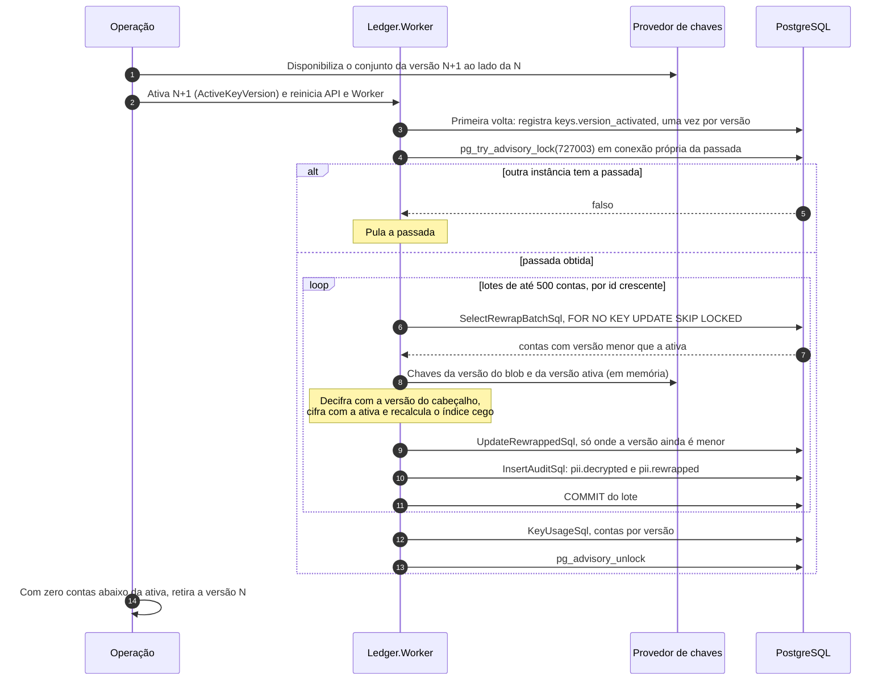

# Fluxo: rotação das chaves de dados pessoais

O documento do titular é guardado cifrado, com a versão do conjunto de chaves registrada no próprio blob. Trocar as chaves não pode exigir parada do ledger nem reescrita manual de milhões de contas. O fluxo descreve como uma versão nova entra em uso, como o `Ledger.Worker` recifra os documentos antigos em lotes com a escrita de lançamentos correndo ao lado e como se sabe que a versão antiga já pode ser retirada. O formato do blob, o índice cego e a custódia das chaves estão em [Proteção de dados](../07-consistencia-e-seguranca/protecao-de-dados.md), e a criação de conta, que produz o primeiro blob, em [criação de conta](criacao-de-conta.md).

O objetivo é levar todas as contas da versão N para a N+1, mantendo o documento legível e o índice cego correto em todos os instantes. Participam quem opera as chaves, o provedor, o `Ledger.Worker` (`KeyRewrapService`, `RewrapAccountsHandler`, `HolderDocumentProtector`, `PostgresAccountKeyRewrapper`, no [nível 3](../04-modelos-c4/nivel-3-componentes-worker.md)) e o PostgreSQL. A API só lê as chaves, na criação de conta. O provedor lê um conjunto por versão, uma pasta por número com `encryption.key` e `blind-index.key`, cada um com 32 bytes em base64 e diferentes entre si (`Security:Pii:Provider` igual a `Directory` e `Security:Pii:Directory` apontando a pasta). Em Development e Testing pode ser a configuração direta (`Security:Pii:KeySets`). API e Worker precisam enxergar as mesmas versões, a ativa vem de `Security:Pii:ActiveKeyVersion` e o papel `ledger_worker` atualiza só as três colunas do documento em `accounts`.

## Sequência

Cada lote é uma transação própria, e a passada inteira roda sob uma trava consultiva. Ativar uma versão é decisão de quem opera as chaves e só vale depois de reiniciar, porque a versão ativa é lida na subida. A recifragem anda por `id` crescente e termina quando um lote volta vazio, e a escrita de lançamentos não espera por nada deste fluxo.



1. **Disponibilizar a versão N+1.** Quem opera as chaves gera o conjunto novo e o coloca ao lado do N, sem torná-lo ativo. O `ReloadingKeyProvider` recarrega a pasta a cada `Security:Pii:ReloadMinutes`. Uma versão já carregada que volta com outro material é rejeitada (a anterior continua valendo, o log 7005 registra o motivo e `ledger.key.reloads` conta a falha), e uma versão que some da pasta é registrada como desaparecida (log 7009) e deixa a readiness da API `Degraded`. Chave malformada, de tamanho errado ou igual à outra do mesmo conjunto impede a subida do processo.

2. **Tornar N+1 a versão ativa.** O operador troca `Security:Pii:ActiveKeyVersion` para N+1 e reinicia API e Worker. Contas novas passam a ser cifradas com a N+1, e as antigas continuam legíveis, porque a N segue viva e o cabeçalho do blob diz com que versão cada documento foi cifrado.

3. **Registrar a ativação.** Na primeira volta do `KeyRewrapService` depois da subida, o `RecordKeyActivationHandler` procura na trilha um `keys.version_activated` com aquela versão e, se não houver, grava um com um identificador de passada. Um reinício com a versão já registrada não grava de novo.

4. **Obter a passada.** A cada `Security:Pii:Rewrap:IdleSeconds`, o `RewrapAccountsHandler` pede ao `PostgresAccountKeyRewrapper` uma conexão exclusiva e executa `pg_try_advisory_lock(727003)`. Com a trava na mão de outra instância a passada é pulada. A trava fica na conexão durante toda a passada, e a queda da conexão a libera no servidor.

5. **Selecionar o lote.** Cada lote é uma transação na fonte `Worker`: até `Security:Pii:Rewrap:BatchSize` contas com versão do documento menor que a ativa e `id` maior que o último processado, em ordem de `id`, travadas com `FOR NO KEY UPDATE SKIP LOCKED`. O `FOR NO KEY UPDATE` mantém a escrita de lançamentos livre, porque não conflita com o `FOR KEY SHARE` que a chave estrangeira de uma inserção em `idempotency_keys` toma sobre a conta, e `SKIP LOCKED` evita que duas passadas esperem pela mesma linha.

```sql
SELECT id, holder_document_encrypted, holder_document_key_version
FROM accounts
WHERE holder_document_key_version < @active_version
  AND id > @after_id
ORDER BY id
LIMIT @batch_size
FOR NO KEY UPDATE SKIP LOCKED;
```

6. **Recifrar cada documento.** O `HolderDocumentProtector.Reprotect` lê a versão no cabeçalho do blob, decifra com o conjunto daquela versão (com o `accountId` como dado associado) e cifra de novo com o conjunto ativo, recalculando o índice cego com a chave de índice ativa. O texto em claro vive só na memória do passo e é zerado em seguida. Uma linha que não decifra, por blob adulterado ou versão de chave perdida, conta como falha, fica intocada e gera o log 7007 (`Error`) com o identificador da conta e nada mais, e a passada segue com as demais.

7. **Gravar o lote.** Uma única instrução atualiza as linhas recifradas, por `unnest` de vetores, e a condição `a.holder_document_key_version < v.key_version` impede reescrever uma linha que já está na versão de destino.

```sql
UPDATE accounts AS a
SET holder_document_encrypted = v.encrypted,
    holder_document_blind_index = v.blind_index,
    holder_document_key_version = v.key_version
FROM unnest(@ids::uuid[], @encrypted::bytea[], @blind_indexes::bytea[], @key_versions::integer[])
     AS v(id, encrypted, blind_index, key_version)
WHERE a.id = v.id
  AND a.holder_document_key_version < v.key_version;
```

8. **Auditar o lote.** Na mesma transação, o `PostgresScopedAuditTrail` grava `pii.decrypted` (finalidade `rewrap` e número de contas), quando houve conta recifrada, e `pii.rewrapped` (versão de origem, que é a menor do lote, versão de destino, contas recifradas e falhas), com o identificador da passada como correlação e o `client_id` do Worker. Se algo falhar antes do commit, atualizações e auditoria somem juntas, e o lote é refeito na volta seguinte.

9. **Avançar.** O ponto de partida do próximo lote passa a ser o maior `id` selecionado, inclusive quando houve falha, para uma linha com defeito não fazer a passada rodar para sempre. Quando um lote volta vazio, a passada termina.

10. **Observar o uso das chaves.** Ao fim, o handler executa a consulta de uso e compara com as versões vivas do provedor.

```sql
SELECT holder_document_key_version, count(*)
FROM accounts
WHERE holder_document_key_version IS NOT NULL
GROUP BY holder_document_key_version;
```

Contas com versão acima da ativa (outra instância está à frente, ou esta ficou para trás) geram o log 7010, e contas com versão que o processo não lê geram o 7011. O resultado alimenta o medidor `ledger.pii.accounts.below_active_key` e a verificação `key-usage` da readiness do Worker, que fica `Degraded` nos dois casos. A passada convergiu quando não recifrou nada, não teve falha e não achou conta abaixo da ativa nem anomalia.

11. **Retirar a versão antiga.** A versão N só pode sair da pasta de chaves quando três condições valem juntas: o medidor de contas abaixo da ativa está em zero e uma passada convergiu; todas as instâncias da API já rodam com a N+1; e passaram 35 dias da última conta criada com uma chave de idempotência sob a N, porque antes disso a repetição de uma criação ainda dentro do prazo receberia 422 em vez da conta original. A retirada é manual, de quem opera as chaves. [Proteção de dados](../07-consistencia-e-seguranca/protecao-de-dados.md) explica cada condição e o prazo de custódia do conjunto antigo, que precisa cobrir os backups com blobs cifrados por ele.

## O índice cego durante a janela

A recifragem recalcula o índice cego, porque o conjunto da versão troca as duas chaves juntas. Enquanto a passada não termina há contas das duas versões, cada uma com o índice da sua, e por isso o `HolderDocumentProtector.BlindIndexCandidates` devolve um índice por versão viva. A única leitura que o código faz do índice cego é a comparação da repetição da criação de conta, que testa o hash do pedido contra o índice de cada versão viva e continua válida depois da rotação (`CreateAccountIdempotencyTests`). O índice é mantido para uma busca por documento que a API não expõe.

## O que falha

| Passo | Falha | Efeito | O que se observa |
|---|---|---|---|
| 1 | Chave malformada ou conjunto sem a versão ativa | O processo não sobe | Log 7005, saída de erro de configuração |
| 1 | Recarga com material alterado, ou pasta ilegível depois da primeira leitura | A versão ou o conjunto em memória continuam valendo | Logs 7005 ou 7003, `ledger.key.reloads` com `result` igual a `failed`. A readiness da API segue `Healthy` |
| 1 | Pasta de chaves ilegível na subida | O processo sobe sem chaves | Criação de conta responde 503, readiness `Degraded` na verificação `keys` ([criação de conta](criacao-de-conta.md)) |
| 4 | Outra instância com a passada | Passada pulada | Nada a registrar |
| 5 a 8 | Banco fora ou falha antes do commit | O lote inteiro é desfeito, com a auditoria | Falha de volta do laço, log 3008, nova tentativa na próxima volta |
| 6 | Blob adulterado ou versão de chave perdida | A linha fica intocada e conta como falha | Log 7007 com a conta, `ledger.rewrap.accounts` com `result` igual a `failed`, passada sem convergência |
| 6 | Provedor de chaves indisponível | A exceção interrompe a volta | Falha de volta do laço, nova tentativa depois |
| 10 | Conta com versão acima da ativa ou que o processo não lê | Passada sem convergência | Logs 7010 ou 7011, `key-usage` `Degraded` |

## O que o fluxo garante

A escrita não para: um lote aberto não faz uma escrita esperar nem estourar o `lock_timeout`, porque o `FOR NO KEY UPDATE` não bloqueia a inserção de lançamento nem o `UPDATE` do saldo. Cada conta é recifrada uma vez, e as três colunas do documento e as duas linhas de auditoria confirmam juntas ou nenhuma. `ck_accounts_holder_document_key_version_matches_payload` impede gravar uma versão que não coincide com o cabeçalho do blob. O texto em claro existe só dentro do passo de recifragem e não vai para log, métrica, span nem trilha. A convergência se vê no medidor de contas abaixo da ativa e na verificação `key-usage`, e cada versão ativada, cada lote decifrado e cada lote recifrado ficam na [trilha de auditoria](../07-consistencia-e-seguranca/trilha-de-auditoria.md).

Não existe adaptador para um cofre de chaves externo: custódia, geração e rotação na pasta são procedimento de implantação, e os testes cobrem a recifragem, a recarga e a degradação com o provedor falhando, mas não um cofre de verdade ([limites conhecidos](../09-qualidade/limites-conhecidos.md)).

Os testes do fluxo são `PostgresAccountKeyRewrapperTests` (seleção por versão, ausência de dupla recifragem, auditoria no mesmo commit, desfazer completo e lote que não bloqueia a escrita), `RewrapConvergenceTests` (convergência, blob adulterado, versão perdida e dois Workers ao mesmo tempo), `KeyActivationAuditTests`, `RewrapAccountsHandlerTests`, `HolderDocumentProtectorTests`, `ReloadingKeyProviderTests`, `CreateAccountIdempotencyTests` e `DocumentPayloadFormatTests` (o formato do blob, com vetores congelados). Métricas e logs 7003 a 7011 estão em [Saúde e observabilidade](../08-resiliencia-e-operacao/saude-e-observabilidade.md) e no [Catálogo de métricas](../08-resiliencia-e-operacao/catalogo-de-metricas.md).
