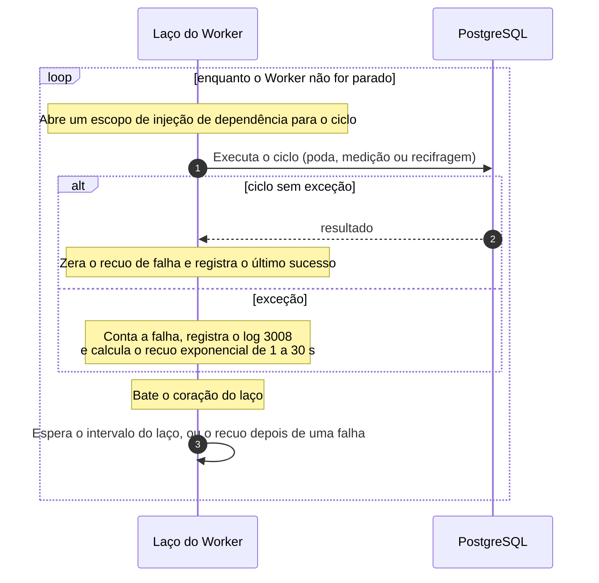

# Fluxo: rotinas de manutenção do Worker

Além de publicar o outbox e conferir a integridade, o `Ledger.Worker` mantém o banco enxuto e mede o que acumula: poda as mensagens já publicadas (a cada 10 minutos, as de mais de 7 dias), poda as chaves de idempotência (a cada 10 minutos, as de mais de 35), mede o acúmulo do outbox (a cada 10 segundos) e recifra documentos de versões antigas (a cada 60 segundos). A publicação está em [publicação do outbox](publicacao-do-outbox.md), a recifragem em [rotação das chaves](rotacao-de-chaves.md) e a conferência em [conferência de integridade](conferencia-de-integridade.md).

As rotinas removem só o que já cumpriu o seu papel, mantêm medidas frescas do acúmulo e dão ao orquestrador e ao plantão sinais confiáveis de que cada laço continua girando. Os componentes são o `WorkerLoopService` (a base dos laços), o `OutboxPruneService`, o `IdempotencyPruneService`, o `OutboxMeasurementService`, o `KeyRewrapService`, o `WorkerHeartbeat` e as verificações de saúde ([nível 3 do Worker](../04-modelos-c4/nivel-3-componentes-worker.md)). O papel `ledger_worker` apaga linhas de `outbox_messages` e, em `idempotency_keys` e `account_creation_keys`, lê só as colunas de chave e de data e apaga linhas, sem permissão de escrita em `ledger_entries`. Os parâmetros ficam em `Outbox`, `Idempotency` e `Worker` na [configuração](../05-contratos/configuracao.md).

## O ciclo comum

O ciclo é igual para os serviços de manutenção, e só muda a chamada do meio. O batimento acontece depois de todo ciclo, com sucesso ou com falha, então um laço que falha em sequência continua registrando o batimento, e quem o denuncia é o contador de falhas. Depois de uma exceção a espera usa o recuo da falha, e não o intervalo normal, e a parada do Worker cancela a espera e termina o laço sem registrar falha.



1. **Ciclo (`WorkerLoopService`).** Cada laço roda `CycleAsync` num escopo novo de injeção de dependência, de modo que nenhum estado de repositório atravessa ciclos. Com sucesso, o recuo de falha é zerado e o `WorkerLoopTelemetry` guarda o instante do último sucesso. Com exceção (menos o cancelamento por parada), o laço registra o log 3008 `WorkerLoopFailed` com o nome do laço, o tipo da exceção e o próximo atraso, conta `ledger.worker.loop.failures` e espera um recuo exponencial de `Worker:FailureBackoff:MinSeconds` a `MaxSeconds`, com 20% de variação. O batimento (`WorkerHeartbeat.Beat`) vem em seguida, nos dois casos.

2. **Poda do outbox.** O `PruneOutboxHandler` repete o `PostgresOutboxQueue.PruneAsync` enquanto o lote apagado tiver o tamanho cheio de `Outbox:PruneBatchSize`. A instrução apaga, do mais antigo para o mais novo, as mensagens com `published_at` anterior ao corte (`Outbox:RetentionDays`, arredondado para dias inteiros), travando as linhas com `FOR UPDATE SKIP LOCKED`. Mensagem pendente nunca é apagada, por mais antiga que seja. O handler conta `outbox.pruned` e registra o log 3004.

```sql
DELETE FROM outbox_messages
WHERE id IN (
    SELECT id FROM outbox_messages
    WHERE published_at < clock_timestamp() - make_interval(days => @retention_days)
    ORDER BY published_at
    LIMIT @batch_size
    FOR UPDATE SKIP LOCKED
);
```

3. **Poda das chaves de idempotência.** O `PruneIdempotencyKeysHandler` repete o `PostgresIdempotencyKeyPruner.PruneAsync` enquanto o total apagado tiver o tamanho do lote (`Idempotency:PruneBatchSize`). Cada chamada executa duas instruções, uma para `idempotency_keys` e outra para `account_creation_keys`, com o corte de 35 dias sobre `created_at` e apoio nos índices `ix_idempotency_keys_created_at` e `ix_account_creation_keys_created_at`. Apagar uma chave não toca o lançamento nem a conta que ela guardava, e o laço não emite métrica nem log próprios: a falha dele aparece como falha de laço.

```sql
DELETE FROM idempotency_keys AS k
USING (
    SELECT account_id, idempotency_key
    FROM idempotency_keys
    WHERE created_at < clock_timestamp() - make_interval(days => @retention_days)
    ORDER BY created_at
    LIMIT @batch_size
) AS expired
WHERE k.account_id = expired.account_id
  AND k.idempotency_key = expired.idempotency_key;
```

```sql
DELETE FROM account_creation_keys AS k
USING (
    SELECT client_id, idempotency_key
    FROM account_creation_keys
    WHERE created_at < clock_timestamp() - make_interval(days => @retention_days)
    ORDER BY created_at
    LIMIT @batch_size
) AS expired
WHERE k.client_id = expired.client_id
  AND k.idempotency_key = expired.idempotency_key;
```

4. **Medição do acúmulo.** O `MeasureOutboxHandler` conta as mensagens pendentes até o teto de `Outbox:PendingCap`, mede a idade da mais antiga e conta, entre as `Outbox:FailedHeadWindow` pendentes mais antigas, as que já têm `Outbox:FailedAttempts` tentativas ou mais. Olhar só a cabeça da fila evita varrer a tabela, e a idade vira zero quando não há pendente.

```sql
SELECT (SELECT count(*)
        FROM (SELECT 1 FROM outbox_messages WHERE published_at IS NULL LIMIT @pending_cap) AS pending) AS pending,
       (SELECT EXTRACT(EPOCH FROM clock_timestamp() - min(created_at))::double precision
        FROM outbox_messages WHERE published_at IS NULL) AS oldest_age_seconds,
       (SELECT count(*)
        FROM (SELECT attempts FROM outbox_messages WHERE published_at IS NULL ORDER BY created_at LIMIT @head_window) AS head
        WHERE head.attempts >= @failed_attempts) AS failed;
```

5. **O retrato da medição.** O `OutboxStatsHolder` guarda a última medição com o seu instante, e os medidores `outbox.pending.messages`, `outbox.oldest_pending.age` e `outbox.failed.messages` só são emitidos enquanto o retrato tem no máximo três intervalos de idade (30 segundos): um valor velho some, em vez de parecer saudável. A verificação `outbox-lag` da readiness do Worker é `Healthy` nos primeiros 60 segundos depois da subida, mesmo sem medição, e `Degraded` passado esse prazo sem medição, com a última velha demais ou com a mensagem pendente mais antiga acima de `Resilience:Health:OutboxLagSeconds`.

6. **Batimento e vida.** O `WorkerHeartbeat` guarda o instante da última volta de cada laço, começando na hora da subida para o Worker recém-iniciado não nascer doente. O `GET /health/live` olha só os batimentos do `outbox` (120 segundos, `Resilience:Health:OutboxHeartbeatSeconds`) e dos dois laços de integridade (30 minutos, `IntegrityHeartbeatMinutes`): os laços de manutenção nunca tornam o processo não saudável por silêncio, porque reiniciar o Worker não cura um banco fora do ar. Um laço auxiliar parado aparece em `worker.last_cycle.timestamp` e `ledger.worker.loop.last_success.timestamp`, e um que falha sem parar, em `ledger.worker.loop.failures`.

## O que falha

| Passo | Falha | Efeito | O que se observa |
|---|---|---|---|
| 1 | Qualquer exceção do ciclo | O ciclo é desfeito, o laço espera o recuo de 1 a 30 s e tenta de novo | Log 3008, `ledger.worker.loop.failures` com o `loop`. O `live` continua 200 |
| 2 e 3 | Banco fora ou lock | A poda não acontece naquele ciclo | As linhas publicadas e as chaves além dos 35 dias ficam até o laço voltar, e a poda recupera em lotes. O ledger não é afetado |
| 4 | Medição falha em todo ciclo | Nenhum retrato novo | Os três medidores somem depois de 30 s, `outbox-lag` fica `Degraded` depois do primeiro minuto e as falhas são contadas |
| 6 | Laço de manutenção parado em silêncio | Nenhum | `worker.last_cycle.timestamp` do laço deixa de avançar. O processo não é reiniciado por isso |

## O que o fluxo garante

Só se apaga o que cumpriu o papel: uma mensagem só depois de publicada e de passados os 7 dias, uma chave só depois dos 35. A poda de mensagens publicadas não fere a imutabilidade, porque o outbox é fila de integração e não registro contábil, e o `ledger_worker` não apaga lançamentos nem linhas do `audit_log`, que gatilhos protegem de qualquer jeito. `FOR UPDATE SKIP LOCKED` deixa duas instâncias podarem juntas sem esperar pelas mesmas linhas, e a poda é incremental, em lotes repetidos até esvaziar. A medição é barata, porque o teto de contagem e a janela da cabeça da fila impedem que varra a tabela. Um laço que falha não derruba o Worker, e o recuo com variação evita que todos reajam em sincronia.

Que os sistemas chamadores reprocessem dentro dos 35 dias é premissa que os donos dos sistemas de Pix e de cartões não confirmaram, e uma chave podada deixa de proteger o reenvio ([limites conhecidos](../09-qualidade/limites-conhecidos.md)). A readiness, a verificação de vida e as métricas estão em [Saúde e observabilidade](../08-resiliencia-e-operacao/saude-e-observabilidade.md) e no [Catálogo de métricas](../08-resiliencia-e-operacao/catalogo-de-metricas.md).

Os testes do fluxo são `OutboxPruneTests`, `PostgresOutboxQueueTests`, `IdempotencyKeyPruneTests`, `AccountCreationKeyPruneTests`, `BrokerAndLagHealthCheckTests`, `WorkerLoopFailureTests`, `WorkerHeartbeatTests` e `ExponentialBackoffTests`. O SQL da poda do outbox é o da constante do código.
