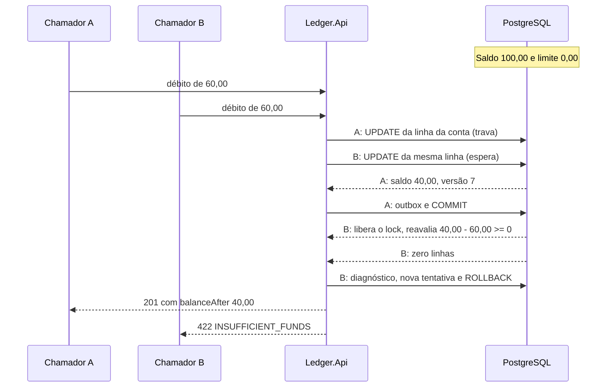

# Modelo de consistência

O ledger tem duas zonas. Saldo, lançamentos, extrato e idempotência são fortemente consistentes: o que o banco confirma é o que toda leitura seguinte enxerga, e a decisão de aceitar ou recusar um débito é do PostgreSQL. Os eventos no RabbitMQ são eventualmente consistentes: chegam ao menos uma vez, sem ordem garantida e com algum atraso. Esta página numera as invariantes (INV-01 a INV-14), diz o que impõe cada uma e qual teste a cobre, explica por que `READ COMMITTED` basta e registra o que o modelo não cobre. O SQL e os passos de cada operação estão nas [páginas de fluxo](../06-fluxos/README.md), e as rotas, em [Contrato da API REST](../05-contratos/api-rest.md).

## Onde a consistência é forte e onde é eventual

| Dado | Garantia | O que a sustenta |
|---|---|---|
| Saldo atual (`account_balances`) | Forte: o estado confirmado mais recente da conta | `UPDATE` condicional sobre a linha da conta |
| Lançamentos e extrato | Forte: qualquer leitura vê as versões da conta de 1 até algum k, sem lacuna | Versão sem lacuna e commit na ordem da versão |
| Saldo em um instante | Forte e repetível fora da janela de acomodação | `recorded_at` monótono e índice por conta |
| Idempotência | Forte, por conta e chave | Chave primária `(account_id, idempotency_key)` e `ON CONFLICT` |
| Eventos no broker | Eventual: ao menos uma vez, sem ordem | Outbox gravado na transação e deduplicação no consumidor |

Quem escreve vê o que escreveu: a resposta de um lançamento já traz `balanceAfter`, e as leituras seguintes usam o mesmo primário, porque as três fontes de dados da API (`Write`, `Balance` e `Statement`) apontam para o mesmo `Postgres:Host`. Não há réplica de leitura.

## Invariantes

Os testes ficam em `tests/Ledger.Api.IntegrationTests`, salvo quando o projeto vem entre parênteses.

| ID | Invariante | Como é imposta | Testes |
|---|---|---|---|
| INV-01 | `ledger_entries` e `audit_log` só recebem inserção, sem `UPDATE`, `DELETE` ou `TRUNCATE` | Três camadas: nenhum SQL de produção altera as tabelas, os papéis da aplicação não têm o privilégio e gatilhos barram quem entrar com um papel mais forte | `LedgerEntriesAreNeverMutatedTests` (Architecture.Tests), `MigrationTests`, `RolePrivilegesTests`, `SecurityPrivilegesTests`, `AuditImmutabilityTests` |
| INV-02 | O `balance` de uma conta é a soma dos créditos menos a soma dos débitos | Um único `UPDATE` soma o delta sobre o valor confirmado, e a API só atualiza `balance`, `version`, `last_entry_id` e `last_recorded_at` | `ParallelEntriesPreserveSumTests`, `ManyAccountsTests`, `InvariantVerifierTests` |
| INV-03 | A cadeia fecha: o `balance_after` de cada lançamento é o do anterior mais ou menos o valor, e o primeiro parte de zero | O `balance_after` vem do `RETURNING` da mesma instrução que grava o saldo | `StatementMatchesBalanceTests`, `InvariantVerifierTests`, `AsOfMatchesChainTests` |
| INV-04 | O saldo nunca fica abaixo de `-overdraft_limit` | `balance + delta >= -overdraft_limit` no `WHERE` do `UPDATE`, a restrição `ck_account_balances_balance_floor` e `AccountBalance` no domínio | `ParallelDebitsTests`, `AccountBalanceTests` (Domain.Tests) |
| INV-05 | `account_version` vai de 1 a N, sem repetição nem lacuna, e `account_balances.version` vale N | `version + 1` dentro do `UPDATE`, com a linha travada, e `uq_ledger_entries_account_id_account_version` | `ParallelEntriesPreserveSumTests`, `InvariantVerifierTests` |
| INV-06 | Dentro da conta, `recorded_at` cresce estritamente com `account_version` | `GREATEST(clock_timestamp(), last_recorded_at + 1 microssegundo)` no mesmo `UPDATE` | `RecordedAtMonotonicityTests`, `InvariantVerifierTests` |
| INV-07 | A linha de `account_balances` descreve o último lançamento: `balance`, `version` e `last_entry_id` | O mesmo `UPDATE` grava os campos que o lançamento repete | `InvariantVerifierTests`, `IntegrityDetectsTamperingTests` |
| INV-08 | Um lançamento é estornado no máximo uma vez, e estorno não se estorna | Índice único parcial `uq_ledger_entries_reverses_entry_id`, `ck_ledger_entries_not_self_reversal` e a regra `ReversalCandidate.Plan` | `ParallelReversalsTests`, `ParallelReversalsHttpTests`, `ReversalCandidateTests` (Domain.Tests), `SqlStateTranslationTests` |
| INV-09 | Lançamento e conta têm a mesma moeda | `a.currency = @currency` no `WHERE` do `UPDATE` | `RegisterEntryRefusalTests` (Application.Tests), `EntriesRulesE2ETests` (EndToEnd.Tests) |
| INV-10 | Reserva da chave, saldo, lançamento e evento do outbox existem juntos ou não existem | `PostgresUnitOfWork`: uma transação, commit só com resultado de sucesso, e chave estrangeira adiada `fk_idempotency_keys_entry_id` | `WriteFailureTests`, `CommitCuttingProxyTests`, `EntryCommitUnknownTests` |
| INV-11 | No máximo um lançamento por conta e chave, e a mesma chave com pedido diferente não grava nada | Chave primária `(account_id, idempotency_key)`, `ON CONFLICT DO NOTHING` e hash canônico com `client_id` | `SameIdempotencyKeyTests`, `SameIdempotencyKeyHttpTests`, `CanonicalRequestHashTests` (Application.Tests) |
| INV-12 | O saldo em T é o `balance_after` do último lançamento com `recorded_at <= T`, ou zero | Consulta `ReadBalanceAtSql` e o índice `ix_ledger_entries_account_id_recorded_at_account_version` | `AsOfMatchesChainTests`, `StableAsOfTests`, `QueryPlanTests`, `BalanceInstantE2ETests` (EndToEnd.Tests) |
| INV-13 | Extrato e saldo contam a mesma sequência: a soma do extrato de uma janela é a diferença entre dois saldos | Ordem `(recorded_at, account_version)` e limite superior único no `ReadStatementPageSql` | `StatementMatchesBalanceTests`, `StatementPaginationTests`, `StatementDuringWritesTests` |
| INV-14 | Todo lançamento confirmado tem exatamente um evento no outbox, e o `accountVersion` do evento não tem lacuna por conta | `EnqueueEventSql` dentro da transação do lançamento, com a versão devolvida pelo `UPDATE` | `BrokerOutageTests`, `PublisherKilledBetweenPublishAndMarkTests`, `EventDeduplicationTests`, `ConsumerConvergenceTests` |

O pareamento do estorno (mesma conta, tipo oposto e mesmo valor do original) depende de código, não de restrição do banco: vem da consulta `ReadReversalCandidateSql`, que filtra por `id` e `account_id`, e do tipo `ReversalPlan`, que só se constrói a partir de um `ReversalCandidate`. A conferência do Worker não verifica esse pareamento, e o limite está na última seção.

## Como cada garantia se sustenta

### Imutabilidade

São três camadas, e as razões estão no [documento de arquitetura 0002](../03-principios-e-decisoes/documento-arquitetura/0002-ledger-imutavel-somente-insercao.md). No código, nenhuma constante SQL de `src/` altera as duas tabelas, e o tipo `Entry` do domínio é selado e só expõe leitura. Nas permissões, as migrações `0002` a `0006` nunca concedem `UPDATE`, `DELETE` nem `TRUNCATE` a `ledger_api`, `ledger_worker` ou `ledger_readonly`. No banco, quatro gatilhos da migração `0001`, dois por tabela, chamam `forbid_mutation()` e levantam `integrity_constraint_violation`. O gatilho protege contra o papel dono do esquema, `ledger_migrator`, usado por engano. Contra quem o desliga de propósito sobra a conferência de integridade e, em produção, o registro de comandos do banco ([Segurança](seguranca.md)).

### O `UPDATE` condicional e o operador do limite

Toda movimentação passa por uma instrução única, de duas partes encadeadas por CTE: a primeira atualiza a linha de `account_balances` e devolve saldo, versão e `recorded_at`, e a segunda insere o lançamento com esses valores. O `balance_after` vem do `RETURNING`, nunca de uma leitura anterior, então não existe leitura intermediária que possa envelhecer. A instrução executada está em [Fluxo: registro de lançamento](../06-fluxos/registro-de-lancamento.md), e a razão do desenho, no [documento de arquitetura 0004](../03-principios-e-decisoes/documento-arquitetura/0004-saldo-corrente-com-update-condicional.md).

O operador do limite é `>=`: um débito que deixa o saldo exatamente em `-overdraft_limit` é aceito, e um que o deixa um centavo abaixo é recusado. Com limite zero, o débito que zera a conta passa. O mesmo operador aparece em quatro lugares que precisam concordar: o `WHERE` do `UPDATE`, a restrição `ck_account_balances_balance_floor`, `AccountBalance.Fits` no domínio e, negado, a verificação `HeadFloor` da conferência. No `ParallelDebitsTests`, `Debits_WithAnOverdraftLimit_StopExactlyAtMinusTheLimit` cobre a fronteira em `-overdraft_limit` sob concorrência (100 débitos de 30 contra saldo 1.000 e limite 500 aceitam 50 e param em -500), e `Debits_AgainstABalance_AcceptOnlyWhatFits`, no cenário de saldo 500 com 100 débitos de 10, cobre a fronteira em zero. A restrição `CHECK` fica como segunda trava no esquema, inclusive contra um `UPDATE` feito fora do repositório, e nenhum teste tenta ultrapassar o piso diretamente por ela. Crédito nunca é barrado pelo piso, e estornar um crédito equivale a um débito e passa pela mesma condição (BR-05).

Quando o `UPDATE` não encontra linha, o motivo pode ser conta inexistente, moeda diferente ou saldo insuficiente. A aplicação lê a conta numa consulta de diagnóstico, na mesma transação, e classifica. Se o saldo parecer suficiente, porque um crédito entrou entre as duas instruções, repete a instrução uma vez, e só uma segunda ausência de linha vira `INSUFFICIENT_FUNDS`. A recusa desfaz a transação e por isso não consome a `Idempotency-Key`.

### Serialização pela linha da conta e `READ COMMITTED`

O `UPDATE` trava a linha da conta até o fim da transação, e quem chega depois espera. Em `READ COMMITTED`, quando a primeira transação confirma, o PostgreSQL reavalia o `WHERE` e o `SET` da segunda contra a versão confirmada, e é essa reavaliação que faz a condição do piso enxergar o saldo mais recente.

A decisão de B nasce do saldo que A gravou, B não leu valor nenhum antes de decidir e a recusa dele não deixa efeito. O nível de isolamento é fixado em `PostgresUnitOfWork` (`IsolationLevel.ReadCommitted`), porque em `REPEATABLE READ` ou `SERIALIZABLE` a mesma instrução falharia com `40001` na colisão em vez de reavaliar.

`READ COMMITTED` basta porque toda decisão que envolve mais de uma transação é arbitrada por uma linha ou por um índice único. O saldo, pela linha da conta. A reserva da chave, pelo índice da chave primária, com `INSERT ... ON CONFLICT DO NOTHING` esperando a transação concorrente confirmar ou desfazer. O estorno, pelo índice parcial de `reverses_entry_id`. As leituras são instruções únicas, e cada instrução enxerga um retrato coerente. Em nenhum caminho o código lê um valor e decide a escrita em outra instrução sem que o banco reavalie ou recuse. A ordem de aquisição também é a mesma em toda transação de escrita, primeiro a chave de idempotência, depois a linha da conta, e sem ordem inversa não há ciclo de espera. Os códigos `40P01` e `40001` são tratados como transitórios só por defesa ([Políticas de resiliência](../08-resiliencia-e-operacao/politicas-de-resiliencia.md)).

A vazão de uma conta quente, 100 lançamentos por segundo com a linha travada do `UPDATE` ao commit, ainda não foi medida em escala nem na topologia de produção ([Limites conhecidos](../09-qualidade/limites-conhecidos.md)).

### Tempo registrado e saldo em um instante

O saldo em T só tem resposta única se o `recorded_at` de uma conta crescer junto com a versão. A linha serializa a ordem das transações, mas não impede que `clock_timestamp()` devolva um instante menor que o anterior, por ajuste de relógio ou troca de primário para um nó atrasado. Por isso o novo `last_recorded_at` é o maior entre o relógio do banco e o valor anterior mais um microssegundo, e o `recorded_at` do lançamento é o que o `UPDATE` devolve. O valor mora na linha, não na memória da instância, e vale também na primeira escrita depois de uma troca de primário. Na criação da conta, `last_recorded_at` recebe o `created_at`, de modo que nenhum lançamento é anterior à conta. Quando a correção acontece, o `UPDATE` devolve `recorded_at_corrected`, a escrita registra o evento `RecordedAtCorrected` e incrementa `ledger_recorded_at_corrections_total`. O `RecordedAtMonotonicityTests` empurra `last_recorded_at` para a frente e confere o incremento de um microssegundo ([documento de arquitetura 0018](../03-principios-e-decisoes/documento-arquitetura/0018-monotonicidade-do-recorded-at-e-janela-de-acomodacao.md)).

O saldo em T é o `balance_after` do último lançamento da conta com `recorded_at <= T`, desempatando por `account_version`, e zero quando não há nenhum. A comparação é inclusiva, e o instante é o do relógio do banco, nunca a data de negócio do chamador (`occurred_at`), que é guardada e devolvida, aceita até 5 minutos à frente do relógio (`Ledger:OccurredAtFutureToleranceMinutes`, com a fronteira coberta por `EntryValidationTests`) e não entra em saldo algum ([documento de arquitetura 0013](../03-principios-e-decisoes/documento-arquitetura/0013-tempo-do-saldo-registrado-em-vs-ocorrido-em.md)). Um `asOf` posterior ao relógio do banco é recusado com `INVALID_AS_OF`. O saldo atual é o estado confirmado mais recente e devolve como `asOf` o relógio do banco na leitura. Quem decide um débito não deve consultar antes de debitar, porque o `UPDATE` condicional já é a verificação.

O `recorded_at` é atribuído dentro do `UPDATE`, antes do commit. Para um T nos últimos instantes pode existir uma transação em voo com `recorded_at <= T` que a consulta ainda não enxerga, e a mesma consulta repetida depois do commit devolve o saldo novo. Como a linha da conta fica travada até o commit, nenhuma versão posterior confirma antes dessa, então a leitura nunca vê uma versão sem a anterior. O campo `settled` diz se o instante já saiu dessa janela:

| `settled` | Significado |
|---|---|
| ausente | O saldo atual foi pedido, sem `asOf`. Não há instante a acomodar |
| `true` | `asOf <= database_now - janela`: o valor é definitivo e repetível |
| `false` | O instante está dentro da janela e o valor ainda pode mudar |

A janela é `Ledger:Balance:SettlingWindowSeconds`, de 1 a 60 e padrão 5. O número vem dos tempos que limitam uma transação depois de receber o `recorded_at`: o timeout da requisição (3 s), o `StatementTimeoutMs` de escrita (2.500) e o `IdleInTransactionTimeoutMs` (5.000), o maior tempo que o servidor tolera uma transação aberta e parada. A resposta não é retida até a janela passar, porque segurar toda consulta histórica por 5 segundos destruiria a meta de latência (NFR-04). A repetibilidade vale, então, para instantes com `settled` verdadeiro, e quem precisa de um número que não muda, como a conciliação, consulta instantes acomodados. Que 5 segundos sejam conservadores, mesmo no p99,99 sob carga, é premissa que ainda não foi medida ([Limites conhecidos](../09-qualidade/limites-conhecidos.md)).

### Idempotência

A reserva da chave abre toda escrita. Uma linha inserida significa pedido novo. Zero linhas significa chave existente, e a aplicação compara o hash guardado com o do pedido em tempo constante: iguais, a resposta é a repetição (201 com `Idempotent-Replayed: true` e o lançamento original, que é imutável); diferentes, 422 `IDEMPOTENCY_KEY_REUSED` sem efeito algum. O hash é um SHA-256 da forma canônica do comando e leva a operação e o `client_id` do token, de modo que reusar a chave de um lançamento num estorno também dá 422 e dois chamadores não veem a repetição um do outro ([documento de arquitetura 0023](../03-principios-e-decisoes/documento-arquitetura/0023-client-id-no-hash-do-pedido.md)). A cadeia e os vetores estão em [Idempotência e hash canônico](../05-contratos/idempotencia-e-hash-canonico.md).

A coluna `hash_version` prepara a evolução do algoritmo: o código conhece só a versão 1 e trata linha de versão desconhecida como falha inesperada (500 `INTERNAL_ERROR`), nunca como conflito nem repetição (`RegisterEntryReplayTests` e `CreateAccountHandlerIdempotencyTests`). Uma versão 2 exigirá escolher o algoritmo pela versão da linha enquanto houver chaves antigas na retenção. As chaves duram 35 dias e o Worker as poda ([documento de arquitetura 0017](../03-principios-e-decisoes/documento-arquitetura/0017-retencao-de-35-dias-das-chaves-de-idempotencia.md)), então depois disso a mesma chave é um pedido novo. É contrato com os chamadores, e que o maior prazo de retentativa deles caiba nos 35 dias é premissa que ainda precisa da confirmação deles ([Limites conhecidos](../09-qualidade/limites-conhecidos.md)).

### Estorno

O estorno é um lançamento novo, de tipo oposto e mesmo valor, que aponta para o original por `reverses_entry_id`, na mesma transação e com as mesmas garantias do registro. A aplicação lê o original por `(id, account_id)`, então um lançamento de outra conta recebe a mesma resposta de um que não existe. Original que já é estorno devolve `ENTRY_NOT_REVERSIBLE` (422), e original já estornado devolve `ENTRY_ALREADY_REVERSED` (409).

Dois estornos do mesmo lançamento, com chaves diferentes, podem passar juntos pela leitura. O segundo `INSERT` esbarra em `uq_ledger_entries_reverses_entry_id` (SQLSTATE `23505`), a instrução daquele pedido falha inteira, saldo incluído, e o repositório traduz o erro para `ENTRY_ALREADY_REVERSED`. Há um segundo desfecho que não passa pela restrição: quando o original é um crédito e o saldo só cobre um estorno dele, o `UPDATE` do perdedor reavalia o piso depois do commit do vencedor e não casa, e a recusa pareceria `INSUFFICIENT_FUNDS`, mandando o chamador esperar por um crédito que não resolve nada. Por isso, quando um estorno termina recusado por saldo, a aplicação repete a leitura do original: se achar o estorno do vencedor, responde 409, e se não achar, o saldo foi gasto por outro lançamento e o 422 está certo. O `ParallelReversalsTests` cobre os dois desfechos.

### Extrato e eventos

O extrato lista em ordem decrescente de `(recorded_at, account_version)`, paginado por posição e não por `OFFSET`. Como lançamentos novos entram sempre no topo, a página seguinte continua de onde a anterior parou mesmo com escrita concorrente ([Cursor do extrato](../05-contratos/cursor-do-extrato.md) e [documento de arquitetura 0025](../03-principios-e-decisoes/documento-arquitetura/0025-extrato-por-posicao-com-cursor-assinado.md)). Daí vem a INV-13: para uma janela `[from, to)`, a soma dos valores com sinal é o saldo em `to - 1 µs` menos o saldo em `from - 1 µs`, e `StatementMatchesBalanceTests` confere as duas igualdades em janelas escolhidas em torno dos instantes reais, fronteiras incluídas.

Lançamento e intenção de anunciá-lo nascem na mesma transação: `EnqueueEventSql` grava a linha do outbox depois do `UPDATE` e antes do commit. Se o commit falha, não existe evento de um lançamento que não houve, e se acontece, o evento existe mesmo com o broker fora. O `message_id`, o `eventId` do corpo e o `id` da linha do outbox são o mesmo valor em toda republicação. O ledger não promete ordem entre eventos, nem dentro de uma conta, porque mais de um publicador reivindica lotes ao mesmo tempo. Promete a numeração: o `accountVersion` vai de 1 a N sem lacuna (INV-05), e o consumidor ordena, detecta ausência e recupera lacunas pelo extrato, que é a fonte de verdade ([Contrato de eventos](../05-contratos/eventos.md), [documento de arquitetura 0005](../03-principios-e-decisoes/documento-arquitetura/0005-transacao-unica-com-outbox.md) e [documento de arquitetura 0008](../03-principios-e-decisoes/documento-arquitetura/0008-rabbitmq-entrega-ao-menos-uma-vez.md)).

## Por que o desenho funciona

Quatro argumentos informais, cada um com as invariantes que sustenta. Não substituem os testes: mostram o raciocínio.

**Sem atualização perdida e sem furar o piso (INV-02, INV-04).** O `UPDATE` trava a linha, e quem chega depois espera e reavalia contra o valor confirmado. As atualizações bem-sucedidas de uma conta formam uma sequência total na ordem do commit, cada uma somando o seu delta ao valor deixado pela anterior. Por indução, o saldo é a soma dos deltas aceitos, e como cada elemento só entra se o piso vale sobre o valor gravado, nenhum saldo confirmado fica abaixo de `-overdraft_limit`.

**Versões sem lacuna e cadeia fechada (INV-03, INV-05).** O `balance_after` e o `account_version` são o `RETURNING` da instrução que gravou `balance` e `version`. O lock dura até o fim da transação, então a versão v+1 só é atribuída depois que v foi confirmada ou desfeita, e a versão desfeita devolve o contador junto com a transação. As versões confirmadas são consecutivas, e cada `balance_after` é o anterior mais o delta do próprio lançamento.

**A leitura vê um prefixo (INV-12, INV-13).** Como a ordem de commit é a ordem de versão, qualquer retrato do banco contém, para uma conta, os lançamentos de 1 até algum k, nunca k+1 sem k. Saldo atual, saldo em T e página de extrato são instruções únicas, e cada uma enxerga um desses prefixos.

**Saldo em T estável fora da janela (INV-06, INV-12).** Com `recorded_at` estritamente crescente com a versão, os lançamentos com `recorded_at <= T` também formam um prefixo. Se todos já estão confirmados, a resposta é o `balance_after` do último e nunca mais muda. A exceção é uma transação em voo cujo `recorded_at` já foi atribuído, e se o tempo máximo entre a atribuição e o fim da transação é menor que a janela, todo T com `settled` verdadeiro está livre dela. Esse limite é a premissa da janela de acomodação, ainda sem medida.

## Conferência em execução

Os argumentos valem se código e banco estiverem como descritos, e o Worker confere isso em produção. A conferência de integridade roda em dois modos, avisa e nunca corrige ([Fluxo: conferência de integridade](../06-fluxos/conferencia-de-integridade.md)), e cada verificação corresponde a uma invariante.

| Verificação (`IntegrityCheck`) | O que compara | Invariante |
|---|---|---|
| `HeadBalance` | `balance` contra o `balance_after` do último lançamento, ou zero | INV-07 |
| `HeadVersion` | `version` contra o `account_version` do último lançamento | INV-05, INV-07 |
| `HeadLastEntry` | `last_entry_id` contra o último lançamento | INV-07 |
| `HeadFloor` | `balance < -overdraft_limit` | INV-04 |
| `ChainDrift` | `balance_after` contra o anterior mais o valor com sinal | INV-03 |
| `ChainGap` | existência do lançamento de versão anterior | INV-05 |
| `ChainNonMonotonic` | `recorded_at` contra o do lançamento anterior | INV-06 |
| `SumBalance` | `balance` contra a soma dos valores com sinal da conta | INV-02 |

Os testes de concorrência terminam com o `InvariantVerifier`, que roda consultas equivalentes por conta ([Testes de concorrência e de falha](../09-qualidade/testes-de-concorrencia-e-falha.md)). `InvariantVerifierTests` planta adulterações e confere que cada uma é acusada. `IntegrityDetectsTamperingTests` e `IntegrityNeverCorrectsTests` conferem que a verificação acusa e não altera nada, e `IntegrityE2ETests` (EndToEnd.Tests) repete o caminho de ponta a ponta.

## O que o modelo não cobre

Que um lançamento confirmado sobreviva à queda do primário depende de o commit ser síncrono com um standby, o que dá RPO zero. O Compose do repositório usa uma instância com `synchronous_commit=on`, que garante o descarregamento do log no disco local e não a cópia em outro nó. O ensaio com standby síncrono que confirmaria o RPO zero na topologia de produção não foi feito ([Limites conhecidos](../09-qualidade/limites-conhecidos.md)).

| Limite | Consequência | Tratamento |
|---|---|---|
| Reescrita consistente por quem é dono do esquema ou superusuário | Os gatilhos podem ser desligados, e a conferência não acusa uma reescrita que preserve todas as invariantes | Separação de papéis, registro de comandos do banco em produção e, como evolução, uma cadeia de hash entre lançamentos ([Evolução futura](../11-evolucao/evolucao-futura.md)) |
| Pareamento do estorno | O banco não tem restrição composta que obrigue o estorno a ser da mesma conta e de mesmo valor | Consulta de elegibilidade e `ReversalPlan`, cobertos por teste. Uma chave estrangeira composta é um endurecimento possível |
| Lançamento retroativo | Não existe: o lançamento atrasado entra com `recorded_at` de agora e leva a data de negócio em `occurred_at` | [documento de arquitetura 0013](../03-principios-e-decisoes/documento-arquitetura/0013-tempo-do-saldo-registrado-em-vs-ocorrido-em.md). Saldo por competência é assunto de contabilidade |
| Transferência entre contas | Não há atomicidade entre duas contas | O chamador faz um débito e um crédito idempotentes e compensa se um falhar |
| Relógio do banco atrasado | Os lançamentos da conta ficam microssegundos à frente do relógio real | Correção sinalizada por `RecordedAtCorrected` e `ledger_recorded_at_corrections_total` |
| Leitura em réplica | O saldo atual e a janela de acomodação pressupõem o mesmo primário | Não há réplica de leitura, e introduzi-la exige rever as duas garantias ([Evolução futura](../11-evolucao/evolucao-futura.md)) |
| Chave de idempotência podada | A mesma chave depois de 35 dias é um pedido novo | Contrato com os chamadores |
