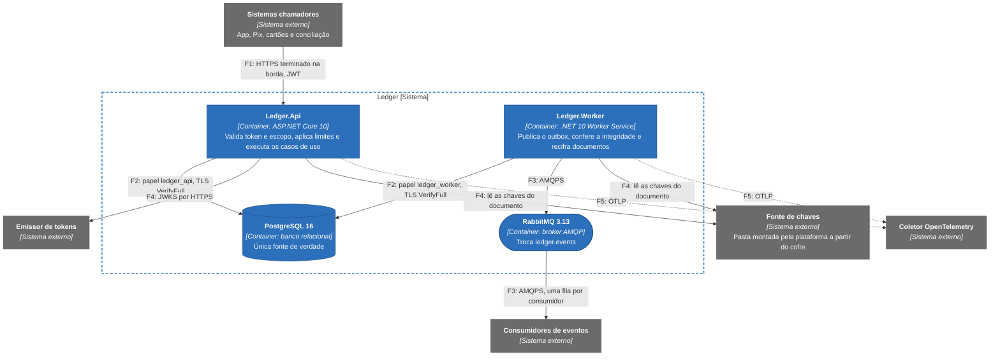

# Segurança

Num ledger, o pior dano é alterar um saldo sem que ninguém perceba, mais do que vazar um dado. Por isso, quando dois controles competem, a integridade vence a disponibilidade, e a disponibilidade vence a confidencialidade. Esta pesa menos do que num cadastro de clientes porque o ledger guarda um único dado pessoal, o documento do titular, e cifrado. Nome, e-mail, telefone e endereço ficam no cadastro do banco.

A página cobre o modelo de ameaças, a superfície HTTP, os privilégios, os segredos, as dependências e as regras de código que mexem com segurança. Tokens e escopos estão em [Autenticação e autorização](autenticacao-e-autorizacao.md), o documento do titular em [Proteção de dados](protecao-de-dados.md) e os eventos auditados em [Trilha de auditoria](trilha-de-auditoria.md). Ficam de fora a detecção de fraude e a decisão de que um débito do Pix é legítimo (do sistema chamador), a autenticação do cliente final, que o ledger nunca vê, e a proteção volumétrica das camadas 3 e 4 (da borda de rede). Ameaças de navegador (XSS, CSRF, clickjacking) não se aplicam: não há navegador nem cookie.

## O que se protege e de quem

| Ativo | Se for comprometido | Propriedade que importa |
|---|---|---|
| Lançamentos e saldos | Dinheiro criado, perdido ou escondido | Integridade |
| Capacidade de registrar lançamentos | App, Pix e cartões param | Disponibilidade |
| Documento do titular (CPF ou CNPJ) | Exposição de dado pessoal e obrigação de comunicar o incidente | Confidencialidade |
| Chaves do documento, do índice e do cursor, e credenciais do banco e do broker | Cai a proteção de todos os itens acima | Confidencialidade |
| Trilha de auditoria | Não saber o que aconteceu nem quem fez | Integridade e retenção |

Os adversários considerados, em ordem de probabilidade: um sistema chamador legítimo comprometido ou com defeito de retentativa; uma pessoa com acesso ao banco ou ao cluster (operador, DBA, credencial vazada); um atacante dentro da rede interna, sem credencial; uma dependência de terceiros comprometida; e o erro humano de operação, que na prática é o mais frequente.

## Fronteiras de confiança

Um dado atravessa cinco fronteiras, de F1 a F5.

A API não fala com o broker, então a credencial do RabbitMQ existe só no Worker. Nenhuma chave de dados pessoais passa por chamada de rede do ledger: a plataforma entrega as chaves numa pasta e o ledger só a lê. O código exige TLS em F2 e F3 fora de `Development` e `Testing`. O de F1 depende da borda (controles de implantação, mais adiante).

## Modelo de ameaças

O modelo segue o STRIDE. A primeira tabela diz o que se teme, o controle e os testes que o cobrem, e a segunda o risco que sobra. Os testes ficam em `tests/Ledger.Api.IntegrationTests`, salvo quando o projeto vem entre parênteses.

| ID | Ameaça | Controle | Testes |
|---|---|---|---|
| S1 | Token forjado ou roubado para chamar a API como outro sistema | Assinatura RS256 ou ES256, `iss`, `aud`, `exp` e `typ` obrigatórios, tolerância de 30 s, teto de vida do token e cache de chaves do emissor | `JwtValidationTests`, `RealKeyJwtTests`, `JwksCacheTests` |
| S2 | Processo qualquer publica no RabbitMQ como o Worker ou consome mensagens | Só o Worker publica. TLS obrigatório fora de desenvolvimento. Credencial própria por serviço e permissões mínimas no broker, a cargo da implantação | `MessagingOptionsValidationTests`, `HostCompositionTests`. As permissões do broker não têm teste |
| S3 | `X-Forwarded-For` forjado para fugir da cota de quem não tem token | O cabeçalho só vale vindo de rede listada em `Security:ForwardedHeaders:KnownNetworks`, com `ForwardLimit` 1. Sem lista, é ignorado. Entrada que não seja CIDR ou seja `/0` impede a subida | `ForwardedHeadersTests` |
| T1 | Alterar ou apagar lançamento direto no banco | Imutabilidade em três camadas e conferência de integridade do Worker | `MigrationTests`, `RolePrivilegesTests`, `SecurityPrivilegesTests`, `IntegrityDetectsTamperingTests`, `LedgerEntriesAreNeverMutatedTests` (Architecture.Tests) |
| T2 | Alterar um pedido em trânsito ou reenviá-lo alterado | TLS na borda (implantação) e hash canônico amarrado à `Idempotency-Key`: mesma chave com corpo diferente dá 422 | `SameIdempotencyKeyHttpTests`, `CanonicalRequestHashTests` (Application.Tests) |
| T3 | Adulterar o cursor do extrato ou usá-lo em outra conta | HMAC-SHA-256 truncado em 16 bytes, amarrado ao `account_id`, comparado em tempo constante | `StatementCursorProtectorTests` (Infrastructure.Tests), `ReadValidationTests` |
| R1 | Um sistema nega ter pedido um débito | `client_id` e `correlation_id` gravados no lançamento, na mesma transação, com `recorded_at` do relógio do banco | `PostgresEntryRepositoryTests.TryApplyAsync_StoresTheFreeTextAndTheCallerIdentity` |
| R2 | Alguém decifra documentos ou troca a versão das chaves sem deixar rastro | Toda recifragem grava `pii.decrypted` e `pii.rewrapped`, e toda ativação de versão grava `keys.version_activated`. Não existe outro caminho que decifre dado real | `KeyRewrapServiceTests`, `PostgresAccountKeyRewrapperTests`, `KeyActivationAuditTests` |
| I1 | Vazamento do documento por dump, backup, log ou resposta de erro | AES-256-GCM no campo, índice cego, mascaramento, nenhum corpo de requisição em log e `IncludeErrorDetail` desligado fora de desenvolvimento | `AccountDocumentProtectionTests`, `LogLeakTests`, `WriteLogLeakTests`, `ReadLogLeakTests`, `SpanAttributesPrivacyTests` (Infrastructure.Tests) |
| I2 | Varredura de contas e saldos com um token de leitura válido | Identificadores UUID versão 7, com 74 bits aleatórios, cota de leitura por chamador, limite de concorrência por classe e evento de auditoria de cada consulta | `RateLimitBehaviorTests`, `ReadAuditLogTests` |
| I3 | Segredo de configuração em log, métrica ou mensagem de erro | `[Sensitive]` e mascaramento por nome de propriedade, mascaramento de texto (Bearer, JWT, `password=`), mensagens de validação que nomeiam a chave e não imprimem o valor, tipos com `PrintMembers` sem segredo | `LogLeakTests`, `AuthLogLeakTests`, `SensitiveTextMaskerTests` (Infrastructure.Tests), `ProductionGuardsTests` |
| D1 | Chamador, ou defeito de retentativa, satura o banco | Cadeia de limites (concorrência por classe, cota por chamador e por conta) com 429 e 503 acompanhados de `Retry-After`, além de timeouts e pools de conexão | `RateLimitBehaviorTests`, `RequestLimitersPartitionTests`, `ConcurrencyBudgetTests` |
| D2 | Martelar uma só conta para serializar a linha de `account_balances` | Cota por conta (`RateLimiting:WritePerAccount`), que só se aplica a quem a autorização aceitaria | `WritePerAccountLimitTests`, `LockedAccountTests` |
| D3 | Crescimento sem controle de `outbox_messages` e das tabelas de chaves | Poda do outbox publicado (7 dias) e das chaves de idempotência (35 dias), com medição do acúmulo | `OutboxPruneTests`, `IdempotencyKeyPruneTests`, `AccountCreationKeyPruneTests` |
| D4 | Um ataque vira carga de escrita pela trilha de auditoria | Negação de escrita gravada fora da resposta e com teto por chamador (10, reposição de 1 por segundo). O 401 e as recusas de negócio não vão para a trilha | `DeniedWriteAuditIntegrationTests`, `AuthorizationDeniedAuditTests` |
| E1 | Cliente de leitura grava, token de outra audiência é aceito ou rota nova nasce aberta | Política explícita por rota, `aud` obrigatória, `client_id` válido exigido e política de reserva que exige token com `client_id` para qualquer rota sem política | `EndpointPolicyCoverageTests`, `RouteScopeMatrixTests`, `ScopeAuthorizationTests` |
| E2 | Injeção de SQL ganha privilégio de DDL ou lê o documento | SQL só com parâmetros e analisador CA2100 com aviso como erro. Papéis da aplicação sem DDL e sem leitura do documento pela API | `SecurityPrivilegesTests` |
| E3 | Contêiner comprometido vira ponto de apoio | Usuário sem privilégio, sistema de arquivos somente leitura, sem capacidades e sem elevação (Compose), imagens fixadas por digest e varredura de imagem. A política de rede fica a cargo da implantação | `CiPipelineTests` (Architecture.Tests) para digest e varredura. O endurecimento do Compose não tem teste automatizado |
| E4 | Produção iniciada com atalho de desenvolvimento: chave local, HS256, provedor de chaves por configuração, lista de provisionamento com `*` ou documento OpenAPI exposto | Só `Development` e `Testing` são permissivos, e qualquer outro nome de ambiente recebe o tratamento de produção: a subida é recusada com essas configurações e o documento OpenAPI não é mapeado | `ProductionGuardsTests`, `HostCompositionTests`, `KeyProviderStartupGuardTests` (Infrastructure.Tests), `OpenApiExposureTests` |

| ID | Risco que sobra | Tratamento |
|---|---|---|
| S1 | Um token válido roubado funciona até expirar, no máximo o teto configurado (`Authentication:MaxTokenLifetimeMinutes`, 15 por padrão e até 60 fora de desenvolvimento) | Tokens curtos e desativação do cliente no emissor |
| S2 | Quem obtiver a credencial do Worker publica eventos falsos, porque os eventos não são assinados | Permissões mínimas no broker e consumidores que confirmam o `accountVersion` pelo extrato |
| S3 | Atrás de um ingress fora da lista, todo pedido sem token do cluster divide uma cota só | Lista de implantação |
| T1 | Quem tem papel de dono do esquema ou superusuário desliga os gatilhos e reescreve de forma consistente, e a conferência acusa inconsistência, não reescrita perfeita | Registro de comandos do banco e, como evolução, cadeia de hash |
| T2 | O canal depende da cifragem da borda e da rede até o pod | Lista de implantação |
| T3 | Trocar `Security:Cursor:SigningKey` invalida os cursores em voo (o cursor não é sigiloso: carrega a posição do próprio chamador) | Os clientes recomeçam a paginação |
| R1 | Dois sistemas que dividam a mesma credencial não se distinguem | Uma credencial por sistema chamador |
| R2 | Quem tem acesso ao processo e às chaves ainda lê memória ou os arquivos de chave | Acesso às chaves auditado pela plataforma de segredos |
| I1 | Quem tem o dump e as chaves lê tudo, e backups antigos mantêm blobs sob uma chave comprometida | Chaves em outro sistema, com outro controle de acesso ([Proteção de dados](protecao-de-dados.md)) |
| I2 | Um chamador com `ledger.read` comprometido enxerga todas as contas, porque esse escopo significa isso | Cota por chamador e auditoria da consulta |
| D1 | Vários chamadores legítimos estourando juntos: o limite protege o banco, não a justiça entre eles | Cotas por chamador e ajuste de configuração |
| D3 | Broker fora por muitas horas enche o disco | Alertas de idade e de tamanho ([Procedimentos de operação](../08-resiliencia-e-operacao/runbooks.md)) |
| E1 | Um chamador com `ledger.write` comprometido debita qualquer conta com saldo e descobre saldos por tentativa. É o maior risco residual | Detecção, não bloqueio (seção seguinte) |
| E2 | Texto concatenado em SQL que escape ao analisador | As regras de código da última seção |
| E3 | Falha do núcleo do sistema operacional ou do runtime | Varredura de imagem e ciclo de atualização |

O desenho aceita três riscos: o chamador com `ledger.write` comprometido, porque o ledger não sabe se um débito é legítimo; a ausência de assinatura nos eventos do RabbitMQ; e a ausência de cadeia de hash entre lançamentos, que tornaria detectável por qualquer pessoa a reescrita perfeita. Os dois últimos estão em [Evolução futura](../11-evolucao/evolucao-futura.md).

## Quem pode operar qual conta

Qualquer chamador autenticado com o escopo certo opera qualquer conta. Saber se o cliente final é dono da conta é trabalho do sistema na frente do ledger, e replicar isso aqui exigiria que o ledger conhecesse os clientes, o que contradiz guardar o mínimo de dado pessoal. O preço é o raio de impacto: um chamador com `ledger.write` comprometido pode debitar uma conta com saldo, estornar o lançamento de outro chamador e descobrir saldos, porque o `balanceAfter` dos lançamentos aceitos e a recusa `422 INSUFFICIENT_FUNDS` revelam o saldo por tentativas.

O ledger não fecha essa porta, ele a torna visível. Grava o `client_id` em todo lançamento e evento de auditoria, aplica cota por `client_id` (um esvaziamento rápido vira lento e visível), expõe `ledger_entries_recorded_total` por `client` e `type` para que um desvio no volume de débitos vire alerta, exige uma credencial por sistema chamador com tokens curtos e alerta sobre a taxa de `INSUFFICIENT_FUNDS` e o volume de estornos por `client` ([Indicadores, objetivos e alertas](../08-resiliencia-e-operacao/slos-e-alertas.md)). O estorno segue a mesma regra, porque restringi-lo ao chamador original quebraria o caso em que a conciliação corrige o erro de outro sistema. A criação de conta tem uma trava a mais: o `client_id` precisa constar em `Authorization:AccountProvisioningClients`, e fora de desenvolvimento a subida recusa lista vazia ou `*`. Restringir cada chamador às operações que usa é pergunta em aberto ([Questões em aberto](../03-principios-e-decisoes/questoes-em-aberto.md)).

## Superfície HTTP

A API valida o JWT localmente, em toda requisição e antes de qualquer código do ledger, e cada rota exige `ledger.read` ou `ledger.write`. A 401 não diz o motivo e a 403 informa só o escopo que faltou. As regras de validação, as respostas de recusa e o comportamento com o emissor fora do ar estão em [Autenticação e autorização](autenticacao-e-autorizacao.md).

A cadeia de limites (concorrência da classe da rota, cota do chamador e cota da conta) roda entre a autenticação e a autorização, na ordem explicada em [Autenticação e autorização](autenticacao-e-autorizacao.md). Um pedido rejeitado por limite nunca chegou ao banco, o que torna segura a repetição com a mesma chave ([Limites de taxa e de concorrência](../08-resiliencia-e-operacao/limites-de-taxa-e-concorrencia.md)). WAF, limite por IP e proteção volumétrica são da infraestrutura do banco, e o limite do código é a segunda linha de defesa, a que vale quando o abuso vem de um chamador autenticado.

O `SecurityHeadersMiddleware` escreve os cabeçalhos no instante em que a resposta começa, por isso eles saem também nas respostas de erro e nas recusas dos limitadores.

| Cabeçalho | Valor | Motivo |
|---|---|---|
| `Cache-Control` | `no-store` | Saldo e extrato são dado financeiro e não devem ficar em cache de proxy |
| `X-Content-Type-Options` | `nosniff` | Evita interpretação errada do tipo |
| `Content-Security-Policy` | `default-src 'none'; frame-ancestors 'none'` | Inofensivo numa API e silencia varredores |
| `Referrer-Policy` | `no-referrer` | URLs contêm identificadores de conta |
| `Strict-Transport-Security` | `max-age=31536000; includeSubDomains` | Enviado fora de `Development` |
| `X-Correlation-Id` | Eco do valor recebido, se válido, ou um novo | Presente em toda resposta, inclusive 401, 429 e 503 |

Não há cabeçalho `Server` nem CORS, porque nenhum navegador chama a API. A API não redireciona HTTP para HTTPS, porque o redirecionamento já teria exposto o token na primeira requisição, e recusar HTTP puro é trabalho da borda. O documento OpenAPI só é mapeado em `Development` e `Testing`. Os endpoints de saúde respondem só o estado agregado, sem versões nem detalhes de dependência, e só a rede interna deveria alcançá-los. Os testes são `SecurityHeadersTests`, `OpenApiExposureTests` e `DataProtectionTests`.

A validação de entrada vale para todas as rotas e barra o que dá antes de tocar o banco (as regras de cada campo estão em [Contrato da API REST](../05-contratos/api-rest.md)). O corpo passa por leitores tipados que recusam campo desconhecido, tipo errado e valor fora de faixa com 400 `VALIDATION_FAILED`, tem no máximo 16 KiB (413 acima) e precisa de `application/json` (415 senão). Identificador de rota que não é GUID hifenizado recebe 404 sem tocar o banco. Instantes exigem fuso, `Idempotency-Key` tem de 1 a 128 caracteres ASCII visíveis e vem uma vez só, e o `X-Correlation-Id` recebido só vale se casar com `^[A-Za-z0-9._:-]{8,64}\z`, o que impede quebra de linha injetada no log. Valor monetário é texto decimal com até duas casas e `decimal` no domínio, nunca `double`. Todo acesso a dados usa parâmetros, e nenhuma mensagem de validação repete o valor recebido ([Catálogo de erros](../05-contratos/catalogo-de-erros.md)).

## Privilégios mínimos

O acesso ao PostgreSQL usa quatro papéis, criados antes da primeira migração (no Compose, por `docker/postgres/init-roles.sh`, que o contêiner do PostgreSQL executa na primeira subida do volume). O `ledger_migrator` é dono do banco e só roda como etapa de implantação, com `--migrate`, nunca dentro da API. Os outros três recebem privilégios por tabela e por coluna, e a tabela final está em [Modelo de dados](../05-contratos/modelo-de-dados.md). Três regras saem dela. Nenhum papel de aplicação tem `UPDATE`, `DELETE` ou `TRUNCATE` em `ledger_entries` nem em `audit_log`, e só a API insere lançamentos. A API nunca lê o documento do titular, nem cifrado nem o índice cego, e o papel somente leitura também não. E o Worker não reescreve o `payload` de um evento antes da publicação, porque só tem `UPDATE` nas três colunas de controle da fila. Dois papéis de aplicação existem por causa de E2: se alguém injetasse SQL pela API, a superfície seria a do `ledger_api`, que não marca mensagens como publicadas nem apaga nada. O `SecurityPrivilegesTests` confere o privilégio exato de cada papel por tabela e coluna, tenta cada instrução que ultrapassa o que o código precisa e roda todas as que o código emite, para mostrar que nenhuma foi barrada.

O Worker, o único que se conecta ao RabbitMQ, declara a troca `ledger.events`, a fila de retenção e a troca e fila de mensagens mortas, publica com confirmação e não consome. No Compose o broker tem um único usuário com permissão total, o que serve ao desenvolvimento e não exercita permissão mínima. Em produção o desenho prevê um host virtual próprio, um usuário do Worker com permissões de configurar, escrever e ler limitadas por expressão aos nomes que ele declara, e um usuário por consumidor, só com leitura da fila dele.

## Segredos

Nenhum segredo vai para o repositório, a imagem ou o `docker-compose.yml`, que só referencia variáveis, e `${VARIAVEL:?mensagem}` impede a subida quando uma falta. O `.env.example` traz só valores de desenvolvimento, o `.env` real é ignorado pelo git, e o pipeline do Azure DevOps varre a árvore de arquivos atrás de segredos com gitleaks, varredura que pode ser estendida ao histórico de commits. As colunas de produção e de rotação abaixo dizem o que a implantação precisa fazer, e o código não as impõe.

| Segredo | Como o código o recebe | Desenvolvimento | Produção | Rotação |
|---|---|---|---|---|
| Senhas de `ledger_api`, `ledger_worker` e `ledger_migrator` | `Postgres:Sources:<Fonte>:Password` | `.env` local | Injetadas na subida pela plataforma de segredos | 90 dias, em duas etapas |
| Credenciais do RabbitMQ | `RabbitMq:Username` e `RabbitMq:Password` | `.env` local | Injetadas pela plataforma | 90 dias |
| Conjuntos de chaves do documento (cifra e índice) | `Security:Pii:Provider`: `Configuration` em desenvolvimento ou `Directory`, que lê a pasta de `Security:Pii:Directory` | Variáveis do `.env` | Pasta montada em memória pela plataforma, a partir do cofre | 12 meses, ou na hora em caso de suspeita |
| Chave de assinatura do cursor | `Security:Cursor:SigningKey`, base64 de 32 bytes | `.env` local | Cofre, por variável | Na troca, os cursores em voo deixam de valer |
| Chaves públicas dos tokens | JWKS do emissor, em `Authentication:Authority` | Par RSA em `dev-keys/`, criado com `openssl` ([Autenticação e autorização](autenticacao-e-autorizacao.md)) | Do emissor | Pelo emissor |
| Credenciais dos chamadores | Do emissor. Não passam pelo ledger | Não se aplica | Uma por sistema chamador | 180 dias |

A troca de senha de um papel do banco em duas etapas evita derrubar o pool: cria-se um segundo usuário com os mesmos privilégios, a aplicação passa a usá-lo na implantação seguinte e só depois o antigo é removido. As chaves do documento têm rotação e provedor próprios ([Proteção de dados](protecao-de-dados.md)). Não existe adaptador para um cofre externo, e a degradação com o cofre fora do ar nunca foi exercitada contra um cofre real ([Limites conhecidos](../09-qualidade/limites-conhecidos.md)).

## Auditoria

O próprio lançamento já carrega `client_id`, `correlation_id`, `recorded_at` e `balance_after`, e a tabela `audit_log`, só de inserção, cobre o resto: ações administrativas e de segurança, num catálogo fechado de sete tipos. Falhas de autenticação e recusas de negócio viram log e métrica e não linha no banco, porque gravar cada token inválido transformaria uma força bruta em carga de escrita (D4). O catálogo, o teto da negação, a auditoria de leitura e o que ainda não foi medido sobre ela estão em [Trilha de auditoria](trilha-de-auditoria.md).

## Dependências, imagens e varredura

A lista de pacotes é curta de propósito (Npgsql, Dapper, DbUp, o cliente do RabbitMQ, Serilog, OpenTelemetry, a validação de JWT do ASP.NET Core e as bibliotecas de teste), com versões centralizadas em `Directory.Packages.props`. A varredura tem quatro camadas, descritas em [Portões de qualidade](../09-qualidade/portoes-de-qualidade.md): o NuGet Audit na restauração, `dotnet list package --vulnerable --include-transitive`, gitleaks para segredos e Trivy para imagens, com as imagens base fixadas por digest. As primitivas criptográficas (`AesGcm`, `HMACSHA256` e `RandomNumberGenerator`) só existem na pasta de segurança da infraestrutura, e o `CryptographyBoundaryTests` (Architecture.Tests) barra qualquer uma nova fora dela. Gitleaks e Trivy rodam só no pipeline do Azure DevOps, e que eles barrem a publicação é algo que só a primeira execução do pipeline confirma ([Limites conhecidos](../09-qualidade/limites-conhecidos.md)).

## Controles que dependem da implantação

O repositório sobe um ambiente de desenvolvimento, e os controles abaixo pertencem à implantação em produção. O código recusa subir sem os que consegue verificar (TLS do banco e do broker, emissor por HTTPS, ausência de chave local), mas não verifica a infraestrutura em volta. Nenhum deles é exercitado pelo repositório, e cada um traz o critério que o confirmaria.

| Controle | O que a implantação precisa fazer | Como confirmar |
|---|---|---|
| TLS entre o chamador e a borda e entre a borda e o pod | TLS 1.2 no mínimo, 1.3 preferido, terminado na borda. A API escuta HTTP na porta 8080 e não sabe se o trecho até o pod foi cifrado, então esse trecho exige malha com mTLS ou recifragem na borda, e só a borda alcança a porta | Varredura de TLS do endereço público sem versão abaixo de 1.2, e acesso à porta 8080 do pod por fora da borda recusado |
| TLS verificado no banco e no broker | Certificado raiz de cada servidor no repositório de confiança do contêiner, `Postgres:SslMode` em `VerifyFull` e `RabbitMq:UseTls` ligado | `pg_stat_ssl` mostrando as conexões cifradas e o console do broker mostrando AMQPS |
| Emissor de tokens | `typ` `at+jwt`, tokens de no máximo 15 minutos, `client_id` e escopos, uma credencial por sistema chamador. Se o emissor não preencher `typ`, `Authentication:RequireAccessTokenType=false` desliga só essa checagem | Token real de homologação aceito, e token com vida acima do teto recusado com 401 |
| Origem real do chamador anônimo | `Security:ForwardedHeaders:KnownNetworks` com a rede do ingress | Dois pedidos anônimos de origens diferentes recebendo cotas separadas |
| Permissões mínimas no RabbitMQ | Host virtual próprio, usuário do Worker limitado aos nomes que declara e usuário por consumidor só com leitura da própria fila | Publicar em outra troca com a credencial do Worker recusado com `ACCESS_REFUSED` |
| Registro de comandos do banco | `pgaudit`, com acesso administrativo separado do acesso da aplicação | `UPDATE` de teste em `ledger_entries`, feito por um papel administrativo, registrado no log do banco |
| Rede | Só a API alcança banco, emissor e fonte de chaves, e só o Worker alcança banco, broker e fonte de chaves | Conexão ao banco a partir de um pod sem permissão recusada |
| Backups | Cifrados, com retenção de 35 dias e restauração ensaiada | Restauração completa em ambiente isolado dentro do tempo-alvo |
| Cofre de chaves | Adaptador para o cofre do banco no lugar da pasta montada | Teste contra o cofre real, inclusive com o cofre fora |

## Regras de código com efeito em segurança

São as convenções de código que sustentam os controles acima. A segunda coluna diz o que barra o descuido sozinho, e onde está escrito que não há teste a regra é só convenção.

| Regra | O que a impõe |
|---|---|
| Toda rota nova tem política explícita, classe de limite e o menor escopo possível | `EndpointPolicyCoverageTests` |
| A identidade do chamador vem do token, nunca do corpo, da consulta nem de cabeçalho enviado pelo cliente | Nenhum teste |
| A entrada passa por leitor tipado, com tamanho limitado e identificadores e parâmetros validados antes de qualquer acesso a dados | `EntryValidationTests`, `CreateAccountValidationTests`, `ReadValidationTests` |
| SQL só com parâmetros, sem interpolação nem concatenação | Analisador CA2100 no build |
| Campo novo que carrega dado pessoal é cifrado, mascarado ou fica fora de resposta e de log | Nenhum teste |
| Nenhum dado pessoal em chave de idempotência, texto livre, atributo de span ou rótulo de métrica | `EntryLogLeakTests` e `SpanAttributesPrivacyTests` (Infrastructure.Tests), `WriteLogLeakTests` |
| Sem corpo, cabeçalhos ou token no log, sem pilha nem valor inválido na resposta, e `[Sensitive]` nos tipos novos com segredo | `LogLeakTests`, `AuthLogLeakTests`, `ProblemCatalogTests` |
| Criptografia só com `AesGcm`, `HMACSHA256` e `RandomNumberGenerator`, MAC comparado com `CryptographicOperations.FixedTimeEquals` e chaves só pelo `IKeyProvider` | `CryptographyBoundaryTests` para as primitivas. O resto não tem teste |
| Migração nova com privilégio explícito, sem `GRANT ALL`, e nada altera `ledger_entries` ou `audit_log` | `SecurityPrivilegesTests`, `LedgerEntriesAreNeverMutatedTests` |
| Nenhum segredo no repositório, na imagem ou no Compose | O job `secrets` do pipeline |
