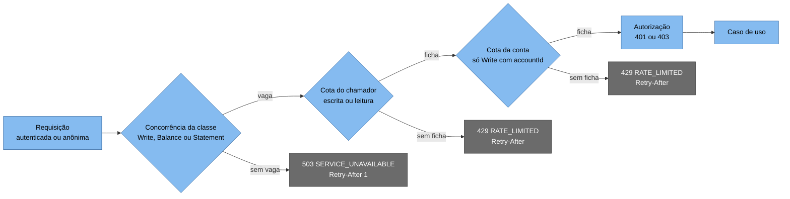

# Limites de taxa e de concorrência

A API se protege de dois problemas diferentes: o chamador que repete ou pede mais do que o combinado e a instância que não dá conta do que já aceitou. Três políticas agem em cadeia, antes de qualquer acesso a dados: a concorrência por classe de rota, a cota por chamador e a cota por conta. O que acontece com o tráfego que passa pelos limites e esbarra no pool, no lock ou no timeout está em [Políticas de resiliência](politicas-de-resiliencia.md), e a ordem dos passos de uma requisição, em [Fluxo: ciclo de vida de uma requisição](../06-fluxos/ciclo-de-vida-da-requisicao.md). A decisão está no [documento de arquitetura 0027](../03-principios-e-decisoes/documento-arquitetura/0027-limites-de-taxa-e-de-concorrencia-em-cadeia.md).

Os limites são locais a cada instância: com N instâncias o teto efetivo é N vezes o configurado. Servem de proteção da instância e não de cota contratual, e uma cota global exigiria um gateway ou um armazenamento compartilhado ([Evolução futura](../11-evolucao/evolucao-futura.md)).

## As políticas

Cada rota de negócio declara uma classe por metadado de endpoint (`RequestClassMetadata`): `POST /v1/accounts`, o registro de lançamento e o estorno são `Write`, o saldo é `Balance` e o extrato é `Statement`. Rotas de saúde e rotas sem classe ficam fora de todos os limites. Saldo e extrato têm concorrência separada porque têm pools separados, e um extrato lento não pode ocupar as vagas do saldo.

| Política (rótulo `policy`) | Classe da rota | Partição | Algoritmo | Padrão | Recusa |
|---|---|---|---|---|---|
| `write-concurrency` | `Write` | A instância | Concorrência, fila zero | 16 simultâneas | `503`, `Retry-After: 1` |
| `balance-concurrency` | `Balance` | A instância | Concorrência, fila zero | 16 simultâneas | `503`, `Retry-After: 1` |
| `statement-concurrency` | `Statement` | A instância | Concorrência, fila zero | 8 simultâneas | `503`, `Retry-After: 1` |
| `write-per-client` | `Write` | `client_id` | Balde de fichas, fila zero | Capacidade 3.000, reposição de 1.500 por segundo | `429` |
| `read-per-client` | `Balance` e `Statement` | `client_id` | Balde de fichas, fila zero | Capacidade 12.000, reposição de 8.000 por segundo | `429` |
| `write-per-account` | `Write` com `{accountId}` na rota | `accountId` da rota | Balde de fichas, fila zero | Capacidade 100, reposição de 50 por segundo | `429` |

Nenhuma política tem fila: o limite estourado recusa na hora. Para o pedido sem token, a cota do chamador é particionada pela origem do soquete, com os mesmos baldes, e a origem só vem de `X-Forwarded-For` quando o proxy está em `Security:ForwardedHeaders:KnownNetworks`.

A cota por conta só vale quando o `accountId` da rota é um GUID válido e o pedido vem de um chamador que a autorização aceitaria (autenticado, com `client_id` válido e `ledger.write`). Um `accountId` que não é GUID responde `404` sem tocar o banco, e um pedido sem token, com token inválido, sem o escopo ou com `client_id` fora do formato passa só pela cota do chamador antes do `401` ou `403`. As duas regras evitam que alguém crie um limitador por valor varrendo identificadores, e que quem conhece um `accountId` esvazie o balde da conta com pedidos sem credencial e faça os lançamentos legítimos receberem `429`.

## A ordem

O middleware de limites vem depois da autenticação, que só identifica o chamador, e antes da autorização, onde saem o `401` e o `403`. Uma recusa por limite acontece antes de qualquer acesso a dados e não consome `Idempotency-Key`, então repetir a escrita com a mesma chave é sempre seguro.

A concorrência vem primeiro porque, quando ela recusa, a cadeia para e nenhuma ficha do chamador é gasta, o que é o certo: a saturação é problema do servidor. Quando uma cota recusa, a vaga de concorrência que o pedido tinha tomado volta sozinha. A ficha do chamador, ao contrário, não volta se a cota da conta recusar depois dela, e quem martela a mesma conta paga por isso.

## O que o chamador recebe e o que fica registrado

| Recusa | Status | `code` | `Retry-After` | Observação |
|---|---|---|---|---|
| Cota (`write-per-client`, `read-per-client`, `write-per-account`) | `429` | `RATE_LIMITED` | Segundos até a próxima ficha, arredondados para cima, no mínimo 1 | O chamador pede mais do que a cota |
| Concorrência (`*-concurrency`) | `503` | `SERVICE_UNAVAILABLE` | 1, fixo | A instância está saturada e o pedido pode ser repetido já, sem fila e sem esperar conexão nem lock |

As duas respostas saem em `application/problem+json`, com `correlationId`, `traceId` e os cabeçalhos de segurança, e nenhuma traz o nome da política, a cota ou o limite ([Catálogo de erros](../05-contratos/catalogo-de-erros.md)). O `Retry-After` do `503` não varia e o do `429` acompanha a reposição do balde, então quem evita a manada de retentativas é o chamador, com recuo exponencial e variação aleatória.

Toda recusa incrementa `ledger_rate_limit_rejections_total` com o rótulo `policy`. O `429` gera o evento 6101 `RateLimitExceeded` (`Information`, com `Policy`, `ClientId` e `RetryAfterSeconds`) e o `503` por concorrência, o 6102 `ConcurrencyLimitExceeded` (`Warning`, com `Policy` e `ClientId`). O `ClientId` de um pedido anônimo é nulo, e a origem do soquete não vai ao log. Os alertas estão em [Indicadores, objetivos e alertas](slos-e-alertas.md).

## Efeito com várias instâncias

Com 4 instâncias e um balanceador sem afinidade, uma conta pode receber até 200 lançamentos por segundo sustentados (4 vezes a reposição de 50) e uma rajada de até 400 (4 vezes a capacidade de 100) sem que nenhum limitador reclame. Isso passa do teto estimado para a linha da conta, cerca de 166 por segundo ([Capacidade e escala](capacidade-e-escala.md)), e nesse caso quem protege a linha é o `lock_timeout` de 1 s, que transforma o excesso em `503` sem gravar nada. Rotear por hash do `accountId` no balanceador, de modo que cada conta caia sempre na mesma instância, faz o limitador por conta valer de verdade, e isso é configuração de balanceador, não código.

Os valores de concorrência (16, 16 e 8) e do balde por conta saíram do orçamento de conexões e não foram calibrados com carga em escala ([Limites conhecidos](../09-qualidade/limites-conhecidos.md)).

## Configuração

| Chave | Padrão | Regra validada na subida |
|---|---|---|
| `RateLimiting:Enabled` | `true` | Tem de ser `true` fora de `Development` e `Testing` |
| `RateLimiting:WritePerClient:Capacity` e `RefillPerSecond` | 3.000 e 1.500 | Faixa de 1 a 1.000.000, e a reposição não passa da capacidade |
| `RateLimiting:ReadPerClient:Capacity` e `RefillPerSecond` | 12.000 e 8.000 | Idem |
| `RateLimiting:WritePerAccount:Capacity` e `RefillPerSecond` | 100 e 50 | Idem |
| `RateLimiting:ReplenishmentSeconds` | 1 | Faixa de 1 a 3.600, e tem de ser 1 fora de `Development` e `Testing` |
| `RateLimiting:WriteConcurrency` | 16 | Faixa de 1 a 256, entre 1 e 3 vezes `Postgres:Sources:Write:MaxPoolSize` (7), ou seja, de 7 a 21 |
| `RateLimiting:BalanceConcurrency` | 16 | Entre 1 e 3 vezes o pool de saldo (8), ou seja, de 8 a 24 |
| `RateLimiting:StatementConcurrency` | 8 | Entre 1 e 3 vezes o pool de extrato (4), ou seja, de 4 a 12 |

Desligar os limites fora do desenvolvimento impede a subida (código de saída 3). A relação com o pool existe porque um limite abaixo do pool desperdiça conexões, e acima de três vezes o pool um pedido esperaria por conexão mais do que o p99 aceita. As demais chaves estão em [Configuração e linha de comando](../05-contratos/configuracao.md).

## Testes

`WritePerAccountLimitTests` roda contra um PostgreSQL real e cobre a cota por conta: o `429` sem lançamento nem chave gravados, a outra conta intacta, a repetição com a mesma chave depois que o balde repõe e o pedido sem token, só de leitura, de escopo trocado, sem `client_id`, com `client_id` gigante ou com assinatura falsa, que não gasta a cota. `RateLimitBehaviorTests` usa rotas de teste e cobre a cota por chamador (leitura e escrita independentes, chamadores independentes, `Retry-After` até a próxima reposição), a ordem das cotas (a ficha do chamador não volta quando a da conta recusa), a concorrência (`503` com `Retry-After: 1` sem gastar cota, a vaga devolvida quando a cota recusa, leitura e escrita separadas), a métrica por política, os eventos 6101 e 6102 e as rotas de saúde fora dos limites. `RequestLimitersPartitionTests` confere a partição de cada política, e `ReadPoolIsolationTests`, que saldo, extrato e escrita não dividem pool. A origem do chamador anônimo está em `ForwardedHeadersTests`, e as faixas, a relação com o pool e as regras de produção em `RateLimitingOptionsValidationTests` e `ConcurrencyBudgetTests`.
