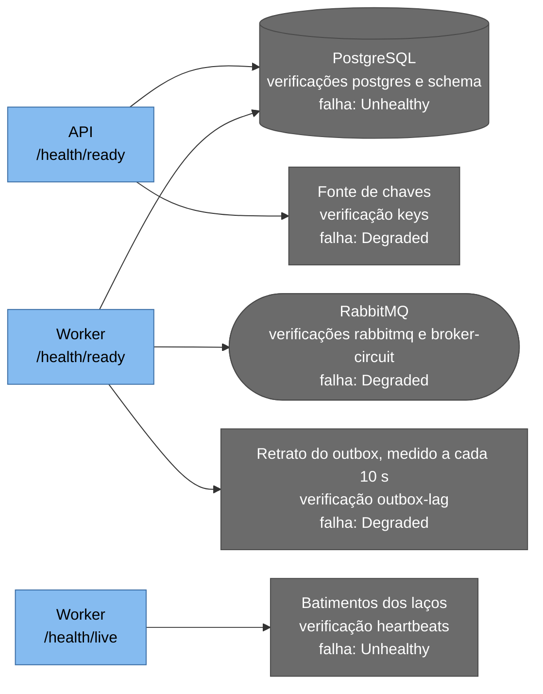

# Saúde e observabilidade

A telemetria responde a três perguntas, nesta ordem. O sistema cumpre o prometido? Respondem as métricas e os objetivos de nível de serviço. Por que não cumpre? Traces e logs. E o que houve com um lançamento específico? O `X-Correlation-Id`. Para saber o destino do dinheiro a fonte de verdade é sempre `ledger_entries`: a telemetria ajuda a achar a linha, a prova está no banco.

A página trata do que cada executável emite além das métricas: sondas, logs, correlação, traces e painéis. As métricas estão em [Catálogo de métricas](catalogo-de-metricas.md), os objetivos e alertas em [Indicadores, objetivos e alertas](slos-e-alertas.md), os passos de quem opera em [Procedimentos de operação](runbooks.md) e a escolha de Serilog e OpenTelemetry no [documento de arquitetura 0012](../03-principios-e-decisoes/documento-arquitetura/0012-observabilidade-serilog-opentelemetry.md).

## Sondas de saúde

Cada executável responde duas perguntas ao orquestrador. `GET /health/live` diz se o processo está vivo e capaz de atender, e se falhar o contêiner é reiniciado. `GET /health/ready` diz se a instância deve receber trabalho agora, e se falhar ela sai do balanceamento sem reinício. As rotas aceitam só `GET` e `HEAD` (na API, outro método dá `405` com `Allow: GET, HEAD`), são anônimas, ficam fora dos limites de taxa e do prazo de requisição e respondem só o estado agregado, com `Cache-Control: no-store`.

| Estado | Status | Corpo | Cabeçalho |
|---|---|---|---|
| `Healthy` | 200 | `{"status":"Healthy"}` | |
| `Degraded` | 200 | `{"status":"Degraded"}` | |
| `Unhealthy` | 503 | `{"status":"Unhealthy"}` | `Retry-After: 5` (`Resilience:Health:RetryAfterSeconds`) |

`Degraded` responde `200` de propósito, porque tirar o processo do balanceamento por causa de um componente auxiliar só atrasaria a volta. Como o endpoint é anônimo, a resposta não diz qual verificação degradou, e o motivo, quando existe, fica no log.

### Ledger.Api

| Rota | Verificação | O que valida | Falha vira |
|---|---|---|---|
| `live` | Nenhuma | Só que o processo responde | `503`, reinício |
| `ready` | `postgres` | `SELECT 1` em até 1 s (`Resilience:Health:ProbeTimeoutSeconds`), no pool do extrato, com o resultado em cache por 5 s (`Resilience:Health:CacheSeconds`) | `Unhealthy` |
| `ready` | `schema` | A versão do diário de migrações é pelo menos a que o código espera. Esquema mais novo é aceito, porque as migrações só expandem | `Unhealthy` |
| `ready` | `keys` | O provedor de chaves entrega o conjunto ativo e nenhuma versão sumiu da fonte desde a subida | `Degraded` |
| `ready` | `shutdown` | O processo ainda não recebeu o pedido de parada | `Unhealthy` |

### Ledger.Worker

O Worker é um host web mínimo que abre uma porta interna só para as duas rotas (8081 no contêiner) e exporta métricas por OTLP, sem porta de coleta.

| Rota | Verificação | O que valida | Falha vira |
|---|---|---|---|
| `live` | `heartbeats` | O laço do outbox completou uma volta nos últimos 120 s (`Resilience:Health:OutboxHeartbeatSeconds`) e cada um dos dois laços da conferência, nos últimos 30 minutos (`Resilience:Health:IntegrityHeartbeatMinutes`) | `Unhealthy`, reinício |
| `ready` | `postgres` e `schema` | Iguais aos da API, no pool do Worker | `Unhealthy` |
| `ready` | `rabbitmq` | O broker aceita uma conexão em até 2 s (`RabbitMq:ConnectTimeoutSeconds`), com cache de 5 s | `Degraded` |
| `ready` | `broker-circuit` | O circuito do broker está fechado | `Degraded` |
| `ready` | `outbox-lag` | A mensagem pendente mais antiga tem até 60 s (`Resilience:Health:OutboxLagSeconds`), a medição tem menos de três intervalos de idade e existe medição 60 s depois da subida | `Degraded` |
| `ready` | `key-usage` | Nenhuma conta está cifrada com uma versão de chave que o processo não lê ou que é mais nova que a sua ativa | `Degraded` |
| `ready` | `shutdown` | Igual ao da API | `Unhealthy` |



A readiness da API depende só do banco e, em modo degradado, da fonte de chaves. A do Worker depende do banco e, em modo degradado, do broker e do retrato do outbox. A liveness da API não consulta nada, e a do Worker só compara as horas dos batimentos com o relógio. O desenho omite `shutdown` e `key-usage`.

A readiness da API não consulta o RabbitMQ nem o emissor de tokens. Se a API ficasse não pronta quando o broker cai, uma falha de componente auxiliar viraria indisponibilidade de tudo e a garantia do outbox seria decorativa. O emissor segue a mesma lógica: as chaves públicas ficam em cache e uma queda curta não impede validar tokens conhecidos. A fonte de chaves é `Degraded` e não `Unhealthy` porque só serve à criação de conta ([documento de arquitetura 0019](../03-principios-e-decisoes/documento-arquitetura/0019-readiness-nao-depende-do-provedor-de-chaves.md)).

O `live` do Worker pega o processo vivo e travado: uma instância que respira e não publica há dez minutos não está viva. Os laços batem o coração ao fim de cada ciclo, com ou sem erro. O laço do outbox e os dois da conferência têm batimento próprio, porque um compartilhado deixaria o laço completo, que acorda a cada 5 minutos, esconder um laço recente preso dentro de uma execução, e a conferência bate também a cada lote ou fatia, para uma execução longa não passar de 30 minutos. Na subida os batimentos valem a hora da subida, então um Worker recém-iniciado não nasce doente.

Bater ao fim de um ciclo que terminou em exceção é deliberado, e o motivo está em [Políticas de resiliência](politicas-de-resiliencia.md). O laço que falha sem parar aparece em `ledger_worker_loop_failures_total` e no evento 3008. O `outbox-lag` lê o retrato mais recente da medição, sem consultar o banco: `Healthy` nos primeiros 60 s depois da subida, `Degraded` sem medição ou com a última mais velha que três intervalos.

No pedido de parada, `shutdown` vira `Unhealthy` na hora nas duas rotas `ready`. A aplicação não acrescenta atraso antes de fechar o listener, então tirar o tráfego antes da parada depende do tempo de sonda e da drenagem do orquestrador, e o Compose usa `/health/ready` como sonda. O que o Worker faz com o lote em curso está em [Políticas de resiliência](politicas-de-resiliencia.md) e em [Fluxo: encerramento e reinício](../06-fluxos/encerramento-e-reinicio.md).

## Logs estruturados

Os logs saem em JSON, uma linha por evento, na saída padrão, pelo Serilog com o `RenderedCompactJsonFormatter`. Não há arquivo: a plataforma coleta o `stdout`, o que dispensa rotação no contêiner. A mensagem renderizada vem em `@m`, o identificador do modelo em `@i`, o nível em `@l` (omitido em `Information`), o `TraceId` em `@tr` e o `SpanId` em `@sp`. A linha abaixo, com identificadores ilustrativos, é uma recusa por saldo insuficiente. O resumo da mesma requisição tem o mesmo `CorrelationId` e `TraceId`, com `RequestRoute`, `StatusCode` e `Elapsed`:

```json
{"@t":"2026-03-14T15:09:41.6453764Z","@m":"Entry rejected for insufficient funds on account \"01a10c1d-c7ae-7c0d-8c5f-5fad14f99c6d\" from client \"pix-core\" (key \"3ae589c8\")","@i":"0d06c0dc","@tr":"4ee586efafae97520931795cd4e6c4cb","@sp":"1a68b445948b579a","AccountId":"01a10c1d-c7ae-7c0d-8c5f-5fad14f99c6d","ClientId":"pix-core","KeyFingerprint":"3ae589c8","EventId":{"Id":1004,"Name":"InsufficientFundsRejected"},"SourceContext":"Ledger.Application.Entries.RegisterEntryHandler","RequestId":"0HNP2RSQU755L:00000001","RequestPath":"/v1/accounts/01a10c1d-c7ae-7c0d-8c5f-5fad14f99c6d/entries","ConnectionId":"0HNP2RSQU755L","Service":"ledger-api","Version":"1.0.0","Environment":"Development","CorrelationId":"01a10c1e214c710fb563c24ff84b22d0","TraceId":"4ee586efafae97520931795cd4e6c4cb","SpanId":"1a68b445948b579a"}
```

| Propriedade | Origem | Observação |
|---|---|---|
| `Service`, `Version`, `Environment` | Fixas na subida | `ledger-api` ou `ledger-worker`; a versão vem do atributo de versão do assembly |
| `EventId` | Atributo `[LoggerMessage]` | Objeto com `Id` e `Name`, o que se filtra para achar um evento do catálogo |
| `SourceContext` | Categoria do `ILogger` | `Ledger.Audit` é a da auditoria de leitura |
| `CorrelationId` | Cabeçalho `X-Correlation-Id`, ou gerado | Em toda linha de uma requisição |
| `TraceId`, `SpanId` | Atividade corrente | Liga o log ao trace |
| `ClientId` | Claim `client_id` do token | Ausente quando a requisição não autenticou |
| `AccountId`, `EntryId` | Rota ou resultado do caso de uso | Identificadores não são dado pessoal por si |
| `RequestRoute`, `RequestMethod`, `StatusCode`, `Elapsed` | Resumo da requisição | A rota é o modelo, para agrupar |
| `RequestPath` | Caminho real | Traz o `accountId` e o `entryId` da rota |
| `KeyFingerprint` | Oito caracteres hexadecimais do hash da chave de idempotência | Nunca a chave inteira |

### Níveis e volume

O resumo da requisição sai com o nível que a resposta justifica (`RequestLogLevel`): `Error` para `5xx` ou exceção (menos o `503` de `/health`), `Verbose` para as rotas `/health`, `Information` para `4xx`, `Warning` para `2xx` acima de 150 ms e `Debug` para `2xx` abaixo disso. Uma linha em `Information` por resposta rápida seria, no pico de 2.000 lançamentos por segundo, 172,8 milhões de linhas por dia que ninguém lê. As rápidas somem do log e continuam nas métricas, e cada lançamento aceito está na tabela com `correlation_id` e `client_id`.

A primeira resposta `2xx` ou `3xx` de cada rota depois da subida paga a compilação do .NET e sai em `Information` mesmo acima de 150 ms (`ColdStartRequestLogLevel`). O `503` da readiness de uma instância ainda não pronta é esperado e fica em `Verbose`, porque a causa já está nos eventos 9101, 9102 ou 9103.

O nível mínimo vem de `Serilog:MinimumLevel`: `Information` na API e no Worker, `Warning` para `Microsoft`, `Microsoft.AspNetCore` e `Npgsql`, e `Information` fixo para `Ledger.Audit`. No Compose, `LEDGER_LOG_LEVEL` define o padrão e o ambiente de teste fixa `Warning`. Para investigar, `LEDGER_LOG_LEVEL=Debug` liga o resumo das respostas rápidas, o evento 1001, os lotes do publicador (3001) e o aquecimento dos pools (5030), ao custo de reiniciar o serviço.

Num ambiente saudável, `docker compose logs` não traz linha `Warning`, `Error` ou `Fatal`. As exceções deliberadas são a chave reutilizada com outro corpo (evento 1003) e a resposta acima de 150 ms que não seja a primeira da rota. A auditoria de leitura (BR-19) usa `Ledger.Audit` em `Information` (eventos 2001 e 2002), e o volume que ela gera em escala é uma hipótese não medida ([Limites conhecidos](../09-qualidade/limites-conhecidos.md)).

### O que nunca entra no log

Em nenhum nível entram o documento do titular (em claro, cifrado ou o índice cego), o token e o `Authorization`, as chaves, as cadeias de conexão, as senhas, o corpo das requisições e respostas, o texto livre do lançamento, a `Idempotency-Key` inteira e o cursor inteiro, e em `Information` ou acima, valores monetários. Quem quer o valor consulta pelo `EntryId`.

Quatro mecanismos sustentam a regra. O corpo nunca é registrado. A `SensitiveDataDestructuringPolicy` troca por `***` o que estiver marcado ou tiver nome proibido. O `SensitiveValueMaskingEnricher` faz o mesmo com texto em forma de token, senha em cadeia de conexão ou documento formatado. E os testes de vazamento criam dados canário, provocam erros e conferem que o canário não aparece ([Proteção de dados](../07-consistencia-e-seguranca/protecao-de-dados.md)).

### Falha de configuração e ruído de bibliotecas

Uma configuração inválida termina o processo com código de saída 3 e uma única linha `Critical` que nomeia cada chave e a regra quebrada, sem repetir valor: evento 5040 na API, 5021 no Worker, 5020 no `--migrate` e 5023 no `--inspect-account`. Sem filtro o host registraria antes um `Error` com pilha de uns 4 KB, e o `ConfigurationFailureLogFilter` o descarta quando a exceção é só de validação de opções.

O framework escreve também uma linha por verificação de saúde que não termina `Healthy` (identificador 103), e o `HealthCheckVerdictLogFilter` a descarta para `postgres`, `schema`, `rabbitmq`, `broker-circuit` e `shutdown`: as quatro primeiras já têm evento próprio (9101, 9102, 9103 e 3003) e `shutdown` falha em qualquer parada. Para `outbox-lag`, `key-usage`, `keys` e `heartbeats` a linha do framework fica, por ser o único registro de um `Degraded` ou `Unhealthy`, e uma exceção não tratada numa verificação (identificador 104) também. O migrador que não alcança o banco escreve o motivo na frase do evento 5012 (por exemplo, `28P01: password authentication failed`), com a pilha no 5015 em `Debug`.

### Catálogo de eventos

Todo evento do ledger é uma mensagem `[LoggerMessage]` com identificador fixo. Eventos de bibliotecas, como o `Now listening` do host, não têm identificador do ledger.

| Id | Nome | Nível | Quando |
|---|---|---|---|
| 1001 | `EntryAccepted` | `Debug` | Lançamento aceito. A contagem vai para a métrica |
| 1002 | `IdempotentReplayDelivered` | `Information` | Repetição idempotente devolvida |
| 1003 | `IdempotencyKeyReused` | `Warning` | `422` por chave com conteúdo diferente |
| 1004 | `InsufficientFundsRejected` | `Information` | Recusa por saldo |
| 1005 | `RecordedAtCorrected` | `Warning` | O `GREATEST` empurrou o `recorded_at` à frente do relógio do banco |
| 1006 | `TransientDatabaseFailure` | `Warning` | Retentativa da escrita, com o SQLSTATE e a tentativa |
| 1007 | `LockTimeoutExceeded` | `Warning` | A linha da conta ficou travada além do `lock_timeout` |
| 1008 | `UnexpectedConstraintViolation` | `Error` | Violação de restrição que o desenho considera impossível |
| 1009 | `RollbackFailed` | `Warning` | O rollback não terminou e o banco descartará a sessão |
| 2001, 2002 | `BalanceQueried`, `StatementQueried` | `Information` | Auditoria de leitura de saldo (`Mode`, `AsOf`) e de extrato (`From`, `To`, `Limit`, `Returned`, `HasCursor`) |
| 3001 | `OutboxBatchPublished` | `Debug`, ou `Verbose` com o lote vazio | Lote publicado |
| 3002 | `OutboxPublishFailed` | `Warning` | Falha de publicação de uma mensagem, com o motivo e a tentativa |
| 3003 | `OutboxCircuitStateChanged` | `Warning` | O circuito do broker mudou de estado |
| 3004 | `OutboxPruned` | `Information`, ou `Debug` sem remoção | Poda concluída, com `Removed` |
| 3005 | `OutboxMessageStuck` | `Warning` | Mensagem com tentativas no limiar ou acima |
| 3006, 3007 | `BrokerConnected`, `BrokerConnectionFailed` | `Information`, `Warning` | Conexão e topologia prontas, ou falha com `Attempt` e `NextDelaySeconds` |
| 3008 | `WorkerLoopFailed` | `Warning` | Uma volta de um laço falhou, com `Loop`, `ExceptionType` e `NextDelaySeconds` |
| 3009 | `OutboxBatchUnroutable` | `Warning` | O broker devolveu mensagens do lote porque nenhuma fila as recebeu |
| 3010 | `RetentionQueueKeptAsFound` | `Warning` | A fila de retenção já existia com outros argumentos e foi mantida |
| 3011 | `OutboxRoutingRestored` | `Information` | O broker voltou a rotear mensagens para uma fila |
| 3100, 3101 | Início e parada do publicador | `Information` | Subida e parada do serviço do outbox |
| 4001 | `IntegrityRunCompleted` | `Information` | Execução da conferência concluída, com contagens |
| 4002 | `IntegrityViolationDetected` | `Error` | Divergência, com verificação, conta, lançamento e versão, nunca o valor |
| 4003 | `IntegrityRunFailed` | `Warning` | Execução interrompida por falha de infraestrutura |
| 4004, 4005 | `IntegrityLockReleaseFailed`, `IntegrityWindowTruncated` | `Warning` | A trava consultiva não pôde ser solta; a janela recente começou mais atrás da completa e foi cortada nela |
| 4006, 4007 | `AccountIntegrityInspected`, `AccountIntegrityFinding` | `Information`, `Error` | `--inspect-account` terminou; uma verificação falhou na conta inspecionada |
| 4100, 4101 | Início e parada da conferência | `Information` | Subida e parada do serviço de integridade |
| 5003 a 5007 | Mensagens do DbUp | De `Trace` a `Error` | Andamento da migração; o 5005 é a falha de script |
| 5010, 5011 | Migração iniciada e concluída | `Information`, e `Error` quando o status não é de sucesso | Início e resumo |
| 5012, 5013 | Banco inalcançável na migração; trava da migração | `Critical` | Motivo na frase; passou de `Migrations:LockTimeoutSeconds` |
| 5014, 5015 | Trava não solta, detalhe da falha de conexão | `Warning`, `Debug` | Diagnóstico da migração |
| 5020, 5021, 5023, 5040 | Configuração inválida | `Critical` | Migração, Worker, `--inspect-account` e API |
| 5022 | `--inspect-account` sem GUID válido | `Critical` | Argumento inválido |
| 5030, 5031 | `ConnectionPoolWarmedUp`, `ConnectionPoolWarmupFailed` | `Debug`, `Warning` | Aquecimento dos pools na subida |
| 6001, 6002 | `AuthenticationRejected`, `AuthorizationDenied` | `Information` | Token recusado, com motivo e modelo da rota; escopo ou `client_id` recusado |
| 6003, 6004 | `DeniedWriteAuditSkipped`, `DeniedWriteAuditFailed` | `Warning` | A trilha de negações atingiu o teto e a linha foi pulada; a gravação falhou |
| 6101, 6102 | `RateLimitExceeded`, `ConcurrencyLimitExceeded` | `Information`, `Warning` | `429` com política e `Retry-After`; `503` por concorrência |
| 7001 | `AccountCreated` | `Information` | Conta criada |
| 7002, 7003 | `KeyProviderUnavailable`, `KeyReloadFailed` | `Warning` | A fonte de chaves está indisponível; a releitura falhou e as chaves anteriores seguem em uso |
| 7004 | `KeySetReloaded` | `Information` | Chaves recarregadas, com as versões e a ativa |
| 7005 | `KeyMaterialRejected` | `Error` | Chave malformada ou sem prova de cifra e decifra |
| 7006 | `RewrapBatchCompleted` | `Information` | Lote da recifragem concluído |
| 7007 | `DocumentDecryptFailed` | `Error` | Um documento não pôde ser decifrado |
| 7008 | `KeyActivationLookupFailed` | `Warning` | A trilha não pôde ser lida para achar a ativação de uma versão |
| 7009 | `KeyVersionsVanished` | `Warning` | Uma versão de chave sumiu da fonte |
| 7010, 7011 | `KeyVersionAheadOfActive`, `KeyVersionNotLive` | `Error` | Contas cifradas com versão mais nova que a ativa do processo, ou com versão que ele não lê |
| 9001 | Exceção não tratada | `Error` | Falha inesperada em uma requisição |
| 9002 | `DependencyUnavailable` | `Warning` | Dependência indisponível, com o `SqlState` quando existe |
| 9003 | Requisição rejeitada pelo servidor | `Information` | Resposta `4xx` gerada pelo servidor, com o tipo da exceção |
| 9004 | `CorrelationIdRejected` | `Warning` | Um `X-Correlation-Id` recebido foi descartado por formato inválido |
| 9101, 9102, 9103 | `ReadinessProbeFailed`, `SchemaBehindCode`, `BrokerProbeDegraded` | `Warning` | A sonda de banco falhou ou estourou o prazo; o esquema está abaixo do esperado; a sonda do broker falhou |
| 9201 | `TelemetryExportConfigured` | `Information` | Diz se traces e métricas estão sendo exportados |

Para achar um evento no Compose: `docker compose logs api worker --no-log-prefix | jq -cR 'fromjson? | select(.EventId.Id == 3009)'`, em que `fromjson?` ignora as linhas que não são JSON.

## Correlação

O `traceparent` do W3C identifica a árvore de chamadas técnicas que a telemetria do ledger enxerga. O `X-Correlation-Id` é do negócio: o app gera um, o Pix repassa ao ledger, e dá para seguir um pagamento por todos os sistemas do banco, inclusive os que não falam OpenTelemetry. Os dois coexistem e o ledger grava ambos.

O `CorrelationIdMiddleware` é o primeiro da cadeia de negócio, antes da autenticação e dos limites. Um único `X-Correlation-Id` que case com `^[A-Za-z0-9._:-]{8,64}$` é usado. Senão o valor é descartado, um novo é gerado (GUID sem hífens) e o evento 9004 registra o descarte sem repetir o valor, porque aceitar o valor cru permitiria injetar quebra de linha no log. O valor vai para o contexto de log como `CorrelationId` e para a atividade como a tag `ledger.correlation_id`, e a resposta o devolve sempre, inclusive em `401`, `429` e `503`, quando mais se precisa dele.

| Etapa | Onde o identificador vive |
|---|---|
| Chamador até a API | Cabeçalho `X-Correlation-Id` (e `traceparent`, se houver) |
| Dentro da API | Contexto de log (`CorrelationId`) e tag da atividade (`ledger.correlation_id`) |
| Transação no PostgreSQL | `ledger_entries.correlation_id`, `audit_log.correlation_id`, e `outbox_messages.correlation_id` e `traceparent` |
| Worker até o RabbitMQ | Propriedade `correlation_id`, propriedade `message_id` (a linha do outbox, que os consumidores usam para deduplicar) e cabeçalho `traceparent` |
| Consumidor | Deve registrar o `correlation_id` recebido |

Quem chama deve usar um `X-Correlation-Id` por fluxo de negócio e uma `Idempotency-Key` por operação distinta, e os dois não mudam numa retentativa. Para seguir um fluxo no Compose basta filtrar o log:

```bash
docker compose logs api worker --no-log-prefix | jq -cR 'fromjson? | select(.CorrelationId == "01a10c1e214c710fb563c24ff84b22d0")'
```

## Traces

As instrumentações automáticas cobrem o ASP.NET Core e o Npgsql, e os spans do negócio vêm da fonte de atividades `Ledger`.

| Span | Quem emite | Atributos |
|---|---|---|
| Requisição HTTP (servidor) | Instrumentação do ASP.NET Core | Atributos de HTTP, `ledger.client_id` e `ledger.correlation_id` |
| `ledger.record_entry` | Caso de uso de lançamento e de estorno | `ledger.entry.type` (`credit`, `debit` ou `reversal`), `ledger.outcome`, `ledger.idempotent_replay` |
| Um span por comando SQL | Instrumentação do Npgsql | O texto do comando com marcadores de parâmetro, nunca os valores |
| `ledger.balance_query` | Caso de uso de saldo | `ledger.balance.mode` (`current` ou `as_of`) |
| `ledger.statement_query` | Caso de uso de extrato | `ledger.statement.limit`, `ledger.statement.returned`, `ledger.statement.has_next` |
| `ledger.create_account` | Caso de uso de criação de conta | `ledger.outcome` (`created`, `already_created`, `key_unavailable` ou `failed`) |
| `outbox.poll` | Worker | `outbox.batch_size` |
| `outbox.publish` | Worker, um por mensagem | `messaging.system`, `messaging.destination.name`, `ledger.outbox.attempt`, `ledger.correlation_id`, `ledger.outcome` (`confirmed` ou `failed`) |
| `integrity.check` | Worker | `integrity.mode`, `integrity.accounts_checked`, `ledger.outcome` (`ok`, `violation` ou `error`) |
| `pii.rewrap` | Worker, um por lote | `ledger.rewrap.accounts`, `ledger.rewrap.failed` |

Nenhum atributo carrega valor monetário, documento, texto livre, chave ou corpo. A publicação do Worker não é filha do span HTTP: entre o commit e a publicação passam de milissegundos a horas, e um trace aberto por tanto tempo é inútil e distorce as durações. O `outbox.publish` nasce como raiz de um trace novo, com link para o contexto lido do `traceparent` guardado no outbox, e um `traceparent` ilegível ou ausente só não gera link.

A exportação usa as variáveis padrão do OpenTelemetry (`OTEL_EXPORTER_OTLP_ENDPOINT`, `OTEL_EXPORTER_OTLP_PROTOCOL`, `OTEL_SERVICE_NAME`, `OTEL_RESOURCE_ATTRIBUTES`, `OTEL_TRACES_SAMPLER` e `OTEL_TRACES_SAMPLER_ARG`). Sem endereço de coletor nada é exportado e o evento 9201 avisa na subida, e com o coletor fora do ar a requisição não sofre. O Compose deixa o endereço vazio. Para subir o coletor com o Grafana (porta 3000, ou a de `OTEL_GRAFANA_PORT`) e apontar os dois executáveis para ele:

```bash
OTEL_EXPORTER_OTLP_ENDPOINT=http://otel:4317 docker compose --profile observability up -d --build --wait
```

Sem variável de amostragem o SDK amostra tudo, e o ambiente de teste do Compose usa `always_off`. Em produção recomendo `parentbased_traceidratio` com 0,1: 10% das requisições, respeitando a decisão do chamador. Os 90% sem trace incluem algumas com erro, e o que compensa é todo log de erro carregar o `TraceId`. A amostragem na cauda exigiria que o SDK enviasse tudo ao coletor, ao custo de banda e memória, e não está prevista.

## Painéis sugeridos

Cinco painéis bastam para começar: visão geral (taxa por rota, `5xx`, p50, p95 e p99 e orçamento de erro), escrita (por tipo e `client`, recusas, idempotência, retentativas, limites e espera no pool), outbox e broker (pendentes, idade da mais antiga, falhas, circuito e filas), integridade e segurança (conferência, divergências, falhas de autenticação, leituras do documento em claro e débitos por `client`) e infraestrutura (coleta de lixo e fila do pool de threads do .NET, CPU e memória e, vindos de um exportador da plataforma, conexões, locks, atraso de replicação, WAL e disco do PostgreSQL). O repositório não os versiona, e o motivo está em [Indicadores, objetivos e alertas](slos-e-alertas.md).

## Testes

A correlação está em `CorrelationIdTests` e `CorrelationConcurrencyTests` (cabeçalho malformado descartado, válido devolvido inclusive em `401` e `429`, inválido fora do log), em `EntryOutboxTests` e `OutboxPublishingTests` (o `correlation_id` chega à linha do lançamento, ao outbox e à propriedade AMQP) e em `EntryEventsE2ETests`, no teste fim a fim. O nível do resumo da requisição e o da primeira resposta de cada rota estão em `RequestLogLevelTests` e `ColdStartRequestLogLevelTests`.

Para o que não pode vazar, `LogLeakTests`, `AuthLogLeakTests`, `ReadLogLeakTests`, `WriteLogLeakTests` e `EntryLogLeakTests` provocam erros com dados canário, e `SensitiveDataDestructuringPolicyTests` e `SensitiveValueMaskingEnricherTests` cobrem as duas peças de mascaramento. `SpanAttributesPrivacyTests` procura valores canário nos atributos de todos os spans. Não existe um teste único com canário que acompanhe uma conta do cadastro à recifragem: cada trecho tem o seu teste de vazamento, e a jornada inteira não foi escrita.

As sondas têm `ApiHealthEndpointTests` (liveness sem dependência, readiness `503` com o banco fora e só o estado no corpo) e `ApiReadinessWithDatabaseTests` (`200` com o broker fora, `Degraded` com a pasta de chaves vazia, `503` com o esquema atrasado), `WorkerHealthSignalsTests` (inclusive o `shutdown`), `WorkerLivenessHealthCheckTests` e `WorkerHeartbeatTests` (batimentos, com relógio controlável), `BrokerAndLagHealthCheckTests` (`rabbitmq`, `broker-circuit` e `outbox-lag`) e `KeyProviderHealthCheckTests` (`keys` degradada sem `503`), além de `HealthE2ETests` e `PostgresOutageE2ETests` no teste fim a fim. `OutboxTracingTests` cobre o `outbox.publish` como raiz de um trace novo, com link. A exportação OTLP só com endereço definido, a amostragem pelas variáveis padrão e o coletor fora do ar sem atraso estão em `TelemetryProviderTests`, `TelemetryTests` e `SamplingFromEnvironmentTests`. O filtro do ruído de configuração inválida, a linha única e o código 3 estão em `LedgerLoggingTests`, `ApiStartupTests` e `WorkerStartupTests`, e o dos veredictos de saúde em `HealthCheckVerdictLogFilterTests`.
