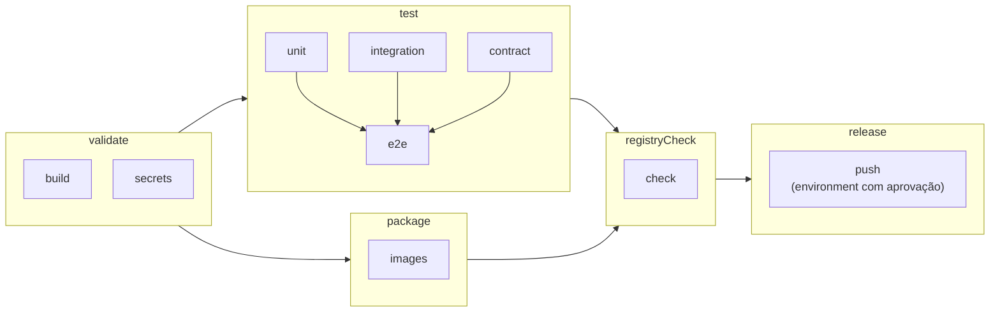

# Pipeline no Azure DevOps

O Azure DevOps é a plataforma de entrega do projeto ([documento de arquitetura 0016](../03-principios-e-decisoes/documento-arquitetura/0016-azure-devops-como-plataforma-de-ci-cd.md)): valida o código, roda os testes, empacota e varre as imagens e, quando ligado, as envia ao Azure Container Registry. A validação dos testes também roda no GitHub Actions, ao lado do código ([GitHub Actions](github-actions.md)). Os portões que o pipeline aplica estão em [Garantias automáticas](../09-qualidade/portoes-de-qualidade.md), e os testes que ele roda em [Estratégia de testes](../09-qualidade/estrategia-de-testes.md). O pipeline está escrito e o `CiPipelineTests` confere a estrutura dos arquivos, mas ele nunca executou no serviço. O que isso deixa sem exercitar está no fim da página e em [Limites conhecidos](../09-qualidade/limites-conhecidos.md).

## Arquivos

```text
azure-pipelines.yml               gatilhos, parâmetros, variáveis e a lista de estágios
pipelines/stages/validate.yml     estágio validate
pipelines/stages/test.yml         estágio test (perfil rápido ou completo)
pipelines/stages/package.yml      estágio package
pipelines/stages/release.yml      estágios registryCheck e release
pipelines/steps/checkout.yml      obtenção rasa do código
pipelines/steps/setup-dotnet.yml  SDK do .NET 10 e cache de pacotes NuGet
pipelines/steps/publish-test-results.yml  publicação dos resultados de teste
pipelines/variables/tools.yml     imagens do gitleaks e do Trivy fixadas por resumo criptográfico
```

Cada passo de compilação, teste e empacotamento é um `bash` com um comando direto (`dotnet`, `docker`, `docker compose`), o mesmo que roda na máquina de quem desenvolve ([Execução local](execucao-local.md)). Fora o `bash`, só há tarefas de infraestrutura do serviço: `UseDotNet@2`, `Cache@2`, `PublishTestResults@2`, `PublishCodeCoverageResults@2`, `PublishPipelineArtifact@1` e `Docker@2`. Nenhum arquivo tem variável secreta, e todo parâmetro do arquivo principal tem tipo e valor padrão.

## Estágios

Todo estágio declara `dependsOn`, sem depender da ordem do arquivo. `validate` não depende de ninguém, `test` e `package` esperam `validate` e rodam em paralelo entre si, `registryCheck` espera os dois e `release` espera `registryCheck`.



Os jobs de `test` rodam em paralelo e só o `e2e` espera os demais, porque o fim a fim é o mais caro e não vale começá-lo com uma suíte mais barata já vermelha. O envio de imagens (`registryCheck` e `release`) fica atrás de `test` e `package` e, no serviço, atrás de uma aprovação.

| Estágio | Job | Comandos | Prazo máximo |
|---|---|---|---|
| `validate` | `build` | `dotnet build -c Release`, `dotnet format --verify-no-changes` e `dotnet list package --vulnerable --include-transitive` com `DOTNET_CLI_UI_LANGUAGE=en`, que reprova se o relatório trouxer `has the following vulnerable packages` | 25 min |
| `validate` | `secrets` | `docker run` do gitleaks (imagem fixada por resumo) com `detect --no-git --source /repo --redact --exit-code 1` sobre a árvore de arquivos, montada somente para leitura | 15 min |
| `test` | `unit` | `dotnet test` da solução com o filtro `FullyQualifiedName!~IntegrationTests&FullyQualifiedName!~EndToEnd`, depois os pisos de cobertura (domínio 95% de linhas e 90% de ramos, aplicação 90% e 80%). Publica os resultados, a cobertura (`PublishCodeCoverageResults@2`) e o artefato `coverage` | 20 min |
| `test` | `integration` | `dotnet test tests/Ledger.Api.IntegrationTests`. No perfil rápido, com `--filter "Speed!=Slow"`. No completo, sem filtro, o que inclui concorrência, resiliência, as classes lentas e a categoria `Performance` | 60 min |
| `test` | `contract` | `dotnet test tests/Ledger.Api.IntegrationTests --filter "FullyQualifiedName~OpenApiContractTests"`: o teste gera o documento OpenAPI e o compara com o versionado. Publica `docs/05-contratos/openapi.v1.json` como artefato `openapi` | 15 min |
| `test` | `e2e` | Depende de `unit`, `integration` e `contract`. `LEDGER_E2E_PROVISION=true dotnet test tests/Ledger.EndToEnd.Tests`, com `LEDGER_E2E_LATENCY_FACTOR=3`. No perfil rápido, com `--filter "Category!=Resilience"` | 60 min |
| `package` | `images` | `cp .env.example .env`, `docker compose build --pull` com `DEV_JWT_PUBLIC_KEY_PEM_B64=somente-para-construir`, varredura do Trivy em `ledger-api:local` e `ledger-worker:local` (`--severity HIGH,CRITICAL --exit-code 1 --ignore-unfixed`) e lista de componentes CycloneDX de cada imagem, publicada como artefato `sbom` | 25 min |
| `registryCheck` | `check` | Recusa o envio, antes de pedir aprovação, se faltarem o servidor do registro ou a conexão de serviço | 5 min |
| `release` | `push` | Job de implantação no `environment` do parâmetro `releaseEnvironment`: `cp .env.example .env`, `docker compose build --pull api worker` com `LEDGER_IMAGE_TAG` igual ao commit, varredura do Trivy nas duas imagens, `Docker@2` para entrar no registro, `docker tag` e `docker push` com a etiqueta do commit e a do número da execução, e `Docker@2` para sair do registro | 40 min |

Na construção das imagens, `DEV_JWT_PUBLIC_KEY_PEM_B64` leva um valor fictício, porque o Compose valida o `.env` inteiro e a variável vazia o derruba. A chave não entra em imagem alguma. Os prazos máximos são tetos com folga, e o `CiPipelineTests` falha se um job ficar com prazo menor que o mínimo da sua duração esperada.

## Gatilhos e perfis

O `trigger` vale para `main` e agrupa as execuções enquanto uma está em curso (`batch`), e o `pr` vale para pull requests em `main` e cancela a execução anterior do mesmo pull request (`autoCancel`). Não há execução agendada.

| Situação | Perfil | Estágios que rodam |
|---|---|---|
| Pull request para `main` | Rápido | `validate`, `test`, `package` |
| Envio para `main` | Completo | `validate`, `test`, `package`. Com o envio de imagens ligado, também `registryCheck` e `release` |
| Execução manual em qualquer ramo | `auto` resolve para completo, e `profile` escolhe | `validate`, `test`, `package`. `registryCheck` e `release` só em `main` |

O perfil rápido roda a integração sem as cinco classes lentas, que esperam queda e religação reais do banco e do broker, e o fim a fim sem a categoria `Resilience`. O completo roda tudo. Pull request nunca chega a `registryCheck` nem a `release`, e ramo que não é `main` nunca publica imagem. A condição de cada estágio usa `Build.Reason`, igual em qualquer provedor de repositório, e o ramo principal é declarado na variável `mainBranch`, com as palavras `main` de `trigger` e `pr` acompanhando-a se o nome mudar.

O pipeline não usa `resources.repositories`, `System.PullRequest.*` nem `Build.Repository.Provider`, para valer em qualquer provedor. A validação de pull request depende do provedor: no Azure Repos o bloco `pr` do YAML é ignorado, e ela vem de uma política de ramo "Build validation" em `main` apontando para este pipeline. Em repositório hospedado no GitHub e integrado ao Azure Pipelines, o bloco `pr` vale, e o resultado do pipeline pode ser exigido como verificação obrigatória do ramo.

## Parâmetros e variáveis

| Parâmetro | Tipo e padrão | Para que serve |
|---|---|---|
| `profile` | texto, `auto` (`auto`, `quick`, `full`) | `auto` escolhe rápido em pull request e completo nas demais execuções |
| `pushImages` | booleano, `false` | Liga o envio das imagens ao registro (só vale em `main`) |
| `containerRegistry` | texto, vazio | Servidor do registro, por exemplo `nomedoregistro.azurecr.io` |
| `registryServiceConnection` | texto, vazio | Nome da conexão de serviço do registro |
| `releaseEnvironment` | texto, `ledger-registry` | Nome do `environment` onde a aprovação do envio fica configurada |
| `variableGroup` | texto, vazio | Nome de um grupo de variáveis a ligar ao pipeline |
| `vmImage` | texto, `ubuntu-24.04` | Imagem da máquina de build hospedada |

| Variável | Valor | Uso |
|---|---|---|
| `DOTNET_NOLOGO`, `DOTNET_CLI_TELEMETRY_OPTOUT`, `DOTNET_SKIP_FIRST_TIME_EXPERIENCE` | `true` | Saída limpa do `dotnet` |
| `NUGET_PACKAGES` | `$(Pipeline.Workspace)/.nuget/packages` | Pasta restaurada pelo cache de pacotes |
| `LEDGER_REQUIRE_DOCKER` | `true` | Faz teste que depende de Docker falhar em vez de ser ignorado ([documento de arquitetura 0022](../03-principios-e-decisoes/documento-arquitetura/0022-testes-dependentes-de-ambiente-falham-por-padrao.md)) |
| `mainBranch` | `refs/heads/main` | Ramo que pode publicar imagens |
| `gitleaksImage`, `trivyImage` | `imagem:versão@sha256:...` | Ferramentas de segurança, em `pipelines/variables/tools.yml` |
| `LEDGER_E2E_LATENCY_FACTOR` | 3, só no job `e2e` | Folga de latência dos testes fim a fim na máquina compartilhada |

O grupo de variáveis é opcional e existe para o envio de imagens funcionar nas execuções automáticas de `main`, em que ninguém digita parâmetros. O pipeline só o liga se `variableGroup` for preenchido. Nenhuma variável do grupo é segredo, porque a credencial do registro fica dentro da conexão de serviço. As variáveis são `LEDGER_PUSH_IMAGES` (`true` liga o envio, como `pushImages`), `LEDGER_CONTAINER_REGISTRY` (o servidor, quando `containerRegistry` está vazio) e `LEDGER_REGISTRY_CONNECTION` (a conexão, quando `registryServiceConnection` está vazio). O parâmetro vence quando preenchido, e se o envio estiver ligado e faltar o servidor ou a conexão, o job `check` falha antes de a aprovação ser pedida.

## Environments, aprovações e conexões de serviço

O estágio `release` roda como job de implantação no `environment` nomeado por `releaseEnvironment` (padrão `ledger-registry`), e é nele que mora a aprovação: o `environment` precisa do check de aprovação, com os aprovadores da entrega, e do check de controle de ramo restrito a `refs/heads/main`. Sem o `environment` criado, o Azure DevOps cria um vazio na primeira execução, sem aprovação nenhuma, e por isso a configuração vem antes. Nenhum job fora do `release` entra em registro ou envia imagem. A conexão de serviço do registro é do tipo Docker Registry, subtipo Azure Container Registry, com identidade de papel `AcrPush`, e o pipeline precisa ser autorizado a usá-la na primeira execução. A imagem recebe a etiqueta do commit e a do número da execução, nunca `latest`, e só `ledger-api` e `ledger-worker` são enviadas, porque o `migrator` do Compose usa a imagem do Worker com `--migrate`.

## Como criar o pipeline

| Item | O que fazer |
|---|---|
| Organização e projeto | Uma organização e um projeto, com permissão de quem cria o pipeline para criar pipelines e gerenciar conexões de serviço |
| Repositório | Azure Repos, ou o repositório no GitHub ligado ao Azure Pipelines. O arquivo é `/azure-pipelines.yml` e o ramo principal é `main` |
| Pipeline | Em Pipelines, New pipeline, o provedor e o repositório, "Existing Azure Pipelines YAML file" e `/azure-pipelines.yml` |
| Máquina de build | Hospedada, `ubuntu-24.04` (`vmImage`), que traz Docker, Docker Compose v2 e `bash`, com o SDK do .NET 10 instalado por `UseDotNet@2`. A saída de rede precisa alcançar `nuget.org` e `api.nuget.org`, `mcr.microsoft.com`, o Docker Hub, `mirror.gcr.io` e `ghcr.io` |
| Paralelismo | `validate` abre dois jobs ao mesmo tempo e, depois dele, `test` e `package` abrem até quatro. Com um único job paralelo o pipeline funciona e leva a soma dos tempos, o que piora o tempo de pull request |
| Registro de imagens | Conexão de serviço, `environment` com os checks de aprovação e de ramo e, opcionalmente, um grupo de variáveis em Pipelines, Library. Só então ligar o envio: `pushImages` com o servidor e a conexão, ou `LEDGER_PUSH_IMAGES=true` no grupo |

## Artefatos e resultados

Todo job que roda testes publica os resultados mesmo quando eles falham (`PublishTestResults@2`, formato VSTest, com um título por job: unidade e arquitetura, integração, contrato e fim a fim). Os artefatos têm nomes únicos: `coverage` (os arquivos Cobertura do domínio e da aplicação), `openapi` (o documento verificado pelo job `contract`) e `sbom` (os componentes das imagens em CycloneDX).

## Pontos de atenção

O que só o serviço executa nunca rodou: a expansão dos modelos, as tarefas `UseDotNet@2`, `Cache@2`, `PublishTestResults@2`, `PublishCodeCoverageResults@2`, `PublishPipelineArtifact@1` e `Docker@2`, a aprovação do `environment` e o check de ramo, o grupo de variáveis, a conexão de serviço, a política de ramo e o tempo e a memória de uma máquina hospedada.

O Docker Hub limita as baixas anônimas em máquinas hospedadas, e o Testcontainers baixa `postgres`, `rabbitmq` e o `ryuk`, enquanto o gitleaks e o Trivy também vêm de lá. Entrar com uma conexão de serviço do Docker Hub ou usar um espelho no ACR mitigaria, e nenhum dos dois está implementado. O Trivy baixa o banco de vulnerabilidades em cada job (de `mirror.gcr.io`, com `ghcr.io` como alternativa) e o compartilha entre as varreduras do job, sem cache entre execuções.

O portão do Trivy reprova quando uma vulnerabilidade com correção aparece numa imagem base fixada por resumo, mesmo sem mudança no código, e a saída é atualizar o resumo. A lista de permissões do `.gitleaks.toml` libera o `.env.example` por caminho e os demais exemplos pelo valor inteiro, então um vetor de teste novo reprova a varredura até o valor entrar. O `release` constrói as imagens de novo antes de enviar, e a enviada é a que o Trivy varreu no próprio job, não idêntica bit a bit à construída em `package`, embora as bases fixadas por resumo tornem o conteúdo equivalente.
